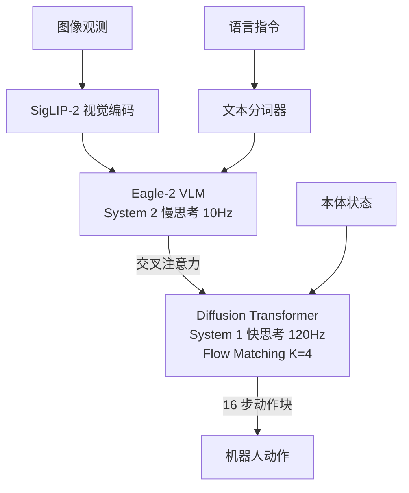

# GR00T N1: An Open Foundation Model for Generalist Humanoid Robots

- Local PDF: `/Users/luogu/physical_intelligence/papers/2026-05-10/gr00t-n1-an-open-foundation-model-for-generalist-humanoid-robots_2503.14734.pdf`
- arXiv: https://arxiv.org/abs/2503.14734
- Source: https://arxiv.org/abs/2503.14734
- Project: https://research.nvidia.com/publication/2025-03_nvidia-isaac-gr00t-n1-open-foundation-model-humanoid-robots
- Authors: NVIDIA（Johan Bjorck, Fernando Castañeda, Linxi "Jim" Fan 等 40+ 作者）
- Published: 2025-03-18
- Category: humanoid foundation model
- Priority: high

## 一句话总结

GR00T N1 是首个开源（CC BY 4.0）2.2B 参数人形机器人基础模型，采用 System 2（Eagle-2 VLM, 10Hz）+ System 1（DiT + Flow Matching, 120Hz）双系统架构，以 592.9M 帧 / 8376h 数据金字塔共训，仅用 10% 真实数据（42.6%）即匹敌扩散策略全量表现（46.4%），全量数据达 76.8%，超越扩散策略 30.4 个百分点。

## 核心技术

1. **双系统架构** — System 2（Eagle-2 VLM, SmolLM2 + SigLIP-2, 使用第 12 层中间 embedding）+ System 1（DiT + Flow Matching, 120Hz 实时动作生成, K=4 去噪步, H=16 action chunk）
2. **Flow Matching 动作生成** — 连续动作空间上的概率流匹配，比传统扩散策略更快的推理速度（4 步 vs 100 步），训练时注入线性插值噪声，推理时通过欧拉积分求解 ODE
3. **数据金字塔** — 三层异构数据共训：基底（互联网+人类视频 2517h）→ 中部（WAN2.1 微调神经轨迹 827h + DexMimicGen 模拟 1743h）→ 顶部（真实遥操作 3289h），总计 592.9M 帧 / 8376h
4. **物体检测辅助损失** — 额外线性层预测 2D 目标中心坐标，通过 OWL-v2 检测框监督，强制视觉系统显式定位指令中的目标物体

## 底层原理与数学推导

GR00T N1 的核心创新是**双系统解耦架构**与**Flow Matching 连续动作生成**的结合。System 2 以较低频率（10Hz）完成场景理解与任务推理，System 1 以较高频率（120Hz）生成精确连续的电机控制信号。

### 双系统信息流

设 $t$ 时刻的图像观测序列为 $\mathbf{O}_t \in \mathbb{R}^{T_v \times 3 \times H \times W}$（$T_v$ 为历史帧数，$H=224, W=224$），语言指令经分词后得文本 token 序列 $\mathbf{L}$。SigLIP-2 编码每帧为 64 个视觉 token，经 pixel shuffle 降采样后与文本 token 拼接送入 SmolLM2。

关键设计：**使用第 12 层（共 1.34B 参数 LLM 的中间层）的 hidden state 作为输出特征**，而非最终层：

$$\phi_t = \text{LLM}^{(12)}(\text{Concat}[\text{SigLIP-2}(\mathbf{O}_t), \mathbf{L}]) \in \mathbb{R}^{N \times d_{\text{vlm}}}$$

其中 $N$ 为总 token 数，$d_{\text{vlm}} = 2048$。使用中间层可在不影响推理准确率的前提下降低延迟，将 System 2 的推理时间控制在 100ms 以内（63.9ms on L40 bf16）。

### Flow Matching 训练

设 $t$ 时刻机器人真实动作为 $\mathbf{A}_t \in \mathbb{R}^{d}$，$d$ 为动作空间维度。Flow Matching 通过构造从噪声到真实动作的线性路径来学习确定性向量场。

**前向加噪过程**（训练阶段）：对真实动作 $\mathbf{A}_t$ 与高斯噪声 $\epsilon \sim \mathcal{N}(0, \mathbf{I})$ 做线性插值：

$$\mathbf{A}_t^\tau = \tau \mathbf{A}_t + (1 - \tau) \epsilon, \quad \tau \in [0, 1]$$

当 $\tau = 1$ 时为真实动作，$\tau = 0$ 时为纯高斯噪声。

**训练目标**：学习向量场 $\mathbf{V}_\theta$ 预测噪声与真实动作之差，即从 $\mathbf{A}_t^\tau$ 沿时间 $\tau$ 指向 $\mathbf{A}_t$ 的方向：

$$\mathcal{L}_{\text{fm}}(\theta) = \mathbb{E}_{\tau, \epsilon, \mathcal{D}}\left[ \|\mathbf{V}_\theta(\phi_t, \mathbf{A}_t^\tau, \mathbf{q}_t) - (\epsilon - \mathbf{A}_t)\|^2 \right]$$

其中 $\phi_t$ 为 VLM 输出 token 序列（通过交叉注意力注入 DiT），$\mathbf{q}_t$ 为本体状态（通过 MLP 编码后与动作 token 拼接）。

**时间步分布**：$\tau$ 的采样分布采用 **Beta 分布**，偏向于 $\tau \to 0$（噪声区域），使模型在去噪初期更精确：

$$p(\tau) = \text{Beta}\left(\frac{s - \tau}{s}; \; \alpha = 1.5, \beta = 1\right), \quad s = 0.999$$

其中 $s = 0.999$ 避免 $\tau = 1$ 处的奇点。$\alpha = 1.5, \beta = 1$ 使采样偏向 $\tau \approx 0.33$ 附近的噪声区域，强化模型在去噪初始阶段的预测能力。

### Flow Matching 推理

推理时使用**欧拉积分**进行 $K$ 步去噪，从 $\tau = 0$（纯噪声 $\epsilon$）出发：

$$\mathbf{A}_t^{\tau + 1/K} = \mathbf{A}_t^\tau + \frac{1}{K} \cdot \mathbf{V}_\theta(\phi_t, \mathbf{A}_t^\tau, \mathbf{q}_t)$$

$K = 4$ 步后得到 $\mathbf{A}_t^1 \approx \mathbf{A}_t$ 的近似值。每次推理同时生成 $H = 16$ 步的 action chunk，覆盖约 0.13s 的未来动作序列。相比于扩散策略通常需要的 50-100 步去噪，Flow Matching 的 4 步推理是实现 120Hz 实时控制的关键。

### DiT 中的双重注意力机制

System 1 的 DiT 每层交替使用两种注意力机制：
- **自注意力（Self-Attention）**：在噪声动作 $\mathbf{A}_t^\tau$ 与本体状态 $\mathbf{q}_t$ 的联合序列上计算，建模时序依赖
- **交叉注意力（Cross-Attention）**：以 VLM 输出 $\phi_t$ 为 Key/Value，噪声动作序列为 Query，融合视觉-语言语义信息

这种交替设计使 System 1 同时感知「当前运动状态」和「任务语义目标」。

### 物体检测辅助损失

除 Flow Matching 主损失外，额外添加 2D 目标检测辅助损失：

$$\mathcal{L} = \mathcal{L}_{\text{fm}} + \lambda \cdot \mathcal{L}_{\text{det}}$$

其中 $\mathcal{L}_{\text{det}}$ 为 VLM 输出特征 $\phi_t$ 通过额外线性层预测的 2D 中心坐标与 OWL-v2 检测结果的 MSE 损失。$\lambda$ 为平衡权重。这一损失强制 VLM 在训练过程中显式关注目标物体的空间位置，提升空间推理能力。

## 物理直觉解释

- **双系统为什么有效？** 好比人类做菜：System 2 像你看菜谱、思考「下一步该放盐还是放糖」（10Hz 慢思考），System 1 像你的手自动执行抓、放、倒等动作（120Hz 快反应）。如果让手等大脑想完再动，动作会卡顿不流畅；如果让大脑跟着手的速度跑，思考质量会下降。解耦后两个系统各司其职。

- **Flow Matching 和扩散模型有什么区别？** 扩散模型像从一堆碎纸片（噪声）慢慢拼回原图，每一步都在猜测「原图是什么样」，需要很多步（50-100）。Flow Matching 像是知道一条确定的折叠路径，从噪声到原图走直线，4 步就能到——因为训练时强迫模型学习确定性的向量场，而非随机性的去噪过程。

- **为什么用中间层 embedding？** 模型的前几层提取低级特征（边缘、颜色），后几层过度抽象（语义概念），中间层（第 12 层）恰好处于「既能理解任务语义，又保留了空间结构信息」的平衡位置。用最后一层反而会因为过度抽象损失空间精度。

- **数据金字塔像什么？** 像教一个学徒做菜：先让他看大量烹饪视频（互联网视频）理解基本概念，再用仿真环境让他反复练习（模拟数据），接着让他看别人遥操作演示（神经轨迹），最后亲自上手做（真实数据）。每一层数据都在为上一层打基础。

## 工程细节与实操指南

### 数据金字塔详细构成

| 层级 | 数据来源 | 规模（小时） | 规模（帧数） | 数据类型 |
|------|---------|-------------|-------------|---------|
| 基底 | Ego4D, EPIC-KITCHENS, Ego-Exo4D, Assembly-101, HOI4D, HoloAssist, RH20T-Human | 2517h | ~179M | 第三方人类第一人称视频 |
| 中部-神经轨迹 | WAN2.1-I2V-14B (LoRA 微调, 81帧 480P) → IDM 标注动作 | 827h | ~59M | 视频生成模型合成的机器人操作视频 |
| 中部-模拟 | DexMimicGen (54 种源-目标容器 × 10K 条 = 540K 轨迹) | 1743h | ~124M | 仿真环境渲染数据 |
| 顶部 | GR-1 遥操作 + OXE + AgiBot-Alpha | 3289h | ~231M | 真实机器人示教 |
| **总计** | | **8376h** | **592.9M** | |

### 神经轨迹生成流水线

核心流程：**真实数据（88h）→ 微调视频生成模型 → 大规模合成视频 → 动作标注**

1. **微调视频模型**：以 WAN2.1-I2V-14B 为基座，在 3000 条真实机器人示教数据上使用 LoRA 微调 100 个 epoch。训练分辨率 480P，输出 81 帧 / 约 3 秒的视频片段。
2. **大规模生成**：以初始帧 + 语言指令为条件生成反事实视频（如更换物体位置、旋转视角），生成成本 ~105K L40 GPU 小时（约 1.5 天在 3600 张 L40 GPU 上）。每段视频约 2 分钟生成时间。
3. **质量过滤**：使用商用级多模态 LLM 对每段视频采样 8 帧进行评分，过滤物理不一致、模糊、伪影严重的生成结果。同时进行重描述（re-captioning）以提升语言指令多样性。
4. **动作标注**：使用预训练的 Inverse Dynamics Model（IDM，基于 Flow Matching 的 DiT）预测帧间动作，作为伪标签。同时使用 VQ-VAE 提取的潜在动作（Latent Actions, LAPA）作为额外的动作表示。
5. **数据增强**：10x 数据翻倍——从 88h 原始数据扩展至 827h 神经轨迹，再配合原始数据以 1:1 采样比共训。

### IDM 训练细节

反向动力学模型本身是一个小型的 DiT + Flow Matching，以相邻帧图像对 $(\mathbf{O}_t, \mathbf{O}_{t+1})$ 为输入，预测两帧之间的动作 $\hat{\mathbf{a}}_t$。训练损失与主模型一致（Flow Matching loss），输出作为合成视频的伪动作标签。IDM 仅在合成视频上推理，不参与最终策略的推理。

### 系统配置与训练超参

- **预训练**：~50000 H100 GPU 小时，~4000 个 VLM 的 decoder-only 预训练预计算步骤后 + 全模型联合训练
- **模型配置**：总参数量 2.2B（VLM 1.34B + DiT 0.86B）。VLM 基于 SmolLM2（1.7B 语言模型）+ SigLIP-2（视觉编码器），输入分辨率 224×224，pixel shuffle 后每帧 64 token
- **System 2 推理**：L40 bf16 下 63.9ms 输出 16 步动作（~15.6Hz）
- **Video 条件观测**：堆叠 $T_v$ 帧历史图像，每帧独立编码后拼接
- **冻结策略**：预训练与后训练均冻结 Language Encoder（text embedder），其余参数全量开放训练

### 后训练

- **步数**：20K-60K 步，取决于目标任务复杂度
- **Batch Size**：默认全局 batch size 1024；DexMimicGen 评测套件使用 batch size 128
- **数据配比**：真实数据 : 神经轨迹数据 = 1:1 采样
- **数据量**：每个任务 30/100/300 条演示三个数据量级

### 训练核心超参速查

| 超参数 | 值 |
|--------|-------|
| 总参数量 | 2.2B（VLM 1.34B + DiT 0.86B） |
| VLM 第几层输出 | 第 12 层 |
| 图像分辨率 / 每帧 token 数 | 224×224 / 64 |
| Action chunk H | 16 |
| 去噪步数 K | 4 |
| Beta 分布参数 (α, β) | 1.5, 1 |
| s（避免奇点） | 0.999 |
| Flow Matching 损失 | $\mathcal{L}_{\text{fm}} = \mathbb{E}[\|V_\theta - (\epsilon - A)\|^2]$ |
| 总损失 | $\mathcal{L} = \mathcal{L}_{\text{fm}} + \lambda \mathcal{L}_{\text{det}}$ |
| 推理时间（L40 bf16） | 63.9ms / 16 动作 |
| 预训练 GPU Hours | ~50K H100 |
| 神经轨迹生成成本 | ~105K L40 GPU Hours |

### 落地实操标准步骤

1. **数据准备**：从 GR00T N1 Hugging Face 仓库下载预训练 checkpoint，准备目标 embodiment 的 30-300 条示教轨迹
2. **环境适配**：根据目标机器人运动学参数调整动作空间维度 $d$，修改 action encoder/decoder MLP 的输入输出维度
3. **后训练**：固定 language embedder，开放其余参数，以真实数据:神经轨迹 = 1:1 混合采样，训练 20K-60K 步
4. **推理部署**：System 2 以 10Hz 异步运行（每 100ms 更新 VLM embedding $\phi_t$），System 1 以 120Hz 运行（每 ~8ms 一次 4 步去噪，输出 16 步 action chunk），两系统通过交叉注意力连接

## 技术权衡（Trade-off）

| 优势 | 劣势与工程代价 |
|------|---------------|
| 双系统解耦实现慢推理+快控制，适配人形机器人高实时性需求 | 架构复杂度高，两系统间同步与通信需要精细的时间调度设计 |
| Flow Matching 仅需 K=4 步推理，比扩散策略快 10-25 倍 | Flow Matching 训练对时间步分布敏感，Beta 参数（α=1.5,β=1）需针对任务调优 |
| 数据金字塔实现极高的数据效率（10% 数据 ≈ DP 全量） | 神经轨迹生成成本高昂（~105K L40 GPU 小时），且质量依赖视频生成模型与 IDM 的准确性 |
| 开源（CC BY 4.0），200 H100 GPU 小时可预训练，复现门槛低 | Eagle-2（SmolLM2 1.7B）VLM 骨干较小，空间推理与复杂语义理解能力有限 |
| 辅助检测损失提升空间定位能力 | 仅支持短时域桌面操作，不支持移动 + 操作等长时间任务 |
| 单模型跨 embodiment 泛化（GR-1, 1X Neo 等） | 神经轨迹的物理一致性无法保证，复杂流体/柔性体场景可能存在伪影 |

## 技术价值与演进定位

GR00T N1 是 2025 年 VLA 领域最具代表性的架构级创新之一，标志着 VLA 从单系统走向双系统协同的新范式：

- **架构演进**：RT-2 等早期 VLA 使用单一 Transformer 同时处理感知与动作，面临感知频率（需要慢）与控制频率（需要快）的根本冲突。GR00T N1 的双系统解耦是解决这一矛盾的标志性方案。
- **数据策略跃迁**：数据金字塔是 Open X-Embodiment 数据规模化路线的系统化升级——从「尽可能多收集真实数据」转向「以少量真实数据为种子，用视频生成+仿真大规模合成」
- **Flow Matching 继承**：继承 Diffusion Policy (2023) → Octo (2024) 的连续动作生成路线，但以 Flow Matching 替代传统扩散，实现数量级的推理加速
- **后训练适应性**：验证了「基础模型预训练 + 少量演示后训练」在机器人领域的可行性，与 NLP/CV 的预训练-微调范式一致

## 与其他论文的关系

- **RT-2 (Google, 2023)**：RT-2 是单系统 VLA 代表，将动作 token 化后接入 VLM 词表。GR00T N1 的双系统架构是对 RT-2 单系统的根本性改进：感知与动作不再共享同一组参数，而是按频率解耦
- **Diffusion Policy (Chi et al., 2023)**：Diffusion Policy 首次将扩散模型引入机器人动作生成。GR00T N1 继承连续动作生成范式，但以 Flow Matching（4 步）替代扩散模型（50-100 步），实现推理加速
- **Octo (Transit, 2024)**：Octo 探索多 embodiment 数据共训的 Transformer 策略。GR00T N1 的数据金字塔是这一方向的深化，涵盖更广泛的数据类型（人类视频、神经轨迹、仿真、真实）
- **Pi0 (Physical Intelligence, 2024)**：Pi0 与 GR00T N1 同为 2024-2025 年重要 VLA 模型，Pi0 使用 action chunk H=50，GR00T N1 使用 H=16。较短 chunk 更适合人形机器人的高频控制需求
- **WAN2.1 (Wan Team, 2025)**：GR00T N1 微调 WAN2.1-I2V-14B 用于神经轨迹生成，是视频生成模型辅助机器人数据合成的重要案例
- **Eagle-2 (NVIDIA, 2025)**：Eagle-2 是 NVIDIA 的 VLM 系列，GR00T N1 使用 Eagle-2 的 SmolLM2 + SigLIP-2 架构作为 System 2 骨干

## 精读问题

1. Flow Matching 相比传统扩散策略在机器人动作生成上的具体优势是什么？（收敛速度、推理速度、动作平滑性）
2. 为什么使用 VLM 的第 12 层 embedding 而非最终层？中间层在「语义理解」与「空间精度」之间如何平衡？
3. 数据金字塔中，神经轨迹质量如何影响最终性能？如果视频生成模型产生物理不一致的轨迹，IDM 能否正确标注动作？
4. DexMimicGen 生成的 6500 小时仿真数据在数据金字塔中被归为「中部」而不是「底部」，为什么仿真数据的价值低于互联网视频？
5. 物体检测辅助损失如何具体提升模型的空间推理能力？是否在所有任务上都有正向贡献？
6. 双系统架构中，System 2 的 10Hz 频率与 System 1 的 120Hz 频率之间的时序对齐如何实现？当 System 2 更新 VLM embedding 时，System 1 如何处理正在进行中的动作 chunk？
7. 1:1 真实数据与神经轨迹的采样比是否最优？不同任务类型（精确操作 vs 粗放操作）是否需要不同的采样比？
8. GR00T N1 的 10% 数据（42.6%）≈ DP 全量（46.4%）的现象说明了什么？是 Flow Matching 的优势，双系统架构的优势，还是数据金字塔的优势？
