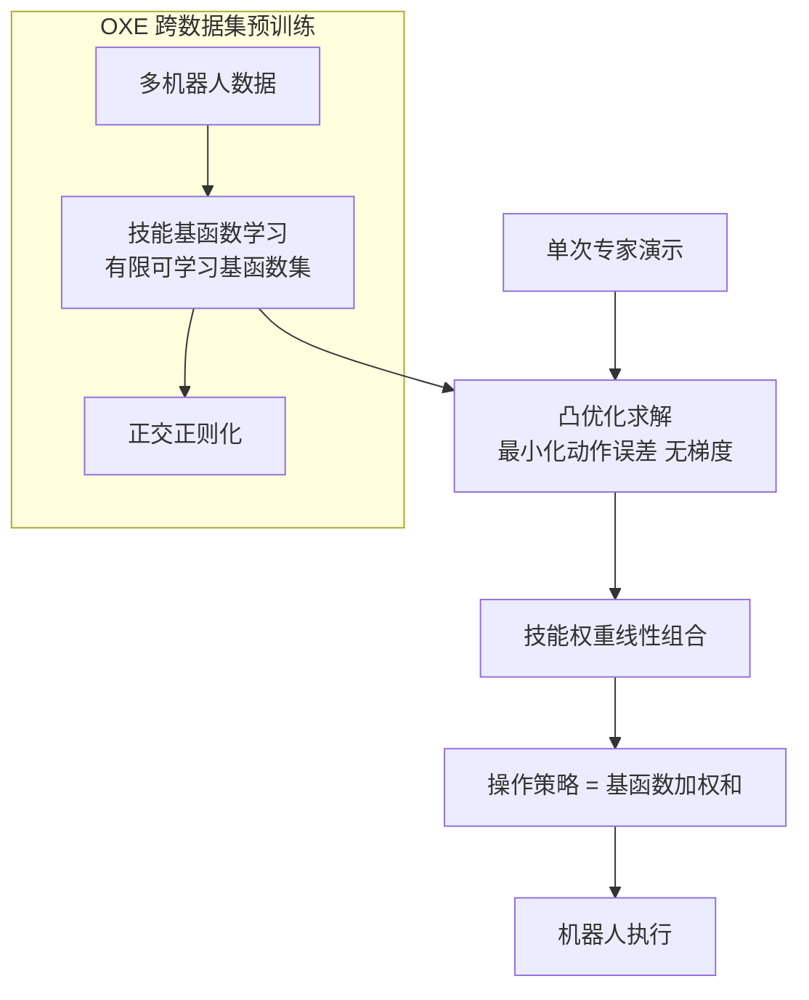

# MoS-VLA: A Vision-Language-Action Model with One-Shot Skill Adaptation

- Local PDF: `/Users/luogu/physical_intelligence/papers/2026-05-10/mos-vla-a-vision-language-action-model-with-one-shot-skill-adaptation_2510.16617.pdf`
- arXiv: https://arxiv.org/abs/2510.16617
- Source: https://arxiv.org/abs/2510.16617
- Project: https://mos-vla.github.io/
- Published: 2025-10
- Category: one-shot adaptation
- Priority: medium

## 一句话总结

MoS-VLA 将机器人操作策略表示为一组可学习基函数的线性组合（Mixture-of-Skills），在 Open X-Embodiment 上跨数据集联合预训练后，给定一次专家演示即可通过 L1 凸优化（最小化动作误差，无需梯度更新）在数秒内适配全新环境/任务/embodiment，在 5/5 个未见数据集上动作预测误差更低，在 OpenVLA 完全失败的场景中达到 70-100% 成功率。

## 核心技术

1. **函数编码器框架（Function Encoder with L1 Banach Space）** — 将策略函数表示为 $k=16$ 个可学习基函数的线性组合，训练时用 Gram 矩阵正交正则化保持基函数多样性，适配时只需基函数权重
2. **凸优化实现单样本梯度无关适配** — 给定一次专家演示后，求解一个 L1 线性规划（min L1 动作误差）得到基函数权重，数秒内完成适配，无需任何梯度回传或反向传播
3. **跨数据集技能空间的联合预训练** — 在 Open X-Embodiment Magic Soup Plus 的 27 个数据集上联合训练基函数，使用校准缓冲区（calibration buffer，每数据集 512 样本）每 16 步重新计算一次基函数系数，避免每步求解线性规划

## 底层原理与数学推导

MoS-VLA 的核心思想来自函数编码器（Function Encoder）理论：将策略函数空间 $(\Pi, \mathcal{H})$ 投影到一组有限基函数张成的子空间上，从而将适配问题简化为系数求解。

**问题形式化：** 设观测空间 $\mathcal{S} = \mathcal{I} \times \mathcal{T}$（RGB 图像 + 自然语言描述），动作空间 $\mathcal{A} \subset \mathbb{R}^m$（$m=7$ 维）。每条轨迹在未观测的上下文 $c \in \mathcal{C}$（光照、相机位姿、机器人形态、决策频率）下采集。目标是学习 $\pi_\theta(s)$ 逼近 $\pi_{\text{exp}}(s, c)$，但由于 $c$ 在训练时隐藏，直接监督学习会学到跨上下文的平均策略（mixed-context overfitting）。

**标准函数编码器（Hilbert 空间 L2 形式）：** 给定 Hilbert 空间 $\mathcal{H} = \{f: \mathcal{X} \to \mathcal{Y}\}$ 和内积 $\langle \cdot, \cdot \rangle_\mathcal{H}$，函数编码器学习基函数 $\{g_1, \dots, g_k\}$ 来张成 $\mathcal{H}$。任何函数 $f \in \mathcal{H}$ 表示为：

$$f = \sum_{i=1}^{k} \alpha_i g_i, \quad \alpha \in \mathbb{R}^k$$

系数通过最小二乘求解：

$$\alpha := \underset{\alpha \in \mathbb{R}^k}{\arg\min} \big\| f - \sum_{i=1}^{k} \alpha_i g_i \big\|^2_\mathcal{H}$$

**MoS-VLA 的修改：L1 Banach 空间公式：** 由于 Open X-Embodiment 数据存在大量噪声（不同机器人、不同设置、不同数据质量），L2 对异常值极度敏感，MoS-VLA 改用 L1 范数：

$$\alpha := \underset{\alpha \in \mathbb{R}^k}{\arg\min} \big\| f - \sum_{i=1}^{k} \alpha_i g_i \big\|_1 \tag{Eq. 1}$$

这是一个**线性规划**（而非无约束二次规划），可使用 CVXPY 高效求解。L1 范数定义为元素级：

$$\|f\|_1 := \int_{\mathcal{S}} \sum_{i=1}^{\dim \mathcal{A}} |f_i(s)| ds$$

策略空间配备标准的元素级向量运算赋予的 Banach 空间结构。

**基函数正交正则化：** 为保持基函数多样性，在训练损失中加入 Gram 矩阵正则化：

$$\mathcal{L}_{\text{reg}} := \sum_{i=1}^{k} \sum_{j=1}^{k} \big( \langle g_i, g_j \rangle - \delta_{ij} \big)^2$$

其中 $\delta_{ij}$ 为 Kronecker delta，内积 $\langle f, g \rangle = \int_{\mathcal{X}} f(x)^T g(x) dx$ 通过轨迹数据集离散近似。

**总训练损失：** 每个训练策略 $\pi_{\text{exp}}^c$ 由其系数 $\alpha^c$ 和第 1 步求解得到，损失为：

$$\mathcal{L} := \sum_{\pi_{\text{exp}}^c \in \Pi_{\text{exp}}} \big\| \pi_{\text{exp}}^c - \hat{\pi}_{\text{exp}}^c \big\|_1$$

$$\theta \leftarrow \theta - \alpha \nabla_\theta (\mathcal{L} + \mathcal{L}_{\text{reg}}) \quad (\text{Adam})$$

**架构设计：** MoS-VLA 基于 OpenVLA（Llama 2 + SigLIP + DinoV2）。关键修改：移除 Llama 2 的 32000 词表输出头，替换为 $k=16$ 个随机初始化的输出头（function encoder action head）。每个头是一个两块的 MLPResNet，从 backbone 的 28672 维扁平特征（4096 × 7）经 4096 维隐藏层处理，输出 $k \times 7$ 维动作向量。其余参数通过 LoRA 微调。

**推理适配（One-Shot Calibration）：**
1. 对专家轨迹 $\tau_{\text{exp}}^c$ 的每一帧，并行前向计算 16 个基函数的输出 $g_i(s)$
2. 求解线性规划（Eq. 1，L1 min），通过 CVXPY 在 RTX 3090 上数秒完成
3. 对新状态 $s$，策略执行：$\hat{\pi}_{\text{exp}}^c(s) = \sum_{i=1}^{k} \alpha_i^c g_i(s)$

整个过程无需反向传播，适配后计算量与演示长度无关（$O(1)$ 推理）。

## 物理直觉解释

MoS-VLA 的核心逻辑是：**先学会几个基础动作技能（基函数），遇到新任务时只用「按比例拼装」这些技能，不需要重新学习。**

- **为什么用线性组合？** 想象你学会了「推」「抓」「抬」「放」「旋转」「前伸」「后退」七种基础动作模式。新的任务「把杯子从桌上拿到碗里」= 前伸 + 抓 + 抬 + 旋转 + 放——这些基础模式只需要不同比例的组合即可。线性组合就是这种「按配方调配」的数学形式。
- **为什么用 L1 而不是 L2？** Open X-Embodiment 数据包含各种机器人、各种采集质量的数据——就像有些是专业厨师记录的菜谱，有些是业余爱好者随手写的。L2（平方误差）对「业余菜谱」中的离谱数字过于敏感（平方放大），L1（绝对值误差）更加鲁棒。
- **一次演示就够了？** 一次演示就像给你一道菜的味道样品，不需要知道完整的菜谱（标注大量数据），只需要知道「这道菜需要偏咸还是偏淡」（调整基函数权重），已有的基础技能库（基函数）已经包含了大部分能力。

**为什么 OpenVLA 在未见过数据集上会失败？** 想象你在训练中用不同设备看视频：有些是 iPhone 拍的，有些是监控摄像头拍的。OpenVLA 学会了「模糊平均」——对 iPhone 和监控摄像头各兼容一半。但新环境用的是 GoPro，这个混合平均策略完全失效。MoS-VLA 则不同：它保留了多个独立的「视觉处理模块」（基函数），用一次演示就能识别出「哦，这是 GoPro 拍的，我应该用这个模块来处理」。

## 工程细节与实操指南

**训练配置：**
- 基座模型：OpenVLA（Llama 2 + SigLIP + DinoV2）
- 基函数数量：$k=16$（消融实验最佳）
- 训练数据：Open X-Embodiment Magic Soup Plus 数据混合（27 个数据集）
- 计算资源：32 个分布式节点，各含 GH200 GPU，PyTorch DDP
- 全局 Batch size：320
- 总梯度步数：5000，训练时间约 24 小时
- 优化器：Adam，学习率 $1 \times 10^{-4}$，10 步预热
- 其余部分：LoRA 微调，仅输出头全参数训练

**校准缓冲区（Scalable Skill Calibration）：** 标准函数编码器需要在每个梯度步求解系数 $\alpha^c$，这在 27 个数据集、每个数万条轨迹的大规模训练中不可行。MoS-VLA 引入校准缓冲区：
- 每数据集维护 512 个训练样本的缓冲区
- 每 16 个梯度步重新计算一次系数
- 在 DDP 训练中，32 个节点中前 27 个各托管一个数据集，负责求解该数据集的线性规划（CVXPY）并广播到所有节点
- 两次校准之间系数固定，不通过系数计算回传梯度

**推理适配流程（单次演示，数秒完成）：**
1. 准备一条专家演示轨迹（可少至 1-3 个时间步）
2. 将所有观测帧批量前向传播通过 16 个基函数头
3. 用 CVXPY 求解 L1 线性规划，得到 16 个权重系数
4. 部署：对任意新观测，$\hat{a}(s) = \sum_i \alpha_i g_i(s)$

**实验结果（仿真 + 真机）：**

| 任务 | 设置 | OpenVLA | MoS-VLA (1-shot) |
|------|------|---------|-------------------|
| 举起方块 | 仿真 | 0% | 70% |
| 开门 | 仿真 | 0% | 75% |
| 到达目标点 | 真机 | 0% | 100% |
| 举起方块 | 真机 | 0% | 100% |
| 插入笔 | 真机 | 0% | 100% |

在 5/5 个未见 OXE 数据集上，MoS-VLA 的 L1 动作预测误差均低于 OpenVLA。

**系数空间可视化：** PCA 和 t-SNE 分析显示，同实验室数据集的策略系数自然聚类，三个 Austin 数据集（已知实验室设置相似）合并为一个聚类，验证了系数空间确实捕捉了真实的物理相似性。

## 技术权衡（Trade-off）

| 优势 | 劣势与工程代价 |
|------|---------------|
| 一次演示 + 凸优化数秒适配，无梯度计算，计算开销极低 | 基函数数量 $k=16$ 限制表达能力——高度非线性或跨形态差异极大的技能组合可能无法用线性组合表示 |
| L1 凸优化对 OXE 中的噪声数据鲁棒，5/5 未见数据集优于 OpenVLA | 单次演示的信息量有限：对高度随机的环境或多模态操作方式，一次演示不能覆盖有效的行为分布 |
| 总参数量小于 OpenVLA（移除大词表头），推理速度更优 | 当前仅限于短周期任务（short-horizon），长周期任务需要时序抽象或层次化技能组合 |
| 训练仅需 24 小时 / 5000 步 / 32 GH200，远低于大规模 VLA 预训练 | 从 OpenVLA 初始化意味着受限于 OpenVLA 的能力上限——分类预训练的目标函数与回归基函数训练不匹配 |

## 技术价值与演进定位

MoS-VLA 在「VLA 高效部署适配」这一关键工程问题上提供了一个轻量化替代方案。现有 VLA 部署到新环境通常需要 finetune（需大量数据和算力）或 RL 微调（不稳定且耗时），而 MoS-VLA 将适配过程简化为一次前向传播 + 凸优化。

从理论角度看，它是首个将函数编码器算法扩展到十亿参数级视觉-语言模型的工作，也是首个证明 Transformer 可以作为基函数来张成机器人策略空间的工作。

该路线的核心假设是：**机器人操作技能可以被分解为一组低维基函数的线性组合**。如果这一假设成立，则意味着 VLA 的泛化瓶颈从「模型容量」转向「基函数空间覆盖度」——预训练阶段的目标应该是构建一个足够完备的基函数库，而非训练一个万能策略。

## 与其他论文的关系

- **OpenVLA**：MoS-VLA 的基座模型和主要对比基线。MoS-VLA 修改了 OpenVLA 的输出头，证明了在无梯度前提下通过函数编码器适配可以超越 OpenVLA 的零样本性能
- **RT-2 / Octo**：大规模 VLA 预训练范式，MoS-VLA 在此基础上增加了「跨上下文适应」能力
- **SimpleVLA-RL**：用 RL 微调 VLA，需要梯度更新和大量探索。MoS-VLA 提供了无梯度替代方案
- **GR00T N1**：通过大量演示数据做上下文学习。MoS-VLA 仅需一次演示 + 凸优化
- **Function Encoder（ICLR 2023）**：MoS-VLA 的理论基础，将函数编码器从纯视觉任务扩展到视觉-语言-动作领域

## 精读问题

1. $k=16$ 个基函数是否是最优选择？是否存在 $k$ 的 scaling law——随着数据集数量和任务复杂度增加，$k$ 应该如何增长？
2. L1 凸优化求解速度在演示轨迹较长时是否仍能维持数秒？单次演示的信息量下限是多少（是否 1-2 帧就足够）？
3. 校准缓冲区的 512 样本 / 16 步的配置是否有理论依据？对于极大规模的数据集（如 DROID），这个配置是否需要调整？
4. 从 OpenVLA 的分类式预训练头切换到回归式基函数头，是否存在预训练-微调的不匹配问题？从头训练基函数而非从 OpenVLA 初始化是否会更好？
5. 线性组合假设（策略 = 基函数的线性组合）对于涉及复杂接触动力学或连续交互的任务（如拧螺丝、穿线）是否仍然成立？是否需要引入非线性组合（如浅层 MLP 后处理）？
