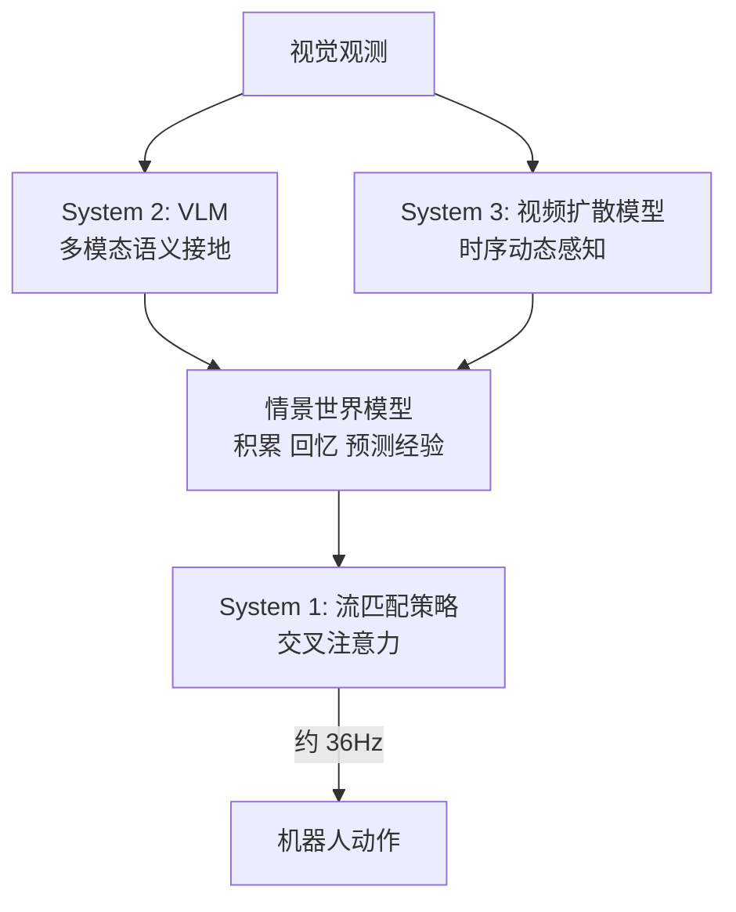

# TriVLA: A Triple-System-Based Unified Vision-Language-Action Model for General Robot Control

- Local PDF: `/Users/luogu/physical_intelligence/papers/2026-05-10/trivla-a-triple-system-based-unified-vision-language-action-model-for-general-ro_2507.01424.pdf`
- arXiv: https://arxiv.org/abs/2507.01424
- Source: https://arxiv.org/abs/2507.01424
- Project: https://zhenyangliu.github.io/TriVLA/
- Published: 2025-07
- Category: episodic world model
- Priority: medium

## 一句话总结

TriVLA 受认知神经科学的「情景记忆」理论启发，提出首个 VLA 中的三元系统架构——VLM（System 2）负责语义接地、视频扩散模型（System 3）负责时序动态感知、流匹配策略（System 1）负责动作生成，通过情景世界模型让机器人积累、回忆和预测操作经验，在 ~36Hz 实时运行下达到 CALVIN 4.37 / LIBERO 87.0% / MetaWorld 0.714 的 SOTA 水平。

## 核心技术

1. **三元系统架构（Triple-System Architecture）** — 受 GR00T N1 双系统启发，新增视频扩散模型作为 System 3（时序动态感知），与 VLM System 2（语义接地）共同构成情景世界模型，流匹配 + DiT 作为 System 1（动作生成），总参数量 3.39B，控制频率 ~36Hz
2. **情景世界模型（Episodic World Model）** — 首次在 VLA 中形式化定义情景记忆：模型不仅理解当前观测，还能通过回忆过去经验和预测未来动态来生成动作，实现长程规划与开放意图理解
3. **视频扩散模型单步推理（Single Forward Pass）** — System 3 不从噪声完整去噪，而是对当前帧加噪后仅执行第一步前向推理，从各上采样层聚合多尺度特征作为预测性视觉表示，将推理延迟控制在 85.9ms 以内

## 底层原理与数学推导

TriVLA 的核心创新在于将「情景记忆」（episodic memory）这一认知神经科学概念引入 VLA 架构。人类的大脑不会每次从零开始规划动作，而是回忆过去类似情景的经验，结合对未来的预测来指导当前行为。TriVLA 用三个系统模拟这一过程。

**System 2：情景多模态感知（Episodic Multimodal Perception）**
- 基座模型：NVIDIA Eagle-2 VLM（SmolLM2 语言模型 + SigLIP-2 图像编码器）
- 图像分辨率：224×224，像素重组（pixel shuffle）→ 每帧 64 个图像 token
- 特征提取：取自 LLM 第 12 层嵌入（非最后一层，速度和精度更好）
- 状态编码：任务专属 MLP 将机器人状态投影到共享嵌入空间 → 状态 token $Q_s$

**System 3：情景动态感知（Episodic Dynamics Perception）**
- 基座模型：Stable Video Diffusion (SVD)，1.5B 参数，在 Something-Something（19.4 万条人类操作视频）和 Open X-Embodiment（17.9 万条机器人操作轨迹）上微调 2-3 天（8×H100）
- 训练目标（扩散重建损失）：

$$\mathcal{L}_D = \mathbb{E}_{x_0 \sim \mathcal{D},\ \varepsilon,\ t} \big\| V_\theta(x_t,\ l_{\text{emb}},\ s_0) - x_0 \big\|^2$$

其中 $x_t = \sqrt{\bar{\alpha}_t} x_0 + \sqrt{1-\bar{\alpha}_t} \varepsilon$，$l_{\text{emb}}$ 为 CLIP 语言嵌入，$s_0$ 为当前帧。

**单步推理：** 推理时，不对完整去噪过程采样，而是将当前帧 $s_0$ 与最终加噪潜变量 $q(x_{t'} \mid x_0)$（白噪声）拼接，仅执行第一步前向推理。从第 $m$ 个上采样层提取特征 $L_m$，插值到统一空间尺寸 $W_p \times H_p$ 后沿通道拼接：

$$F_p = \text{concat}\big( \text{Interp}(L_0),\ \text{Interp}(L_1),\ \dots,\ \text{Interp}(L_m),\ \text{dim}=1 \big)$$

$$F_p \in \mathbb{R}^{T \times (\sum_m C_m) \times W_p \times H_p}$$

多摄像头场景下（固定 + 腕部相机），各自独立预测后再拼接。

**System 1：策略学习模块（Policy Learning Module）**

预测性 token 压缩：可学习 token $Q_{[0:T,\ 0:L]}$ 先进行空间注意力：

$$Q' = \{\text{Spat-Attn}(Q[i], (F_p^{\text{static}}[i], F_p^{\text{wrist}}[i]))\}_{i=0}^T$$

再进行时序注意力：

$$Q_p = \text{FFN}(\text{Temp-Attn}(Q'))$$

**流匹配动作扩散：** 采用扩散策略作为动作头。加噪动作 $a_k$：

$$a_k = \sqrt{\bar{\beta}_k} a_0 + \sqrt{1-\bar{\beta}_k} \varepsilon$$

跨注意力将 $Q_{vl}$ 和 $Q_p$ 注入 DiT 块。损失函数：

$$\mathcal{L}_{\text{diff}}(\psi; A) = \mathbb{E}_{a_0,\ \varepsilon,\ k} \big\| A_d(D_\psi(a_k, Q_{vl}, Q_p)) - a_0 \big\|^2$$

- $D_\psi$：DiT 去噪器
- $A_d$：任务专属动作解码器（MLP）
- 预测 10 步动作块（action chunk size = 10）

**控制频率与延迟：**
- System 2 推理：27.5ms
- System 3 推理：85.9ms（单步 SVD）
- 总延迟：142.69ms
- 控制频率：34-36Hz（通过动作块预测实现）

## 物理直觉解释

TriVLA 的三元系统可以类比人类驾驶：

- **System 2（VLM）** = 副驾驶认路：「前方路口左转，注意行人」——处理语义信息、理解任务目标
- **System 3（视频扩散）** = 司机的空间直觉：「前面那辆车好像在减速，旁边车道有空隙」——感知物体的时序动态
- **System 1（流匹配策略）** = 手脚的肌肉记忆：自动打方向盘、踩刹车——生成具体动作

**什么是「单步推理」？** 正常的视频扩散模型要从纯噪声逐步去噪几十步才能生成完整视频，计算量巨大。TriVLA 的做法是：把当前帧加噪声到接近纯噪声，然后只走第一步——就像你快速扫一眼未来 1 秒的变化趋势，不需要精确知道每一帧的细节，只需要「大概往哪个方向变」。这步推理提取的特征包含丰富的时序信息，但计算量只有完整去噪的 1/50。

**动作块（action chunk）的作用：** 机器人不每步都重新规划，而是一次预测未来 10 步的动作（约 0.3 秒的轨迹），这样即使 System 3 需要 85.9ms 处理，整体控制频率仍能达到 36Hz。

## 工程细节与实操指南

**训练配置：**
- System 3 微调：8×H100，2-3 天，Something-Something（19.4 万条）+ OXE（17.9 万条）+ CALVIN + MetaWorld + 真机数据
- System 1 策略训练：4×H100，5-9 小时
- System 2 VLM：Eagle-2 预训练权重直接使用，不做微调
- 数据集采样策略：采用 Octo 的 dataset-specific sampling ratio 处理数据集规模不均衡问题

**推理流程：**
1. 输入当前帧 $s_0$ 和语言指令 → System 2 提取 VLM 特征 $Q_{vl}$ + 状态 token $Q_s$
2. 对 $s_0$ 加噪 → System 3 单步前向 → 提取多尺度预测特征 $F_p$
3. 可学习 token 通过时空注意力压缩 $F_p$ → $Q_p$
4. DiT 通过跨注意力融合 $Q_{vl}$ 和 $Q_p$ → 扩散生成 10 步动作块
5. 执行动作块前几步，滚窗重复

**消融实验关键结论：**
- 无 System 2 和 System 3（仅策略）：CALVIN 3.68, 29.29ms, 0.53B 参数
- +System 2（VLM）：CALVIN 4.06 (+0.38), 115.19ms, 1.87B 参数
- +System 2 + System 3（完整）：CALVIN 4.37 (+0.31), 142.69ms, 3.39B 参数
- System 2 贡献最大（+0.38），System 3 在此基础上进一步提升（+0.31）

## 技术权衡（Trade-off）

| 优势 | 劣势与工程代价 |
|------|---------------|
| 情景世界模型实现长程规划和开放意图理解，超越反应式行为 | 三元架构总参数 3.39B，延迟 142.69ms，部署成本远高于单系统 VLA |
| 视频扩散单步推理将 System 3 延迟控制在 85.9ms，通过动作块达到 ~36Hz | SVD 微调需要 8×H100 训练 2-3 天，数据量大（37 万 + 条轨迹） |
| 三个系统可独立替换和升级，模块化程度高 | 情景记忆的容量和检索机制尚未深入——当前仅用单步视频特征，没有显式的记忆存储和检索索引 |

## 技术价值与演进定位

TriVLA 是 GR00T N1 双系统架构的自然扩展——增加视频扩散作为独立的时序动态感知系统。它标志着 VLA 架构从「感知-动作」两阶段向「感知-预测-动作」三阶段的演进，填补了 VLA 中「对未来动态的显式建模」这一空白。

这条路线的核心假设是：**仅靠 VLM 的语义理解不足以支撑机器人操作，需要独立的时序动态感知模块来捕获物理世界的运动规律。** 这一假设在 CALVIN（+0.31）、LIBERO（+0.11）和 MetaWorld（+0.13）上均得到验证。

## 与其他论文的关系

- **GR00T N1**：双系统（VLM + 动作）。TriVLA 继承并扩展为三系统（VLM + 视频扩散 + 动作），新增「时序动态感知」
- **VPP / Seer**：用视频预测做前瞻。TriVLA 同样利用视频预测，但将其作为 System 3 与 VLM System 2 解耦并行
- **Stable Video Diffusion**：TriVLA 直接微调 SVD 作为 System 3 的基座，利用其大规模预训练的视频动态先验
- **Eagle-2**：作为 System 2 的 VLM 基座，负责多模态语义理解

## 精读问题

1. System 3 单步推理提取的特征来自 SVD 的浅层上采样层，这与从完整去噪后的潜变量提取特征有何本质差异？丢失了多少时序细节？
2. 三个系统的特征融合方式是否最优？当前通过可学习 token 的时空注意力压缩，是否有更高效的信息路由方式？
3. 情景世界模型的「回忆」功能目前仅通过视频扩散的时序特征实现，是否有更显式的记忆机制（如记忆槽、检索增强生成）能进一步提升性能？
4. System 3 的 SVD 在 Something-Something 和 OXE 数据上微调，数据跨域巨大（人类操作 vs 机器人操作），训练时如何处理域偏移？
5. 动作块大小 10 步约对应 0.3s 的控制窗口，对于需要精细反馈的高速操作（如插入、拧螺丝），10 步开环是否足够？是否需要在动作块执行期间引入重规划机制？
