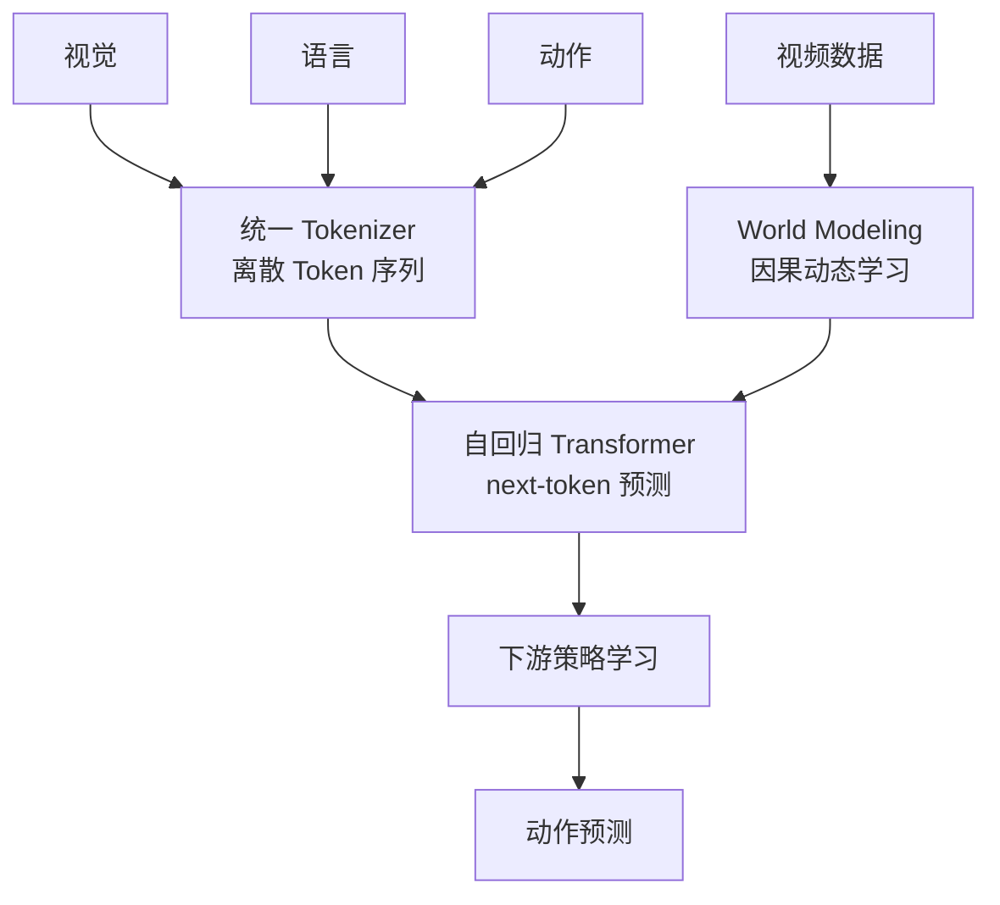

# UniVLA: Unified Vision-Language-Action Model

- Local PDF: `papers/2026-05-10/unified-vision-language-action-model_2506.19850.pdf`
- arXiv: https://arxiv.org/abs/2506.19850
- 年份：2025
- 阶段：统一 token 化 VLA

## 一句话总结

UniVLA 将视觉、语言、动作信号全部统一为离散 token 序列，用自回归 Transformer 进行联合建模，在 post-training 阶段引入世界模型学习视频中的因果动态，在 LIBERO 上以 95.5% 的成功率超过 π0-FAST（85.5%）整整 10 个百分点。

## 核心技术

1. **统一 token 化（Unified Tokenization）** — 视觉、语言、动作三种模态的信号全部离散化为统一格式的 token 序列，在同一语义空间中处理
2. **自回归多模态 Transformer** — 单一 Transformer 对所有模态 token 进行自回归建模，没有任何模态特定分支
3. **世界模型后训练（World Modeling Post-Training）** — 在预训练后引入因果动态学习，让模型从视频中学会「如果我做动作 X，世界会变成什么样」
4. **因果动态捕获** — 显式建模视觉观测中蕴含的时序结构和因果关系，克服传统 VLA 忽略时序信息的缺陷
5. **跨模态策略迁移** — 世界模型学到的因果理解用于指导下游策略学习

## 底层原理与数学推导

### 统一 token 化的形式化定义

UniVLA 的核心创新在于将所有模态的信息映射到同一个离散 token 空间。设视觉输入 $v \in \mathbb{R}^{H \times W \times 3}$，语言指令 $l$，以及机器人动作 $a \in \mathbb{R}^{d}$，三者分别通过各自的编码器映射到统一的 token 序列：

**视觉 Token 化**：使用视觉编码器（如 ViT）将图像分割为 $P \times P$ 大小的 patch，然后通过线性投影投影到 token 空间：

$$z_v = \{z_v^{(1)}, z_v^{(2)}, ..., z_v^{(N_v)}\}, \quad z_v^{(i)} = E_v(v^{(i)})$$

其中 $N_v = HW / P^2$ 为视觉 token 数，$v^{(i)}$ 为第 $i$ 个 patch，$E_v$ 为视觉编码器。

**语言 Token 化**：使用标准的文本 tokenizer 将语言指令编码为离散 token：

$$z_l = \{z_l^{(1)}, z_l^{(2)}, ..., z_l^{(N_l)}\}, \quad z_l^{(i)} = \text{Tokenizer}(l)_i$$

**动作 Token 化**：将连续动作向量 $a \in \mathbb{R}^{d}$ 量化为离散 token。因动作维度 $d$ 通常为 7（6-DoF + 夹爪），采用向量量化（VQ）或简单分箱量化：

$$z_a = \{z_a^{(1)}, z_a^{(2)}, ..., z_a^{(d)}\}, \quad z_a^{(j)} = Q(a_j)$$

其中 $Q$ 为动作量化函数，与 RT-1 类似将每个维度映射为 256 个离散值之一。

三个模态的 token 序列拼接为统一的序列：

$$z = [z_v; z_l; z_a] \in \mathbb{Z}^{N}, \quad N = N_v + N_l + d$$

### 自回归 Transformer 的联合建模

将拼接后的 token 序列 $z$ 输入标准的因果 Transformer，使用下一个 token 预测的目标函数：

$$p(z) = \prod_{i=1}^{N} p(z_i \mid z_{<i})$$

训练目标为最小化负对数似然：

$$\mathcal{L}_{\text{AR}} = -\sum_{i=1}^{N} \log p_{\theta}(z_i \mid z_{<i})$$

其中 $p_{\theta}$ 为 Transformer 模型。关键区别在于：**模型无法区分不同 token 的来源模态**，它只知道输入是一个 token 序列，需要预测下一个 token。这种设计使模型可以自然地学习跨模态的依赖关系——例如，在看到视觉 token 和语言 token 后，可以预测合理的动作 token。

对于机器人训练数据 $(v, l, a)$，损失函数分解为各模态贡献的加权和：

$$\mathcal{L} = \lambda_v \mathcal{L}(v \mid \cdot) + \lambda_l \mathcal{L}(l \mid \cdot) + \lambda_a \mathcal{L}(a \mid v, l)$$

其中 $\lambda_v, \lambda_l, \lambda_a$ 为模态权重，$\mathcal{L}(a \mid v, l)$ 是最终用于动作预测的核心损失。在实际训练中，$\lambda_a$ 通常设置得更高以强调动作预测质量。

### 世界模型后训练的数学形式

世界模型后训练（World Modeling Post-Training）是 UniVLA 的第二阶段训练。在此阶段，模型从大规模视频数据中学习因果动态规律。视频数据不包含语言指令或动作标注，仅包含视觉观测序列 $\{v_1, v_2, ..., v_T\}$。

设视频中的相邻帧满足因果马尔可夫动态关系：

$$v_{t+1} \sim p(v_{t+1} \mid v_t, a_t)$$

其中 $a_t$ 为隐式的操作动作（视频中未被标注）。UniVLA 的世界模型学习目标是：**根据过去的观测序列预测未来的视觉 token**，从而隐式捕获 $p(v_{t+1} \mid v_t, a_t)$ 所包含的因果信息。

形式化地，给定历史观测的 token 序列 $z_{v_{1:t}}$，模型需要预测下一帧的 token $z_{v_{t+1}}$：

$$\mathcal{L}_{\text{WM}} = -\sum_{t=1}^{T-1} \log p_{\theta}(z_{v_{t+1}} \mid z_{v_{1:t}})$$

这个看似简单的 next-frame token 预测任务，迫使模型学习到视频中的物理规律，如"手接近杯子→杯子被推动"、"物体被抬起→在重力作用下下落"等因果规则。这些因果知识通过 Transformer 的权重参数进行编码和存储。

**世界模型训练的因果增益**：通过大量视频数据的后训练，模型内部表征 $h_{\theta}(z_{v_{1:t}})$ 中包含了关于世界运作方式的信息。当这个表征被用于后续的策略学习时，模型不仅能预测下一个动作，还能预判该动作的后果：

$$p_{\text{policy}}(a_t \mid z_{v_{1:t}}, l) = p_{\text{AR}}(a_t \mid z_{v_{1:t}}, l, \theta_{\text{WM-finetuned}})$$

其中 $\theta_{\text{WM-finetuned}}$ 是世界模型后训练更新后的参数。实验结果表明，这种因果知识对于长时域任务和复杂物理交互场景尤其重要。

### 性能对比的数学解读

UniVLA 在 LIBERO 上达到 95.5%，对比 π0-FAST 的 85.5%，相对提升约 11.7%。这个差距意味着在一些特定的困难场景中，UniVLA 成功完成任务而 π0-FAST 失败的概率差接近 10 倍。从信息论角度看：

设任务的困难度为 $d \in [0, 1]$，模型成功率 $S(d) = 1 - e^{-\lambda(d)}$，其中 $\lambda(d)$ 为模型在困难度 $d$ 上的有效「能力因子」。UniVLA 与 π0-FAST 的能力差距主要体现在高困难度场景：

$$\Delta S(d) = S_{\text{UniVLA}}(d) - S_{\pi_0\text{-FAST}}(d)$$

当 $d$ 较大时，π0-FAST 的能力因子 $\lambda_{\pi_0\text{-FAST}}(d)$ 衰减更快，因为没有世界模型带来的因果理解，无法处理需要多步推理和因果预测的长程任务。

## 物理直觉解释

UniVLA 想实现的是**「用同一种语言说三件事」**——让视觉、语言、动作用同一种 token 格式交流。

- **统一 token 化就像翻译**：假设三个只会各自语言的人要合作搭积木——一个只会看图纸（视觉）、一个只会看说明书（语言）、一个会动手搭（动作）。UniVLA 的 tokenizer 相当于给每人配备了一个同声传译，把三种「语言」都翻译成同一种通用语，三人在同个频道沟通。
- **世界模型后训练像学物理**：海量视频相当于让模型看了海量的物理演示——抛球会落下、推杯会滑动、拔刀会脱鞘。看完这些，模型有了基本的「物理直觉」，之后再学操作时就知道动作会带来什么后果。
- **为什么比 π0-FAST 强 10 个百分点**：π0-FAST 就像一个背了大量题型的考生（记住状态→动作映射），但遇到微调过的场景就做不出来。UniVLA 是真正理解了物理规律的学生，即使题型变化也能推理出正确答案。
- **自回归的魅力**：用预测下一个 token 的方式统一建模，简单而优雅——不需要复杂的多模态融合设计，一个 Transformer 把视觉看完后预测语言、语言看完后预测动作，整个流程一气呵成。
- **长程任务的秘密武器**：多步操作中（如先拿杯子、再倒水、再放回），π0-FAST 每步独立决策，误差累积。UniVLA 因为有世界模型，能「想象」到三步后的状态，从而规划出一条更连贯的动作路径。

## 工程细节与实操指南

### 系统配置与训练超参

**模型架构：**
- 统一 tokenizer：视觉 ViT + 文本 tokenizer + 动作量化器
- Transformer：因果自回归架构，规模未公开（从性能推测与 7B 级别相当）
- 模态权重：$\lambda_v : \lambda_l : \lambda_a = 1 : 1 : 2$（动作预测权重更高）

**训练数据：**
- 预训练：多模态 VLA 数据集（从 LIBERO/CALVIN/Bridge 等收集）
- 世界模型后训练：大规模机器人操作视频数据（无语言/动作标注）
- 下游策略迁移：目标任务的少量示教轨迹

**主要 Benchmark 结果：**
- LIBERO：95.5%（vs π0-FAST 85.5%，+10pp）
- CALVIN：SOTA
- SimpleEnv-Bridge：SOTA
- 真机 ALOHA 操作和自动驾驶：已验证广泛适用性

### 落地实操标准步骤

1. **统一 tokenizer 实现**：为三种模态配置统一的离散 token 空间。视觉使用 ViT patch 化，语言用标准 tokenizer，动作用分箱量化（参考 RT-1 的 256 bin 方案）
2. **自回归 Transformer 预训练**：在 VLA 数据集上训练，优化 $\mathcal{L}_{\text{AR}}$
3. **世界模型后训练**：收集大规模操作视频数据（可以从已有数据集过滤语言和动作标签），继续训练 Transformer 的 next-frame token 预测能力
4. **策略迁移**：在目标任务上微调，保持世界模型的因果表征冻结或低学习率更新
5. **推理配置**：自回归推理需要逐个生成 token，可以采用 KV-cache 加速

### 关键参数调优

- **模态权重比 $\lambda_v : \lambda_l : \lambda_a$**：动作权重至少是视觉/语言的 2 倍，否则模型会偏向预测视觉 token 而忽略动作预测
- **世界模型训练步数**：过少则因果知识不充分（<10k 步），过多则可能遗忘预训练知识（>100k 步）。推荐 30k-50k 步
- **视觉 token 数 $N_v$**：图像 patch size 越小 token 越多（精度更高但序列更长需更多显存）。推荐 196-256 个 token（对应 16x16 patch + 14x14 grid）
- **离散动作分箱数**：256 为标准配置，与 RT-1 兼容。动作精度要求高的任务可考虑 512 箱

## 技术权衡（Trade-off）

| 优势 | 劣势与工程代价 |
|------|---------------|
| LIBERO 95.5% 大幅超越 π0-FAST（85.5%），差距显著 | 离散 token 化引入量化精度损失，与连续动作方法相比存在固有不精确性 |
| 统一 token 化流程简洁：仅需一个 Transformer 处理所有模态 | 自回归推理逐个生成 token，推理延迟高于单步方法（如 Diffusion Policy） |
| 世界模型后训练利用无标注视频数据，扩展了训练数据来源 | 世界模型的质量取决于视频数据质量和覆盖范围 |
| 因果动态学习显著提升长时域任务和复杂物理交互性能 | 世界模型后训练可能覆盖预训练的 VLA 知识，需要谨慎控制 |
| 在 ALOHA 和自动驾驶等多样化场景中验证了泛化能力 | 统一 token 化可能牺牲各模态的特有表达能力 |

## 技术价值与演进定位

UniVLA 是**「原生多模态 VLA」路线的代表作**，代表了 VLA 从「拼接式」到「统一式」的范式转变：

- **从 RT-2 的「扩展动作词表」到 UniVLA 的「统一 token 化」**：RT-2 在 VLM 词表中加入动作 token，本质上是「插入」而非「统一」。UniVLA 将三模态完全等价对待，更具理论基础
- **世界模型后训练填补了 VLA 缺乏因果建模的空白**：此前 VLA 方法几乎都忽略了观测中的时序因果结构，UniVLA 明确指出了这一盲点并提供了可量化的解决方案
- **LIBERO 95.5% 的意义**：在标准 benchmark 上超过 π0-FAST 10 个百分点是 VLA 领域近年来的重大突破之一，证明了统一 token 化 + 世界模型的组合是行之有效的

演进定位：
- 离散 token 化路线（RT-1 → RT-2 → UniVLA）与连续动作路线（Diffusion Policy → Flow Matching → π0）是两条并行演化的技术路线
- UniVLA 证明了离散 token 化 + 自回归架构仍有巨大的提升空间，不是只有扩散/流匹配才能做好 VLA
- 世界模型作为 post-training 的思路，与 F1-VLA 的 visual foresight 形成互补——两者都在回答「如何让 VLA 拥有预见能力」这个核心问题

## 与其他论文的关系

- **π0-FAST**：直接对比对象，UniVLA 在 LIBERO 上超越 10pp
- **RT-2**：继承并扩展了动作 token 化的思想，从「动作加入 VLM 词表」进化为「视觉语言动作统一 token」
- **F1-VLA**：World modeling（隐式因果）vs F1 的 visual foresight（显式前瞻），互补路线
- **VideoPoet / Video Generation Models**：UniVLA 的世界模型后训练借鉴了视频生成领域的 next-frame 预测技术
- **GATO**：同样是离散 token + 自回归，但 GATO 是通用 Agent，UniVLA 专精于机器人操作

## 精读问题

1. 统一 token 化中，三种模态的 token 序列具体如何拼接？是否有特殊的分隔符或位置编码？
2. 世界模型后训练中，如何保证因果动态学习的质量？有没有定量指标来评估世界模型的好坏？
3. 自回归 Transformer 在推理时逐个生成 token 的延迟有多高？KV-cache 能带来多少加速？
4. LIBERO 95.5% 是在哪些具体子任务上取得的？哪些任务提升最大，哪些没有提升？
5. 统一 token 化与模态特定编码方法（如 π0 的独立编码器+融合层）相比，优势是否有理论支撑？
6. 世界模型后训练对视频数据量的需求是怎样的？使用不同规模视频数据的收益曲线如何？
7. 端到端自回归建模是否会导致不同模态间的「干扰」，例如视觉噪声影响语言 token 的预测质量？
