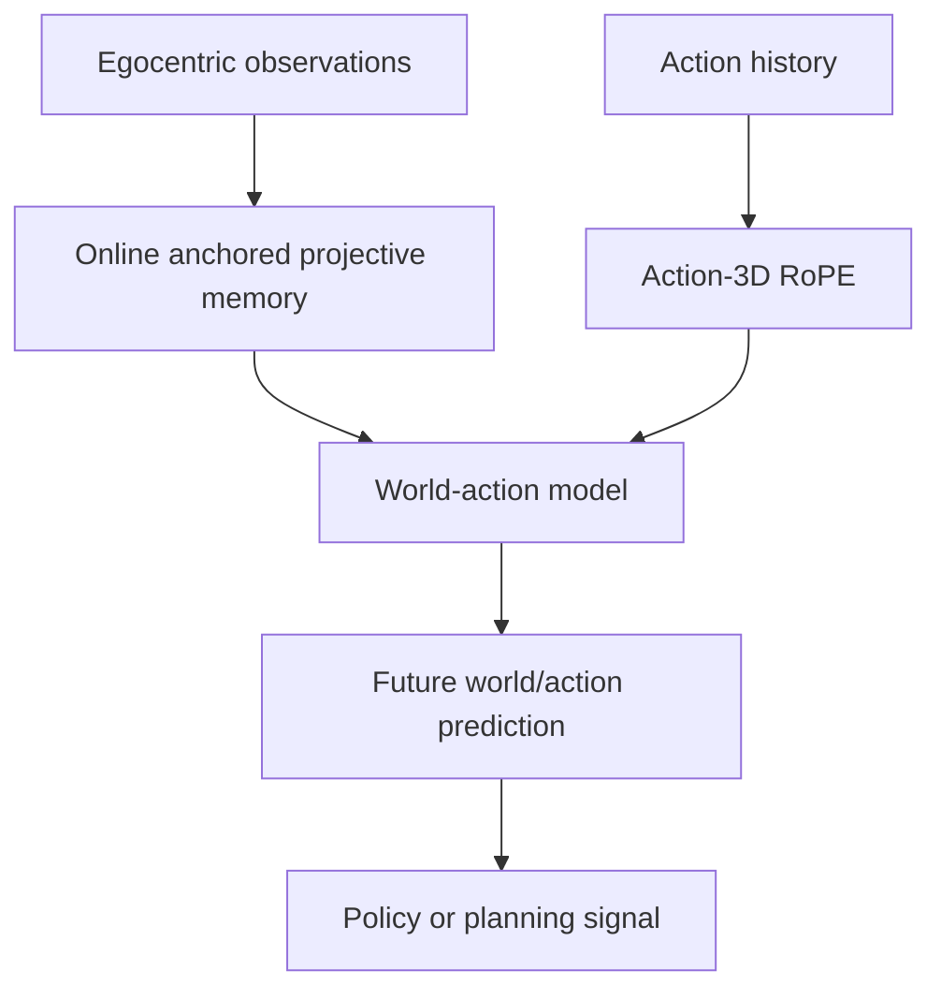

# EgoGenesis: Egocentric World-Action Modeling with Online Anchored Projective Memory and Action-3D RoPE

- arXiv: https://arxiv.org/abs/2607.28243
- Source: https://arxiv.org/abs/2607.28243
- Project:
- Local PDF: `/Users/luogu/physical_intelligence/papers/2026-08-02-priority-2/egogenesis-egocentric-world-action-modeling-with-online-anchored-projective-memo_2607.28243.pdf`
- Year: 2026
- Category: egocentric world-action model
- Priority: medium

## 一句话总结

EgoGenesis 研究 egocentric world-action modeling：用在线 anchored projective memory 和 Action-3D RoPE 把第一视角观测、记忆和动作空间结合起来，目标是改进具身智能体的世界-动作预测能力。

## 核心技术

1. **Egocentric world-action modeling**：从第一视角建模未来状态和动作，而不是依赖外部全局视角。
2. **Online anchored projective memory**：在线维护与视角/空间锚定相关的 memory，使过去观测能服务当前动作。
3. **Action-3D RoPE**：将 3D 空间结构编码进动作/时序建模，增强空间一致性。
4. **World-action coupling**：不是单独预测视频或单独预测动作，而是把世界变化和 action representation 绑定。

## 底层原理与数学推导

可以把模型看成学习：

$$
p(o_{t+1:t+H}, a_{t:t+H} | o_{\le t}, a_{<t}, M_t)
$$

其中 $M_t$ 是 anchored projective memory。Action-3D RoPE 的作用类似把标准 RoPE 从 1D token position 扩展到 action-relevant 3D coordinates，使 attention 机制保留空间相对关系。

## 物理直觉解释

人类执行任务时不是只看当前一帧，而是记得刚才看过的物体位置、自己移动过的路线、手和物体的相对关系。EgoGenesis 试图让模型在 egocentric 视角下维护这种“在线空间记忆”，并把它直接用于动作预测。

## 工程细节与实操指南

- 适合长程任务、移动操作、人形机器人第一视角、头戴/胸前相机场景。
- 阅读时重点看 memory 更新规则和 Action-3D RoPE 的坐标定义。
- 如果接到你的方向，可以作为 VLA/VLM 测试中“记忆/状态一致性”评估的候选架构。
- 复现难点通常在数据格式：需要 egocentric trajectory、动作和空间标注对齐。

## 消融实验与分析

重点看：

- 去掉 anchored memory 后长程任务是否明显退化。
- Action-3D RoPE 相比普通 temporal/2D position encoding 是否有增益。
- 模型是改进 action prediction、future observation prediction，还是下游 task success。
- 是否有真实机器人或标准 embodied benchmark，而不只是视频预测指标。

## 技术权衡（Trade-off）

| 优势 | 劣势与工程代价 |
|------|---------------|
| 适合第一视角具身智能 | 数据要求高，需要对齐观测、动作、空间 |
| 把记忆和动作建模结合 | 架构复杂，复现成本高 |
| Action-3D RoPE 可能提升空间泛化 | 对固定桌面单臂任务收益可能有限 |
| 有助于长程任务状态一致性 | 是否能转成真实控制能力需验证 |

## 技术价值与演进定位

EgoGenesis 属于 robot foundation model / world-action model 架构方向。它对你有价值，因为它不局限于当前工作中的 failure diagnosis，而是拓展到“具身模型如何记忆、预测和行动”的更长期问题。

## 与其他论文的关系

- 和 PaLM-E：PaLM-E 接入 embodied input，EgoGenesis 更强调第一视角 memory 和 action coupling。
- 和 ACE-Data-0：ACE 这类 egocentric/multiview 数据可为 EgoGenesis 类模型提供训练基础。
- 和 LingBot-VA/World Action Models：都把世界预测和动作建模结合。

## 精读问题

1. Anchored projective memory 的 anchor 是图像 patch、3D point，还是 object-level entity？
2. Action-3D RoPE 如何处理不同 embodiment 的动作空间？
3. 是否能提升真实操作成功率，还是主要提升预测指标？
4. 对人形机器人第一视角 VLA 测试有什么直接借鉴？
