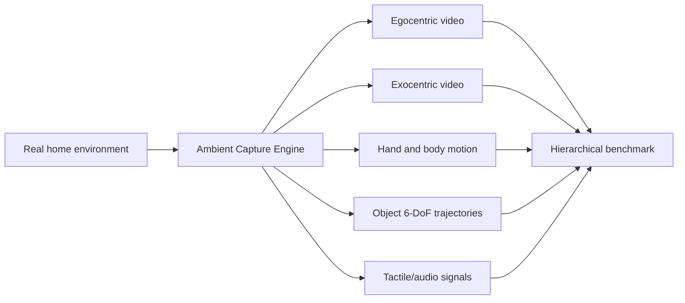

# ACE-Data-0: Human-Centric Ambient Capture as Embodied Data Engine

- arXiv: https://arxiv.org/abs/2607.28625
- Source: https://arxiv.org/abs/2607.28625
- Project:
- Local PDF: `/Users/luogu/physical_intelligence/papers/2026-08-02-priority-manual/ace-data-0-human-centric-ambient-capture-as-embodied-data-engine_2607.28625.pdf`
- Year: 2026
- Category: embodied data engine / benchmark
- Priority: medium

## 一句话总结

ACE-Data-0 不是一个策略模型，而是一个面向 embodied intelligence 的多模态数据引擎：用 table-scale 和 room-scale ambient capture 同步记录第一视角/外部视角视频、全身与手部运动、物体 6-DoF、音频和触觉，试图缓解具身智能的数据瓶颈。

## 核心技术

1. **Ambient Capture Engine**：把真实家庭环境变成时空同步的多模态录制系统。
2. **Two-scale setup**：table-scale 捕捉精细手-物交互，room-scale 捕捉全身运动、家具交互和长程活动。
3. **Multisensory stream**：同步 egocentric/exocentric video、body/hand motion、object geometry、6-DoF trajectories、audio、tactile signals。
4. **ACE-Data-0 数据集**：论文声称包含 150 小时、17M video frames、200 task categories、50 participants、2 environments、75,000 interaction episodes。
5. **Hierarchical benchmark**：从 signals 到 scene components 再到 interactions，评估模型在 contact、occlusion、egomotion、long horizon 下的缺口。

## 底层原理与数学推导

ACE 的核心不是新模型损失，而是数据对齐问题。可抽象为在统一时间轴 $t$ 下同步多模态观测：

$$
x_t = (I_t^{ego}, I_t^{exo}, q_t^{body}, q_t^{hand}, T_t^{object}, \tau_t^{tactile}, a_t^{audio})
$$

数据价值来自这些模态之间的可监督关系，例如视觉预测手部/物体 6-DoF、触觉预测接触状态、视频预测动作进程。

## 物理直觉解释

机器人数据难，不只是因为少，而是因为真实操作需要同时知道“看到什么、手怎么动、物体怎么动、有没有接触、声音/触觉发生了什么”。普通视频数据只能看到表面，机器人轨迹数据又缺少自然人类行为多样性。ACE 想把这些信号一次性对齐采下来。

## 工程细节与实操指南

- 对个人或小 lab，完整 ACE 难复现，但可以借鉴它的 benchmark 维度：contact、occlusion、egomotion、long horizon。
- 如果做 VLA evaluation，可以把 ACE 的 hierarchical benchmark 思想转成轻量级测试 protocol。
- 数据采集时最关键是时间同步、坐标标定和 object trajectory 标注。
- 不要把 ACE 直接当机器人示教数据；它是 human-centric embodied data，需要考虑 human-to-robot embodiment gap。

## 消融实验与分析

论文报告多个 benchmark 表，包括 close-range table-scale、room-scale、world-space hand pose、object articulation 等。结果显示现有方法在 contact、occlusion、egomotion 和长时序上仍有明显 gap。重点看：

- 哪些任务现有模型表现最差。
- table-scale 和 room-scale 的挑战是否不同。
- tactile/contact supervision 是否提供明显额外价值。
- Limitations 中提到只覆盖两个 sites，环境多样性有限。

## 技术权衡（Trade-off）

| 优势 | 劣势与工程代价 |
|------|---------------|
| 多模态同步数据非常完整 | 采集系统复杂，普通实验室难复现 |
| 覆盖接触、遮挡、长程活动 | 只有两个环境，分布多样性仍有限 |
| 对 world model / VLA / imitation learning 都有价值 | human-centric 数据到 robot policy 仍有 embodiment gap |
| benchmark 能暴露现有模型弱点 | 数据规模仍远小于 web-scale 视频 |

## 技术价值与演进定位

ACE-Data-0 是数据基础设施论文。它的长期价值在于定义“有用的 embodied data 应该包含哪些同步信号”。对你来说，它适合支撑 data/benchmark/evaluation 方向，而不是立即作为可复现实验。

## 与其他论文的关系

- 和 TacWAM：ACE 提供触觉/接触数据采集思路，TacWAM 展示如何用触觉未来监督训练策略。
- 和 EgoGenesis：ACE 的 egocentric/multiview 数据可支持 egocentric world-action modeling。
- 和 Open X-Embodiment：OXE 是机器人轨迹数据，ACE 是人类多模态交互数据；二者解决不同数据瓶颈。
- 和 VLA evaluation：ACE 的 contact/occlusion/egomotion gaps 可以转成 VLA 测试维度。

## 精读问题

1. ACE-Data-0 的标注是否足以训练机器人 policy，还是主要用于 perception/world modeling？
2. Human-to-robot transfer 如何处理 embodiment gap？
3. 哪些 benchmark 任务最能暴露当前 VLA/VLM 的短板？
4. 小规模实验室能复用 ACE 的哪些设计，而不是完整复现硬件系统？
