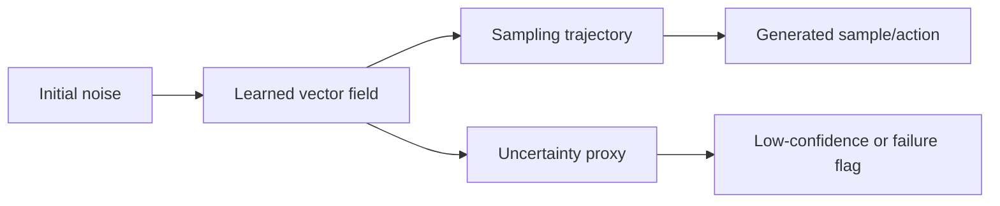

# The Geometric Nature and a Free Proxy for Flow-Matching Uncertainty

- arXiv: https://arxiv.org/abs/2607.27933
- Source: https://arxiv.org/abs/2607.27933
- Project:
- Local PDF: `/Users/luogu/physical_intelligence/papers/2026-08-02-priority-manual/the-geometric-nature-and-a-free-proxy-for-flow-matching-uncertainty_2607.27933.pdf`
- Year: 2026
- Category: flow matching uncertainty
- Priority: medium

## 一句话总结

这篇是 flow matching 的方法论论文：它研究 FM 模型中的不确定性几何，并提出一个几乎“免费”的 proxy 来估计不确定性；对机器人动作模型的潜在价值在于把 flow/动作生成的不确定性转成 action confidence 或 failure detection 信号。

## 核心技术

1. **Geometric interpretation of FM uncertainty**：从 flow trajectory / vector field 的几何结构理解模型不确定性。
2. **Free uncertainty proxy**：利用 FM 推理过程中的已有量，不额外训练 ensemble 或 Bayesian head。
3. **Failure detection evaluation**：论文提到 failure-detection evaluation grid，用 proxy 检测模型不可靠区域。
4. **Method transfer potential**：虽然不是 robotics 专用，但可迁移到 flow-based action policy 的置信度估计。

## 底层原理与数学推导

Flow Matching 学习速度场：

$$
\frac{dx_t}{dt} = v_\theta(x_t, t)
$$

从噪声 $x_0$ 积分到数据 $x_1$。不确定性可以来自速度场局部几何不稳定，例如路径弯曲、不同条件路径冲突、或向量场在邻域内变化大。一个 proxy 可抽象为：

$$
U(x_t,t) = g(v_\theta(x_t,t), \nabla_x v_\theta(x_t,t), \Delta v)
$$

它不一定显式计算完整 Jacobian，而是用推理过程中的几何信号近似模型不确定性。

## 物理直觉解释

如果一个 flow 模型在某个区域“知道该往哪里流”，向量场应该稳定、路径平滑。如果模型不确定，路径可能扭曲、方向变化剧烈，或者不同邻近点被推向不一致的结果。机器人动作生成中，这种不确定性可能对应“动作不可靠”或“场景超出训练分布”。

## 工程细节与实操指南

- 不要把这篇当机器人论文读；它是 flow matching 基础方法。
- 对你有价值的是：能否把 uncertainty proxy 接到 flow action policy，例如 π0 / FLOWER / flow-based VLA action expert。
- 最小实验：记录 flow policy 在成功/失败 episode 上的 uncertainty proxy，检查它是否能预测动作错误。
- 如果 proxy 计算几乎免费，可用于 online execution monitor。

## 消融实验与分析

论文包含 failure-detection evaluation grid。精读时重点看：

- proxy 是否比简单 likelihood/score norm 更有效。
- 是否需要额外训练或多次采样。
- 在不同 flow architectures 和 datasets 上是否稳定。
- 失败检测阈值是否容易调。

## 技术权衡（Trade-off）

| 优势 | 劣势与工程代价 |
|------|---------------|
| 不需要额外 ensemble，推理成本低 | 不确定性 proxy 未必校准为真实概率 |
| 可迁移到 flow action models | 需要验证和机器人 failure 的相关性 |
| 理论解释比黑箱 confidence 更强 | 对 diffusion/autoregressive policy 不直接适用 |
| 可能服务 online failure detection | 阈值选择可能依赖任务 |

## 技术价值与演进定位

这篇对机器人不是直接贡献，但对“动作生成模型置信度”很有潜在价值。随着 π0/FLOWER 等 flow action models 增多，如何知道生成动作是否可靠会成为重要问题。

## 与其他论文的关系

- 和 π0/Flow Matching：提供 flow action expert 的 uncertainty 视角。
- 和 FA-RDP：FA-RDP 解决接触反馈，FM uncertainty 可提供动作置信度。
- 和 VLA failure diagnosis：可作为模型内部 failure signal，而不是只看外部任务失败。
- 和 Diffusion Policy：类似可寻找 diffusion sampling uncertainty，但公式不完全相同。

## 精读问题

1. 这个 proxy 是否需要访问中间 trajectory，每步计算成本是多少？
2. proxy 是否校准，还是只能排序？
3. 能否在 robot action space 中预测 failure episode？
4. 对 flow matching action expert 的实时部署是否可行？
