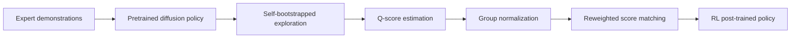

# X-NavDP: Generalizing Navigation Diffusion Policy to Novel Behavior and Embodiments with Group Q-score Reweighted Matching

- arXiv: https://arxiv.org/abs/2607.28560
- Source: https://arxiv.org/abs/2607.28560
- Project: https://yty-sky.github.io/x-navdp-project-page
- Local PDF: `/Users/luogu/physical_intelligence/papers/2026-08-02-priority-manual/x-navdp-generalizing-navigation-diffusion-policy-to-novel-behavior-and-embodimen_2607.28560.pdf`
- Year: 2026
- Category: RL post-training / diffusion policy
- Priority: medium

## 一句话总结

X-NavDP 用 RL post-training 改进预训练 navigation diffusion policy 的跨行为/跨 embodiment 泛化；虽然任务是导航而非 manipulation，但它的方法对“如何用 RL 修正 imitation/diffusion policy 的长尾失败”有迁移价值。

## 核心技术

1. **Diffusion policy post-training**：不是从零训练，而是在大规模专家示教预训练策略上做 RL fine-tuning。
2. **GQRM: Group Q-score Reweighted Matching**：用 group-normalized Q-score 对 diffusion score matching 重新加权，缓解扩散策略 likelihood 不可解导致的 policy gradient 不稳定。
3. **Self-bootstrapped exploration**：通过 behavior perturbation 保留 pretrained policy prior，同时探索更难场景。
4. **Cross-embodiment training**：分布式在线 RL 覆盖 heterogeneous embodiments。
5. **仿真和真机 hard cases**：论文报告 simulation success 从 61.20% 到 84.28%，real-world hard cases 从 10% 到 65%。

## 底层原理与数学推导

扩散策略直接做 policy gradient 困难，因为动作 likelihood 难以精确计算。X-NavDP 的思路是用 Q-value 作为 reweighting signal 修正 score matching：

$$
L_{GQRM} = \mathbb{E}[w(Q(s,a)) \cdot \|\epsilon - \epsilon_\theta(a_t, s, t)\|^2]
$$

其中 $w(Q)$ 不是直接用 raw Q，而是在 group 内归一化，避免不同轨迹/状态的 Q 尺度不稳定。

## 物理直觉解释

模仿学习策略学到的是“专家通常怎么走”，但遇到死胡同、陌生 embodiment 或 hard case 时，单纯模仿不够。RL 可以告诉模型哪些轨迹最终更有价值。GQRM 的作用是把这种价值信号注入 diffusion policy 的训练目标，而不是强行用不稳定的 likelihood gradient。

## 工程细节与实操指南

- 对你的 manipulation 方向，重点读方法，不必深读导航场景。
- 可迁移问题：能否对 Diffusion Policy/ACT 的失败场景做 targeted RL post-training？
- 需要注意 RL 成本：在线交互、reward 设计、Q 估计稳定性。
- 如果迁移到 manipulation，应选小任务验证，比如目标偏移、障碍、摩擦变化。

## 消融实验与分析

论文报告跨场景、跨 embodiment 的 SR/SPL，并比较 distributed online RL、GQRM、behavior perturbation 等模块。重点看：

- Group Q normalization 是否比 raw Q reweighting 稳定。
- RL post-training 是否破坏 clean task performance。
- sim-to-real hard cases 中提升是否来自更好探索还是更好策略更新。
- 对 unseen embodiment 的提升是否一致。

## 技术权衡（Trade-off）

| 优势 | 劣势与工程代价 |
|------|---------------|
| 提供 diffusion policy + RL 的可行方案 | 原任务是 navigation，迁移到 manipulation 需验证 |
| 保留 pretrained prior，避免从零 RL | 在线 RL 成本高 |
| Q reweighting 比直接 policy gradient 更适合 diffusion | reward/Q 估计可能不稳定 |
| 对长尾 hard cases 有启发 | 真实机器人安全探索难 |

## 技术价值与演进定位

X-NavDP 是 RL post-training 方向的重要参考。它说明预训练 diffusion policy 可以通过价值信号继续改进。对你来说，它的价值在于提供“模仿策略长尾失败如何用 RL 修正”的方法模板。

## 与其他论文的关系

- 和 FA-RDP：FA-RDP 更关注接触期 reactive execution，X-NavDP 更关注 RL post-training。
- 和 SimpleVLA-RL/Green-VLA：同属于策略后训练/对齐方向。
- 和 Diffusion Policy：X-NavDP 是在 diffusion policy 上加 RL 改进。
- 和 Static In, Dynamic Out：SIDO 用数据增强解决动态场景，X-NavDP 用 RL 解决 hard cases。

## 精读问题

1. GQRM 是否能直接用于 manipulation diffusion policy？
2. Group Q-score 的 group 如何定义？
3. RL post-training 是否会降低原始专家行为质量？
4. 如果真实机器人不能安全在线探索，能否用 offline RL 或仿真替代？
