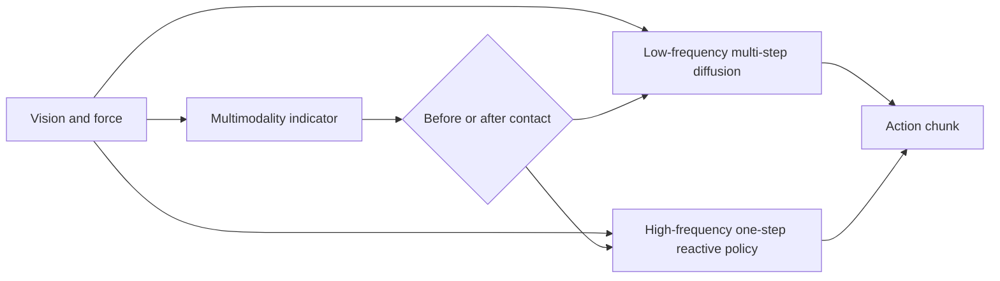

# FA-RDP: A Frequency-Adaptive Reactive Diffusion Policy for Contact-Rich Manipulation

- arXiv: https://arxiv.org/abs/2607.28596
- Source: https://arxiv.org/abs/2607.28596
- Project: https://fa-rdp.github.io
- Local PDF: `/Users/luogu/physical_intelligence/papers/2026-08-02-priority-2/fa-rdp-a-frequency-adaptive-reactive-diffusion-policy-for-contact-rich-manipulat_2607.28596.pdf`
- Year: 2026
- Category: reactive diffusion policy / contact-rich manipulation
- Priority: high

## 一句话总结

FA-RDP 针对 contact-rich manipulation 中“接触前需要多样轨迹、接触后需要高频反馈”的矛盾，提出频率自适应 reactive diffusion policy，在不同执行阶段动态切换低频多步采样和高频一步响应。

## 核心技术

1. **Frequency-adaptive policy**：不是固定推理频率，而是根据动作多模态程度动态选择 low-frequency multi-step 或 high-frequency one-step。
2. **Multi-frequency visual-force Transformer**：同时预测低频和高频 action chunks，融合视觉与力反馈。
3. **Multimodality indicator**：判断当前动作分布是否仍存在多种有效模式；接触前保留多模态，接触后强调快速响应。
4. **Manifold Consistency Distillation**：让 diffusion network 预测位于机器人动作 manifold 上的动作，同时保留 DDPM residual supervision。
5. **Contact-rich 任务实验**：论文在 Box、Button、Switch 等任务上报告比固定频率 diffusion baselines 更高成功率。

## 底层原理与数学推导

标准 diffusion policy 通常学习：

$$
\epsilon_\theta(a_t^k, o_t, k) \approx \epsilon
$$

通过多步去噪得到 action chunk。FA-RDP 的核心是把采样策略改成状态相关：

$$
a_t =
\begin{cases}
\text{MultiStepDenoise}(o_t), & m(o_t) \text{ high} \\
\text{OneStepReactive}(o_t, f_t), & m(o_t) \text{ low}
\end{cases}
$$

其中 $m(o_t)$ 是 multimodality indicator，$f_t$ 是 force feedback。直觉上，接触前动作空间多峰，需要慢一点保留多种可能；接触后解空间收缩，需要快一点跟随力反馈。

## 物理直觉解释

拿物体前，机器人有很多可能轨迹：从左侧接近、从右侧接近、先绕开障碍物。扩散模型多步采样有利于保持这些多峰可能。但接触发生后，轨迹选择空间变小，关键变成“现在力太大/太小，马上修正”。这时继续慢速多步采样会错过反馈窗口。FA-RDP 的核心就是把这两个阶段分开。

## 工程细节与实操指南

- 需要能获取 force feedback，或者至少有关节力矩/触觉 proxy。
- 核心调参是切换条件：multimodality indicator 过早切高频会丢失轨迹多样性；过晚切换会反应慢。
- 适合 button pressing、drawer/switch、surface following、插拔类任务。
- 可作为 VLA action output 后的 low-level execution policy。

## 消融实验与分析

论文报告 Box、Button、Switch 三类任务，并比较固定频率策略、无 MCD、不同采样设定。重点看：

- 高频策略是否在接触后明显提升。
- 低频策略是否在接触前保持多样性。
- MCD 是否减少 off-manifold action。
- 对 force noise 和视觉遮挡是否鲁棒。

## 技术权衡（Trade-off）

| 优势 | 劣势与工程代价 |
|------|---------------|
| 同时处理多峰动作和接触反馈 | 需要阶段/多模态判断，系统更复杂 |
| 比固定频率 diffusion 更贴近真实执行 | 依赖 force feedback 或 proxy |
| 可作为 VLA 低层执行补丁 | 训练和推理管线比普通 Diffusion Policy 重 |
| 适合 contact-rich 任务 | 对无接触任务收益可能有限 |

## 技术价值与演进定位

FA-RDP 是 Diffusion Policy 向 reactive control 演进的代表。它不是单纯改网络，而是把控制频率、接触阶段和动作分布多模态联系起来，适合用来思考“VLA 输出动作后，低层策略如何闭环执行”。

## 与其他论文的关系

- 和 TacWAM：TacWAM 用未来触觉监督学 contact representation，FA-RDP 用 force feedback 做 reactive execution。
- 和 Static In, Dynamic Out：SIDO 处理目标动态，FA-RDP 处理接触动态。
- 和 π0/Flow Matching：可对比 diffusion 多步采样与 flow/one-step 控制在实时性上的差异。
- 和 X-NavDP：二者都涉及 diffusion policy 的后续改进，但 FA-RDP 更贴 manipulation。

## 精读问题

1. Multimodality indicator 的训练标签来自哪里？
2. 高频 one-step policy 是否牺牲长期规划？
3. Force feedback 的采样频率和策略频率如何匹配？
4. 能否把这种频率切换机制用在 VLA action chunk 执行监控上？
