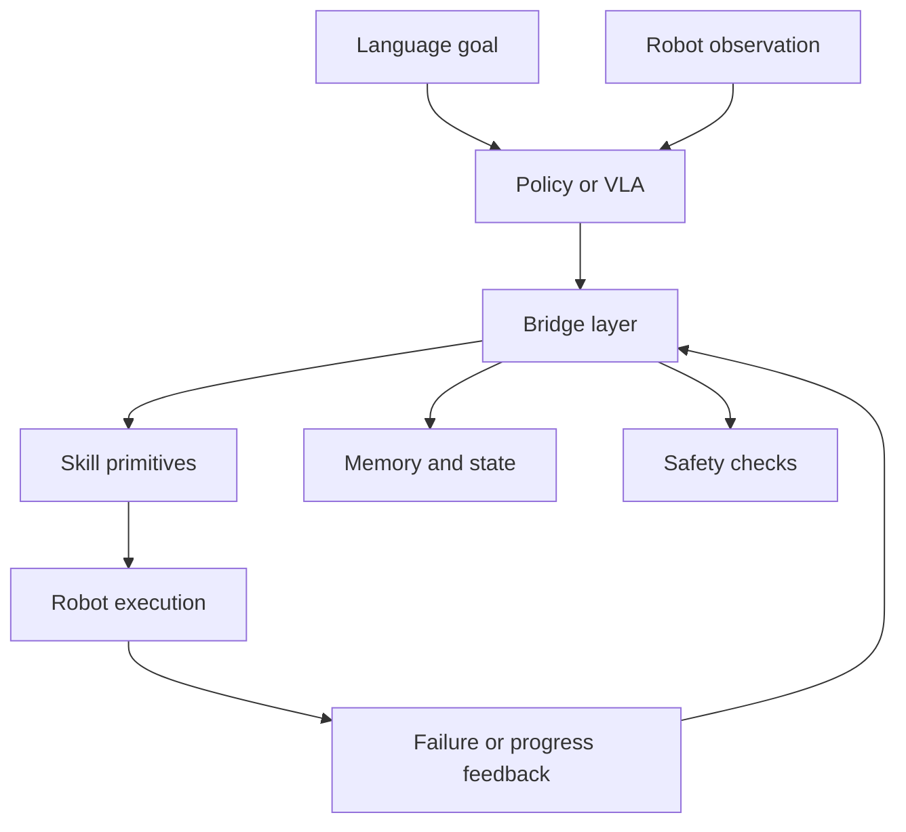

# RoboBRIDGE: A Modular Framework for Bridging Policies to Robust Real-World Robotic Agents

- arXiv: https://arxiv.org/abs/2607.27881
- Source: https://arxiv.org/abs/2607.27881
- Project:
- Local PDF: `/Users/luogu/physical_intelligence/papers/2026-08-02-priority/robobridge-a-modular-framework-for-bridging-policies-to-robust-real-world-roboti_2607.27881.pdf`
- Year: 2026
- Category: real-world robot agent systems
- Priority: high

## 一句话总结

RoboBRIDGE 关注的不是单个 policy 的 SOTA，而是如何把 VLA/机器人策略桥接成鲁棒真实机器人 agent：通过模块化组件处理感知、技能调用、replanning、安全和执行失败。

## 核心技术

1. **Policy-to-agent bridge**：把 learned policies 接到真实机器人 agent 系统，而不是只在 benchmark 中评估 policy。
2. **Modular architecture**：将 high-level instruction、perception、primitive skills、execution monitor、replanning 等拆成可替换模块。
3. **Robust real-world loop**：强调真实环境中的失败恢复，而不是一次性开环执行。
4. **Evaluation by success rate**：论文报告 Success Rate，并比较不同模块组合对 robustness 的影响。

## 底层原理与数学推导

RoboBRIDGE 可以抽象为层级闭环：

$$
\pi_{agent}(a_t | o_t, g) =
\pi_{exec}(a_t | z_t, s_t), \quad
z_t = B(\pi_{policy}(o_t, g), M_t)
$$

其中 $B$ 是 bridge 模块，把 foundation policy 的输出和 memory、skill library、safety constraints、execution feedback 结合起来。核心不是新损失函数，而是系统接口设计。

## 物理直觉解释

一个 VLA policy 像“会给建议的大脑”，但真实机器人还需要身体层面的接口：什么时候调用哪个技能、失败时怎么重试、状态有没有变化、动作是否安全。RoboBRIDGE 讨论的是这层工程-研究交界处的 glue。

## 工程细节与实操指南

- 适合作为你的 R02 VLA 测试经验向“real-world robot agent systems”扩展的参考。
- 阅读时重点画出模块图：每个模块输入输出是什么，失败如何回流。
- 不要只看成功率，要看哪些模块带来可复用的系统设计。
- 可把它和 OpenVLA/π0/GR00T 这类 policy 区分：RoboBRIDGE 不是 base model，而是部署与执行架构。

## 消融实验与分析

论文实验部分报告 SR 指标，并比较不同组件对真实机器人表现的影响。应重点看：

- 去掉 replanning 后失败率是否上升。
- primitive skill vocabulary 是否限制任务覆盖。
- 感知错误和执行错误是否被区分记录。
- 成功率提升是否来自系统重试机制，而不是 policy 本身更强。

## 技术权衡（Trade-off）

| 优势 | 劣势与工程代价 |
|------|---------------|
| 把 policy 接到真实机器人系统，现实价值高 | 模块多，系统复杂度高 |
| 支持 replanning 和 failure recovery | 贡献可能偏系统工程，需清晰实验支撑 |
| 可复用到多种 VLA/policy | skill vocabulary 限制开放性 |
| 适合工业部署和研究 demo | 难以和端到端模型公平比较 |

## 技术价值与演进定位

RoboBRIDGE 的价值是提醒：robot foundation model 的研究不止模型结构，还包括 policy-to-agent integration。对你来说，它能把“测试工程经验”扩展成“真实机器人 agent 系统研究”。

## 与其他论文的关系

- 和 OpenVLA/π0：后者是 policy/model，RoboBRIDGE 是桥接系统。
- 和 FA-RDP/TacWAM：这些是低层 policy 改进，RoboBRIDGE 是系统级执行框架。
- 和 ACE-Data-0：ACE 提供数据/benchmark，RoboBRIDGE 提供 agent execution architecture。

## 精读问题

1. Bridge layer 的最小必要模块是什么？
2. RoboBRIDGE 是否能明确区分 policy failure 和 system failure？
3. primitive skill vocabulary 是否会限制泛化？
4. 能否把你的 VLA 评估体系映射到 RoboBRIDGE 的模块级诊断？
