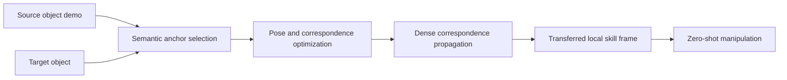

# SemAnCorr: Semantic Anchored Correspondence for Zero-Shot Manipulation Skill Transfer

- arXiv: https://arxiv.org/abs/2607.28382
- Source: https://arxiv.org/abs/2607.28382
- Project: https://semancorr.github.io
- Local PDF: `/Users/luogu/physical_intelligence/papers/2026-08-02-priority/semancorr-semantic-anchored-correspondence-for-zero-shot-manipulation-skill-tran_2607.28382.pdf`
- Year: 2026
- Category: zero-shot manipulation / correspondence
- Priority: high

## 一句话总结

SemAnCorr 解决的是“同一功能、不同几何形状”的物体之间如何零样本迁移操作技能：它不直接学一个端到端策略，而是用语义锚点加几何一致性优化建立 dense correspondence，从而把一个物体上的操作局部坐标系迁移到新物体上。

## 核心技术

1. **Semantic anchored correspondence**：先找语义一致的 anchor regions，再把这些 anchor 当作全局约束传播到整个物体表面，避免纯 nearest-neighbor feature matching 出现空间不连续。
2. **Joint pose-correspondence optimization**：同时优化物体姿态和对应关系，让对应点不仅语义相似，还在几何局部框架上连贯。
3. **Functional maps propagation**：用 functional map 思想把 anchor 约束扩展成 dense correspondence，使局部操作 frame 可以转移。
4. **Training-free skill transfer**：核心卖点不是训练一个大策略，而是用 correspondence 让单次示教在新实例上复用。
5. **真实操作验证**：论文不只做 PartNet-Mobility 上的 correspondence benchmark，还声称将 correspondence 改进转化成真实世界 manipulation 成功率提升。

## 底层原理与数学推导

这篇的数学核心可以理解为：给定源物体表面点集 $V_1$ 和目标物体表面点集 $V_2$，目标是学习一个对应矩阵 $C$，使得源物体上的功能区域和局部操作 frame 能映射到目标物体。

一个简化目标可以写成：

$$
\min_C \; L_{sem}(C) + \lambda_g L_{geom}(C) + \lambda_s L_{smooth}(C)
$$

- $L_{sem}$ 保证语义一致，例如 handle 对 handle、blade 对 blade。
- $L_{geom}$ 保证局部几何 frame 一致，避免语义对了但姿态错了。
- $L_{smooth}$ 保证表面对应关系连续，避免 nearest-neighbor 式跳变。

SemAnCorr 的关键不在“找到相似点”本身，而在用少量语义 anchor 限制整个 correspondence 场，使其同时满足功能语义和几何可操作性。

## 物理直觉解释

人类学会“拉抽屉把手”后，换一个形状不同但功能相同的把手，通常不会重新学习整条轨迹，而是找“哪里是把手、把手的朝向是什么、应该沿哪个局部方向施力”。SemAnCorr 做的就是把这种功能部件级的迁移显式化。

纯视觉特征匹配容易把外观相近但功能不对的位置连起来；纯几何匹配又可能忽视语义功能。语义 anchor 的作用是先锁定“功能上应该对应”的区域，再由几何优化给出可执行的局部 frame。

## 工程细节与实操指南

- 适合用在 articulated objects、tools、container、kettle、scissors 这类“功能结构比外观更重要”的物体。
- 复现时不要只看 correspondence accuracy，还要看 transfer 后的轨迹是否满足机器人可达性、碰撞约束和接触方向。
- 如果接到 VLA 系统，可以把 SemAnCorr 当作中间模块：VLA 给出高层语义目标，SemAnCorr 负责把目标物体上的功能 frame 定位出来，再交给 planner/policy。
- 最小实验可以从 PartNet-Mobility 或少量 3D scanned objects 开始，先做 one-demo skill transfer。

## 消融实验与分析

论文报告了 dense correspondence benchmark，并给出 90.8% semantic accuracy 的结果；更重要的是，它声称几何 coherence 的改进能转化为真实 manipulation performance。应重点看以下消融：

- 没有 semantic anchors 时，feature matching 是否出现空间不连续。
- 没有 pose-correspondence joint optimization 时，局部 frame 是否不稳定。
- correspondence benchmark 的提升是否和真实操作成功率一致。
- 失败案例是否集中在高度变形、遮挡或功能部件不可见的物体。

## 技术权衡（Trade-off）

| 优势 | 劣势与工程代价 |
|------|---------------|
| 不需要为每个新物体重新训练策略 | 依赖可靠的 3D 表面/特征，感知质量差会直接影响迁移 |
| 适合 one-shot / zero-shot skill transfer | 对功能部件语义 anchor 的识别仍可能失败 |
| 显式 correspondence 比端到端动作更可解释 | 复杂接触动力学仍需要低层控制器处理 |
| 可与 VLA、planner、Diffusion Policy 组合 | 对 deformable object 或拓扑变化大的对象适用性有限 |

## 技术价值与演进定位

SemAnCorr 不属于“大 VLA 架构”论文，而是 manipulation 泛化里的关键中间层工作。它的价值在于把“物体实例泛化”从纯数据驱动策略中拆出来，转成 object-centric correspondence 问题。

对你的长期方向，它提示一条不依赖大规模训练的路线：用显式几何/语义结构增强 VLA 或模仿学习策略的泛化。

## 与其他论文的关系

- 和 RT-2/OpenVLA 的区别：RT-2/OpenVLA 直接从图像和语言到动作，SemAnCorr 提供可解释的 object-centric skill transfer 中间表示。
- 和 VoxPoser 类方法相近：都强调空间/几何约束，而不是端到端动作猜测。
- 和 Static In, Dynamic Out 互补：前者解决跨物体几何迁移，后者解决静态示教到动态物体操作的泛化。
- 和 Diffusion Policy 可组合：SemAnCorr 可生成目标 frame，Diffusion Policy 负责局部动作生成。

## 精读问题

1. 语义 anchor 是如何选择的？如果 anchor 识别错，是否有恢复机制？
2. correspondence benchmark 的指标和真实机器人成功率之间相关性有多强？
3. 对 transparent、reflective、deformable objects 是否仍然有效？
4. 能否把 SemAnCorr 作为 VLA action grounding 模块，而不是独立 skill-transfer 模块？
