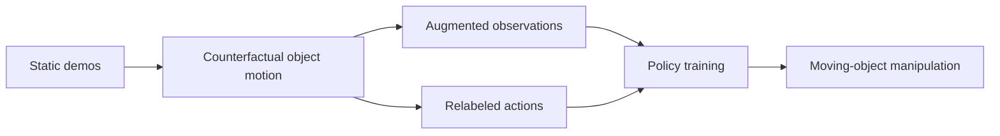

# Static In, Dynamic Out: Counterfactual Action Augmentation for Moving Object Manipulation

- arXiv: https://arxiv.org/abs/2607.27890
- Source: https://arxiv.org/abs/2607.27890
- Project:
- Local PDF: `/Users/luogu/physical_intelligence/papers/2026-08-02-priority/static-in-dynamic-out-counterfactual-action-augmentation-for-moving-object-manip_2607.27890.pdf`
- Year: 2026
- Category: dynamic object manipulation / augmentation
- Priority: high

## 一句话总结

这篇论文研究如何用静态物体操作数据合成动态物体操作训练信号，让策略在面对移动目标时不必完全依赖昂贵的动态示教数据；核心思想是 counterfactual action augmentation。

## 核心技术

1. **Static-to-dynamic augmentation**：从静态物体示教出发，构造“如果物体在执行中移动，动作应该如何变化”的反事实动作样本。
2. **Counterfactual action relabeling**：不是只增强图像，而是同步修改动作标签，使训练数据表达动态目标追踪或拦截。
3. **Moving-object manipulation evaluation**：测试对象包含 x-axis、y-axis、circle、random 等运动模式，比固定物体抓取更接近真实环境。
4. **Diffusion Policy + SIDO**：论文把方法接到 Diffusion Policy 类策略上，比较静态训练、动态训练和 SIDO 增强。

## 底层原理与数学推导

设静态示教数据为 $(o_t, a_t)$，其中 $o_t$ 是观测，$a_t$ 是专家动作。动态场景中目标位姿发生偏移 $\Delta x_t$，反事实增强要构造新样本：

$$
o'_t = T_{\Delta x_t}(o_t), \quad a'_t = a_t + f(\Delta x_t, \dot{\Delta x}_t)
$$

关键不是图像变换 $T$ 本身，而是动作修正函数 $f$：如果目标在未来移动，动作不能仍然指向旧位置。SIDO 的贡献可以理解为把静态 demonstration 的动作语义重标注到动态目标坐标系中。

## 物理直觉解释

真实世界中物体不会永远静止：人递杯子、传送带移动、目标被碰撞偏移，都要求机器人根据目标未来状态调整动作。只用静态示教训练的策略学到的是“去那个位置”，而不是“跟踪这个物体”。这篇论文试图用反事实数据把后者补出来。

## 工程细节与实操指南

- 最适合先在仿真中复现，因为可以精确控制目标运动轨迹。
- 任务可从 moving pick、dynamic pushing、moving insertion 的简化版本开始。
- 需要检查增强动作是否物理可行：速度、加速度、关节限制不能因为重标注而失真。
- 对真实机器人落地，必须考虑 perception latency：动作标签基于当前位置还是预测位置，会决定是否能追上移动目标。

## 消融实验与分析

论文表格显示它比较了 static、x-axis、y-axis、circle、random 等运动条件，并报告 DP+SIDO 在 moving object demonstrations 不足时仍能提升。关键消融应关注：

- 只做 observation augmentation 不改 action 是否无效。
- 反事实运动模式和测试运动模式不一致时是否泛化。
- 动态示教数据足够多时，SIDO 是否仍有价值。
- 不同动作频率下性能是否稳定。

## 技术权衡（Trade-off）

| 优势 | 劣势与工程代价 |
|------|---------------|
| 用静态示教扩展到动态任务，降低数据采集成本 | 反事实动作模型如果不准确，会引入错误监督 |
| 直接服务真实移动物体操作 | 需要知道或估计目标运动，依赖 tracking |
| 可接入 Diffusion Policy / ACT 类策略 | 高速运动时控制延迟会放大误差 |
| 提供比普通 data augmentation 更接近机器人控制的增强 | 对 contact-rich 动态交互仍可能不够 |

## 技术价值与演进定位

这篇论文的价值不在 VLA 架构，而在 manipulation data problem：如何让有限示教学到动态世界中的策略。它适合成为你从“静态桌面任务”走向“真实动态环境”的阅读入口。

## 与其他论文的关系

- 和 Diffusion Policy：SIDO 是数据增强/动作重标注层，Diffusion Policy 是动作生成模型。
- 和 SemAnCorr：SemAnCorr 解决跨实例几何泛化，SIDO 解决时间动态泛化。
- 和 TacWAM/FA-RDP：后两者处理接触反馈，SIDO 更偏目标运动和数据增强。
- 和 VLA：可以用于扩展 VLA fine-tuning 数据，使 VLA 不只适应静态目标。

## 精读问题

1. 反事实动作标签具体如何计算？是否依赖 ground-truth object pose？
2. 对 unseen motion pattern 的泛化能力如何？
3. 能否和 execution-time monitor 结合，在发现目标偏移时在线生成修正动作？
4. 如果目标运动来自人类交互而非预定义轨迹，SIDO 是否仍可用？
