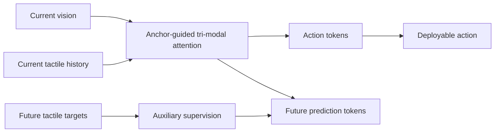

# TacWAM: Anchor-Guided World Action Model with Mechanics-Aware Tactile Prediction

- arXiv: https://arxiv.org/abs/2607.28391
- Source: https://arxiv.org/abs/2607.28391
- Project:
- Local PDF: `/Users/luogu/physical_intelligence/papers/2026-08-02-priority/tacwam-anchor-guided-world-action-model-with-mechanics-aware-tactile-prediction_2607.28391.pdf`
- Year: 2026
- Category: tactile world action model / contact-rich manipulation
- Priority: high

## 一句话总结

TacWAM 把 tactile future prediction 引入 World Action Model，用未来触觉信号作为训练监督，但避免在部署时让 action branch 偷看未来信息，从而提升 contact-rich manipulation 的动作学习。

## 核心技术

1. **Mechanics-aware tactile prediction**：不仅预测视觉未来，还预测触觉外观、dense force field、deformation flow 等接触信息。
2. **SAF Tactile Encoder**：Spatially Aligned Fusion 将 tactile appearance、force、deformation 融合到共享 latent space。
3. **Tactile history encoder**：用触觉历史建模接触变化，解决单帧触觉不足以判断 slip/shear/deformation 的问题。
4. **Anchor-Guided Tri-Modal Attention**：区分 current visual/tactile anchors、future prediction tokens 和 action tokens，防止未来标签泄漏到部署动作分支。
5. **真实任务验证**：论文在 fragile grasping、surface contact、dynamic in-hand manipulation 等四个真实任务上报告平均 75.0% 成功率，比最强 baseline 高 37.5 个百分点。

## 底层原理与数学推导

TacWAM 的训练目标可以理解为联合学习 action prediction 和 tactile future prediction：

$$
L = L_{act}(a_t, \hat{a}_t) + \lambda_v L_{vis}(s_{t+k}, \hat{s}_{t+k}) + \lambda_\tau L_{tactile}(\tau_{t+k}, \hat{\tau}_{t+k})
$$

其中 $\tau$ 表示触觉相关状态，如 force、deformation、shear。关键约束是：未来 tactile target 可以作为 representation learning 的监督，但不能在部署时作为 action branch 的直接输入，否则会形成 privileged information leakage。

## 物理直觉解释

视觉能看到形状和位置，但看不到接触力、滑移和微小形变。人在拿樱桃、擦拭、旋转物体时，会依赖手指触觉判断“有没有夹稳”“有没有滑”。TacWAM 的思想是：即使部署时不能看到未来触觉，也可以在训练时让模型预测未来触觉，从而学到更懂接触的 latent representation。

## 工程细节与实操指南

- 最适合 contact-rich、fragile、deformable 或 in-hand manipulation。
- 复现硬件门槛较高；如果没有 tactile sensor，可以先用仿真 contact force 或关节力矩 proxy 做低配版本。
- 重点检查 information constraint：训练时 future tactile supervision 不能变成部署不可用的 privileged cue。
- 可作为 VLA 低层 action expert 的辅助训练目标，而不是替代 VLA。

## 消融实验与分析

论文报告 staged ablation：去掉 tactile history 或放松 future target 访问约束都会降低表现。表格中任务包括 Chip、Cherry、Wiping、Twirling。应重点看：

- Tactile history 是否比单帧 tactile 显著好。
- Future tactile prediction 是否真的提升 action，而不只是提升预测指标。
- AGT 信息隔离是否必要。
- 在不同接触类型上提升是否一致。

## 技术权衡（Trade-off）

| 优势 | 劣势与工程代价 |
|------|---------------|
| 针对视觉 VLA 缺失的接触信息 | 需要触觉/力觉硬件或高质量仿真 |
| 用未来触觉监督学接触表征 | 训练/部署信息隔离设计复杂 |
| 对 fragile/contact-rich 任务价值高 | 泛化到无触觉平台需要 proxy |
| 能与 WAM/VLA/action expert 结合 | 数据采集和标定成本明显高 |

## 技术价值与演进定位

TacWAM 是“world model / action model 不能只看视觉未来”的代表。对机器人操作而言，真正影响执行成败的是接触状态，TacWAM 将 tactile future 加入世界动作建模，是 VLA 走向真实物理操作的关键补充。

## 与其他论文的关系

- 和 FA-RDP：二者都关注 contact-rich manipulation；TacWAM 偏 tactile future representation，FA-RDP 偏执行频率和 reactive policy。
- 和 ACE-Data-0：ACE 强调采集多模态接触数据，TacWAM 展示如何把触觉数据用于策略学习。
- 和 π0/Flow Matching：可作为 action expert 的辅助监督。
- 和 Diffusion Policy：TacWAM 可补充 Diffusion Policy 在接触状态建模上的弱点。

## 精读问题

1. Future tactile prediction 的 target 是传感器原始信号、force field，还是 latent？
2. AGT 如何严格防止 future tactile 泄漏给 action branch？
3. 如果用低成本力矩/电流 proxy 替代触觉，是否还能保留收益？
4. 成功率提升来自更好 representation，还是来自更强模型容量？
