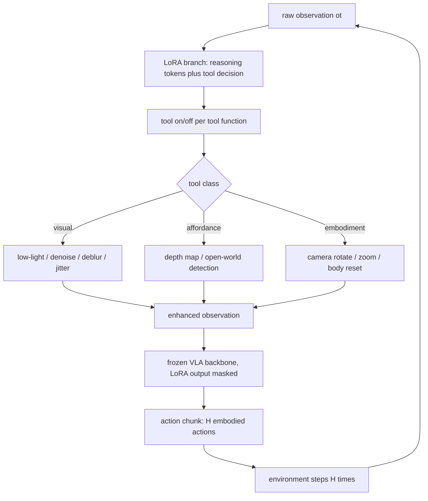

# Evolve Vision-Language-Action Model into an Agent with On-the-fly Tool-use

- arXiv: https://arxiv.org/abs/2608.14047
- Source: https://arxiv.org/abs/2608.14047
- Project: 
- Local PDF: `/Users/luogu/physical_intelligence/papers/architecture/ART_2608.14047.pdf`
- Year: 2026
- Category: architecture
- Priority: high

## 一句话总结

ART（Agentic Robot with Tool-use）是一个 tool-injection 微调框架：把三类现成工具模块（低层视觉增强 / 高层 affordance 增强 / 具身增强）以离散 token 的形式注入一个冻结的 3B π0-FAST，用 LoRA 只学"何时调用哪个工具"，动作生成时把 LoRA 输出屏蔽掉以保住原动作能力。仅用 30K 工具轨迹（远小于端到端基线的数据量）就在 LIBERO 与 Astribot S1 真机的扰动任务上把平均成功率做到 75% / 62%，比主流基线高约 20%。

## 核心技术

### 问题设定：把动作空间从连续流形换成"连续动作 + 离散工具"

论文的出发点是对两条主流路线各取一半：

- **模块化路线**（RoboTool、RoboScript、RoboCodeX、CaP）：模型只负责调用固定 API，能力彻底解耦，但语言到动作被压缩成手工函数，复杂语言理解和灵巧动作做不了。
- **端到端路线**（OpenVLA、ECoT、π0 / π0.5）：单模型直接产出高精度动作，但遇到新场景/新任务要昂贵的 post-training，且能力耦合在一起，继续微调容易灾难性遗忘。

ART 的做法是把 VLA 的动作空间从 $a_t \in \mathcal{A}$ 扩成 $\mathcal{A}^* = \mathcal{A} \times \mathcal{R} \times \mathcal{T}$：$\mathcal{R}$ 是语言推理空间，$\mathcal{T}$ 是工具调用空间。这样解任务变成一条增广轨迹，而不是一条纯动作轨迹。

### 三类工具 = 对观测的三种"修改"

工具被定义为"对观测的修改与增强"，与 VLA 的三种输入模态（视觉 $I_t$、语言 $l$、本体状态 $q_t$）一一对应：

1. **视觉增强（Visual Enhancement）**：10 种低层视觉工具，包括 low-light enhancement、denoising、jitter correction、deblurring 等，用于把被扰动的图像拉回干净分布。
2. **Affordance 增强**：接入 Metric3D 深度估计与 DINO-X 开放世界检测两个外部模型，把"最远的物体""盘子左边 30 cm"这类需要几何量的语言查询变成可定位的目标。
3. **具身增强（Embodiment Enhancement）**：相机旋转、变焦、机器人本体状态重置，直接对抗 LIBERO-Plus 指出的视点/初始状态漂移导致的性能崩塌。

### Tool Token Injection：工具调用即语言生成

每个工具的状态天然是二值的（开/关），所以工具动作可以写成 $a_{t,t} \in \{0,1\}^n$（$n$ 为工具数）。论文沿用 RT-2 和 OpenVLA 的做法，把**词表最后 $N$ 个 token** 保留给工具状态，使工具调用完全融入标准 next-token prediction，用 cross-entropy 训练，不需要任何新的解码头或输出格式。

### Adaptive LoRA：工具推理走旁路，动作走主干

这是全文最关键的机制。微调时冻结 VLA backbone，只训一个动态激活的 LoRA 模块：

- 带 LoRA → 模型生成工具推理 token 与工具调用 token；
- 不带 LoRA（推理时把 LoRA 层输出 mask 掉）→ 模型回到原始动作生成能力。

两阶段训练（先工具使用阶段、后动作阶段屏蔽 LoRA）把"工具推理"和"动作生成"在参数与数据两个层面解耦，论文明确以此避免 naive 联合训练造成的 backbone 退化与灾难性遗忘（引用 π0 系的 Knowledge Insulating 工作作为证据）。

### 与 action chunk 的整合

现代 VLA 普遍一次预测 $H$ 步动作来摊薄推理开销。ART 把工具推理降频到**每个 chunk 一次**：模型在每个 chunk 开头预测一次推理 token 与工具决策，选中的工具作用于接下来 $H$ 帧观测。

### AT 数据集：不采新数据，"退化"旧数据

沿用 T3-Agent 思想的三步流水线，把已有 VLA 数据集（LIBERO、Bridge v2、DROID）扩成带工具推理的 AT（Action with Tool）数据集，共 30K 条工具轨迹 + 动作演示：

1. **Task Generation**：对视觉/本体模态随机注入扰动；对语言模态用 GPT 把简单指令改写成需要 affordance 推理的任务（如"放到盘子上"→"放到抽屉左边 30 cm 处"），制造"必须用工具才能解"的任务。
2. **Tool Chain Generation**：记录解掉扰动与 affordance 推理所需的工具序列，形成 tool chain。
3. **Trajectory Generation**：用 GPT 把任务-工具对串成逐步解释"为什么需要这个工具、它怎么帮到任务"的长推理轨迹。

论文声称这是首个带长轨迹 tool-use reasoning 的 VLA 数据集。

### 推理时的整体流程

## 底层原理与数学推导

### 三种范式的形式化对比

模块化方法把动作生成分解为 affordance 函数与具身函数的串联：

$$ \pi : o_t \mapsto (f, f_{act}), \quad f : o_t \mapsto o_t^*, \quad f_{act} : o_t^* \mapsto A_t $$

其中 $o_t^*$ 是中间 affordance 表示（物体位置、分割 mask 等）。端到端 VLA 则直接回归动作 chunk：

$$ \pi : o_t \mapsto A_t, \quad A_t = [a_t, a_{t+1}, \cdots, a_{t+N}], \quad a_t \in \mathbb{R}^d $$

$d$ 为机器人自由度。介于两者之间的 affordance-guided 方法（ECoT、边界框预测等）写成 $\pi = \pi_2 \circ \pi_1$，$\pi_1: o_t \mapsto o_t^*$，$\pi_2: (o_t, o_t^*) \mapsto A_t$。ART 指出这条路线的两个软肋：依赖大规模人工 affordance 标注，且中间量由模型自己"想象"生成，输入一受扰动就崩。

### ART 的优化目标与关键分解

把解表示为增广动作轨迹 $a^*_{1:T} = (a^*_1, \cdots, a^*_T)$，每个 $a^*_t \in \mathcal{A}^*$，整体目标为：

$$ \pi^* = \arg\max_{\pi} P_\theta\!\left(a^*_{1:T} \mid \tilde{o}_{1:T}\right) $$

其中 $\tilde{o}$ 是被噪声/扰动污染的原始观测。全文的核心假设是：**正确的动作 $a_t$ 应当独立于原始观测中的噪声，只依赖增强后的观测 $o_t$**。在这个假设下目标可分解为两项乘积：

$$ \pi^* = \arg\max_{\pi} \prod_{t=1}^{T} P_{\theta,1}(a_t \mid o_{1:t}) \; P_{\theta,2}(a_{r,t}, a_{t,t} \mid \tilde{o}_{1:t}) $$

$P_{\theta,1}$ 就是原封不动的 VLA 训练目标，$P_{\theta,2}$ 是新增的"推理 + 工具调用"目标——作者称之为 tool injection。分解的正确性完全系于"增强后观测 $o_t$ 干净"这一前提，这也是三类工具全都作用于观测端（而非动作端）的原因。

### 两段损失的参数分离

工具推理 token 用 next-token prediction 训练，只更新 LoRA 参数 $\theta_L$：

$$ \mathcal{L}_{tool} = -\sum_{t=1}^{T} \log P_{\theta_L}\!\left(a_{r,t}, a_{t,t} \mid \tilde{o}_{1:t}\right) $$

动作 token 建立在**上一步激活的工具**处理过的观测之上（FAST 用离散余弦变换 DCT 把连续动作离散成 token，自回归预测）：

$$ \mathcal{L}_{action} = -\sum_{t=1}^{T} \log P_{\theta}\!\left(a_t \mid f_{t-1}(\tilde{o}_t)\right) $$

$\theta$ 是不带 LoRA 的 backbone 参数，$f_{t-1}$ 是上一时刻被激活的工具函数。注意这个损失形式里工具调用对动作路径的影响是**只通过输入观测**发生的——参数上完全隔离，这就是"非破坏性修改"的数学含义。

### 解空间复杂度的直观论证

端到端模型要在整个连续空间 $\mathcal{A}$ 上用数据铺出从 $\tilde{o}$ 到 $a_t$ 的映射，扰动每多一个维度，需要覆盖的组合就指数增长；ART 把"如何把脏观测变干净、如何把模糊语言变成几何目标"折叠成 $\{0,1\}^n$ 的离散开关选择，模型真正要学的只剩"何时按哪个开关"，动作部分继续复用预训练学好的干净观测到动作的映射。这就是论文声称的"缩小动作解空间 → 高泛化 + 低数据依赖"的机制化表述。

## 物理直觉解释

**近视的人不需要重新学走路，只需要一副眼镜。** 在暗光下 pick-and-place 失败的 VLA，多数时候不是"不会抓"，而是"看不见"——它的动作策略是在干净观测上学的，输入一脏，输出就掉进训练分布之外的空洞。传统修法是把暗光数据也采一遍、把模型训到能记住脏观测下的动作映射，这相当于让近视的人蒙眼练走路直到熟练。ART 的修法是递一副眼镜（low-light enhancement 工具）：把输入拉回策略本来就认识的干净分布，动作能力原封不动。三类工具的分工也由此而来——眼镜（视觉增强）、尺子（affordance 增强）、调整站姿（具身增强），全都在修"输入"，不碰"输出"。

**把一张连续的大地图，换成一本离散的操作手册。** 端到端 VLA 面对的是一张巨大的连续地图：所有光照、噪声、视点、指令组合下的动作都要靠数据一点点铺出来，30K 条轨迹只够铺很小一块。ART 把地图上最难铺的区域（扰动处理、几何推理）整块抽掉，换成一本只有"开/关"两态的操作手册：$n$ 个工具就是 $n$ 个开关，模型只需在 $2^n$ 种组合里学会少数几种有用序列。这就是"工具注入缩小动作解空间"的物理含义——**不是把问题学得更熟，而是把问题变简单**。代价也随之而来：手册里没有的动作，模型做不出来。

**LoRA 像心脏搭桥，不动主干。** 直接在扰动数据上继续微调 VLA，新数据的梯度会把好不容易学到的动作能力冲掉（灾难性遗忘）。ART 的做法相当于外科手术：主干血管（backbone 权重）完全不动，接一条旁路（LoRA）专门走工具推理的血流；一旦进入动作生成阶段，旁路被夹闭（mask 掉 LoRA 输出），血液还是走原来的主干通道。这样"学新东西"和"保住老本事"在参数与数据两条轴上都被隔开，训练可以放心用小数据集（30K 条），不必担心稀释动作质量。

**工具决策按 chunk 降频，像人不每 50 毫秒重新决定要不要开灯。** 每 chunk（$H$ 步）做一次工具推理而不是每步做，既符合物理事实（灯开了不会马上需要重开），又摊薄了外部工具（depth estimation、detection 都是独立模型）的调用开销。这也暗示 ART 的工具粒度是"场景级修正"而非"毫秒级闭环控制"——修正观测环境，让接下来的 $H$ 步动作在干净输入上进行。

## 工程细节与实操指南

- **基座与 token 预算**：预训练 3B π0-FAST（正文写作 π-FAST，即 FAST tokenizer 论文的预训练模型）。工具 token 占用词表末尾 $N$ 个位置——与 RT-2（动作 bin）和 OpenVLA 的惯例一致，改动词表的最小化方案。FAST 的 DCT 动作离散化让动作 token 与工具 token 落在同一个 next-token prediction 框架内，不需要为工具单独设计解码头。
- **训练配置**：AT 数据集 30K 条轨迹上微调 1 epoch；8× A800，batch size 24，初始学习率 $5\times10^{-5}$，1k 步 warm-up。论文未公布 LoRA 的秩、alpha、注入层位。
- **工具清单搭建**：视觉增强 10 种（low-light enhancement、denoising、jitter correction、deblurring 等）；affordance 侧直接挂 Metric3D（深度）与 DINO-X（开放世界检测）两个现成模型；具身侧是相机旋转/变焦/本体状态重置三个"改变环境"型工具。所有工具都被包装成对观测的函数 $f_{t-1}(\tilde{o}_t)$。
- **复刻数据流水线的要点**：任务"退化"是核心——视觉/本体模态用随机扰动，语言模态用 GPT 把简单指令改写成需要 affordance 推理的形式；然后为每个任务记录 tool chain；最后让 GPT 把"为什么用这个工具"写成逐步推理文本。整个流程不需要采新的动作数据。
- **真机设置**：Astribot S1 双臂人形机器人，16 自由度；对照用的基线 FAST 模型在 16K 条 pick-and-place 动作轨迹（80 种物体、10 种容器）上训练。
- **评测环境**：三个设定——LIBERO 仿真（可改光照/噪声/指令精度/相机与机体初始位置）、真机闭环、真机开环测试。
- **待确认：LoRA 秩/α 与目标模块未公开**，复刻需自行扫描消融。
- **待确认：action chunk 长度 $H$ 的具体数值未给出**，只说明"每 $H$ 步推理一次工具"。
- **待确认：工具总数 $n$ 未汇总公布**（10 类视觉增强 + depth + detection + 相机旋转/变焦/重置，论文未给出总和）。
- **待确认：AT 数据集的逐域统计与样例说"见附录"，但本 arXiv v1 PDF 共 12 页且第 9-12 页为参考文献，无附录内容**。
- **待确认：每个任务的评测 episode 数与统计显著性未报告**，表中成功率无方差。
- **待确认：代码与权重是否开源未在论文中提及**。
- **待确认：工具调用引入的推理延迟/吞吐开销未量化**（外部 depth/detection 模型的耗时、每 chunk 额外 token 数均未报告）。
- **待确认：用于改写指令与生成轨迹的 GPT 具体型号未说明**。

## 消融实验与分析

### 主结果：扰动任务上的工具注入收益（论文 Table 1）

| 模型 | LIBERO Vision | LIBERO Affordance | LIBERO Embodiment | LIBERO 平均 | S1 Vision | S1 Affordance | S1 Embodiment | S1 平均 |
|------|------|------|------|------|------|------|------|------|
| OpenVLA | 20% | 10% | 7% | 12% | 5% | 5% | 10% | 6.7% |
| π0 | 65% | 15% | 10% | 30% | 40% | 30% | 40% | 37% |
| π0-FAST | 60% | 12% | 45% | 39% | 40% | 30% | 60% | 43% |
| ART-FAST | 81% | 62% | 82% | 75% | 70% | 55% | 70% | 62% |

**核心结论：** ART-FAST 在 LIBERO 平均 75%、真机 Astribot S1 平均 62%，比最强基线 π0-FAST（39% / 43%）分别高出 36 与 19 个百分点；收益最大的是 Affordance 类任务（LIBERO 上 12% → 62%），因为深度/检测工具直接把模糊语言变成了几何目标。注意 OpenVLA 与 π0 在两类环境平均都低于 30%，与 LIBERO-Plus 对 SOTA VLA 抗扰动能力的悲观结论一致。

### 对照 Reason-only 模型 ECoT：中间量是"想出来的"还是"工具算出来的"（论文 Table 2）

| 模型 | 有视觉扰动 | 无视觉扰动 | 平均 |
|------|------|------|------|
| ECoT | 12% | 58% | 36% |
| ART-FAST | 72% | 62% | 67% |

**核心结论：** 干净数据上两者接近（62% vs 58%），但一旦注入视觉扰动，ECoT 从 58% 跌到 12%（-46 个百分点），因为它自己生成的文本化 affordance 在分布外直接幻觉；ART 靠外部视觉增强工具把输入拉回分布内，反而升到 72%。这一组对比是"工具输出 vs 模型自述"之争最直接的证据。

### 对照同数据量端到端训练（论文 Table 3）

| 模型 | Vision | Embodiment | Affordance |
|------|------|------|------|
| FAST (post-trained，去掉工具推理) | 71% | 61% | 65% |
| ART-FAST | 81% | 62% | 82% |

**核心结论：** 在完全相同的训练消耗下，把同样的数据直接当端到端数据训练，收益集中在 Affordance（65% → 82%，+17 个百分点），Embodiment 几乎持平（61% → 62%）——说明工具注入的增益主要来自"外部几何计算"，而不是单纯的额外监督信号；视觉类 +10 个百分点则来自增强工具对输入分布的修复。

### 值得注意的异常点

- π0 在 LIBERO Vision 类拿到 65%，反而高于 π0-FAST 的 60%，也高于它自己在其他两类的成绩（15% / 10%）：flow-matching 连续动作头在纯视觉扰动下可能比 token 化动作更稳，但在需要语义推理的 Affordance 类上崩到 15%。论文未讨论此现象。
- 真机 S1 上所有方法的绝对值都低于仿真（ART 62% vs 75%），但相对排序保持一致，说明工具推理能力可以跨域迁移（AT 数据混合了 LIBERO、Bridge v2、DROID 三种来源）。

## 技术权衡（Trade-off）

| 优势 | 劣势与工程代价 |
|------|---------------|
| 工具即插即用：新增能力挂一个工具模块即可，无需重训整个 VLA | 动作能力上限被基座 VLA 封顶，工具解决不了的灵巧操作仍然做不了 |
| 30K 轨迹即可，复用已有数据集，无需新采动作数据 | 扰动类型与工具链靠人工/GPT 设计，覆盖面受设计者想象力限制 |
| 冻结 backbone + LoRA mask，动作保真度不被稀释，规避灾难性遗忘 | 工具推理与动作生成被硬性解耦，无法联合优化（Eq.5 的分解是假设不是推导） |
| 中间量来自外部工具的真实计算，扰动下不幻觉（12% vs 58% 的对比） | 引入级联失败面：depth/detection 工具出错会顺着 tool chain 污染后续动作，论文未做失败分析 |
| 离散工具 token 与 FAST 动作 token 同框架，改动最小 | 每次工具调用带来额外 token 与外部模型延迟，论文未量化推理开销 |
| 工具推理能力跨数据集迁移（LIBERO 训练 → 真机 S1 有效） | 评测集中在作者自建的 AT 扰动套件，未在标准 LIBERO/真机第三方基准上与 SOTA 对齐比较 |

## 技术价值与演进定位

ART 的定位是模块化与端到端之间的第三条路：**保留端到端的连续动作输出，同时把"获取可靠观测与几何信息"外包给离散工具调用**。它对 2024-2025 年两条支线的修正都很具体：对 ECoT 一系 reason-only 方法，ART 用"工具的真实输出"替换"模型自己生成的中间文本"，用 58%→72%（扰动下）对 58%→12% 的对比证明自述式推理在分布外不可靠；对 TIGeR（只注入几何计算工具）与 VLA^2（只做 web 检索）这类单工具工作，ART 第一次把三类多模态工具组织进**长轨迹、多任务链**的工具推理里，并给出了可复用的数据合成配方（退化旧数据 + GPT 串工具链）。它与 π0 系的 Knowledge Insulating 思路形成呼应——两者都判断"联合训练推理与动作会毁掉主干"，但 Knowledge Insulating 用训练配方隔离，ART 用参数结构（冻结 backbone + LoRA mask）隔离，后者更彻底也更便宜。放在这条演进线上，ART 预演了 2026 年 agentic VLA 的标准形态：VLA 不再是纯反射弧，而是会按需调用感知与计算资源的执行体。它的局限同样清晰：工具集是人工圈定的封闭集合，动作端没有新能力，且所有证据都来自作者自建的扰动套件与单一机器人平台。

## 与其他论文的关系

- `notes/architecture/pi0.md` 与 `notes/architecture/fast-tokenizer.md` — ART 的基座就是 3B π0-FAST：FAST 用 DCT 把连续动作压成低频 token，使工具 token 与动作 token 能在同一条自回归序列里用同一个 next-token prediction 目标训练，这是 ART"零架构改动"得以成立的前提。
- `notes/architecture/rt-2.md` 与 `notes/architecture/openvla.md` — "占用词表末尾若干 token 承载新语义"的做法直接沿袭这两家：RT-2 把动作 bin 放进词表尾部，OpenVLA 沿用；ART 把同样的位置让给工具开关，说明这是 VLA 扩展输出空间的事实标准。
- `notes/architecture/pi05.md` — 同属 Physical Intelligence 生态的 π0.5 走的是"用互联网级共训数据换开世界泛化"的路线，ART 则证明在扰动鲁棒性这一具体短板上，外部工具比堆数据更便宜（30K vs 大规模共训）。
- `notes/architecture/g05.md` — 同样以 Qwen 系小模型为底座、同样在 token 流里混排推理与动作，但 G0.5 的推理是自生成的 CoT 模板（Subtask/BBox/Trace/ActionHint），ART 的推理落在真实外部工具上；两者分别代表"自述式"与"工具式"中间量的两个极端，正好对应 Table 2 中 ECoT 与 ART 的 46 个百分点差距。
- `notes/reasoning/onetwovla.md` — OneTwoVLA 用 Decision Token 在推理/动作模式间切换，与 ART 的"工具推理在前、动作在后"同属把 System 2 塞进单模型的方向；差别是 OneTwoVLA 的推理产物仍是文本，ART 的推理产物是工具调用。
- `notes/reasoning/trivla.md` — TriVLA 用视频扩散世界模型当 System 3 提供时序预见，与 ART 的"用工具修观测"是互补的两种抗扰动思路：一个预测世界怎么变，一个先把世界看清楚。
- `notes/architecture/llada-vla.md` — 同样依赖"离散 token + 词表内输出"的机制（扩散 VLM 上做动作 bin），说明 ART 的工具 token 方案在非自回归骨干上同样有落地空间。
- `notes/architecture/xr-1.md` / `notes/architecture/lingbot-vla2.md` — 这类工作把感知（深度/时序教师蒸馏）内化进预训练，与 ART 把感知外置成工具调用构成"内化 vs 外包"的对照，前者推理快、训练贵，后者训练便宜、推理链长。

## 精读问题

1. 工具输出错误时模型能否察觉并恢复？例如 depth estimation 给出错误 affordance、detection 框错物体时，ART 是会重试、换工具还是直接把错误几何喂给动作策略？论文只展示了工具链成功的 rollout（Figure 4），没有任何失败案例分析——对一个声称"agentic"的框架来说，这是不是最关键的缺口？
2. Eq.5 的分解依赖"正确动作只依赖增强后观测"这一假设，但工具本身有偏差与延迟，增强观测 $o_t$ 并不是真值——这个分解在实际中引入的近似误差有多大？是否可以设计一个联合微调阶段来校正？
3. Action chunk 期间（$H$ 步内）工具被锁定，如果光照在执行中途突变，模型要等下一个 chunk 才能重新调用视觉增强——$H$ 的取值如何影响"扰动恢复延迟"与推理开销的权衡？
4. Table 1 中 π0 在 LIBERO Vision 类（65%）反超 π0-FAST（60%），却在 Affordance 类（15%）大幅落后，这一不对称是否说明连续动作头与离散动作 token 在鲁棒性来源上有本质区别？
5. AT 的指令改写由 GPT 完成，工具推理文本也由 GPT 合成——模型学到的"何时调用工具"是否过拟合到 GPT 的特定措辞分布？换成人类自然语言表述的同义 affordance 查询，工具调用率与成功率还剩多少？
