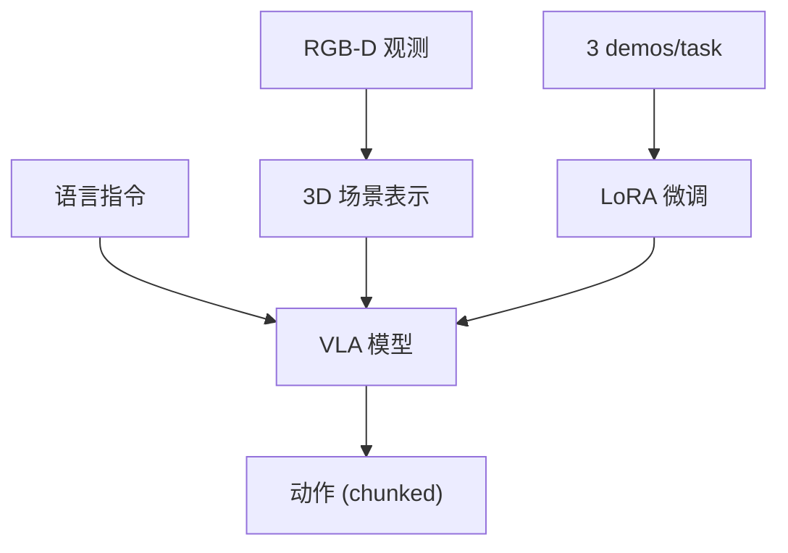

# BridgeVLA: 高效 VLA — 3 条轨迹微调达到 96.8% 成功率

- 本地 PDF：`papers/architecture/BridgeVLA_2505.21372.pdf`
- arXiv：https://arxiv.org/abs/2505.21372
- 年份：2025 (NeurIPS 2025 相关)
- 团队：多机构（BridgeVLA 项目组）
- 阶段：样本高效 VLA — 3 demos/task 微调

## 一句话总结

BridgeVLA 是样本高效的 3D VLA：仅 3 条示范轨迹/task 微调即在 10+ 真实任务上达到 96.8% 成功率。核心是利用 3D 场景理解桥接视觉-语言-动作，大幅降低数据需求。

## 核心技术

1. **3D 场景理解** — 3D 表示桥接视觉与动作（类似 FP3 的点云路线）
2. **样本高效微调** — 3 demos/task 即达高成功率
3. **VLA 架构** — 视觉-语言-动作统一模型

## 底层原理与数学推导

**核心机制**：3D 场景表示作为视觉-动作之间的"桥"——模型理解物体在 3D 空间中的位置，语言指令可直接 grounding 到 3D 位置，大幅减少从 2D 像素学习空间关系的样本需求。

## 物理直觉解释

"3 demos 就够"的直觉：如果你已经知道"杯子在桌子的 3D 坐标"（3D 表示），学会"伸手到这个坐标抓取"只需要少量演示。但如果只给你 2D 图像（不知道 3D 位置），你需要从大量图像中推断空间关系——样本需求差一个数量级。BridgeVLA 把空间理解"外包"给 3D 表示，策略只需学动作映射。

## 工程细节与实操指南

- 3D 表示：从 RGB-D 重建（点云/深度）
- 微调：LoRA，3 demos/task
- 评估：10+ 真实操作任务

## 消融实验与分析

| 消融/对比 | 结论 |
|---------|------|
| 3D vs 2D 输入 | 3D 表示是数据效率的核心杠杆 |
| 3 demos vs 更多 demos | 3 条即达 96.8%，边际收益递减 |
| vs OpenVLA | 同数据量下 3D 显著更优 |

## 技术权衡（Trade-off）

| 优势 | 劣势 |
|------|------|
| 3 demos 极高数据效率 | 依赖深度传感器 |
| 96.8% 成功率 | 任务范围有限（10+ 任务） |
| 3D 空间 grounding 自然 | 3D 重建误差影响精度 |

## 技术价值与演进定位

BridgeVLA 是"数据效率"路线的代表——和 FP3（80 demos）、SymSkill（5 分钟数据）共同证明 2026 年 manipulation 的数据需求已从百条级降到个位数级。3D 表示是数据效率的关键杠杆。

## 与其他论文的关系

- **FP3** — 3D 基础策略（80 demos）；BridgeVLA 进一步降到 3 demos
- **DP3** — 3D 扩散策略前身
- **OpenVLA** — 2D VLA baseline，BridgeVLA 用 3D 大幅降数据需求

## 精读问题

1. 3 demos 的适用边界——接触丰富任务是否仍需要更多？
2. 3D 表示的具体形式（点云/体素/隐式）与 FP3 的对比？
3. 跨任务泛化——3 demos/task 在新任务类别上的表现？
