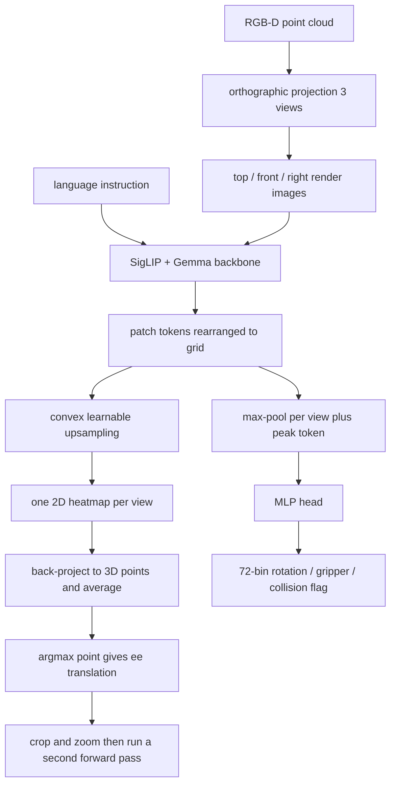

# BridgeVLA: Input-Output Alignment for Efficient 3D Manipulation Learning with Vision-Language Models

- 本地 PDF：`papers/architecture/BridgeVLA_2506.07961.pdf`
- arXiv：https://arxiv.org/abs/2506.07961
- 项目页：https://bridgevla.github.io/
- 年份：2025（NeurIPS 2025；arXiv v2 更新于 2025-10）
- 团队：中科院自动化所（CASIA）+ ByteDance Seed + 国科大 + FiveAges + 南京大学（Peiyan Li 一作，Tao Kong / Tieniu Tan / Hongtao Wu 通讯）
- 阶段：3D VLA 架构范式——把输入与输出同时压回 VLM 熟悉的 2D 图像空间，以极小数据量换高成功率

## 一句话总结

BridgeVLA 主张 3D VLA 的瓶颈不在「要不要 3D 信息」，而在「输入输出是否与 VLM 预训练分布对齐」：它先用 120K 目标检测数据（RoboPoint）把 PaliGemma 预训练成「按文字要求在图上画 2D heatmap 找物体」，再做 3D 动作微调时把点云正交投影成三张图（输入对齐）、并让模型先画热图再回传 3D 平移目标（输出对齐）。RLBench 平均成功率从最强基线 RVT-2 的 81.4% 提到 88.2%，COLOSSEUM 从 56.7% 到 64.0%，GemBench 平均 50.0%；真机上仅 3 条轨迹/任务就拿到 95.4%（13 任务），同期 π0 喂 10 条轨迹只有 3.8%、基本全崩。

## 核心技术

1. **输入对齐（3D 转 2D）** — 场景点云按 top/front/right 三个方向做正交投影（沿袭 RVT/RVT-2 的做法），得到的三张 2D 图直接替换 VLM 原本吃的 RGB 图；整个 VLM 前向过程中不注入任何额外模态（没有机器人状态、没有逐像素 3D 坐标），最大限度避免预训练与微调的特征分布漂移
2. **输出对齐（动作转热图）** — 平移动作不 regress 成向量，而是由与输入同分辨率的 2D heatmap 表示：三个视角的热图分别反投到工作区均匀采样的 3D 点网格上取均分最高者作为下一关键帧末端位置；旋转/夹爪/碰撞旗标则由全局与局部特征拼接过 MLP 预测（Euler 角每轴离散成 72 个 bin）
3. **可扩展的热图预训练** — PaliGemma 本来只会输出 token 序列、天生不会画热图，于是先用检测框构造高斯热图监督（cross-entropy），用 convex upsampling（借自 RAFT 的可学习逐像素插值上采样）把 patch token 网格还原到原图分辨率；该配方可平移到 keypoint 检测与语义分割等任何能表达成热图的任务
4. **Coarse-to-fine 双次前向** — 第一次在完整点云上预测粗位置，然后以该位置为中心裁剪放大一块长方体点云，第二次前向给出最终动作（继承 RVT-2 的精化策略）
5. **Keyframe 参数化 + 规划器执行** — 只在瓶颈帧（静止 / 夹爪状态变化 / 终止帧）做预测，帧间运动交给 sampling-based motion planner（OMPL/RRT-Connect 系），并输出 collision flag 决定是否避障

## 底层原理与数学推导

### 1. 任务形式化

策略映射为 $\pi : (o, l) \mapsto a$，动作 $a$ 包含下一关键帧的 6-DoF 位姿 $T \in SE(3)$、二值夹爪状态 $g \in \{0,1\}$ 与碰撞旗标 $c \in \{0,1\}$；数据集是 $N$ 条轨迹 $\tau_i = \{l_i, (o_1,a_1),\dots,(o_H,a_H)\}$。

### 2. 高斯热图监督（预训练与微调共用）

每个目标框中心 $b_i$ 生成带截断的概率图：

$$p_i(x) = \exp\left(-\frac{\|x - b_i\|_2^2}{2\sigma^2}\right), \qquad H^{gt}_i(x) = \begin{cases} p_i(x), & p_i(x) \ge p_{min} \\ 0, & \mathrm{otherwise} \end{cases}$$

多目标按平均融合后归一化为整幅 $H^{gt}$：

$$H_{avg}(x) = \frac{1}{N}\sum_{i=1}^{N} H^{gt}_i(x), \qquad H^{gt}(x) = \frac{H_{avg}(x)}{\sum_{x' \in \Omega} H_{avg}(x')}$$

预训练用 cross-entropy 直接回归这幅热图；微调时的平移监督即上式中 $b_i$ 取「末端下一关键帧位置的投影像素」的单目标版本。

### 3. 热图反投影取点（论文文字描述的符号化）

记三个视角集合 $V = \{\mathrm{top}, \mathrm{front}, \mathrm{right}\}$、$\Pi_v$ 为世界点到视角 $v$ 像素的投影，则工作区点 $p$ 的得分为

$$S(p) = \frac{1}{|V|}\sum_{v \in V} H_v(\Pi_v(p)), \qquad T^{*} = \arg\max_{p \in \mathcal{W}} S(p)$$

消融一节把这一步描述为「projecting 3D workspace points onto the heatmaps and selecting the point with the highest mean probability」，上式是该描述的直接符号化（论文本身未写显式公式）。

### 4. 总损失

$$\mathcal{L} = \mathcal{L}_{trans} + \mathcal{L}_{rot} + \mathcal{L}_{gripper} + \mathcal{L}_{collision}$$

$\mathcal{L}_{trans}$ 是热图的交叉熵，$\mathcal{L}_{rot}$ 是 bin 分类交叉熵，$\mathcal{L}_{gripper}$ 与 $\mathcal{L}_{collision}$ 为二元交叉熵；训练时对点云和真值动作施加联合随机刚体变换增广。预训练与微调全程冻结 SigLIP 视觉编码器与语言 token embedding，Gemma 其余参数照常更新。

## 物理直觉解释

**输入对齐像「把立体仓库拍成三张工程图纸再交给只识平面图的调度员」。** PaliGemma 这类 VLM 在海量自然图像上学出来的全部世界观都依附于「规则网格像素 + bidirectional attention 的 image token」这一种输入格式。绝大多数 3D VLA 的做法是把点云编码成 token 塞进语言模型，这等于强迫一个只会读平面地图的人去理解三维沙盘上的点阵——他必须从头学一套新字母。BridgeVLA 反过来：把 3D 世界重新渲染成模型认识的母语（三张正交图），预训练的所有语义能力即刻可用。代价是丢掉了显式的深度通道，于是第三层设计（不用逐像素 3D 坐标）成了铁律——消融证明一旦往图像特征里混入 3D 卷积编码的位置信息，即便几何线索更丰富，平均成功率也从 88.2% 掉到 56.2%，因为特征分布已经不再像它预训练时见过的样子。

**输出对齐像「先把手指按在地图上说『就是这儿』，再让人走过去」。** 让网络直接回归一个 3D 坐标向量是开环的数值猜测：监督信号只有一个点，模型既不知道自己偏了多少也不知道哪些区域绝对不能碰。热图则是把答案铺满整张与输入共享坐标系的画布——每个像素都有梯度，等于把稀疏的一维回归问题变成稠密的二维分类问题。更妙的是「反投影取均分最高点」这一步自带空间一致性约束：一个 3D 点必须同时被三个视角认可才能胜出，相当于三张图纸互相背书。这就是消融表里那道鸿沟的来历——把凸上采样模块换成同等规模的 Transformer decoder 直接回归位置（MSE 监督），88.2% 立刻跌到 31.4%，而且后者对超参数极其敏感（要靠 batch size 192 和仔细调学习率才训得动，前者 batch 64 就很稳）。

**两阶段热图预训练像「上岗前先教会新人用荧光笔圈重点」。** PaliGemma 的原生技能是「看图回答文字」，它的输出永远是词表里的 token 序列，让它凭空画一张热图等于让会计改行画施工图。于是作者插入了一个便宜而通用的桥梁阶段：拿 120K 条「文字里说找什么、图中就圈什么」的检测数据，教会模型把语言短语落到图像坐标上。这个阶段只有约 2 小时（8 张 A100、3800 步），却决定了下游能不能把「下一个夹爪该去哪」当成同一个「指认」问题来做。C.4 还展示微调后模型回到预训练数据上依旧圈得准——指认能力没有被动作微调冲掉，只是 Category 泛化时往往「指对了物体却在放置步直接奔向目的地」，作者把这归因于预训练全是第三人称自然图像、与渲染出的正交投影仍有域差，且操作需要预测的非物体关键点（如把手、凹槽）超出纯定位任务的覆盖范围。

**Keyframe 加规划器像「老司机只在转弯、变道这些节点上做决策」。** 每条轨迹真正需要智能的只有少数几个瓶颈帧：夹爪开合前、到达抓取位时、松手放下时。BridgeVLA 只在这些帧上跑一次 0.21 秒的推理（RTX 4090 实测），帧间那段直线轨迹全部外包给成熟的采样式运动规划器。这种分工正是它 3 条演示就能学会的原因之一——模型不需要学「怎么走过去」，只需要学「去哪、什么时候合爪」。反过来看 π0：同样的 PaliGemma 主干、同样端到端训练，却要靠流匹配一条一条地学连续轨迹，10 条演示根本不够描出一个动作分布，于是训练集内表现尚可、在线测试时经常提前开爪或者干脆抓空。

## 工程细节与实操指南

- **算力清单（附录 Table 5）**：预训练 8×A100 约 2 小时（lr 5e-5、batch 384、warmup 400）；RLBench 与 COLOSSEUM 各 48×H100 约 20 小时（lr 8e-5、batch 192、83K 步）；GemBench 40×A100 约 2.1 小时（batch 160、50 epoch、不做 demo 增广只用关键帧）；真机微调仅 8×A100 约 1.5 小时（lr 2e-5、batch 192、300 epoch）
- **仿真设置**：Franka Panda 四路 RGB-D（front/left/right shoulder + wrist），18 个 RLBench 任务每任务 100 条专家演示，25 trials 评测、单次最多 25 步；RLBench 与 COLOSSEUM 训练使用 demo 增广，GemBench 不用
- **真机设置**：Franka Research 3 + 静置 ZED 2i 彩色点云；13 个任务（3–9 个关键帧），示教方式是先手动摆关键帧再回放录制；Basic 场景每任务收 10 条轨迹，另做 3 条轨迹的数据效率测试
- **推理速度**：RTX 4090 上点云进、动作出平均 0.21 秒（含两次前向），约合每秒不到 5 个 keyframe 决策——远慢于流匹配 VLA 的高频控制，但对关键帧粒度够用
- **七个评测场景设计**：Basic / Distractor（加相似干扰物）/ Lighting（关灯）/ Background（三种桌布）/ Height（物体垫高 9.5 cm 抽屉）/ Combination（见过的物体和技能、没见过的组合指令共 13 条）/ Category（7 个未见类别物体）
- **执行栈依赖**：OMPL/RRT-Connect 系运动规划器负责关键帧之间的运动，模型的 collision flag 决定是否启用避障；整套方案隐含依赖标定好的相机外参与深度质量
- **内部数字出入提示**：引言称「3 条轨迹达 96.8%」，摘要与实验节、附录 C.5 给的是 95.4%（与 Table 12 十三项任务的均值吻合），引用时应采用 95.4%

## 消融实验与分析

架构消融（RLBench，Table 1；18 任务、25 trials、5 次评测）：

| 配置 | Avg. SR (%) | Insert Peg | Place Cups | Sort Shape |
|---|---|---|---|---|
| RVT-2（最强 baseline） | 81.4 | 40.0±0.0 | 38.0±4.5 | 35.0±7.1 |
| w/o heatmap（303M Transformer decoder 直接回归位置） | 31.4 | 0.0±0.0 | 1.3±2.3 | 4.0±4.0 |
| w pos（加入 3D 卷积位置特征） | 56.2 | 26.7±2.3 | 14.7±4.6 | 21.3±8.3 |
| **BridgeVLA 完整版** | **88.2** | **88.0±2.8** | **58.4±10.0** | **60.8±7.7** |

真机数据效率（Table 4 Basic 设定 13 任务 + Table 12 分解）：

| 方法（每任务训练量） | Basic 平均成功率 | 代表单任务成绩 |
|---|---|---|
| SpatialVLA（50 条轨迹） | 28.5% | Put giraffe in lower drawer 1/10 |
| SpatialVLA（10 条轨迹） | 3.1% | 仅 Press sanitizer 2/10 等三项非零 |
| π0（10 条轨迹） | 3.8% | Press sanitizer 1/10 |
| ACT 单任务模型（10 条轨迹） | 22.3% | 训练密集区尚可、边缘必挂 |
| RVT-2（10 条轨迹） | 90% | 放置环节偶发失误 |
| **BridgeVLA（10 条轨迹）** | **96.9%** | Press sanitizer / 多项 10/10 |
| **BridgeVLA（3 条轨迹）** | **95.4%** | Put wolf in upper drawer 仅 7/10 |

其余基准关键行：COLOSSEUM 14 项设定中 13 项第一，All Perturbations 18.7±2.2 vs RVT-2 15.6±0.8，Camera Pose 73.8±0.3 vs 64.4±0.5，唯一落败项是 Distractor（51.8±1.5 vs 60.8±0.5）；GemBench 平均 50.0 超 3D-LOTUS++ 48.0（L1 91.1±1.1 / L2 65.0±1.3 / L3 43.8±1.2），但 L4 长程设定为 0.0±0.0（3D-LOTUS++ 为 17.4±0.4）；去掉热图预训练后真机的 Combination / Category 两个语言相关设定连 RVT-2 都打不过（Fig. 3 柱状图，未提取出具体数值，待确认：图表数值无法从 PDF 文本层读取）。

**核心结论**：两张表指向同一个结论——数据效率不是「3D 信息」的恩赐而是「输入输出同处一个空间」的红利：同样是 3D 方法、甚至同样用正交投影，SpatialVLA 把 3D 编码塞进 2D VLM 却只有 3.1%~28.5%，RVT-2 靠投影与 coarse-to-fine 拿到 90%，BridgeVLA 再加上「VLM 先画热图再出动作」的对齐便逼近满分；架构侧的两个消融进一步给出了机制的分解——去掉热图输出损失 56.8 个百分点（监督密度与结构先验双杀），而去掉输入纯度只损失 32 个百分点且伤害集中在需要精细形状匹配的任务（Insert Peg 26.7%、Place Cups 14.7%）；3 与 10 条轨迹之间只差 1.5 个点的平台效应则说明，在这个接口设计下每任务少量演示已触及当前泛化上限，继续加数据主要补齐个别易混淆物体（如 wolf/zebra 上下抽屉）。

## 技术权衡

| 选择 | 收益 | 代价 |
|------|------|------|
| 输入端只用投影 RGB、拒绝 3D 位置注入 | 预训练特征分布零漂移，语义知识全部继承 | 深度信息只能间接经多视角几何恢复，遮挡目标最难（Place Cups 18 任务中相对最弱） |
| 2D heatmap 作为动作中间表示 | 密集监督 + 三视角互证 + 88.2 vs 31.4 的实证碾压 | 必须配运动规划器执行，无法输出连续轨迹，难以处理需要力控或动态物体的任务（论文未测，待确认：论文未涉及动态/接触丰富任务） |
| Keyframe 决策 + 规划器 | 每条演示只需学几个瓶颈帧，天然抗数据稀缺 | 闭环带宽受限（0.21 s/关键帧），单次推理由两次前向组成；L4 长程组合任务全军覆没暴露了缺少任务分解机制 |
| 热图预训练只做目标定位 | 数据好找（任意检测/分割/关键点集都可复用）、成本 2 小时 | 预训练是第三人称自然图像、微调是渲染投影，域差使 Category 设定的成绩绝对值不高，常见失败是忽略目标直接冲向终点 |
| 固定 top/front/right 三视角 | 输入格式稳定、训练稳定可靠 | 论文自己提出未来要做动态视角选择来缓解遮挡 |

## 技术价值与演进定位

从落地视角看，BridgeVLA 给出了一条与「堆数据的大 VLA」截然相反的成本曲线：真机适配一次只要 1.5 GPU 时（8×A100）、仿真适配 20 GPU 时（48×H100），预训练更是 2 小时的热身运动——相比 π0/OpenVLA 系动辄万卡级的预训练，这是一套中小团队真的能够复现和私有化部署的配方，前提是接受三个工程前提：深度相机与标定、关键帧间靠规划器、任务以抓放/插拔为主。它也把「什么样的 3D 表示值得投入」这个问题答得很干脆：与其设计花哨的点云/体素编码器，不如让 3D 信息以 VLM 认识的样子进出。短板清单同样清晰——没有轨迹生成意味着无法直接用于擦抹、搅拌这类接触连续控制；无长程任务分解（L4 全零）；单臂平行爪 + 单相机；语言理解深度受限于 PaliGemma 3B 且未展示开放词汇之外的推理能力；对需要高频反应的场景（如接住抛物）0.21 秒的关键帧延迟不可接受。后续方向论文自陈有二：扩热图预训练的任务面（分割、keypoint），以及引入 diffusion 等更强解码器生成轨迹。

## 与其他论文的关系

- **RVT / RVT-2** — 正交投影三视角、coarse-to-fine 双次前向、72-bin 旋转离散都直接继承自这条线；BridgeVLA 的增量是把无语言的 RVT-2 换成 PaliGemma 主干并用「热图预训练 + 输入输出对齐」证明 VLM 知识可以无损嫁接到这套高效骨架上（RLBench 81.4 → 88.2）
- **π0 / π0.5** — 对照组的锚点：两者共用 PaliGemma 3B 主干且同为端到端训练，π0 用 flow matching 直出连续动作、在大数据预训练下强，但在每任务 10 条演示的真机上只有 3.8%，关键帧 + 热图接口在同骨干下把效率拉开了数量级
- **OpenVLA / RT-2 系自回归 VLA** — 以 next-token prediction 吐动作 token 的通用路线被论文明确批评为「token 序列没有空间结构」，浪费了 3D 结构先验；SimplerEnv 型 benchmark 上它们的数据饥渴与本文 3 轨迹可用形成路线分野
- **SpatialVLA** — 「把 3D 注入 2D VLM」（Ego3D 位置编码 + 自适应动作栅格）的代表，恰好反衬本文论点：只注入 3D 不做接口对齐，50 条轨迹仍然不及格（28.5%）
- **PerAct / C2F-ARM-BC（体素系）** — 「在动作输出所在的同一 3D 空间里做分类」思想的前辈，也是 keyframe 协议与碰撞旗标的出处；体素遍历计算贵，BridgeVLA 相当于把这个统一空间的容量压扁成三张热图来换效率
- **Act3D / PolarNet / 3D Diffuser Actor / FP3** — 点云策略谱系的各支流（特征场选点 / PointNext + heatmap / 3D 扩散轨迹 / 点云基础策略）；3D Diffuser Actor 在 RLBench 已到 81.3 但扩散轨迹在 Insert Peg 这类高精对齐上不如热图分类稳
- **RoboPoint** — 供应了 120K 检测分割热图预训练数据，也与「spatial affordance 指认」的动机相通

## 精读问题

1. **三视角互证的得分机制有多鲁棒**：$S(p)$ 取三视角热图均值意味着任一视角的伪峰值都会拉票，遮挡场景（Place Cups）是不是恰恰因为某视角信号缺失而整体失灵？若改成 min 或 learned 加权能否救回这一类任务？
2. **热图收益应归功于监督密度还是结构对齐**：消融把凸上采样整块换成 Transformer decoder 同时改变了监督形式与输出结构，若保留热图输出但换成均匀 MSE 监督、或保留直接回归但加密监督信号，是否能把这两个因子拆干净？
3. **引言 96.8% 与摘要/C.5 95.4% 的出入从何而来**：Table 12 均值精确支持 95.4%，96.8% 是否为早期 checkpoint 或另一组种子的遗留数字？这对宣传口径的影响该如何校准？
4. **Category 泛化的失败到底是知识丢失还是接口不匹配**：模型在预训练分布上依旧圈图准确，却常在真机上越过目标直奔终点——这是「抓取步指认没错、放置步的关键点不属于任何物体」的表达缺陷，还是投影渲染图从未出现在预训练中的域差？
5. **热图范式能否承受动态任务**：0.21 秒的双次前向 + 规划器栈显然撑不住实时反馈，若把外层换成 MPC 或把第二阶段解码器换成 diffusion 轨迹头，输入输出对齐的分析框架还剩下多少适用性？
6. **3 条轨迹的平台能否推到更复杂的技能面**：95.4% 建立在抓放、按压、抽屉这类含清晰瓶颈帧的任务上，对涂抹、翻转、柔性物操作这类没有「静止即关键帧」特征的任务，keyframe 协议本身会不会先于数据量成为瓶颈？
