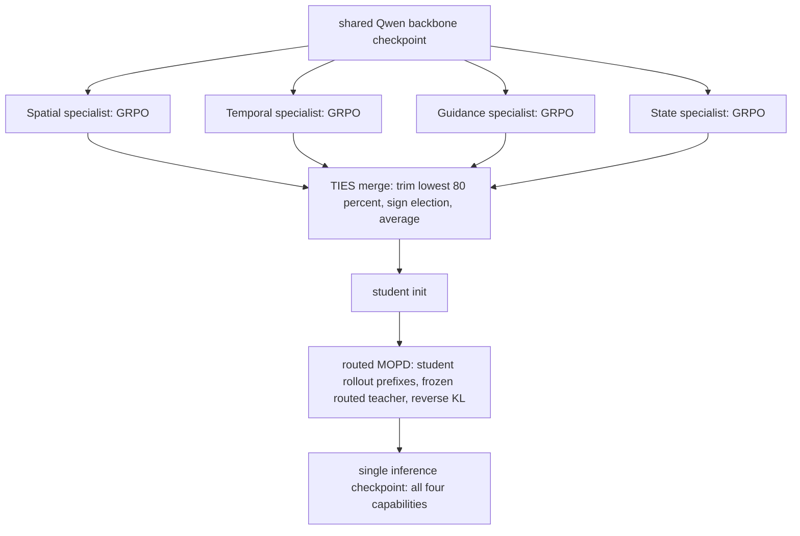

# Capek 0.5: An Execution-Centric Vision-Language Model for Embodied Intelligence

- arXiv: https://arxiv.org/abs/2608.06756
- Source: https://arxiv.org/abs/2608.06756
- Project: 
- Local PDF: `/Users/luogu/physical_intelligence/papers/architecture/Capek05_2608.06756.pdf`
- Year: 2026
- Category: architecture
- Priority: medium

> 来源性质：XPENG ROBOTICS 技术报告（37 页，arXiv v1，2026-08-07），**无同行评审**。下文所有性能数字均来自厂商自报；报告声称全部评测行（含外部基线）由其内部 DeepInsight 评测设施统一重跑、未抄官方数字，但外部无法独立复核。

## 一句话总结

Capek 0.5 是一个以"执行"为组织原则的具身 VLM：把机器人在执行循环中反复调用的能力分成 Spatial Reasoning、Temporal Understanding、Action Guidance、State Verification 四族，从同一个 Qwen backbone 各训一个 GRPO 专家，再用 TIES 权重合并 + routed MOPD 在线策略蒸馏压成单一推理模型（2B 与 35B-A3B 两个尺度）；34 个协议对齐基准行上 35B 赢 28 行、2B 赢 30 行，并在 EmbodiedBench 与 VIGIL 闭环仿真里验证能力能组合成任务成功。

## 核心技术

### Execution-centric 能力分类学

不按数据集或任务组织训练，而按"执行周期中反复出现的信息需求"分四族：

- **Spatial Reasoning**：场景几何与实体间关系（方向、深度/距离/尺寸、跨视角对应、放置可行性）。
- **Temporal Understanding**：事件顺序、发生时刻、随时间的变化（视频因果 QA、时间区间定位、长视频理解）。
- **Action Guidance**：把任务语言落到可操作的图像目标——pointing、affordance 区域、有序轨迹（waypoint 序列）、指令接地。
- **State Verification**：两级——物理级 PSV（physical-state verification，"刚才那一步真的把物体变成需要的状态了吗"）与任务级 PVE（progress-value estimation，"整体进度百分比 + 下一步动作"）。

论文强调这四族不是互斥的流水线阶段，而是在一次观测-推理-动作循环中反复、重叠地被调用（用 BEHAVIOR-1K 的家庭操作轨迹做了可视化论证）。

### 统一输出接口：一切皆文本生成

两个尺度（35B-A3B MoE 每 token 激活约 3B；2B dense）都用标准 ViT-LLM 结构，**没有任何任务专属解码头**：点/框/轨迹输出归一化到共享的 $[0,1000]^2$ 图像坐标系，时间跨度输出 [start, end] 区间，状态判断输出结构化字段，进度输出标量 + JSON。这让四种异构能力可以被同一套自回归接口承载，也是后面 RL 奖励与合并可行的前提。

### 数据：按执行角色而不是来源组织

审计后的候选数据池共 316,736 条 train-side candidate view rows（272,541 非 State + 44,195 State）：Spatial 84.0K（26.5%）、Temporal 92.6K（29.2%）、Guidance 95.9K（30.3%）、State 44.2K（14.0%）。来源覆盖 SenseNova-SI-8M、VSI-590K、MindCube、EmbSpatial-SFT（Spatial）；CLEVRER、NExT-QA、PerceptionTest、STAR、Charades、DiDeMo、LLaVA-ST 等（Temporal）；PixMo、RoboPoint、DROID、AgiBot World、RoboMIND 2.0、ShareRobot、RoboVQA 等（Guidance）。**State 族全部从 BEHAVIOR-1K 家庭操作轨迹构造**，锚定在 primitive/skill/task 三级执行检查点上，用 BDDL 目标条件与仿真器状态在教师侧推导标签，模型只看到当前检查点之前的因果视觉前缀。

### 两阶段后训练：先专业化，再合并

1. **专业化**：四个专家从同一 checkpoint 出发，各自用能力对齐的数据、输出格式与奖励做 GRPO（Group Relative Policy Optimization）强化学习。
2. **合并**：先用 TIES 做权重空间合并得到学生初始化，再用 routed MOPD（Multi-Teacher On-Policy Distillation）在学生自己生成的前缀上，把对应专家的行为蒸馏进来。专家与路由**只存在于训练期**，推理只加载一个 checkpoint。

### Capek-StateBench：自建的 State Verification 基准

现有公开基准很少测"执行之后世界状态对不对、任务进度到哪了"，报告为此构造两条 track：Capek-StateBench-P（物理状态核验，500 例，单图/短视频/关键帧 + 选择或 yes/no 判定）与 Capek-StateBench-T（任务状态核验，500 例，含 213 条 task-condition 与 287 条 primitive-skill 记录），主指标 $s_T = (5 s_p + 4 s_a)/9$。

## 底层原理与数学推导

### Token 级 GRPO 与组相对优势

每个专家用 GRPO 优化。对输入-目标对 $(x, y^\star)$，rollout 策略采样一组 $G$ 个回答 $\{y_i\}$，按格式相关奖励打分 $r_i = R(y_i, y^\star)$，组内归一化得到响应级优势：

$$ \hat{A}_i = \frac{r_i - \bar{r}}{\sigma_r + \delta} $$

$\bar{r}$ 与 $\sigma_r$ 是组内奖励均值与标准差，$\delta > 0$ 是数值稳定项。组相对基线免去了学习 value function。优势被平摊到回答的每个 token 上，用 token 级 clip 目标更新：

$$ \mathcal{L}_{RL}(\theta) = -\frac{1}{\sum_{i=1}^{G} |y_i|} \sum_{i=1}^{G} \sum_{t=1}^{|y_i|} \left[ \min\!\left(\rho_{i,t} \hat{A}_i,\; \text{clip}(\rho_{i,t}, 1-\varepsilon, 1+\varepsilon)\hat{A}_i\right) - \beta\, \hat{D}_{KL,i,t} \right] $$

其中重要性比率 $\rho_{i,t} = \pi_\theta(y_{i,t} \mid x, y_{i,<t}) / \pi_{\theta_{old}}(y_{i,t} \mid x, y_{i,<t})$。**Rollout 式样本筛选**是实践中重要的一环：当组内奖励方差为零时优势消失，所以全对的 prompt 被降采样、全错的 prompt 先审计（标注歧义/视觉证据不足/解析失败/真难）再决定去留，且按能力独立筛。

### 统一奖励结构与各能力的打分几何

所有专家共用 $R(\hat{y}, y^\star) = \lambda_{fmt} R_{fmt}(\hat{y}) + \lambda_{acc} R_{acc}(\hat{y}, y^\star)$，$R_{fmt} \in \{0,1\}$ 是格式硬解析奖励，$R_{acc} \in [0,1]$ 由规则验证器或冻结语义裁判给出，权重非负且和为一。各能力的正确性项：

- 时间定位用时间 IoU：$R_{tIoU}(I_p, I_g) = \max(0, \min(e_p, e_g) - \max(s_p, s_g)) \,/\, (\max(e_p, e_g) - \min(s_p, s_g))$；时空接地再对半加 box IoU，即 $R_{st} = \tfrac{1}{2} R_{tIoU} + \tfrac{1}{2} R_{box}$。
- 有序轨迹用离散 Frechet 距离（保序），坐标归一化到 $[0,1]^2$ 后按五点等弧长重采样，再用指数核转成越高越好：

$$ R_{traj}(\bar{P}, \bar{Q}) = \exp\!\left(-\lambda_{traj}\, D_{DFD}(\bar{P}, \bar{Q})\right), \qquad \lambda_{traj} = 10 $$

- PVE 的进度奖励是 25 个百分点截断接近度 $r_{value} = \max(0, 1 - |\hat{p} - p|/25)$，带下一步动作的样本总奖励为 $R_{prog+act} = 0.5\, r_{value} + 0.4\, r_{action} + 0.1\, r_{fmt}$。

### TIES 权重空间合并

四个专家共享架构、tokenizer 与初始化，任务向量直接兼容：$\Delta_e = \theta_e - \theta_0$。TIES 通过"裁剪低幅值参数 + 坐标级符号投票 + 只平均符号一致的更新"来消解冲突：

$$ \theta_{TIES} = \theta_0 + \lambda_{TIES}\, \tau\!\left(\{\Delta_e\}_{e=1}^{E}\right), \qquad E = 4,\; \tau = 0.8,\; \lambda_{TIES} = 1.0 $$

$\tau = 0.8$ 表示每个任务向量中幅值最低的 80% 分量被 mask 掉。

### Routed MOPD：在学生自己的轨迹上蒸馏路由专家

合并不能保证每个专家行为都被保留，于是每个样本按能力路由到对应专家教师，在**学生生成的前缀** $h_t = (x, y_{<t})$ 上做 token 级反向 KL：

$$ \mathcal{L}_{MOPD}(\theta) = \mathbb{E}\!\left[\frac{1}{|y|} \sum_{t} D_{KL}\!\left(\pi_\theta(\cdot \mid h_t)\,\|\, q_r(\cdot \mid h_t)\right)\right] $$

实践中不算全词表 KL，而是采样代理：教师给出每个学生采样 token 的 log 概率，构成逐 token 蒸馏优势（带 stop-gradient 与 $\pm\varepsilon_{max}$ 截断）：

$$ \hat{A}^{MOPD}_{t} = \text{clip}\!\left( \text{sg}\!\left[ \log \frac{q_r(y_t \mid h_t)}{\pi_\theta(y_t \mid h_t)} \right], -\varepsilon_{max}, \varepsilon_{max} \right) $$

由于 rollout 来自学生自身的 $\pi_\theta$，该优势可直接用 token 平均策略梯度优化。报告另把 MOPD 直接用在 backbone 上（跳过 TIES）作为受控对照，用于隔离权重初始化的贡献。

### Capek-StateBench 的评分设计

进度得分 $s_p = \max(0, 1 - |\hat{p} - p|/25)$，下一步动作用固定语义裁判的精确匹配 $s_a \in \{0,1\}$（容忍无害改写，但操作/物体/目标/方向/关系必须一致），主指标为 $s_T = (5 s_p + 4 s_a)/9$——进度权重 5、动作权重 4。物理 track 用归一化精确匹配准确率。

## 物理直觉解释

**四个专科医生会诊，而不是一个全科医生硬啃四本教材。** 让一个模型同时用四套互不兼容的输出格式与奖励几何做 RL，梯度会互相打架——报告引用的优化干扰现象在多任务 RL 里是常态。Capek 0.5 的做法是先让四个专科医生各自在自己的领域练到最好（同源、参数兼容），TIES 合并相当于把四份诊疗方案合成一份会诊纪要：裁掉各自方案里幅度小的噪声项（80% 低幅值分量），对冲突的结论投票取多数，只把意见一致的部分平均进来。MOPD 则是让全科医生**跟着专科医生出门诊**：病人是学生自己接进来的（student-generated prefix），老师在学生实际会遇到的状态上示范该说什么——这比拿老师的教科书（teacher 的 off-policy 分布）硬背要贴近实战，也解释了为什么 MOPD-only 在动作与状态类任务上比 TIES 更稳。

**执行是循环，不是流水线。** 机器人每动一下，世界就被改写一次：三秒前"抽屉是关着的"这个结论现在可能已经作废。所以能力的组织原则不该是"感知→规划→动作"这种阶段划分，而应该是"这次执行里反复需要什么信息"——在哪（空间）、什么时候变了（时间）、该碰哪里（引导）、成了没（验证）。**像边开车边看导航：每打一次方向，导航就重绘一次，你需要在每个路口重新确认"拐对了吗"。** 这个视角的直接后果是 State Verification 被提升为一等能力族——绝大多数现有基准只测"能不能想对"，很少测"做完之后世界真的对不对"，而这恰恰是闭环执行里最便宜也最关键的一环。

**独立验收员与"自己报的进度"之间的差。** State Verification 分两级各司其职：PSV 只回答"这一步真的做完了吗"（局部窗口内的物理谓词：开/关、通电/断电、抓住/放下、装进去/支撑住）；PVE 回答"整体进度百分之几、下一步干什么"。人干活都会高估自己的进度，模型也一样——VIGIL 的设计正是把这件事量化了：W（世界谓词真的满足）与 B（模型还正确地报告了完成）分开计分。Qwen3.6 骨干在 VIGIL 上 W 是 37.4% 而 B 只有 28.8%，差出来的 8.6 个百分点就是"活没干完却报了完成"的虚报率；Capek 0.5 把这条差距压到 6.4 个百分点（38.6% vs 32.2%）。一个会自我核验的模型，不仅做对得更多，也谎报得更少。

## 工程细节与实操指南

- **训练栈**：verl + Megatron-LM，vLLM 做 rollout，bfloat16。专家 GRPO 配置（Table 7）：学习率全部 $1\times10^{-6}$、每 prompt 8 个 rollout；KL 系数 Spatial/Guidance(affordance)/Temporal 均为 0.01，**Guidance(trajectory) 为 off**；全局 batch 128（Spatial、Guidance-affordance）或 64（Temporal、Guidance-trajectory）；最大 prompt 长度 8192/5120/10240/10240，最大响应 5120/5120/5120/8192；TP2/EP8，rollout TP 8 或 4。
- **MOPD 运行配置**：学生从 TIES 合并点初始化，全局 batch 240、lr $1\times10^{-6}$、每 prompt 2 个学生 rollout、prompt/响应上限 10240/5120、1 个 epoch、12 张 actor GPU（TP2/EP4）+ rollout TP2；四个专家冻结作教师，contract-to-expert 映射与路由比例写死在 run manifest 里。
- **评测协议**：全部结果由内部评测设施 DeepInsight 统一重跑（记录配置、生成与分数），不引用官方数字；每个 benchmark 的数据版本、媒体采样、prompt 模板、解析器、打分器对所有被比模型完全一致。**Capek 0.5 与其 Qwen 初始对共享同一套解码配置**，因此对内行的带符号差值可归因于后训练配方本身；外部基线则用各自官方推荐推理设置。
- **推理设置**：vLLM，128K 上下文，自动截断，最多 64 视频帧，temperature 0.7、top-p 0.95、top-k 20，最多 16,384 生成 token，thinking 开启；打分前剥掉 `<think>` 与可选 `<answer>` 包裹。
- **可比性技巧**：35B-A3B 主 track 只与 A3B MoE 及激活参数量相近的 7-9B dense 模型同表比较（每 token 激活约 3B），沿用 HY-Embodied 的 active-compute 比较原则；2B track 只与 ≤4B 模型比。
- **数据工程要点**：所有坐标目标统一转换到共享 $[0,1000]^2$ 坐标系；轨迹保留有序 waypoint（导航轨迹另存稀疏语义 waypoint 与更密的 2D 路径）；数据划分继承自原始来源并在视图序列化之前分配，去重在 logical-sample 级别进行以防训练/评测泄漏；依赖策略的难度筛选**不在静态语料上做**，而是推迟到专家 RL 的 rollout 筛选阶段。
- **待确认：训练总算力（GPU 时）与四个专家各自的训练时长/步数未披露**（Table 7 只给超参，不给规模）。
- **待确认：模型权重、代码与 Capek-StateBench 数据是否公开发布，PDF 未说明**。
- **待确认：2B track 的专家 GRPO manifest 只有"记录在其自身 run manifest 中"的表述，具体超参未在正文给出**。
- **待确认：MOPD 的 $\varepsilon_{max}$、KL 系数 $\beta$、GRPO 的 clip 阈值 $\varepsilon$、G（每 prompt rollout 数为 8，但奖励归一化分组是否跨能力共享）等训练敏感量的具体取值未全部给出**。
- **待确认：报告未提供真机闭环实验**，EmbodiedBench 与 VIGIL 均为仿真（AI2-THOR / ProcTHOR / ALFRED / Habitat 系），因此"执行中心能力能否迁移到物理机器人"没有直接证据。

## 消融实验与分析

### 专业化与合并的受控消融（论文 Table 4，35B-A3B，同一 Qwen3.6 初始化）

| 能力 | 签名基准 | 共享起点 | 对应专家 | Mix-RL | TIES | MOPD | TIES+MOPD |
|------|------|------|------|------|------|------|------|
| Spatial | MindCube | 58.67 | 71.52 | 60.38 | 58.38 | 68.48 | 69.90 |
| Spatial | VSI-Bench | 60.83 | 70.99 | 65.05 | 71.02 | 69.54 | 70.69 |
| Temporal | EgoTempo | 38.20 | 50.80 | 42.80 | 49.40 | 43.20 | 44.60 |
| Temporal | LongVideoBench | 60.48 | 65.31 | 63.31 | 65.14 | 64.48 | 64.89 |
| Guidance | VABench-point | 54.71 | 59.00 | 58.33 | 57.67 | 59.78 | 59.33 |
| Guidance | VABench-trace (RMSE, 越低越好) | 139.28 | 100.43 | 121.8 | 117.49 | 108.83 | 108.15 |
| State | StateBench-P | 65.80 | 80.00 | 70.40 | 68.00 | 75.80 | 76.80 |
| State | StateBench-T | 43.76 | 47.88 | 48.23 | 43.55 | 45.52 | 46.21 |

**核心结论：** 专业化阶段专家在全部 8 个签名基准上大幅超越共享起点（MindCube +12.85、VSI-Bench +10.16、EgoTempo +12.60、StateBench-P +14.20、VABench-trace RMSE -38.85）；三条合并路线各有偏向——Mix-RL 全面但保留有限（只在 StateBench-T 拿最优 48.23），TIES 保空间/时间最好（VSI-Bench 71.02）却在 MindCube（58.38，低于起点 58.67）和 StateBench-T（43.55）出现回退，MOPD 在动作与状态类最稳；最终 TIES+MOPD 在 8 行里拿到 3 项最优、5 项次优，相对 MOPD-only 改进 7/8 行，仅 VABench-point 让出 0.45 分。

### 总体基准与闭环（论文 Table 2/3/5/6 摘录）

| 评测 | Qwen 初始 | Capek 0.5 | 变化 |
|------|------|------|------|
| 35B 对齐基准行（共 34 行） | — | 28 行提升 | 82.4% |
| 2B 对齐基准行（共 34 行） | — | 30 行提升 | 88.2% |
| StateBench-P (35B) | 65.80 | 76.80 | +11.00 |
| EB-HAB 平均成功率 (35B) | 46.0% | 63.0% | +17.0 |
| EB-HAB 长时程 (35B) | 28.0% | 54.0% | +26.0 |
| VIGIL B（含正确报告的成功率, 35B） | 28.8% | 32.2% | +3.4 |
| VIGIL PG 像素接地 B (35B) | 52.8% | 72.8% | +20.0 |

**核心结论：** 收益集中在执行导向的能力上（35B 的 Action Guidance 10/10 行、Temporal 5/5 行全升；2B 上 VABench-point +28.87、NaviTrace +54.67），通用能力大体保持（8 个回归控制里 5 升，MMMU 74.86→76.19，LiveCodeBench v6 77.31→72.91 小幅回退）；闭环里长时程与复合指令子集涨幅最大（+26.0 / +20.0），说明四能力的组合确实兑现为多步任务成功，而 VIGIL 中 W 与 B 差距收窄说明虚报完成的比例也在下降。

## 技术权衡（Trade-off）

| 优势 | 劣势与工程代价 |
|------|---------------|
| 专家化隔离了四套异构奖励/格式之间的优化干扰，能力获取与保持都可审计（有 matching expert 作为"应保留上限"的参照） | 训练期要维护 4 个专家 + 学生 + 路由，成本约 5 倍于单模型后训练；总算力未披露 |
| 推理只需一个 checkpoint，路由只存在于训练期 | 合并仍非无损：StateBench-P 80.00 → 76.80（-3.20）、MindCube 71.52 → 69.90（-1.62），专家峰值能力被摊薄 |
| 输出全部可验证（规则解析 + 指数核/截断奖励），RL 奖励可扩展、不依赖奖励模型 | 只有能写成可验证格式的任务能进入分类学；自由形态技能（柔性物操作、接触丰富控制）不在覆盖范围内 |
| 全部评测行内部重跑、对内行共享解码配置，归因干净 | 数字仍是厂商自报、无同行评审；State 数据与 StateBench 同出 BEHAVIOR-1K，分布同源使 76.80 的绝对值有高估风险 |
| 分类学覆盖感知-推理-验证的执行闭环，且打分可诊断到每个能力族 | 模型不输出低层动作（future work 才计划加 action tools），必须搭配下游 specialized policy 才能构成完整机器人栈 |
| MoE 每 token 只激活约 3B，部署比同规模 dense 轻 | 相比 7B 级端到端 VLA 仍重；且无真机闭环， EmbodiedBench/VIGIL 的行动空间是离散语义动作而非连续控制 |

## 技术价值与演进定位

这份报告的价值不在某个单项指标，而在把"能力怎么组织"本身当成可研究、可审计的对象：它给出了具身 VLM 的能力分类学（四族 + 类型化输出契约）、配套的逐能力奖励几何、以及一条专家→统一的可复现合并配方（TIES 初始化 + routed MOPD），并用同一初始化下的 Mix-RL/TIES/MOPD/TIES+MOPD 四列受控对照把"合并到底损失了什么"量化到每个签名基准。在 2026 年涌现的同生态工作群（RynnBrain、MiMo-Embodied、Embodied-R1.5、RoboBrain、HY-Embodied）里，多数报告只给一张总表，Capek 0.5 是少数把 capability retention 拆开来做消融的。它自建的 Capek-StateBench 补的是 State Verification 这一基准空白——现有公开套件普遍只测推理正确性，不测执行后状态核验与进度估计；配套的 VIGIL（同团队前作，arXiv 2605.08747）进一步把"世界真的完成"与"模型报告完成"拆成两个分数，让虚报率首次可测量。定位上，Capek 0.5 明确不做低层控制器：它输出点、框、有序轨迹、时间区间与状态判定这些**可验证中间量**，服务于下游 specialized policy——这与端到端 VLA（π0/OpenVLA 系）是栈上互补而非竞争关系。其 future work 写得直白：要把工具调用变成执行循环里的一等动作（perception tools、可执行代码编排、暴露机器人技能的 action tools），即沿着 ART 一类 tool-use VLA 的方向继续走，届时"执行中心分类学"将多出第五族。

## 与其他论文的关系

- `notes/architecture/g05.md` — 与 Capek 0.5 最值得对照的近亲：G0.5 同样以 Qwen3.5 2B 为底座、同样在 token 流里混排推理与动作、同样把 GRPO 当微调手段，且同样在 BEHAVIOR-1K 上有评测；差别是 G0.5 的推理是自生成 CoT 模板并直接耦合动作输出（闭环策略），Capek 0.5 的输出止于可验证中间量（开环推理核），四能力专家化 + 合并的做法在小鹏栈里没有对应物。
- `notes/reasoning/onetwovla.md` — 同属"System 2 显式推理放进单模型"的方向：OneTwoVLA 用 Decision Token 在推理/动作模式间自适应切换并做错误检测恢复，Capek 0.5 的 State Verification 族（PSV/PVE）正是把这类"错误检测"独立成可训练、可基准化（StateBench-P/T）的能力。
- `notes/reasoning/gr00t-n1.md` — 双系统架构的对立面参照：GR00T N1 用 System 2 VLM + System 1 flow matching DiT 在频率上分工，Capek 0.5 刻意不做阶段划分（论文原话：不把 VLM 当 low-level controller），把四能力装进一个自回归模型，执行循环里的分工留给下游。
- `notes/architecture/pi05.md` — 端到端路线的对照面：π0.5 用 97.6% 非目标平台数据换开世界泛化、直接出连续动作；Capek 0.5 用专家化 + 合并换能力广度与可验证性、不出动作。两者在"泛化从哪来"上给出不同的答案（数据规模 vs 能力组织）。
- `notes/architecture/pi0.md` / `notes/architecture/fast-tokenizer.md` — 若按 Capek 的 future work 把 action tools 接上，下游最自然的 specialized policy 就是 π0 系：FAST 的 DCT 动作 token 化与 Capek 的类型化文本输出可以直接拼成"推理核 + 动作专家"的两段栈。
- `notes/architecture/lingbot-vla2.md` — LingBot-VLA 2.0 把深度（LingBot-Depth）与时序（DINO-Video）教师**内化**进 VLA 预训练，与 Capek 0.5 把同类能力（Spatial/Temporal）作为独立专家**外置**训练再合并，是同一能力清单的两种工程化路径：前者服务闭环控制，后者服务可审计推理。
- `notes/architecture/xr-1.md` — XR-1 的统一视觉-运动 token 空间追求感知与动作在 latent 层面不分家，与 Capek 0.5 "推理与控制显式分层"形成哲学上的两极。
- `notes/reasoning/trivla.md` — TriVLA 的 System 3 视频扩散世界模型提供时序预见，可视为对 Capek 0.5 Temporal Understanding 族的生成式升级：从"判断事件何时发生"到"预测画面将如何演变"。

## 精读问题

1. 合并非无损：专家在 StateBench-P 上 80.00、合并后 76.80（-3.20），MindCube 71.52 → 69.90（-1.62）——这些损失是 routed MOPD 当前训练量（1 epoch、batch 240）下的暂时欠拟合，还是权重平均与蒸馏的原理性上界？报告没有给出延长 MOPD 训练后的损失曲线，这个差距还能继续压缩吗？
2. 进度奖励 $r_{value} = \max(0, 1 - |\hat{p} - p|/25)$ 允许 25 个百分点的误差仍拿非零分，而主指标 $s_T$ 里进度权重（5）高于下一步动作（4）——对依赖 PVE 决定任务终止的下游 agent 来说，±25% 的进度容差是否会导致过早终止或空转？
3. State Verification 的全部训练数据与 Capek-StateBench 同出 BEHAVIOR-1K 仿真家庭场景，报告称基准对训练严格 held out，但分布同源——76.80 的 StateBench-P 分数在跨到真实家庭场景时还能保留多少？
4. Guidance(trajectory) 专家的 KL 系数被设为 off（Table 7），而其他三个专家都是 0.01——是因为指数核奖励本身足够塑形、还是 Frechet 距离奖励下 KL 约束会阻碍探索？这会不会解释了 TIES+MOPD 在 VABench-trace 上相对 matching expert 仍有 7.72 像素的 RMSE 差距？
5. VIGIL 的 W 与 B 之间仍有 6.4 个百分点的差距（38.6% vs 32.2%），说明虚报完成并未被 State Verification 训练根除——如果把这个差距直接作为 RL 奖励惩罚项（谎报即负奖励），能否在下一版 Capek 里把 B 拉到 W 的水平？
