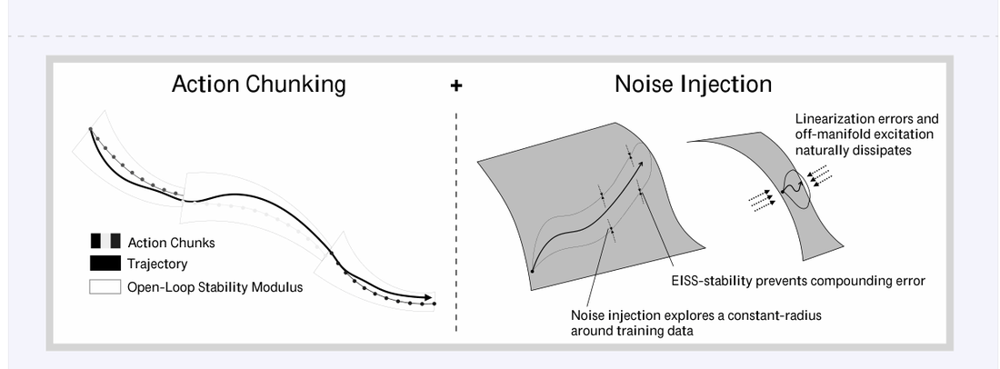
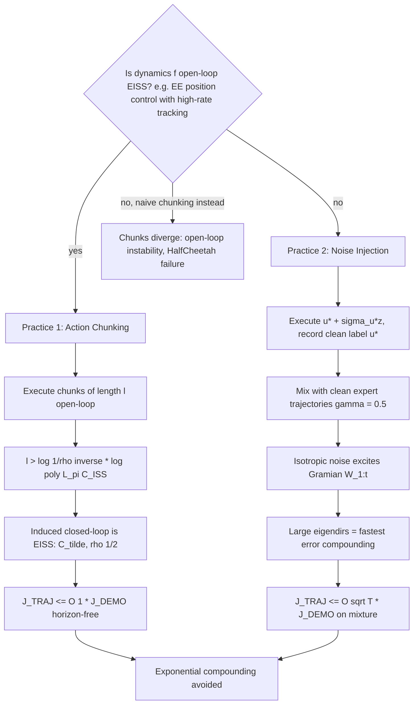

# Action Chunking and Exploratory Data Collection Yield Exponential Improvements in Imitation Learning

- arXiv: https://arxiv.org/abs/2507.09061
- Source: Thomas T. Zhang (UPenn), Daniel Pfrommer (MIT), Chaoyi Pan (CMU), Nikolai Matni (UPenn), Max Simchowitz (CMU)；v5 (2025-11-26) 正式标题为 "...Yield Exponential Improvements in Behavior Cloning for Continuous Control"
- Project: 
- Local PDF: `papers/architecture/ChunkingExploratory_2507.09061.pdf`
- Year: 2025
- Category: action chunking theory
- Priority: high

## 一句话总结

**Problem**：连续控制 IL 存在指数复合误差下界（Simchowitz et al. 2025：即使动力学与专家均稳定，任何平滑马尔可夫学习器都逃不掉 C^T 放大）；**Insight**：控制论稳定性才是 chunking/数据增强收益的核心机制——只要**开环执行足够长的 chunk**（长度仅需对数于稳定参数），或对示教做**噪声注入采集**（在易激励方向上提供一阶监督），就能绕开下界；**Mechanism**：chunk 化策略在开环 EISS 动力学上诱导出 EISS 闭环（Thm 1：horizon-free 误差界）；等向白噪声激励可控性 Gramian 的大特征方向，恰好是误差最快复合的方向（Thm 2）；**Evidence**：robomimic tool_hang 全状态确定性设置中"执行块长度"比"预测长度"关键得多（成功率先升后降，20Hz 下 32 步 ≈ 1.6s 开环）；MuJoCo 上单次噪声注入追平 DAgger/DART，而不需要任何迭代交互。

## 九问速览

1. **Problem**：连续控制 BC 误差随 T 指数复合；两大流行实践（chunking、探索式采数）为何有效无理论解释
2. **Bottleneck**：已有理论把 chunking 归因部分可观测/多模态，但它在全观测确定性状态控制中依然有效——归因错误
3. **Insight**：控制论视角——chunk 开环执行诱导增量稳定性；噪声注入激励"误差最易复合"的可控子空间方向
4. **Method**：EISS（指数增量输入-状态稳定）框架下证 chunked 策略误差界 + Gramian 分析噪声注入；robomimic/MuJoCo 验证
5. **Evidence**：Thm 1：ℓ > log(1/ρ)^{-1}·log(poly(L_π,C_ISS)) 即得 horizon-free 界 J_TRAJ ≲ O(1)·J_DEMO；tool_hang 上块长从 1 增到数十成功率剧增后回落
6. **Ablation**：预测 horizon 与执行块长解耦——增益主要来自执行块长；纯噪声轨迹 vs 干净标签混合：干净标签至关重要
7. **Assumption**：Practice 1 需开环 EISS 动力学（EE 位置控制 + 高频底层跟踪）；Practice 4 需光滑 (C_π, C_reg) + 专家闭环 EISS
8. **Failure**：开环不稳定系统（MuJoCo 无底层稳定器）上朴素 chunking 是灾难；光滑性破坏（MPC 类分段动力学）超出现有理论
9. **Opportunity**：稳定性正则化/hierarchy 强制 (π̂, f̂) EISS；各向异性/鲁棒扰动采集配方；迭代交互的边际收益刻画

| 维度 | 论文答案 |
|---|---|
| Perception | 全状态低维观测（无视觉）——刻意消融感知因素，证明 chunking 收益与部分可观测无关 |
| Closed-loop | chunk 长度 = 反馈间隔：理论说对数长即可稳定，超长只有边际收益且撞上开环漂移；receding-horizon（ℓ=1）不触发稳定机制 |
| Correction | 无显式纠错；纠错被重构为"增量稳定性"——块内开环不纠错，但块边界重观测 + EISS 使旧误差指数衰减；噪声注入是数据侧的"预演纠错" |
| Deployment | 判据可操作：有高频底层位置跟踪（开环稳定）→ 上 chunking；否则 → 采数时注入噪声（单次、非迭代、干净标签） |

## 核心技术

**理论框架：把 IL 干预翻译成稳定性语言。** 论文在 x_{t+1} = f(x_t, u_t) 确定性连续控制 + 确定性马尔可夫专家 π* 的最小设定下，用两个核心误差量沟通"学习"与"控制"：J^DEMO,T（示教分布上的回归误差，监督学习可控）与 J^TRAJ,T（闭环 rollout 轨迹误差， clipped）。指数复合误差定义为 E[J^TRAJ,T] ≳ C^T·E[J^DEMO,T]（C>1）。

*论文 Figure 1（p1）：Figure 1:*

**关键定义**：
1. **EISS（Def 2.1，指数增量输入-状态稳定）**：对任意两条轨迹对（初值+输入序列），‖x_t − x'_t‖ ≤ C_ISS ρ^{t−1}‖x_1−x'_1‖ + C_ISS Σ ρ^{t−1−k}‖u_k−u'_k‖。是 ISS 到"轨迹间"的推广——连续控制版的"可恢复性"。记 C_stab = C_ISS/(1−ρ)。**开环稳定**指 f 自身 EISS（无需反馈）；**闭环稳定**指 (π, f) 复合 EISS。
2. **Chunking 策略（Def 3.1）**：π̃ 在第 kℓ+i 步执行 π̃_chunk,i(x_{kℓ+1})——每 ℓ 步观测一次，块内开环。
3. **诱导 chunk 策略（Def 3.2）**：chunk[π̃](x) = (π̂(x), π̂((ĝ∘π̂)(x)), …, π̂((ĝ∘π̂)^{ℓ−1}(x)))——用"候选动力学 ĝ 模拟闭环 rollout"生成 chunk。形式化要求 (π̂, ĝ) 是 EISS 对，但**不要求 ĝ 接近真 f**（实验中朴素 ℓ 步预测器也有效，暗示架构隐式偏置）。
4. **噪声注入分布（Def 4.1）**：P_{π*,σu}：执行 ũ_t = π*(x̃_t) + σ_u z_t 但**记录干净标签** ũ_t = π*(x̃_t)，z ~ Unif(B^{d_u}(1))；混合分布 P_{π*,σu,γ} = γP_{π*} + (1−γ)P_{π*,σu}。
5. **线性化与 Gramian（Def 4.2/4.3）**：沿专家轨迹 A_t = ∇_x f, B_t = ∇_u f, K*_t = ∇_x π*；闭环传递 A^{cl}_{s:t} = ∏(A+B K*)；**可控性 Gramian** W^u_{1:t} = Σ A^{cl}_{s+1:t} B_s B_s^T (A^{cl}_{s+1:t})^T——σ_u² 噪声下 E[δx_t δx_t^T] ≈ σ_u² W^u_{1:t}，其大特征方向 = 误差最易被放大的方向。

**两个实践（Practice）**：P1 = 在 Π_chunk,ℓ 类上做 BC（只改策略参数化，不改数据）；P2 = 在混合分布上做马尔可夫 BC（只改数据，不改算法）。分别对抗 Theorem A 的 (i)/(ii) 两个下界分支。

## 底层原理与数学推导

**出发点（Theorem A，Simchowitz et al. 2025 非正式重述）**：(i) 存在 g 开环 EISS、(π,g) 闭环 EISS、两者光滑 Lipschitz 的实例族，使任何返回光滑 Lipschitz 马尔可夫策略（状态无关随机性）的学习器承受指数-in-T 复合误差；(ii) 若 g 无需开环 EISS，则**任何算法**（无限制）都逃不掉指数误差——意味着必须改数据分布。

**Theorem 1（Practice 1 主定理：chunking 使误差 horizon-free）**：设 f 开环 (C_ISS, ρ)-EISS（ρ ≤ 1/e）、策略 L_π-Lipschitz。当 chunk 长度足够长：

$$
\ell > \log(1/\rho)^{-1}\cdot \log\big(\mathrm{poly}(L_\pi, C_{\mathrm{ISS}})\big)
\;\Longrightarrow\;
J^{\mathrm{TRAJ},T}(\tilde\pi) \lesssim O^*(1)\cdot J^{\mathrm{DEMO},T}(\tilde\pi;\,P_{\pi^*})
$$

由 Prop 3.1（chunked 策略在真动力学上诱导 (C̃, ρ^{1/2})-EISS，C̃ = log(1/ρ)^{-1}·poly(L_π, C_ISS)）+ Prop 3.2（EISS ⟹ J^x_TRAJ,p ≤ (C̃/(1−ρ̃))^p J^DEMO,p）合成。证明核心是**块间收缩引理**：

$$
\|x'_{t_{k+1}} - x''_{t_{k+1}}\| \le \rho^\ell \|x'_{t_k} - x''_{t_k}\| + C_{\mathrm{ISS}} \sum_{s=0}^{\ell-1}\rho^{\ell-1-s}\|u_{t_k+s}\|
$$

选 ℓ 使 (1+L_π)C_ISS^{2ℓ}ρ^{ℓ−1} ≤ ρ^ℓ（取对数即得对数 chunk 长度），迭代"剥洋葱"得全局 EISS。关键点：**该条件只对"执行块长"生效**——receding-horizon（ℓ=1）执行不绕过 Theorem A(i)。

**Prop 4.1（噪声注入的漂移下界，说明为何需要混合干净数据）**：对任意 σ_u > 0 存在两个 C_π-光滑策略 π_1, π_2，各一条干净轨迹即可完美区分，但在 σ_u² 注入分布上，任何学习器以概率 ≥ 1 − n·exp(−Ω(√d_u)) 产出 J^TRAJ,T(π̂) ≳ C_π²σ_u⁴——纯注入数据有不可消除的加性漂移。

**Theorem 2（Practice 2 主定理：噪声注入的horizon 受控误差界）**：设 (π*, f) (C_π, C_reg)-光滑、L_π-Lipschitz、闭环 EISS，π̂ 为 L_π-Lipschitz C_π-光滑。取 σ_u ≍ O*(poly(1/C_π, 1/C_reg))（可取 O*(1)）：

$$
J^{\mathrm{TRAJ},T}(\hat\pi) \lesssim O^*(T)\cdot\sigma_u^2\cdot J^{\mathrm{DEMO},T}(\hat\pi;\,P_{\pi^*,\sigma_u,0.5})
\;\;\overset{\sigma_u = O^*(1)}{\Longrightarrow}\;\;
J^{\mathrm{TRAJ},T}(\hat\pi) \lesssim O^*(T)\cdot J^{\mathrm{DEMO},T}(\hat\pi;\,P_{\pi^*,\sigma_u,0.5})
$$

且更精细的分解（式 4.3）为 horizon-free 的干净项 + 混合分布误差事件之和；若估计误差满足超收缩性，则 J^TRAJ ≲ O*(1)J^DEMO(P_π*) + O*(T/σ_u⁴)·J^DEMO(P_mix)²。技术核心：Prop 4.3 证明只要在**可控子空间 R*_t = range(W^u_{1:t}) 上控制一阶（梯度）误差**至 c_stab·ε，非线性泄漏项以 O(ε²) 自我调节；Prop 4.4 证明混合分布回归恰好以 ~d_u/σ_u² 系数控制该梯度误差——**不需要持续激励（PE）或全维覆盖**，白噪声自动把最多监督分配给最快复合的方向。对照：一步可控假设下的朴素界（Suboptimal Prop 4.2）要求 σ_u 微小且付出 ϵ_W^{−1}σ_u^{−2} 的代价——正是被混合分布 + 一阶分析修掉的缺陷。

## 物理直觉解释

**Chunking 像"把方向盘锁死一小段"：只要车本身有回正力矩，短暂松手反而比手抖更稳。** 控制工程的传统智慧是开环执行危险（模型失配会发散），所以看到 chunking"故意开环"觉得反直觉。这篇论文的解释是：机械臂的 EE 位置控制下面是 500Hz 的 PD/力矩跟踪层，它给了系统**内在的回正力矩（开环增量稳定性）**——你命令的位置序列即使有点错，真实轨迹也只会温和偏离而不是发散。此时每步反馈反而是误差放大器：策略在略微偏出的状态上预测，又把这个预测误差写进下一个状态，形成"策略-动力学"互激的指数爆炸（Theorem A(i)）。锁死 ℓ 步等于切断这个反馈回路，让底层控制器的时间去耗散掉旧误差；只要 ℓ 超过"耗散时间常数"（对数于稳定参数），每个块边界看到的状态都是被底层动力学"洗"过一遍的、更接近示教分布的状态。**开环不是放弃控制，而是把控制权暂时移交给更底层、更稳定的控制器。**

**噪声注入像"疫苗接种"：在专家轨道周围故意制造小感染，让策略学会正确的免疫反应。** 复合误差的方向不是随机的——它集中在闭环动力学最容易放大的方向（Gramian 大特征方向），比如欠阻尼关节、松动物体的摆动方向。纯专家数据永远只在这条一维轨道上提供标签，策略在这些危险方向上的梯度（一阶响应）完全靠外推，错一点就被动力学放大。注入等向白噪声后，状态以 σ_u 为半径散布在轨道周围，而动力学自动把这个球**拉成 Gramian 椭球**——最危险的方向被推得最远、拿到最多带标签的样本。妙处有三：记录的是干净标签（专家"本想做的动作"）而非噪声动作，避免策略学会"抖动"；只需单次采集，不需要 DAgger 式迭代（因为需要见证的只是局部一阶行为，不是全局恢复轨迹）；噪声可以放大到光滑度容忍的上限，而不是理论先验认为的极小值。**专家示教是"标准答案"，噪声注入给的是"错题本"——而错题本只需覆盖最容易错的题型。**

**为什么这两件事是同一枚硬币：都在对抗"无监督的危险方向"。** Theorem A 的两个分支对应两种失败物理：分支 (i) 是系统本可自稳（开环 EISS）但学习器的每步反馈引入了失稳耦合——chunking 通过物理层的稳定时间常数来截断耦合；分支 (ii) 是系统本身不自稳（如 MuJoCo 直接力矩控制），错误动作立刻发散，任何算法层面的修补都无效——必须改数据，让策略在发散方向上见过"专家如何不发散"。实验完美对应理论：tool_hang（EE 位置控制 = 开环稳定）上 chunk 长度是成功率的主导变量；HalfCheetah（无底层稳定器）上朴素 chunking 反而灾难性失效（Fig 10 右），而噪声注入可靠起效。**判断你该用哪个实践，先问一句：我的低层控制器能不能在我不发指令的 1 秒内把机器人稳住？**

## 工程细节与实操指南

- **先判系统的开环稳定性再选方法**：有高频位置/力矩跟踪层（末端位置控制、delta EE）→ Practice 1（chunking）；裸力矩/速度控制、欠驱动系统 → Practice 2（噪声注入采数）。判据可实测：让机器人在固定姿态下停止发指令 1-2 秒，看轨迹是否自发收敛而非发散。
- **Chunk 长度只需"对数级"，不要贪长**：理论阈值 ℓ ≳ log(1/ρ)^{-1}·log(poly(L_π, C_ISS))——实践中几十步内饱和；tool_hang 上执行块从 1 涨到 ~8-16 收益巨大，到 32（20Hz 下 ≈1.6 秒开环）开始被开环漂移反噬。**执行块长 ≥ 预测 horizon 的意义**：只预测不执行（receding horizon ℓ=1）拿不到稳定收益。
- **预测 horizon 适中即可**：horizon 4-32 都能工作，过长（64）徒增输出维度、挤占容量且低数据下增益消失；收益主峰在"执行多少"不在"预测多远"。
- **噪声注入配方（Practice 2）**：σ_u 取动作范围的可观比例（HalfCheetah 上 0.5-1.0，约 0.2-0.4 逐维扰动）；z ~ Unif(球面/球)；**一半轨迹注入、一半干净**（γ=0.5；比例在 0.2-0.8 间不敏感）；**记录干净动作标签**（记噪声标签是灾难性的）；单轮采集即可，无需看学习器 rollout。
- **何时两者叠加**：开环稳定系统里也可以加噪声注入（Fig 5 右，σ=0.05 有协同），但注意长 chunk + 注入数据互相冲突——chunk 抹掉了中间状态监督，把有用的局部探索变成了"要拟合的噪声目标"。
- **对人类示教的启示**：人类示教天然带噪声/抖动，可能自带部分 Practice 2 效应；对脚本/RL 专家蒸馏时需人为补噪声，否则策略在危险方向上零监督。
- **不要用这篇给"chunk 越大越好"背书**：论文恰恰证明对数长度之后收益边际递减，且与开环执行风险直接冲突（"longer chunk lengths beyond that point provide marginal benefit"）。

## 实验协议清单

| 项目 | 论文设置 | 来源与备注 |
|---|---|---|
| 观测 | 全状态低维观测（合成 6 维；robomimic tool_hang full-state；MuJoCo 状态向量）；无视觉 | §5、附录 E |
| 动作空间 | 连续：合成 R^6；HalfCheetah [−1,1]^6（σ_u=1 时逐维扰动 ~0.4）；robomimic 末端位置控制指令；Humanoid 维数未报告 | 附录 E.1-E.3、Fig 10 注 |
| 控制频率 | robomimic 20Hz（"32 actions at 20Hz ≈ 1.5s open-loop"）；MuJoCo/合成未报告 | §5、附录 E.2 |
| 重规划频率 | 每 ℓ 步重观测（执行块长）；对照 receding-horizon ℓ=1 | Def 3.1、Fig 5 |
| 动作 horizon | 训练预测 horizon ∈ {4,8,16,32,(64)}（robomimic）；合成 chunk ∈ {1,2,4,8,16}；执行块长独立扫描 1…horizon | 附录 E.1-E.2、Fig 5 |
| 数据 | robomimic：预训练确定性专家 rollout 的 100 条（左图）/50 条（右图）成功轨迹；合成：100 条 × 64 步专家轨迹；MuJoCo：SAC/TQC 专家轨迹数扫描（奖励-vs-轨迹数曲线），范围未报告 | 附录 E.1-E.3 |
| 奖励 | 学习目标为 BC 回归（无 RL）；MuJoCo 评估用环境 reward；robomimic 用成功率；合成用轨迹误差 | §2、附录 E |
| Reset | 未报告 | — |
| 成功定义 | robomimic 任务二值成功；MuJoCo 环境 reward；合成 J^TRAJ 轨迹误差 | §5、附录 E |
| 评估次数 | robomimic：3 模型 × 50 rollouts；MuJoCo/合成：5 模型（合成未报告模型数）× 100 独立轨迹；bootstrap 中位数 + 10-90 分位（Agarwal et al. 2021） | 附录 E.1-E.3 |
| 随机种子 | robomimic 3 seeds/config；MuJoCo 5 seeds/config；合成未报告 | 附录 E.2-E.3 |
| 扰动测试 | 无部署时扰动实验；扰动以数据侧噪声注入系统研究（标签干净/噪声 × 比例 × σ_u 三消融） | Fig 10、附录 E.3 |
| 真机 | 无（纯仿真：robomimic/robosuite + MuJoCo Gymnasium + 合成系统） | §5 |
| 算力 | 未报告 | — |
| 特权信息 | 专家本身是预训练 RL/生成策略（SAC、TQC、flow-matching 专家）——专家来自带奖励信号的训练；full-state 真值观测 | 附录 E.2-E.3 |

**附录陷阱自查**：
- privileged 信息：专家由 RL（HalfCheetah SAC、Humanoid TQC）或生成策略（robomimic flow-matching 专家）预训练——比人类示教更强更确定；full-state 观测消融掉感知难度，结论向视觉部分可观测迁移需谨慎
- reward shaping：无（BC 回归；reward 仅作 MuJoCo 评估读数）
- reset 难度：未报告（合成/robomimic 标准重置；Humanoid 提前终止按 80% 总步数预算调噪声上限）
- eval budget：每 config 150-500 rollouts + bootstrap 中位数报告，中等但够用；成功率为图中曲线、多数未给表格数值
- 底层控制栈：robomimic 位置控制 = 高频跟踪层（开环稳定的关键前提，论文明说这是 modern robot learning 的分层骨干）；MuJoCo 无此层 → chunking 失效对照——这是全文最重要的实验设计而非缺陷
- 数据优势：专家确定性 rollout、仅保留成功轨迹（零噪声完美数据）——与人类示教分布不同；噪声注入实验中 σ_u 范围依环境调过（Humanoid 上限由 80% 步数预算定）

## 消融实验与分析

**机制隔离设计（本文实验的灵魂）**：专家固定为确定性、马尔可夫、全观测的策略（脚本/RL/生成专家），一举消融"部分可观测""多模态""人类非马尔可夫性"三个混淆变量——剩下的 chunking 增益只能来自控制论稳定性。

**Fig 5（robomimic tool_hang，100 条专家轨迹，3 seeds × 50 rollouts）：预测 horizon × 执行块长解耦**

| 消融轴 | 设置 | 结果（定性，图中曲线） | 结论 |
|---|---|---|---|
| 预测 horizon | horizon ∈ {4,8,16,32}，执行块长固定 | 有短暂/中等增益，低数据（50 条）下减弱，horizon 64 反而挤容量 | 多步预测（表征学习）只有次要贡献 |
| 执行块长 | 块长 1→horizon 扫描（同批模型） | receding-horizon（块长 1）很差，块长稍增"improves success drastically"，到 32 步回落 | **执行开环块才是主机制**，与 Thm 1 对数阈值一致 |
| 数据量 | 100 vs 50 条专家轨迹 | 50 条时长预测增益消失，块长增益保留 | 稳定机制比表征机制更数据高效 |
| 噪声注入协同 | σ=0.05·Unif(S^{d_u})，50% 轨迹 | 右图显示有协同增益 | Practice 1+2 可叠加于开环稳定系统 |

**Fig 2 / Fig 10（MuJoCo HalfCheetah-v5 & Humanoid-v5，5 seeds × 100 轨迹，T=300）：噪声注入配方消融**

| 消融轴 | 设置 | 结果（定性） | 结论 |
|---|---|---|---|
| 噪声规模 σ_u | {0, 0.01, 0.1, 0.5, 1.0}（HalfCheetah），γ=0.5 | 大噪声（0.5-1.0）显著提升，与 DAGGER/DART 同档 | 大 σ_u 有益，反驳"σ_u 须随 J_DEMO 缩小"的旧理论（Prop 4.2 缺陷） |
| 标签干净度 | 干净标签 vs 噪声标签（σ_u ∈ {0.5,1.0}，γ=0） | 噪声标签"catastrophic"，干净标签持续提升 | 必须记录专家本意（干净标签），与 RL 覆盖论直觉相反 |
| 干净比例 γ | {0, 0.2, 0.5, 0.8, 1.0}，σ_u=0.5 | γ=1（纯 BC）差、γ=0（纯注入）有漂移损失、中间段差异小 | 混合分布是理论要求也是实践配方；比例不敏感 |
| 交互式对照 | DAGGER（β=0.5，5 轮）/ DART | 单次噪声注入与之同档；Humanoid 上 DAGGER/DART 反而可能更差 | **迭代交互非必需**——单次探索足够（Practice 2 核心 claim） |
| chunking 失效对照 | 朴素多步 chunk 于 HalfCheetah | 灾难性失败 | 开环不稳定系统上 chunking 有害，划清 Practice 1 适用边界 |

**合成实验（Fig 2 左，Simchowitz 2025 hard instance 嵌入 6 维，100 轨迹 × 64 步）**：chunk ∈ {1,2,4,8,16} 的 BC 全部训练误差 ≤ 1e-6（在示教上近乎完美），但闭环轨迹误差随 chunk 变短急剧放大——**同一 J^DEMO、天壤之别的 J^TRAJ**，直观展示复合误差与 Thm 1 的稳定效应（具体数值为图中曲线，未报告）。

**核心结论**：执行块长（而非预测 horizon）是 chunking 收益的主变量且只需对数长度；噪声注入的三个设计点（大 σ_u、干净标签、与干净数据混合）各自被消融锁定；两个 Practice 分别精确对应 Theorem A 的两个下界分支。

## 技术权衡（Trade-off）

| 优势 | 劣势与工程代价 |
|------|---------------|
| 首个连续控制 IL 中 chunking/探索采数正概率保证，且与下界 (Theorem A) 精确对偶 | Practice 1 依赖开环 EISS——力矩控制/欠驱动/接触剧烈切换系统不适用（HalfCheetah 反例） |
| chunk 长度仅需对数于稳定参数，给出可操作的数量级（几十步封顶） | 理论假设 (π̂, ĝ) 为 EISS 对，实践中朴素 ℓ 步预测器不保证；如何强制是开放问题（作者自认） |
| 噪声注入单轮、非迭代、实现成本≈0，追平 DAgger/DART | 等向噪声对高维灵巧操作可能危险/不可行（作者自述）；光滑性假设在 MPC 等分段动力学上失效 |
| 干净标签 + 混合分布的配方消融完备（σ_u、γ、标签三轴） | 全部实验为低维状态、仿真、RL/生成专家——无视觉、无人类示教、无真机 |
| horizon-free / O*(T) 误差界比信息论覆盖界更紧 | 界中 poly(1/C_π, 1/C_reg) 等实例常数在真实系统上难估计，阈值 ℓ 无法先验算出 |

## 技术价值与演进定位

这篇论文把 action chunking 从"模仿学习 trick"重新定位为"控制论稳定性的正确用法"，是 chunking 理论化的两篇支柱之一（另一篇 why-chunking-works 2608.02547 从统计/集成侧解释）。它的两个贡献改变实践认知：(1) 执行开环块——而非多步预测——才是收益主载体，且对数长度即够，直接反驳"chunk 越大越好"的工程直觉，也划出了与 receding-horizon 实践的理论分界线；(2) 单次噪声注入（干净标签 + 混合分布）等价于迭代式专家交互，把 DAgger 以来"必须在线纠错"的教条降级为可选项。方法论上它示范了"控制论界比信息论界更紧"的连续 IL 分析路线（EISS + Gramian 一阶分析），为后续稳定性正则化（Stable-BC 一类）、分层多速率控制与 VLA 低层跟踪栈的联合设计提供了理论底座。其"开环稳定判据"已成为选型 checklist：EE 位置控制 + 高频跟踪 → chunking；裸动力学 → 先修数据。

## 与其他论文的关系

- **notes/data/mobile-aloha-act.md（ACT 原文）**：ACT 把 chunking 动机归为复合误差与多模态示教；本文在确定性单模态全观测设置中证明 chunking 依然关键，把 ACT 的复合误差直觉精确化为"开环执行诱导 EISS"；ACT 的 chunk=45 恰在本文"对数级即饱和"预测的合理范围。
- **notes/architecture/diffusion-policy.md（Diffusion Policy）**：DP 的 receding horizon（预测 16 执行 8）在本文框架下被重新解读——执行 T_a=8 步的开环块已超过稳定阈值，拿到主要收益；但本文明确"ℓ=1 的 receding-horizon 执行不触发稳定机制"，即 DP 若把 T_a 调到 1 会丢掉 chunking 红利；DP 的位置控制动作空间正是本文开环稳定前提的实例。
- **notes/architecture/pi0.md（π0）**：π0 的 flow-matching 动作专家 + H=50 chunk + 每 0.5s/0.8s 部分执行，是本文理论覆盖的"生成策略 + chunked 执行"组合；本文实验用的 flow-matching 专家（Chi-UNet，源自 Diffusion Policy 架构）与 π0 动作专家同族，说明结论对生成式动作头成立。
- **notes/briefs/action-chunking-brief.md（88 方法工作台）**：本文是分类轴 8"分析与理论"双支柱之一（"when it works"：开环稳定任务指数优势）；对分类轴 1（长度自适应）给出理论锚点——阈值是对数级、超长有害；对分类轴 5（RL × chunk）的噪声注入探索与分类轴 4（边界噪声）的开环漂移问题提供机制解释。
- **why-chunking-works（2608.02547，库内姊妹篇，即本文作者群被引的 Zhang et al.）**：同一现象的互补机制——该文在统计侧发现"延迟条件预测 + 隐式集成"几乎解释全部 chunking 收益、时序一致性非必要；本文在控制侧证明"开环执行块"的稳定效应。两文共享平滑动力学/EE 控制前提；该文的 50-60Hz 失效边界与本文的开环稳定条件互为镜像；合并阅读得到完整图景：chunking = 延迟容忍（统计）× 稳定性截断（控制）× 集成（统计）。
- **Simchowitz et al. 2503.09722（The Pitfalls of IL when Actions are Continuous）**：Theorem A 两个指数下界的出处，本文是其"正面对偶"（positive converse）。
- **DAgger / DART（外部）**：本文证明其迭代交互在光滑+EISS 前提下可被单次噪声注入替代，Practice 2 是 DART 的非迭代蒸馏版。

## 精读问题

1. 视觉部分可观测下的 EISS 判据：full-state 前提去掉后，观测器（低通滤波/latent 状态估计）能否恢复"等效开环稳定"？这能否解释为什么视觉策略的最优 chunk 长度普遍长于状态策略？
2. 自适应 chunk 长度：EISS 参数 (C_ISS, ρ) 沿轨迹非平稳（自由空间 vs 接触段），能否在线估计局部稳定模并按段切换块长（对接工作台分类轴 1 的 A³/ACH/ACSAC 方法族）？
3. (π̂, ĝ) EISS 对的强制实现：理论要求候选动力学稳定，实验用朴素预测器也行——架构里藏了什么隐式偏置？显式加稳定正则（Sindhwani/Mehta 一类）能否再降所需块长？
4. 噪声注入的各向异性设计：等向白噪声在高维/安全受限机器上不可行，能否用估计的 Gramian 特征方向定向注入，用更小 σ_u 达到同等激励（理论 Prop 4.4 的 ϵ-子空间选取已是雏形）？
5. 两个 Practice 的统一：开环不稳定系统上"chunking + 噪声注入"会冲突（长 chunk 抹掉中间状态监督），是否存在交替式配方（短 chunk 稳住 + 注入数据补梯度）达到两者兼得？
6. 与 why-chunking-works 的 RDE 对话：RDE 每步重算但用旧观测——在本文框架下这等效于变相 chunk 吗？RDE 在开环不稳定系统（HalfCheetah）上是否同样灾难性失效？
7. 人类示教的"天然噪声"折算：人类操作自带 ~2-10Hz 带宽的抖动，等效于多大的 σ_u 注入？能否解释为什么人类示教训练的策略有时比脚本专家数据更鲁棒？

