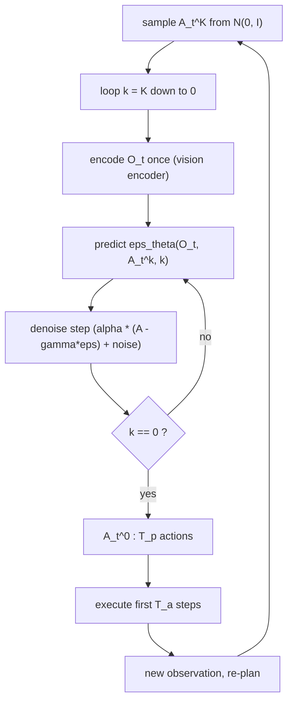

# Diffusion Policy: Visuomotor Policy Learning via Action Diffusion

- 本地 PDF：`papers/architecture/Diffusion_Policy_2303.04137.pdf`
- arXiv：https://arxiv.org/abs/2303.04137 （v5, 2024-03；会议版为 RSS 2023）
- 年份：2023 (RSS 2023)
- 团队：Columbia University（Shuran Song 组）+ Toyota Research Institute + MIT CSAIL
- 阶段：行为克隆策略表示的分水岭工作——把 visuomotor policy 的输出从"一次回归"改成"条件去噪扩散"，此后 VLA 的 action expert 基本都沿用这一表示

## 一句话总结

把机器人策略写成条件 DDPM：以视觉观测 $O_t$ 为条件，从高斯噪声出发迭代去噪出一段长度为 $T_p$ 的动作序列，配合 receding horizon control 只执行前 $T_a$ 步；在 4 个 benchmark 的 15 个任务上平均超过此前 SOTA 46.9%，并且用 score 而非 energy 绕开了 EBM 策略的负采样不稳定问题。

## 核心技术

1. **条件扩散作为策略表示**：不直接回归动作，而是学噪声预测网络 $\epsilon_\theta(O_t, A_t^k, k)$，推理时执行 Langevin 式迭代去噪。可表达任意可归一化的分布，包括多模态动作分布。
2. **Closed-loop action sequence + receding horizon control**：每次推理预测 $T_p$ 步动作、只执行 $T_a$ 步再重新观测重规划（典型配置 $T_p=16$, $T_a=8$, $T_o=2$），兼顾时序一致性与闭环响应。
3. **视觉条件化而非联合建模**：与 Diffusion Planning 对 $(O, A)$ 联合建模不同，本文只对 $p(A_t|O_t)$ 条件建模——视觉特征只编码一次，所有去噪步共享，使实时控制可行并让 vision encoder 可以端到端训练。
4. **两种 backbone**：
   - CNN-based（1D temporal conv + FiLM 注入观测与迭代步）：稳定、几乎免调参，默认首选；
   - Time-series diffusion transformer（minGPT decoder，cross-attention 注入观测 embedding，causal mask）：缓解 temporal conv 偏好低频信号的 over-smoothing，在高频动作变化/速度控制的任务上占优。
5. **DDIM 加速**：训练 100 步去噪、推理降到 10~16 步，RTX 3080 上 0.1s 推理延迟，10Hz 出指令再插值到 125Hz 执行。
6. **位置控制优先**：发现 position-control action space 一致优于 velocity-control，与传统 BC 文献结论相反。

## 底层原理与数学推导

### 1. 去噪即"在能量面上做带噪梯度下降"

DDPM 的单步反向更新写作：

$$
x^{k-1} = \alpha\left(x^k - \gamma\,\epsilon_\theta(x^k, k) + N(0, \sigma^2 I)\right)
$$

把它和一步 noisy gradient descent 对照：

$$
x' = x - \gamma \nabla E(x)
$$

可知 $\epsilon_\theta$ 实际上是在拟合能量函数的梯度场 $\nabla E(x)$，而 $\alpha, \gamma, \sigma$ 随迭代步 $k$ 的调度等价于学习率调度（$\alpha$ 取略小于 1 有助稳定）。这就是为什么扩散策略既保住了 implicit policy 的分布表达力，又不需要显式算 $E$ 本身。

### 2. 训练目标（条件化后的 MSE 去噪损失）

对策略形态只需要两个改动：把 $x$ 换成动作序列 $A_t$，并把去噪过程条件化到观测上。

$$
A_t^{k-1} = \alpha\left(A_t^k - \gamma\,\epsilon_\theta(O_t, A_t^k, k) + N(0, \sigma^2 I)\right)
$$

$$
L = \text{MSE}\left(\epsilon_k,\ \epsilon_\theta(O_t,\ A_0^t + \epsilon_k,\ k)\right)
$$

按 Ho et al. 的结果，最小化该 MSE 同时最小化了数据分布 $p(x^0)$ 与 DDPM 采样分布之间 KL 散度的 variational lower bound——也就是标准的 DDPM evidence bound 简化形式。噪声调度采用 iDDPM 的 squared cosine schedule。

### 3. 为什么比 EBM implicit policy 稳定：score 与配分函数无关

Implicit policy（IBC）用 EBM 表示动作分布：

$$
p_\theta(a|o) = \frac{e^{-E_\theta(o,a)}}{Z(o,\theta)}
$$

其 InfoNCE 损失需要用负样本估计不可积的 $Z(o,\theta)$：

$$
L_{infoNCE} = -\log\left(\frac{e^{-E_\theta(o,a)}}{e^{-E_\theta(o,a)} + \sum_{j=1}^{N_{neg}} e^{-E_\theta(o, e a_j)}}\right)
$$

而扩散策略改为建模同一分布的 score function，配分函数项被梯度消掉：

$$
\nabla_a \log p(a|o) = -\nabla_a E_\theta(a,o) - \underbrace{\nabla_a \log Z(o,\theta)}_{=\,0} \approx -\epsilon_\theta(a,o)
$$

训练和推理都不出现 $Z(o,\theta)$，因此没有负采样偏差带来的 loss 尖峰——这是 Fig. 6 中 IBC 训练曲线震荡、success rate 来回摆动，而 Diffusion Policy 平滑收敛的根因。

### 4. Receding horizon 控制

每个控制周期：输入最近 $T_o$ 步观测 $O_t$，去噪出 $T_p$ 步动作，仅执行前 $T_a$ 步，然后丢弃剩余部分重新观测重规划。这与 MPC 中的 receding horizon control 同构；论文还提到可以用上一次预测的动作序列 warm-start 下一次推理的去噪起点来进一步提升平滑度。选择 $T_a$ 是在两个失败模式之间取中点：$T_a$ 太小退化成单步策略（jitter、无法跨模态承诺），太大则反应迟钝。

### 5. 控制论极限情形（Tp=1 的线性系统）

对线性系统 $s_{t+1} = A s_t + B a_t + w_t$，若示范来自线性反馈策略 $a_t = -K s_t$（如 LQR 解），则当 $T_p = 1$ 时最优 denoiser 为：

$$
\epsilon_\theta(s, a, k) = \frac{1}{\sigma_k}\,[a + K s]
$$

DDIM 采样会收敛到全局极小 $a = -Ks$。而当 $T_p > 1$ 时，最优 denoiser 给出 $a_{t+t'} = -K(A-BK)^{t'} s_t$，说明要完美克隆一个依赖状态的轨迹式行为，学习者必须隐式学到任务相关的 dynamics model。

### 多模态来源与推理流程

多模态的两个来源：(1) 初始噪声 $A_t^K$ 的随机性决定落入哪个吸引盆；(2) 迭代过程中的随机扰动允许样本在盆间移动或最终收敛，因此同一次 rollout 内部会"承诺"一个模式，不会像 BET 那样来回跳模态。

## 物理直觉解释

**像雕塑而不是画直线。** 显式策略是从观测到动作的一条"直线"：看到一个观测就吐一个数，数据里如果有两条合理路径它只能学出两者的平均——把左手绕和右手绕平均成撞向中间。Diffusion Policy 更像一个雕塑家对着一块粗糙的石料（纯噪声）反复雕琢，每刀都问"这里哪个方向更像合法动作"。因为每一刀（去噪步）都是局部修正，最终可以停在任何一块合理的"形状"上，而不是所有形状的平均。

**Receding horizon 像 MPC 开车看远灯。** 只执行 $T_a=8$ 步就重新规划，相当于司机按远光灯预判前方 $T_p=16$ 步的路，但手上方向盘每隔一小段就微调一次。只看一步开车会抖（每帧独立决策、模态乱跳），一口气开 16 步不看路又会撞——action chunking 把"计划的长"和"反馈的快"拆成两个旋钮分开调。此外因为预测的是未来一段绝对位姿，指令本身就带了对处理延迟的容忍：即使晚 4 步才收到第一条动作，那仍是序列里正确的一步，这解释了 latency robustness 到 4 步的现象。

**Score 比 Energy 好 学，像学坡度而不是学海拔图。** Implicit policy 要画出整张海拔图（energy landscape），但归一化常数 $Z$ 相当于"海平面的绝对高度"永远测不准，只能靠抽负样本猜，猜错整张图就扭曲、训练崩。Diffusion Policy 只需要知道"站在任何一点该往哪边下坡"，绝对高度完全不用管（$\nabla \log Z = 0$）。学一个方向场当然比重建一整个标量场容易且稳得多。

**CNN 与 Transformer 的差别是低通滤波器 vs 可编程滤波器。** 时间卷积天然偏好低频信号，遇到需要急停急转的速度控制序列就会把尖峰抹圆；transformer 的 attention mask 则是逐 token 决定看谁，能保留高频突变。代价是 transformer 对 attention dropout、weight decay 这类超参敏感得多。

## 工程细节与实操指南

- **Action normalization 至关重要**：逐维 min-max 缩放到 $[-1, 1]$。DDPM 每次迭代会把预测 clip 在 $[-1,1]$，所以常用的 zero-mean unit-variance 归一化会让部分动作空间永远到达不了。方差极小的维度只做零均值平移、不缩放；旋转相关维度保持不变。
- **旋转表示**：velocity control 沿用 axis-angle（指令接近 0 时奇异性无害）；position control 用 6D rotation representation（Zhou et al. 2019）。
- **Vision encoder**：ResNet-18 不加载预训练权重，global average pooling 换 spatial softmax（保留空间信息）、BatchNorm 换 GroupNorm（与 DDPM 常用的 EMA 配合更稳）。每个相机视角独立 encoder，各时间步独立编码后拼接成 $O_t$，端到端与扩散网络一起训。
- **噪声调度**：squared cosine schedule（iDDPM）。
- **关键超参数（Table 7，CNN 版）**：位置控制；$T_o=2$，$T_a=8$，$T_p=16$；lr $1e{-4}$，weight decay $1e{-6}$；训练 100 步去噪迭代；仿真 eval 也 100 步（iDDPM），真机用 DDIM 降到 16 步；state 任务 batch 256、image 任务 batch 64；cosine lr schedule，CNN warmup 500 step、Transformer 1000 step。模型规模约 256M（diffusion net）+ 22M（vision encoder），Transport 双相机 45M；真机版本 67M。Kitchen 里 transformer 版用到 80M/768 emb dim。
- **实操选型顺序**：新任务先用 CNN-based；性能上不去（任务复杂或高频动作变化）再换 transformer，接受额外调参成本（attention dropout 从 0.01 到 0.3 视任务而定，Kitchen 需要 layer 数加倍）。
- **BlockPush 是例外**：示范来自 Markovian scripted oracle，最优 horizon 完全不同（$T_p=12$、$T_a=1$ 或 3）；human teleop 数据则统一用 8/16。
- **Push-T 上 DiffusionPolicy-C 报告的数字用的是 inpainting-style conditioning 而非 FiLM**——换掉 FiLM 后效果好一档，属于论文自己披露的实现细节。
- **训练时长参考**：real Push-T 每个方法固定训 12 小时取最后一个 checkpoint（IBC 除外，取训练集 MSE 最小的 checkpoint）。
- **数据效率**：在 40 / 60 / 90 / 130 / 200 条示范的每个规模上 Diffusion Policy 都高于 LSTM-GMM（Fig. 15）。

## 消融实验与分析

**视觉 encoder 与训练策略（robomimic Square PH，CNN backbone，500 epochs，成功率）**

| 架构 & 预训练 | from scratch | frozen pretrained | finetuning |
|---|---|---|---|
| ResNet-18 (in21k) | 0.94 | 0.58 | 0.92 |
| ResNet-34 (in21k) | 0.92 | 0.40 | 0.94 |
| ViT-B/16 (CLIP) | 0.22 | 0.70 | 0.98 |

**核心结论**：frozen 预训练特征全面变差（最好也只有 0.70，ResNet-34 甚至掉到 0.40），说明扩散策略需要与通用预训练不同的视觉表征；finetune 小学习率（相对策略网络 10 倍小）最划算——CLIP ViT-B/16 finetune 只训 50 epochs 就到 98% 成功率；ViT from scratch 只有 22%，数据量不足时无法白手起家。

**多阶段长视野任务（状态观测，成功率）**

| 方法 | BlockPush p1 | BlockPush p2 | Kitchen p1 | Kitchen p4 |
|---|---|---|---|---|
| BET | 0.96 | 0.71 | 0.99 | 0.44 |
| DiffusionPolicy-C | 0.36 | 0.11 | 1.00 | 0.99 |
| DiffusionPolicy-T | 0.99 | 0.94 | 1.00 | 0.96 |

**核心结论**：长视野多模态上优势最大——BlockPush p2 提升 32%、Kitchen p4 提升 213%；但 CNN 版在 BlockPush 上反而崩（p1 仅 0.36），只有 transformer 版拿下 0.99，说明 backbone 选择在这类 scripted-oracle 数据上是决定性的。

**仿真整体汇总（Table 1/2/4 平均）**：对每列取 baseline 最优与 Diffusion Policy 两个变体的最优之差算相对提升，$\frac{1}{N}\sum_i improvement_i = 0.46858 \approx 46.9\%$，且每个任务都为正。

**真机 Push-T（136 条示范，IoU / 成功率）**：Human 0.84 / 100%；DiffusionPolicy(E2E, Transformer) 0.80 / 95%（时长 22.9s vs 人类 20.3s）；R3M 版 80% 但抖动且易卡住；ImageNet 版 15%~25%；LSTM-GMM 最好 20%（8/20 卡在 T 块附近）；IBC 最好 0%（6/20 提前离开 T 块）。

**其他单点数字**：action horizon 消融中最优 $T_a=8$；模拟 latency 到 4 步内 success rate 保持峰值；Mug Flip 90%/20 trials；Sauce Pour coverage 0.74 vs 人 0.79，Spread coverage 0.77 vs 人 0.79 且 Pour 成功率 79% / Spread 100%；双臂 Egg Beater 55%（210 demos）、Mat Unrolling 75%（162 demos）、Shirt Folding 75%（284 demos）。

## 技术权衡（Trade-off）

1. **$T_a$ 的大小**：大 → 时序一致、抗 idle action、抗延迟；小 → 反应快。实验上 8 是多数任务的甜点，脚本数据（BlockPush）退到 1。
2. **CNN vs Transformer**：CNN 稳定免调参、参数可无限加大仍受益；Transformer 高频任务强但对 dropout/wd/layer 数极其敏感（加大有时反而变差）。工程上应默认 CNN。
3. **FiLM vs inpainting condition**：FiLM 全任务优，唯 Push-T 例外（报的就是 inpainting 结果）。
4. **表达力 vs 推理成本**：扩散天生要跑 K 步，即便 DDIM 压到 10~16 步仍是 0.1s 级延迟；作者明说对高频率控制任务可能不够，指望 consistency models、更好的 solver 进一步压缩。
5. **端到端视觉 vs 预训练特征**：端到端最强但吃数据；frozen 特征省算力但明显拖后腿；finetune（小 lr）是折中最优。
6. **BC 范式本身的限制继承下来**：数据次优/覆盖不足时照样次优；作者指出可接 RL 微调利用负样本。

## 技术价值与演进定位

这篇工作的贡献不是提出 DDPM，而是证明"策略的结构本身是 BC 的瓶颈"：同样数据，仅换成扩散表示就在全部 15 个任务上超越之前所有方法（平均 46.9%），并且给出了使其能在真机实时跑起来的三件套（receding horizon、视觉条件化、time-series transformer）。它是后续整个 action-diffusion 家族的共同底座：

- π0 / π0.5 等 flow-matching VLA 的 action expert，本质是把这里的 DDPM 换成了更少步数的流匹配；
- 3D Diffusion Policy 把深度点云接进同一个框架；
- ACT 的 action chunking 思想与此处的 chunk + receding horizon 相互印证；
- 大量后续 RL-from-demo 工作（DPPO 等）以 diffusion policy 作为可微调的策略类。

一句话定位：**确立了"动作序列的条件生成模型"作为操纵策略的默认表示**，类似于 ResNet 之于分类 backbone。

## 与其他论文的关系

- **IBC (Florence et al. 2021)** — 同样追求多模态表达的 implicit policy，靠 InfoNCE + 负样本训练，本文用 Table 6 与 Fig. 6 展示其在真机上 0% 成功率和训练震荡，正是扩散改用 score 后绕开的痛点。
- **BET (Shafiullah et al. 2022)** — 把回归离散化为 k-means 分桶 + offset 回归来抓多模态；在 Kitchen/BlockPush 上被 transformer 版大幅超过（p4: 0.44 vs 0.99/0.96），且因逐帧独立预测缺乏时序一致性而无法承诺单一模态。
- **LSTM-GMM / BC-RNN (Robomimic)** — 单步 GMM 显式策略的代表；在 idle action 和阶段切换处失败（真机 Push-T 20 次里 8 次卡住，pour 任务 15/20 无法抬起勺子）。
- **Planning with Diffusion (Janner et al. 2022)** — 对 $(O,A)$ 联合建模做 trajectory planning；本文反其道只建 $p(A|O)$，避免推断未来状态的开销，换来实时性。
- **Decision Diffuser / DiffuserBC（Pearce, Reuss, Hansen-Estruch 等同期工作）** — 并行地在仿真里研究扩散策略的采样策略与 goal-conditioning；本文侧重真机上的 action space、horizon 与延迟设计。
- **ACT (Aloha)** — 另一条得到 action chunking 的路线（CVAE + transformer 回归），与本文的 chunk + 重规划在设计上殊途同归，可作为对照阅读。
- **Robomimic (Mandlekar et al. 2021)** — 本文最主要的评测基准与 baseline 来源；其对多任务人类示范数据的研究直接支撑了"多模态是主要难点"的动机。

## 精读问题

1. **Score 与 energy 的边界在哪里**：论文论证了 $\epsilon_\theta$ 拟合的 score 与 $Z(o,\theta)$ 无关所以稳定，但在什么任务设定下，显式估计 energy（例如为了做 composition 或 constraint reasoning）仍然值得付负采样的代价？
2. **46.9% 这个数怎么读**：附录 B.2 显示这是"每个任务列的 baseline 最大值 vs 我方两变体最大值"的相对提升均值，checkpoint 还用 max 口径报告过（同时给出 last-10 average）——这种口径会比严格 protocol 抬高多少？换 last-10 口径后优势还剩多少？
3. **Position control 为什么赢**：论文给出两条推测（位置空间的多模态更弱、累积误差更小），如何在没有 reward 的 BC 设定下设计实验区分这两个机制？
4. **隐式 dynamics model 的证据**：Sec 4.5 说明 $T_p>1$ 时最优 denoiser 必须隐式学到 $(A-BK)^{t'}$，能否在非线性真实任务上设计探针实验验证网络确实学了某种 task-relevant dynamics？
5. **backbone 失效模式的成因**：CNN 版在 BlockPush(scripted oracle) 上崩到 0.36 而 transformer 版 0.99，这是卷积低频偏置、Markovian 数据的分布特性，还是超参未调到位？如何用一组受控实验隔离？
