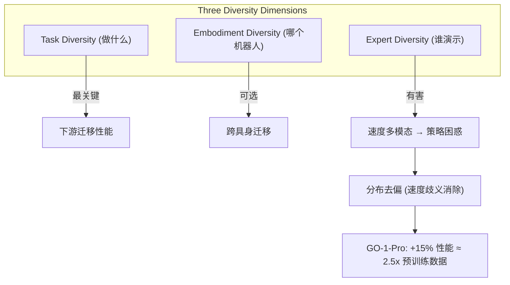

# Is Diversity All You Need for Scalable Robotic Manipulation?

- 本地 PDF：`papers/architecture/DiversityAllYouNeed_2507.06219.pdf`
- arXiv：https://arxiv.org/abs/2507.06219
- 代码：https://github.com/OpenDriveLab/AgiBot-World
- 年份：2025
- 团队：OpenDriveLab (HKU) + 上海 AI Lab（Shi Modi, Hongyang Li 等）— AgiBot-World 团队
- 阶段：数据多样性系统性研究 — 挑战"越多样越好"的直觉

## 一句话总结

论文系统性研究机器人操作预训练中"数据多样性"的三种维度——任务（做什么）、具身（哪个机器人）、专家（谁演示）——并挑战"多样性越多越好"的主流直觉。核心发现：(1) **任务多样性 > 每任务示范数量**，(2) **多具身预训练数据是可选的**——高质量单具身数据跨具身迁移效率更高、微调扩展性更好，(3) **专家多样性反而有害**——人类演示中的速度多模态（不同操作者的偏好差异）会混淆策略学习。提出分布去偏方法消除速度歧义，得到 GO-1-Pro，性能提升 ~15%，等价于 2.5× 预训练数据。

## 核心技术

1. **三维度多样性分解** — 将数据多样性拆为 task / embodiment / expert 三个正交维度，分别消融
2. **任务多样性 vs 每任务数量** — 多样任务上预训练 → 对未见下游场景迁移收益最大；单一任务的示范数量边际收益递减
3. **单具身 vs 多具身预训练** — 高质量单具身数据预训练的模型在跨具身迁移时效率更高、微调 scaling 更好——多具身数据"锦上添花但非必需"
4. **专家多样性 = 混淆源** — 不同操作者的速度偏好 + 演示随机性导致动作速度分布多模态，策略在"学谁的速度"上困惑
5. **分布去偏 (Distribution Debiasing)** — 消除速度歧义的训练方法 → GO-1-Pro

## 底层原理与数学推导

**速度多模态问题**：同一任务、同一机器人，不同操作者演示的速度分布不同——有人快、有人慢，甚至同一个人不同次演示速度也不同。行为克隆策略在拟合这些多模态速度分布时被迫取"折中速度"，导致动作模糊（velocity multimodality）。

**分布去偏思路**：显式建模/去除速度维度的分布歧义——将速度信息从策略学习的核心目标中解耦（类似 MINT 的频域意图-执行解耦思路）。

## 物理直觉解释

这篇论文的核心洞察可以类比为：**"见过 100 种不同的杯子"比"100 个不同的杯子的照片"更能帮你识别新杯子**——任务多样性提供的是"语义概念"的覆盖，而单任务示范数量只是"同一概念的重复曝光"。

最反直觉的是专家多样性：**不同的人教同样的动作，反而把学生教糊涂了**。就像三个人用不同速度教同一首歌——一个慢、一个快、一个忽快忽慢——学生不知道该学哪个节奏。机器人演示数据里的"速度多模态"就是这个道理：动作轨迹的"形"一样，但"速度"不同，策略在速度维度上陷入平均化困境。

## 工程细节与实操指南

- **数据集**：AgiBot-World (OpenDriveLab 发布的大规模人形/移动操作数据集)
- **三组受控实验**：分别固定其他两维、只变一维，隔离单一多样性因子的因果贡献
- **GO-1-Pro**：在 GO-1 模型基础上应用分布去偏训练
- **评估**：下游任务迁移成功率 + 微调 scaling 曲线

## 消融实验与分析

| 消融维度 | 关键发现 | 定量结果 |
|---------|---------|---------|
| 任务多样性 vs 每任务示范数 | 任务多样性是迁移的关键，示范数边际递减 | 多样任务预训练 → 下游迁移最优 |
| 单具身 vs 多具身预训练 | 高质量单具身数据效率更高 | 跨具身迁移 + 微调 scaling 均更优 |
| 有/无 专家多样性 | 专家多样性混淆策略 | 速度多模态导致成功率下降 |
| GO-1-Pro vs GO-1 | 分布去偏提升性能 | **+15% ≈ 2.5× 预训练数据** |

**核心结论**：数据质量（多样性结构）比数据规模更重要——精心设计的任务多样性分布 + 干净的单具身数据 + 去偏的速度分布，等价于 2.5× 的原始数据规模。这直接反驳了"越大越好"的 naive scaling 直觉。

## 技术权衡（Trade-off）

| 优势 | 劣势与工程代价 |
|------|----------------|
| 系统性消融给出可操作的"多样性配方" | 结论基于 AgiBot-World 单数据集，跨数据集普适性待验证 |
| 发现专家多样性有害 → 可直接指导数据筛选 | 分布去偏方法的具体机制论文细节有限（待确认） |
| 单具身高质数据即可 → 降低数据采集成本 | "多具身可选"结论可能不适用于极端异质具身（如手臂 vs 人形） |

## 技术价值与演进定位

这篇论文是 2025-2026 年"数据工程"路线的重要一环——和 LingBot-VLA 2.0 的 DataQA 数据清洗、π0.5 的异构数据 co-training 形成对话。它给出了一个反直觉的数据配方：**不是把所有数据堆进去，而是精心控制任务/具身/专家三个维度的多样性结构**。这直接影响了后续数据采集策略（GO-1-Pro 成为 AgiBot-World 系列的基线）。

## 与其他论文的关系

- **LingBot-VLA 2.0 (2026)** — 用 DataQA 清洗 60K 小时数据；本篇提供"什么数据值得清洗"的维度框架
- **π0.5 (2025)** — 97.6% 非目标数据 co-training 主张"数据多样性 > 规模"；本篇进一步拆解"哪种多样性"
- **GO-1 / AgiBot-World** — 本篇的基座模型和数据集（同团队）
- **MINT (RSS 2026)** — 频域意图-执行解耦，与本篇的速度去偏思路在"解耦多模态"上有共通点

## 精读问题

1. 速度多模态的定量特征——不同操作者的速度分布差异有多大？去偏后保留哪个"速度"？
2. 分布去偏的具体机制——是显式速度建模、条件化还是数据筛选？与 MINT 的频域解耦有何异同？
3. "多具身可选"结论在哪些边界条件下失效？（极端异质具身、移动操作 vs 桌面操作？）
4. 任务多样性的最优结构——是均匀覆盖还是按任务难度/相似度加权？
