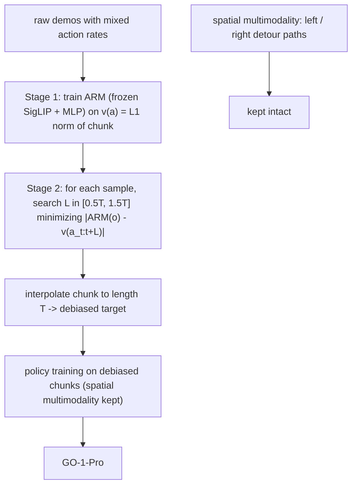

# Is Diversity All You Need for Scalable Robotic Manipulation?

- 本地 PDF：`papers/architecture/DiversityAllYouNeed_2507.06219.pdf`
- arXiv：https://arxiv.org/abs/2507.06219 （本地 PDF 为 v2, 2026-06-04, IEEE T-RO 格式；v1 为 2025-07）
- 代码：https://github.com/OpenDriveLab/AgiBot-World
- 年份：2025 (arXiv v1)；本 PDF 为 v2 投稿版
- 团队：HKU（Hongyang Li 组）+ Beihang + Shanghai Innovation Institute + AgiBot（智元）
- 阶段：在 AgiBot World 百万级单一本体数据上系统拆解"数据多样性"三维度（任务/具身/专家）的受控实验报告，结论是三种多样性的价值方向并不一致——一个有益、一个非必需、一个有害

## 一句话总结

用同规模不同采样方式构造的预训练集做受控对比，发现：任务多样性里**场景多样性比技能多样性更能带来分布偏移下的鲁棒性**（GO-1 上 10% episode 采样平均分 0.46 vs task 采样 0.36 vs scenario 采样 0.33，且幂律拟合 $y = 1.24x^{-0.08}$、Pearson $r=-0.99$）；跨本体迁移不要求预训练数据见过目标本体（单本体的 RDT-AWB 在 ManiSkill/RoboTwin/真机 Agilex 上随微调数据增加反超见过目标本体的 RDT-OXE）；专家多样性里的**动作速率多模态是干扰项**，用 ARM 做分布去偏后 GO-1-Pro 平均提升 15%（0.46→0.53），等价于 2.5 倍预训练数据。

## 核心技术

1. **三维度受控分解**：task（做什么）/ embodiment（哪台机器人）/ expert（谁演示），每次只动一维、其他条件对齐（同数据量、同模型、同评测协议），并同时在 GO-1 与 RDT 两个架构上复验（附录 Fig. 16/17，结论跨架构一致）。
2. **三种采样策略解耦任务多样性**：scenario-based（只采 10% 场景 → 场景多样性低）、task-based（挑与目标任务最相关的 10% 任务 → 技能多样性低但场景覆盖广）、episode-based（每任务随机采 10% episodes → 技能与场景多样性都保留）。关键对照点：episode 集里属于目标任务原子技能的 episodes 占比反而更低（59.2% vs 71.1%）。
3. **单本体预训练 vs 多本体预训练（RDT-OXE vs RDT-AWB）**：OXE 训练集里包含评测本体（Franka、双臂），存在"本体对齐先验"优势，作者明确说明这一对比对 OXE 不公平、而 AWB 仍能在数据量大时反超。
4. **Action Rate Model（ARM）分布去偏**：SigLIP（冻结）+ 三层 MLP 回归"该观测下的期望动作速率"，训练时据此把每个样本的动作块重采样到统一速率，消除速率维度多模态但保留空间多模态（左右绕行这类策略差异不动）。
5. **GO-1-Pro**：在预训练与微调两阶段一致应用去偏的 GO-1。

## 底层原理与数学推导

### 1. 为什么速率多模态是"噪声"而空间多模态是"信号"

行为克隆的监督目标是给定观测下的动作块分布。把演示轨迹写成状态 $\{s_t\}$、观测 $\{o_t\}$、动作 $\{\alpha_t\}$ 的序列，策略在时刻 $t$ 预测长度 $T$ 的 action chunk $\alpha_{t:t+T-1}$。同一空间轨迹 A→D 在不同操作者手里变成同一时间窗内内容完全不同的 chunk（$A \to B$ vs $A \to B \to C \to D$）——对模型来说这是同一输入对应两个不兼容的回归目标，损失面上出现非策略原因的多模态；而"从左绕还是从右绕"这类空间多模态对应的是真实可选策略，删掉任何一个都是信息损失。Diffusion Policy 一类模型能表达这种多模态，但表达不等于该多模态值得被表达。

### 2. ARM 的训练与使用

ARM 以 MSE 学"给定观测的期望动作速率"：

$$
\mathcal{L}_{ARM} = \mathbb{E}_{(o_t, a_{t:t+T}) \sim D}\left[\big\lVert ARM(o_t) - v(a_{t:t+T}) \big\rVert_2^2\right]
$$

速率度量定义在末端执行器动作上（先逐维归一到 $[-1,1]$）：

$$
v(a_{t:t+T}) = \big\lVert a^{eef}_{t:t+T} \big\rVert_1
$$

即 chunk 内 L1 位移总量。训练策略时，对每个样本搜索最优 chunk 长度：

$$
L = \arg\min_{L} \left| ARM(o_t) - v(a_{t:t+L}) \right|
$$

搜索范围限制在 $[0.5T, 1.5T]$ 以抑制 ARM 预测误差的干扰，然后把 $a_{t:t+L}$ 插值回长度 $T$ 得到去偏目标 $\tilde{a}_{t:t+T}$。直观上这是给每条演示配一个"由视觉上下文决定的节拍器"，把快手和慢手的演示拉回同一条时间轴。SigLIP 编码器全程冻结，防止 ARM 记住训练样本的细粒度外观而学不到"平均节奏"。

### 3. 幂律 scaling 的形式

在任务多样性充分的前提下，预训练数据量 $X$ 与 optimality gap $Y = 1 - \text{Normalized Score}$ 满足

$$
Y = \beta \cdot X^{\alpha}, \qquad \hat{Y} = 1.24 X^{-0.08}, \quad r = -0.99
$$

微调阶段同样成立且指数反映去偏收益：Wipe Table 上 GO-1-Pro 的拟合指数 $-1.01$ 对 GO-1 的 $-0.67$（去偏让数据边际收益更陡），Make Sandwich 上两者指数接近（$-0.38$ vs $-0.36$）但 Pro 全程保持更低的 gap——说明去偏的收益是"常数偏移 + 收敛加速"两种形态。

### 数据流

## 物理直觉解释

**场景多样性是"换考场"，技能多样性是"换题型"。** task-based 采样像一个只练目标题型但换着教室练的学生，episode 采样像什么都练一点、每道题还在不同教室练。in-domain 时两者差距不大（GO-1 上 +0.10 左右），可一旦考场变了（视觉干扰、换物体换环境），"见过多种教室"的优势立刻拉开（+0.13 vs +0.08~0.09）。机器人策略对光照、背景、物体位置这类低层视觉扰动的敏感度，远高于对"任务语义相近程度"的敏感度——所以同一任务在 100 个厨房里采，比 100 个相关任务在 1 个厨房里采更保值。

**速率多模态像合唱团里每个人按自己的节拍唱同一旋律。** 空间多模态是不同人走了不同路线，这是真的两种方案；速率多模态是大家走同一条路线但有人快有人慢。对逐帧回归的策略来说，"同一画面"对应两个互相矛盾的下一步指令——模型只能学出一个折中速度，于是动作变得犹豫。注意这个"折中"不是扩散模型不会表达多模态，而是这个多模态本身不携带任务信息，纯粹是采集者个人习惯的指纹。

**单本体预训练像只读一位作家的全集再去读别的作家。** 直觉上"读得杂才能融会贯通"，但实验里只读过 AgiBot G1 这一"作家"的模型，微调少量数据后反而在 Franka/Arx/Cobot Magic 这些"别家作家"上超过读过全集的 OXE 模型（ManiSkill 1000 demos：0.58 vs 0.50）。原因可能是单本体数据的动作分布、相机几何、时序节奏高度一致，模型学到的更多是"操作本身的物理"而不是"某台机器人的习惯"；多本体混合数据里每个本体的习惯都要模型额外花容量去对齐。

**去偏的收益在低数据区最大。** 15 条微调演示时 Make Sandwich 从 0.35 升到 0.52：样本越少，每个样本里混入的噪声相对权重越大，清理分布的杠杆就越明显——数据清洗本质上是在"低数据区买性能"。

## 工程细节与实操指南

- **模型与数据底座**：策略用 GO-1（AgiBot World 团队自家的 latent-action VLA）与 RDT-1B；数据用 AgiBot World Beta（百万级双臂轨迹、单一 AgiBot G1 本体、统一相机配置：1 头部 + 2 腕部）。
- **真机评测协议**：4 个任务（Wipe Table 接触丰富擦拭 / Fold Shorts 双臂变形物折叠 / Pour Water 精细倒水 / Make Sandwich 长视野装配），每任务 3 个场景（in-domain、视觉干扰、物体-环境泛化）× 10 次 trial，带位置扰动、恒定室内光照；分数按动作步骤打 1 / 0.5 / 0 后取均值。评分员盲评（不知道在被评哪个策略）、3 名独立评分员且每人负责一个任务、评分标准由评分员本人制定。
- **预训练算力**：10% 数据 32 张 H100、batch 64/GPU、100K 步；25% 数据同硬件 250K 步；全量 96 张 H100、500K 步；预训练时 VLM 部分参与训练。微调 8 卡、batch 128、20K 步、冻结 VLM。
- **跨本体实验配置**：RDT-AWB 在 AgiBot World 上预训练（96 H100、batch 32、200K 步），RDT-OXE 用官方 checkpoint（48 H100、1M 步）。ManiSkill 5 任务（Franka，单第三人称视角）按 125/250/500/1000 演示每任务分别微调 37.5K/75K/150K/300K 步；RoboTwin 4 任务（Arx，四视角）按 25/50/100/200 演示微调 10K/30K/50K/60K 步；真机 Agilex Cobot Magic 5 任务、100 演示每任务（Fold Shorts 200）、100K 步。仿真任务每格 25 rollouts × 10 seeds。
- **ARM 实现**：SigLIP（冻结）+ 三层 MLP（LayerNorm、GELU、dropout 0.1），三路图像输入，输出标量速率并 min-max 归一到 [0,1]；微调实验 8 H100、20K 步，预训练实验 100K 步。
- **部署侧注意**：速率插值要求高精度跟踪控制器；低精度硬件可改用"预测实际到达位姿而非指令位姿"（引 SAIL 的做法），把策略学习与采集控制器的缺陷解耦。
- **明确的适用边界（作者自述）**：去偏不能用于速率本身承载任务信息的动态任务（如乒乓球）；无意义停顿、导致死循环的次优行为等其他专家噪声仍未处理。

## 消融实验与分析

**分布去偏的施加阶段（10% episode 采样预训练 + 微调，任务完成分）**

| 预训练数据 | 微调数据 | Pour Water | Fold Shorts | Make Sandwich | Wipe Table | 平均 |
|---|---|---|---|---|---|---|
| Biased | Biased | 0.20±0.02 | 0.30±0.03 | 0.67±0.04 | 0.66±0.04 | 0.46±0.04 |
| Debiased | Biased | 0.27±0.02 | 0.30±0.02 | 0.71±0.03 | 0.68±0.04 | 0.49±0.03 |
| Biased | Debiased | 0.26±0.02 | 0.33±0.03 | 0.73±0.02 | 0.69±0.04 | 0.50±0.03 |
| Debiased | Debiased | 0.32±0.03 | 0.37±0.04 | 0.73±0.04 | 0.70±0.03 | 0.53±0.03 |

**核心结论**：只去偏预训练 +6.5%（0.46→0.49）、只去偏微调 +8.7%、两阶段一致去偏 +15%（0.46→0.53，p<0.05），其中操作密集的 Pour Water 提升最大（+60%，0.20→0.32）；单侧去偏会制造预训练-微调分布失配，因此"两头都干净"才拿到全收益；该 15% 的增益在量级上等于把预训练数据扩到 2.5 倍（Fig. 4 的 scaling 曲线内插）。全量数据复验同趋势（0.58→0.64）。

**任务多样性三采样策略（10% 数据量，GO-1 真机平均分）**：scenario 0.33 / task 0.36 / episode 0.46；分布偏移下 episode 相对 scenario 高 0.13、相对 task 高 0.09（视觉干扰）与 0.13 / 0.08（物体-环境泛化）。RDT 上复现：0.20 / 0.23 / 0.31，偏移下 +0.12 vs +0.07、+0.13 vs +0.06——结论跨架构成立。

**跨本体迁移（ManiSkill 平均成功率，每任务演示数 → 分数）**：125 条时 OXE 0.22 vs AWB 0.21（OXE 略优）；250 条追平（0.31 vs 0.32）；1000 条 AWB 反超（0.58 vs 0.50），且单项上 PegInsertionSide 0.12 vs 0.04、PickCube 0.86 vs 0.76、StackCube 0.90 vs 0.66。真机 Agilex（5 任务平均分）AWB 0.43±0.04 vs OXE 0.38±0.03，5 项中 4 项占优（唯 Fold Shorts 0.48 vs 0.65 落后）。

**数据 scaling**：GO-1 预训练从无 → 100K → 250K → 1M 演示，平均分 0.28 → 0.47 → 0.53 → 0.58，幂律拟合 $y = 1.24x^{-0.08}$、$r = -0.99$。

## 技术权衡（Trade-off）

1. **场景多样性 vs 技能多样性**：偏移鲁棒性靠场景，域内精度两者相近——采集预算应优先铺场景而不是堆相关任务。
2. **单本体数据质量 vs 多本体覆盖**：单本体一致性好、采集与训练简单、迁移不必然吃亏；代价是早期微调效率略低（少样本区间 OXE 占优），且结论建立在 AgiBot G1 数据量百万级这一前提上，小规模单本体数据是否仍成立未验证。
3. **去偏收益 vs 适用范围**：操作密集任务受益最大（Pour Water +60%），动态任务（速率即信息）完全不适用；且要求控制器能跟得上改变后的动力学。
4. **分布干净 vs 数据规模**：15% 去偏收益 ≈ 2.5 倍数据，但当幂律已经把规模收益定为 $x^{-0.08}$ 的慢变量时，"清洗"与"扩量"最终会交汇——清洗买的是曲线的截距，规模买的是斜率。
5. **评测严谨性 vs 成本**：盲评 + 单一评分员负责单任务 + 步骤级 rubric 可信，但每格 10 trials 的样本量对 0.03 量级的差异仍偏紧（论文用 p<0.05 与标准误缓解）。

## 技术价值与演进定位

这篇报告的价值在于把"数据多样性"从一个被当作公理的口号拆成三个可以分别检验的变量，并给出方向相反的三个答案：任务（尤其是场景）多样性有益且有可预测的幂律、具身多样性非必需、专家多样性中的速率成分有害。它把 Lin et al. (ICLR 2025) 的"物体/环境多样性幂律"推进到预训练阶段与更细的分解，也第一次把"演示者习惯"作为数据分布的一等公民来度量与修正（ARM 是一个极简、可复用的工具）。对本库的意义：与 FP3 的"8 环境 × 8 物体 × 10 条"采集协议、OpenVLA"去掉 DROID 反而变好"的观察、以及各家 VLA 的数据配比实践串起来读，能构成一份"什么样的机器人数据值得收"的操作手册。

## 与其他论文的关系

- **Lin et al., Data Scaling Laws in Imitation Learning (ICLR 2025)** — 直接前驱与对照：确立了物体/环境多样性与性能的幂律，本篇把分析推进到预训练阶段、拆出场景 vs 技能两个成分，并引用其幂律形式拟合 $y=1.24x^{-0.08}$。
- **OpenVLA (CoRL 2024)** — "more is better" 的反例来源：OpenVLA 论文里去掉 DROID 数据反而涨点，是本篇质疑"无脑堆料"的动机证据之一。
- **Diffusion Policy (RSS 2023)** — 空间多模态概念的出处（Push-T 左右绕行例子即沿用其 Fig. 3）；本篇在其基础上区分"值得表达的空间多模态"与"不该表达的速率多模态"。
- **RDT-1B (ICLR 2025) / OXE** — 跨本体实验的两个臂：RDT-OXE 代表"预训练见过目标本体"的社区最强开源基线，RDT-AWB 是本篇的单本体对照；结论直接挑战"预训练必须含目标本体"的通行假设。
- **GO-1 / AgiBot World Colosseo** — 本篇的底座模型与数据集（同一团队），GO-1-Pro 是其去偏版本，已构成 AgiBot 系列的改良基线。
- **DemoSpeedup (CoRL 2025) / SAIL (CoRL 2025)** — 并发的演示变速工作：分别从加速演示执行与"预测实际位姿"角度处理速率问题，本篇在控制器精度不足时直接借用了 SAIL 的策略。
- **Saxena et al., What Matters in Large-Scale Datasets (ICLR 2025) / ReMix (CoRL 2024)** — 同属"数据该收什么"的研究线：前者找采集与检索的关键维度，后者用 group DRO 自动配比混合数据；本篇补充了"专家维度"这块两者都没碰的拼图。

## 精读问题

1. **速率多模态的来源分解**：操作者间差异与同一操作者的随机波动各占多少？ARM 冻结 SigLIP 是为了防记住外观，但如果速率其实与场景强相关（精细插销必须慢、倒水必须停顿），把速率回归到"观测条件的期望值"会不会把任务需要的速率信息一起抹掉？论文用"限制搜索范围 [0.5T, 1.5T]"缓解，这个界足够吗？
2. **"多本体非必需"的边界**：RDT-AWB 的反超出现在 250+ 演示之后，在 10-50 演示的超低数据区会怎样？结论是否只在"预训练数据量足够大到覆盖操作物理"时成立？
3. **幂律的外推有效性**：$x^{-0.08}$ 是在 0 到 1M 演示内拟合的，外推到 10M 意味着再要 8 倍数据才换来不到 20% 的 gap 缩减——这个斜率是 AgiBot World 的任务分布决定的还是 Manipulation 的普遍性质？
4. **评测协议的效力**：每格 10 trials、三名评分员分别负责不同任务，跨任务的分数可比性如何保证？0.03-0.05 量级的差异在 10 trials 下的检验力是否足以支撑"一致优于"的表述？
5. **专家噪声的完整清单**：速率之外的"无意义停顿""死循环次优行为"被点名但未处理——它们能否也用类似 ARM 的条件模型检测并过滤？与用 VLM 打分的数据清洗（如 DataQA 类方法）相比哪种更可控？
