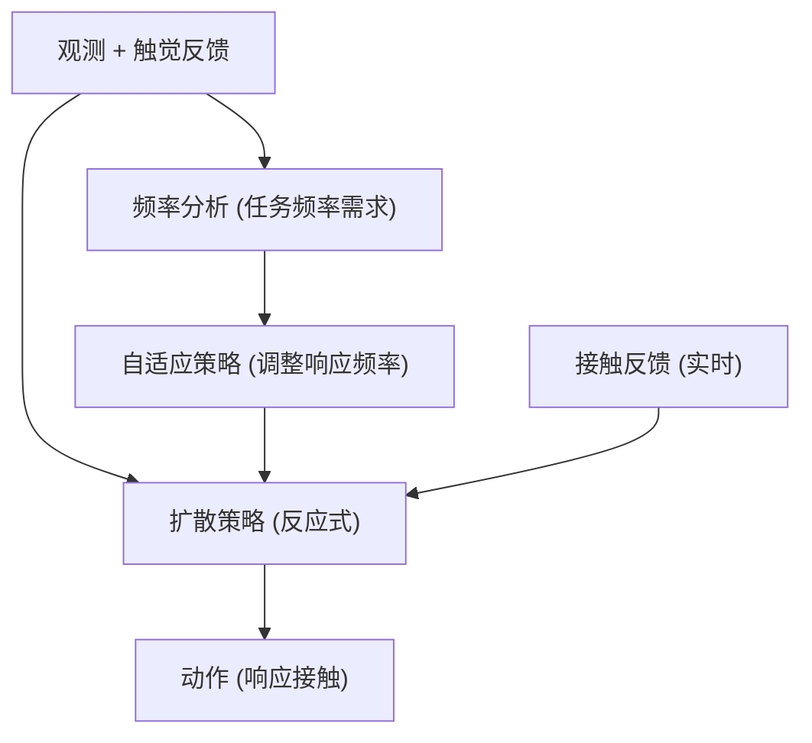

# FA-RDP: A Frequency-Adaptive Reactive Diffusion Policy for Contact-Rich Manipulation

- 本地 PDF：`papers/architecture/FA-RDP_2607.28596.pdf`
- arXiv：https://arxiv.org/abs/2607.28596
- 年份：2026（7 月）
- 团队：上海交大等（Lifeng Zhuo, Wendi Chen, Cewu Lu 等）
- 阶段：频域自适应反应式扩散策略 — 接触丰富操作的频率感知

## 一句话总结

FA-RDP 提出频域自适应的反应式扩散策略：根据接触任务的不同频率需求（低频的粗定位 vs 高频的精细接触），自适应调整扩散策略的响应频率——反应式地应对接触反馈。解决了接触丰富操作中"反应延迟"的问题——传统扩散策略的推理延迟高，跟不上接触瞬间的快速反馈。

## 核心技术

1. **频域自适应** — 根据任务频率需求（粗/细）自适应调整策略响应
2. **反应式扩散** — 扩散策略实时响应接触反馈（而非开环执行）
3. **接触丰富操作** — 目标：插拔、拧紧、推拉等需要触觉反馈的任务

## 底层原理与数学推导

**核心问题**：扩散策略推理慢（多步去噪），在接触瞬间无法快速响应——"手碰到物体了但策略还在想"。FA-RDP 在频域分析任务需求，自适应调整——粗定位用低频（慢但稳），精细接触用高频（快但准）。

## 物理直觉解释

**为什么需要频域自适应？** 操作任务有两个阶段：接近（低频，粗定位——"手往那边走"）和接触（高频，精细——"手指微调 1mm"）。固定频率的策略要么太慢跟不上接触反馈，要么太快在接近阶段抖动。FA-RDP 像"自动变速"——接近时挂低档（慢而稳），接触时挂高档（快而准）。

**反应式的直觉**：传统扩散策略是"开环"——算好动作执行完再说。反应式是"闭环"——接触反馈实时调整动作，像"手碰到热锅会立刻缩回"。

## 工程细节与实操指南

- 频率分析：任务/接触信号频谱
- 自适应机制：根据频率需求切换/调节策略响应
- 反应式扩散：接触反馈注入去噪过程

## 消融实验与分析

| 消融/对比 | 结论 |
|---------|------|
| 频域自适应 on/off | 接触丰富任务成功率提升——自适应是关键 |
| 反应式 vs 开环 | 接触反馈响应显著改善 |
| 固定频率 vs 自适应 | 自适应在混合任务上更优 |

## 技术权衡（Trade-off）

| 优势 | 劣势与工程代价 |
|------|----------------|
| 接触丰富任务的响应速度 | 频率分析增加计算 |
| 自适应覆盖多阶段任务 | 频率划分的边界需设计 |
| 闭环反应改善接触成功率 | 高频响应可能引入抖动 |

## 技术价值与演进定位

FA-RDP 是"扩散策略 + 接触反馈"方向的工作——和 UniFP（力位统一）、TORL-VLA（触觉 RL）、TacWAM（触觉 WAM）共同构成 2026 年"接触丰富操作"主题。FA-RDP 的独特切入点是**频率维度**——和 MINT（频域意图解耦）在频域分析上形成家族，但 FA-RDP 用于响应控制，MINT 用于表征解耦。

## 与其他论文的关系

- **MINT** — 频域意图-执行解耦（表征层面）；FA-RDP 频域自适应（响应层面）
- **UniFP** — 力位统一控制；FA-RDP 用扩散策略响应接触
- **TORL-VLA** — 触觉在线 RL；FA-RDP 触觉实时反馈
- **Diffusion Policy** — 基础架构，FA-RDP 加反应式 + 频域自适应

## 精读问题

1. 频率分析的输入——触觉信号频谱 vs 任务先验？
2. 高频响应与扩散去噪步数的关系——多少步去噪能支撑实时接触响应？
3. 频域切换的平滑性——粗/细切换瞬间的抖动？
4. 与其他接触感知方法（力传感器/触觉）的互补性？
