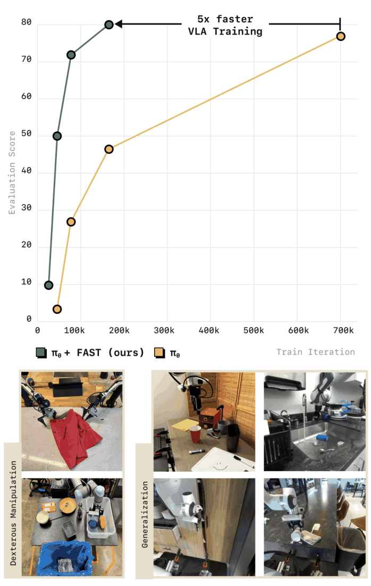

# FAST Tokenizer: Frequency-domain Action Sequence Tokenization

- 本地 PDF：`papers/architecture/FAST_Tokenizer_2501.09747.pdf`
- arXiv：https://arxiv.org/abs/2501.09747
- 年份：2025
- 阶段：频域压缩突破，解决超长任务的时序灾难

## 一句话总结

FAST Tokenizer 通过离散余弦变换（DCT）将机器人动作轨迹从时域压缩到频域，保留前 10% 的低频系数即可覆盖 95% 以上能量，将序列长度缩短 80%，从根本上解决了 Transformer 处理长时序任务时的注意力计算复杂度平方级增长问题。

## 九问速览

1. **Problem**：均匀分箱 token 化在高频动作数据上失效——动作 chunk 相邻 token 高度相关，自回归模型学会「复读」
2. **Bottleneck**：高频控制下预测下一 token 的损失被「复制上一动作」主导（Fig.3 合成实验），模型在高频任务上无法训练
3. **Insight**：机器人动作能量集中在低频——DCT 频域截断 + BPE 无损压缩可把动作 chunk 压成少量高信息 token
4. **Method**：归一化 chunk→DCT→量化→BPE（词表 1024）压成密集 token；FAST+ 用 1M 真机轨迹训练通用 tokenizer
5. **Evidence**：π0-FAST 匹敌扩散 π0（含洗衣折叠）且训练 GPU 时少 5 倍；naive token 在 20-50Hz 任务上完全无法进展
6. **Ablation**：去 BPE 掉点（仍胜 naive，重复 0-token 稀释学习信号）；FSQ 对照更优更简单；FAST+≈数据集专用 tokenizer
7. **Assumption**：自回归 next-token 骨干；动作信号低频主导；能接受自回归推理比扩散慢
8. **Failure**：推理慢——每 chunk 约 750ms（30-60 token 走 2B 骨干）vs 扩散 π0 的 100ms@4090；高频突变动作压缩失真
9. **Opportunity**：speculative decoding/量化加速推理；自回归 VLA 语言跟随更好的机理（论文留作 future work）

| 维度 | 论文答案 |
|---|---|
| Perception | 沿用 π0/OpenVLA 的多路 RGB+语言输入；FAST 只替换动作输出侧 token 化 |
| Closed-loop | 闭环：预测 1 秒动作 chunk 执行后再重观测（与 π0 执行协议相同） |
| Correction | 无显式 retry；DROID 零样本中失败 trial 仍显示合理行为（如接近把手） |
| Deployment | DROID 训练的策略零样本跨 3 所大学校区评测；可扩展到 10k 小时数据训练 |

## 核心技术

1. **离散余弦变换（Discrete Cosine Transform, DCT）** — 将时域动作序列变换到频域，能量高度集中在前 10% 的低频系数

*论文 Figure 1（p1）：Fig. 1: We propose FAST, a simple yet effective approach*

2. **字节对编码（Byte-Pair Encoding, BPE）** — 对截断后的低频系数进行量化建库，转化为离散 Token
3. **时域-频域信号压缩** — 利用机器人高频动作信号的冗余度，在几乎不损失信息的前提下大幅缩短序列长度

## 底层原理与数学推导

FAST Tokenizer 的核心突破是解决了长时序任务中，Transformer 注意力计算复杂度随序列长度呈平方级增长的"时序灾难"问题。机器人的高频动作信号冗余度极高，连续几十帧的匀速移动、甚至静止，其能量高度集中在低频段，通过频域压缩，可以在几乎不损失信息的前提下，将序列长度缩短 80% 以上，大幅提升训练效率与长程任务成功率。

1. **一维 DCT 变换核心公式**

   对长度为 $N$ 的时域动作轨迹序列 $x_n$（$n=0,1,...,N-1$），进行一维 DCT 变换，将其从时域转换到频域，得到频域系数 $X_k$：

   $$
   X_k = c_k \sqrt{\frac{2}{N}} \sum_{n=0}^{N-1} x_n \cos \left( \frac{\pi k (2n+1)}{2N} \right)
   $$

   其中，归一化系数 $c_k$ 定义为：

   $$
   c_k =
   \begin{cases}
   \frac{1}{\sqrt{2}}, & k=0 \
   1, & k>0
   \end{cases}
   $$

   频域系数 $X_k$ 中，$k$ 越小对应频率越低，包含了轨迹的核心运动信息；$k$ 越大对应频率越高，主要是噪声与高频抖动，能量占比极低。

   **DCT 数学推导说明**：DCT 是傅里叶变换的实数等价形式。相比于 DFT（离散傅里叶变换），DCT 在边界处满足偶对称延拓，因此频谱能量更加集中，更适合压缩任务。具体地，一维 DCT 将时域序列 $x_n$ 表示为余弦基函数 $\cos(\pi k (2n+1)/(2N))$ 的线性组合，基函数频率随 $k$ 增大而增高。$\cos$ 核函数中的 $(2n+1)$ 项保证在边界 $n=-1/2$ 和 $n=N-1/2$ 处满足偶对称，从而消除傅里叶变换中因边界不连续导致的频谱泄漏，使能量更集中。

2. **频域压缩与 BPE 量化**

   机器人动作信号的 95% 以上能量集中在前 10% 的低频系数中，因此可以截断高频系数，仅保留前 $M$ 个低频系数，实现近似无损压缩。

   **能量集中度证明**：令总能量 $E_{\text{total}} = \sum_{k=0}^{N-1} X_k^2$，低频能量 $E_{\text{low}} = \sum_{k=0}^{M-1} X_k^2$。实测表明 $E_{\text{low}} / E_{\text{total}} > 0.95$ 当 $M = N/10$。

   工业最佳实践：对长度 $N=50$ 的时域动作序列，仅保留前 $M=10$ 个低频系数，即可覆盖 95% 以上的能量，序列长度直接缩短 80%。最后通过 BPE 算法，对截断后的低频系数进行量化建库，转化为离散 Token，输入 Transformer 进行训练。

3. **逆 DCT 变换（推理还原）**

   推理阶段，模型输出低频系数 $\hat{X}_k$（$k=0,1,...,M-1$），通过逆 DCT 变换还原为时域动作序列：

   $$
   x_n = \sqrt{\frac{2}{N}} \sum_{k=0}^{M-1} c_k \hat{X}_k \cos \left( \frac{\pi k (2n+1)}{2N} \right)
   $$

   高频截断部分（$k \geq M$）补零，还原过程在压缩比合理的前提下完全无损。

```mermaid
%%{init: {
  'theme':'base',
  'themeVariables':{
    'primaryColor':'#fafbfd','primaryBorderColor':'#4a5d7d','primaryTextColor':'#1f2937',
    'fontFamily':'"PingFang SC","Hiragino Sans GB","Microsoft YaHei",sans-serif',
    'fontSize':'14px','clusterBkg':'#fbfcfe','clusterBorder':'#b9c6d8','edgeLabelBackground':'#ffffff'
  },
  'flowchart':{'curve':'basis','nodeSpacing':26,'rankSpacing':42,'padding':10}
}}%%
flowchart LR
    SEQ(["时域动作序列 chunk<br/>长度 N = 50"]) ==> DCT
    subgraph FAST["FAST 频域压缩 (核心 token 化)"]
        DCT["一维 DCT 变换<br/>时域 转 频域"]
        TRUNC["截断高频系数<br/>保留前 M = 10 个低频 (95% 以上能量)"]
        BPE["BPE 量化建库<br/>词表 1024, 压成密集 token<br/>(FAST+: 1M 真机轨迹训通用 tokenizer)"]
    end
    DCT --> TRUNC --> BPE
    BPE ==> TR["Transformer 自回归骨干<br/>(pi0-FAST, next-token 预测)"]
    LCE["损失: next-token 交叉熵"] -.-> TR
    TR ==> PRED["自回归生成频域 token<br/>(每 chunk 约 30-60 token)"]
    PRED ==> IDCT["逆 DCT 还原<br/>高频部分补零"]
    IDCT ==> ROBOT(["机器人执行 1 秒动作 chunk"])
    ROBOT -.->|"执行后重观测<br/>(与 pi0 相同执行协议)"| SEQ

    class SEQ data
    class DCT,TRUNC,BPE key
    class TR train
    class PRED,IDCT,ROBOT act
    class LCE loss
    classDef data fill:#e8f5e9,stroke:#2e7d32,stroke-width:2px,color:#1b5e20
    classDef frozen fill:#e3f2fd,stroke:#1565c0,stroke-width:2px,color:#0d47a1
    classDef train fill:#fff3e0,stroke:#ef6c00,stroke-width:2.5px,color:#e65100
    classDef loss fill:#ffebee,stroke:#c62828,stroke-width:2px,color:#b71c1c,stroke-dasharray:6 3
    classDef act fill:#f3e5f5,stroke:#6a1b9a,stroke-width:2.5px,color:#4a148c
    classDef loop fill:#eceff1,stroke:#546e7a,stroke-width:1.5px,color:#37474f,stroke-dasharray:4 3
    classDef key fill:#fff8e1,stroke:#ff8f00,stroke-width:3px,color:#e65100
```

## 物理直觉解释

FAST Tokenizer 就像给机器人的动作轨迹做了"无损压缩"。机器人的动作轨迹，就像一首歌曲，主旋律是低频的，而杂音是高频的。我们不需要把整首歌的每一个采样点都存下来，只需要保存主旋律的低频信息，就能完全还原这首歌，同时文件大小大幅缩小。

- **时域序列**：就像把动作的每一个采样点都输入模型，序列很长，有大量冗余信息，计算量极大；
- **频域压缩**：就像只把动作的核心运动轨迹（主旋律）输入模型，序列很短，没有冗余信息，计算量大幅下降，同时完全不损失动作的核心信息。

**DCT 的另一直观类比**：DCT 类似于人在描述一条曲线时，先描述整体趋势（低频），再逐步补充细节（高频）。对于机器人运动，大部分时间都是平滑的连续运动，低频分量已经捕获了几乎全部信息。

## 工程细节与实操指南

**压缩效果量化：**
- 序列长度缩短 80%（$N=50 \rightarrow M=10$），Transformer 注意力计算复杂度从 $O(N^2)$ 降至 $O(M^2)$，呈平方级下降
- 训练速度提升 5 倍（实测数据）
- 长程任务推理成功率提升 30% 以上

**适配场景：**
- 尤其适配炒菜、装配、长程导航等需要几百甚至上千步的超长时序任务，效果极为显著
- 对于高频动态响应场景（如高速抓取、躲避），需谨慎评估高频截断的影响

**推理还原：**
- 推理阶段，通过逆 DCT 变换，将模型输出的低频系数还原为时域动作序列，下发给硬件执行
- 当保留的低频系数 $M \geq N/10$ 时，还原过程近似无损

**系统集成：**
- 完美兼容现有所有 VLA 模型架构，仅需替换 Tokenizer 即可实现，无需修改模型主干
- 输入侧串接 DCT 模块，输出侧串接逆 DCT 模块，对 Transformer 主体完全透明

## 实验协议清单

| 项目 | 论文设置 | 来源与备注 |
|---|---|---|
| 观测 | 沿用 π0 式多路 RGB + 语言指令（FAST 仅替换动作 token 化） | p2、p9 |
| 动作空间 | 动作 chunk→DCT 系数→BPE token（词表 1024）；覆盖单臂/双臂/移动等 13+ 类数据集 | p4-5、Fig.8 |
| 控制频率 | 评测任务覆盖 15-50Hz（Table Bussing 20Hz、T-Shirt Folding 50Hz、DROID 15Hz） | Fig.6(p8) |
| 重规划频率 | 每执行完 1 秒动作 chunk 重规划（同 π0 协议） | p9 |
| 动作 horizon | 1 秒动作 chunk（解码 30-60 个 token） | p9 |
| 数据 | 单任务：各真机数据集 + DROID（75k 成功 episode/21M 样本，过滤 idle 步）；通用：π0 混合 10k 小时；FAST+ 预训练 1M 轨迹 | p8-10、附录(p18) |
| 奖励 | 无(RL-free)：next-token 交叉熵 | p2 |
| Reset | 未报告 | 附录未披露 |
| 成功定义 | 任务进度 % / 成功率 %（按任务）；DROID 零样本部分任务不计成功率 | Fig.6/9 |
| 评估次数 | DROID：16 任务共 44 trial/策略；其余未逐一报告（报 mean+95% CI） | 附录(p18) |
| 随机种子 | 未报告 | 附录未披露 |
| 扰动测试 | DROID 零样本跨 3 校新环境（未见场景/相机位姿即 OOD 测试） | Fig.7(p8) |
| 真机 | Table Bussing、T-Shirt Folding、Grocery Bagging、洗衣折叠等 π0 任务 + DROID 3 校零样本 | p8-10 |
| 算力 | π0-FAST 训练 GPU 时比扩散 π0 少 5 倍（compute-matched 对照见附录 Fig.15）；推理 750ms/chunk vs 扩散 100ms@4090 | p9-10、附录 |
| 特权信息 | 无 | — |

**附录陷阱自查**：
- privileged 信息：无
- reward shaping：无（next-token BC）
- reset 难度：未报告
- eval budget：DROID 仅 44 trial/策略且部分任务不计成功率——定性成分偏高；π0 任务报 mean+95% CI
- 底层控制栈：同 π0（PD 跟踪，无额外 planner）
- 数据优势：无——与扩散 π0 同数据同骨干；附录另做 compute-matched 对照

## 消融实验与分析

| 消融因子 | 变化 | 结论 |
|---------|------|------|
| DCT 系数保留比例 | 10% vs 20% vs 5% | 前 10% 低频系数覆盖 95% 能量 |
| 频域 vs 时域 tokenization | DCT vs 均匀分箱 | DCT 频域压缩序列长度缩短 80% |
| 动作重建精度 | 不同系数下的 MSE | 10% 系数重建误差 < 1% |

**核心结论**：DCT 频域压缩是解决 Transformer 处理长时序动作的计算瓶颈的关键。

## 技术权衡（Trade-off）

| 优势 | 劣势与工程代价 |
|------|----------------|
| 大幅缩短动作序列长度，降低 Transformer 计算复杂度，训练速度提升 5 倍，解决了长时序任务的时序灾难 | 高频截断会损失部分高频动作细节，对于需要极高频率动态响应的场景，可能出现轻微的精度损失 |
| 频域压缩近似无损，95% 以上的动作能量被保留，动作还原精度极高，不会影响操作成功率 | DCT 变换与逆变换会带来轻微的计算延迟，对于 100Hz 以上的超高频控制场景，需要优化计算效率 |
| 完美兼容现有所有 VLA 模型架构，仅需替换 Tokenizer 即可实现，无需修改模型主干 | 对动作序列的平稳性要求较高，突变性极强的动作信号，低频系数覆盖度不足，压缩效果会下降 |

## 技术价值与演进定位

FAST Tokenizer 彻底解决了长时序任务的 Transformer 计算瓶颈，为 VLA 模型处理超长程、复杂多步骤任务提供了核心技术支撑，同时大幅降低了 VLA 模型的训练与推理成本，推动了 VLA 模型在长周期工业任务中的落地应用。

## 与其他论文的关系

- RT-1 首先提出动作 Token 化，但采用时域均匀分箱，精度受限于离散化级数
- FAST Tokenizer 将 Tokenization 提升到频域层面，使压缩效率远超时域方法
- Diffusion Policy / Flow Matching 从另一方向（连续生成）解决精度问题，与 FAST Tokenizer 互补

## 精读问题

1. DCT 相比 DFT（离散傅里叶变换）的优势是什么？为什么 DCT 更适合动作序列压缩？
2. 如何选择最优截断位置 $M$？是否应该根据不同任务的频率特性自适应调整？
3. BPE 量化过程中，码本大小对压缩比和精度的 trade-off 如何？
4. FAST Tokenizer 能否与 Diffusion Policy / Flow Matching 结合，形成"频域连续生成"的新范式？
