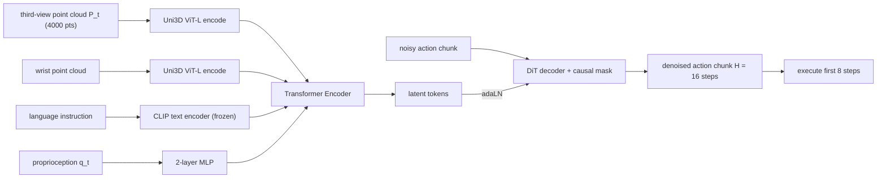

# FP3: A 3D Foundation Policy for Robotic Manipulation

- 本地 PDF：`papers/architecture/FP3_2503.08950.pdf`
- arXiv：https://arxiv.org/abs/2503.08950 （v1, 2025-03；IEEE 会议双栏格式，正文含 VII 节）
- 年份：2025
- 团队：Tsinghua IIIS + Shanghai AI Laboratory + Shanghai Qi Zhi Institute + UC San Diego（Yang Gao / Chuan Wen 组）
- 阶段：第一个把"基础模型 recipe（大规模预训练 + 少样本 post-training）"搬到 3D 点云表征上的操纵基模，证明点云 + DiT 可以比同规模 2D VLA 更省数据、更抗域偏移

## 一句话总结

FP3 用 Uni3D ViT-L 编码点云（每视角 4000 点、带颜色）、CLIP 编码语言、MLP 编码本体状态，经 Transformer Encoder 融合成 latent token，再由带 causal mask 的 Diffusion Transformer decoder 以 adaLN 方式去噪出长度 $H=16$ 的动作块；在 DROID 60k 轨迹上预训练后，每个新任务只需 80 条示教 + 单卡 2 小时 LoRA 微调，in-domain 平均成功率 95%、in-the-wild（未见物体与环境）82.5%，而 DP/DP3/OpenVLA 的 in-the-wild 只有 0~3.75%。

## 核心技术

1. **3D 点云作为主观测模态**：RGB-D 反重建点云后统一到世界坐标系，裁掉 1 m box 外的点，FPS 降到 4000 点并保留颜色；第三人称与腕部视角各用一个独立 Uni3D ViT-L encoder（300M 参数，预训练对齐图文特征），微调而非冻结。
2. **Encoder-Decoder DiT**：encoder 把多模态 embedding 融合为 latent token 序列；decoder 以噪声动作为输入、时间因果掩码约束动作 token 只关注自身及之前的动作 token，通过 adaLN 注入条件——作者明确说相比 RDT 的 cross-attention 选 adaLN 是为了稳定训练。
3. **语言条件最简化**：CLIP text encoder 冻结使用，刻意不接 VLM，把复杂语义留给未来工作（Limitations 里明确承认这是短板）。
4. **LLM 式 pre-training / post-training 两段式**：DROID（86 任务、76k 轨迹中取 60k）预训练 → 每个下游任务在 8 个环境 × 8 个物体上各采 10 条共 80 条遥操数据，LoRA（rank 32, alpha 16）微调。
5. **数据多样性优先于数量**：明确沿用 Lin et al. (2024) 的结论，同一场景堆示教不如换环境换物体。
6. **观测历史补偿**：stack 2 帧（含 1 步历史）弥补点云缺失的动态信息。

## 底层原理与数学推导

### 1. 语言条件 visuomotor 控制的形式化与扩散目标

问题定义为建模条件分布。观测为多相机点云 + 语言 + 本体：

$$
p(A_t \mid o_t), \qquad o_t = [P_t^{1}, \dots, P_t^{n},\ \ell_t,\ q_t]
$$

其中动作是未来一段序列（action chunk）：$A_t = [a_t, a_{t+1}, \dots, a_{t+H-1}]$，$H=16$。用 DDPM 近似该分布、DDIM 加速推理：训练时对真实动作加噪 $k$ 步得到 $\tilde A_t^{\,k}$，噪声预测网络拟合

$$
L_{ddpm} = \mathbb{E}_{t,\,k,\,\epsilon}\left[\big\|\epsilon - \epsilon_\theta(o_t,\ \tilde A_t^{\,k},\ k)\big\|^2\right]
$$

推理从纯噪声出发迭代 $K$ 步（部署时 DDIM 压到 16 步），每步去噪都在"这段动作应该长什么样"的能量面上走一小步——保留 Diffusion Policy 的多模态表达力，同时把去噪器换成可扩到 1.3B 的 transformer。

### 2. adaLN 与 cross-attention 条件化的差别

Diffusion Transformer 的每个 block 里，条件信息 $c$（latent token 池化/embedding）不以 attention 读出，而是生成仿射参数去调制归一化层。以 StyleGAN/DiT 一脉的标准形式：

$$
x \leftarrow x + \mathrm{MLP}\big(\mathrm{modulate}(\mathrm{LN}(x),\ c)\big), \qquad (\gamma_c,\ \beta_c) = \mathrm{Linear}(c)
$$

即先由条件算出 scale $\gamma_c$ 与 shift $\beta_c$，再对 LayerNorm 后的特征做通道级仿射。与 cross-attention 相比，adaLN 把"条件如何影响每个特征通道"变成逐通道的门控/缩放，梯度路径更短，论文认为这是其大规模扩散训练稳定的关键。

### 3. 因果 mask 保证时序一致性

decoder 内部的 action token 采用 causal masking：token $a_{t+i}$ 只能 attend 到 $a_{t+j},\ j \le i$ 以及 encoder 输出的观测 latent token。这样第 $i$ 步的动作预测只依赖已确定的过去动作与当前观测

$$
p(a_{t+i} \mid a_{t:t+i-1},\ o_t)
$$

与自回归分解一致，避免未来信息泄漏导致的 chunk 内不自洽。

### 4. LoRA 参数高效微调

post-training 冻结预训练权重 $W_0 \in \mathbb{R}^{d \times k}$，只训练低秩增量：

$$
W = W_0 + \Delta W = W_0 + B A, \quad B \in \mathbb{R}^{d \times r},\ A \in \mathbb{R}^{r \times k},\ r \ll \min(d,k)
$$

本文取 rank $r=32$、alpha 16、lr $1e{-6}$。可训练参数量只有总量的一小部分，这解释了为什么单张 A800 上 2 小时就能完成一个任务的适配且不破坏预训练获得的世界结构。

### 架构数据流

## 物理直觉解释

**点云是自带深度仲裁的证据，图像只是投影剪影。** 2D 图像里"杯子在哪"取决于像素相关性，换个背景纹理、灯光色温，相关性就断了；而 RGB-D 反建出的点云把"物体表面离我多少米"直接写进坐标里，背景被裁剪掉后剩下的几乎全是操作对象的几何形状。这也是 FP3 对相机视角变化稳健的根本原因：只要标定正确，同一个世界坐标系下的点云在不同视角下本来就是同一个东西，图像却会完全变样。

**基模型像认字的文具店老板，小型策略像刚背下一条路线的学徒。** DP/DP3 这类小网络第一次看到没抓稳纸团之后的场景就彻底懵了——失败后的状态在它们的 80 条示范分布之外，只能原地打转。FP3 见过 DROID 里 86 种任务、564 个场景的第一千种失败姿势，所以第一次尝试落空后会自己重新定位再抓一次。这就是"预训练提供的是常见扰动下的合理行为先验"，而不是某一个任务的肌肉记忆。

**LoRA 像给旧房子只动软装不动承重墙。** 80 条示教不足以教会一个模型"什么是抓取"，但足够告诉一个已经会抓取的模型"这个家里毛巾折叠要从右往左"。低秩增量限制每次改动的"能量"，使预训练形成的几何与物理直觉不被冲垮——如果全量微调反而等于推倒重来，样本效率优势就没了。

**多任务指令跟随考察的是把任务分开了存储。** 同一初始状态给出不同指令执行不同任务，说明语言条件真正调制了行为而不是被平均掉；baseline 在其他任务的目标物干扰下跑偏，说明它们学到的更像"这台桌面上通常会发生什么"的场景统计，而不是"指令→行为"的映射。

## 工程细节与实操指南

- **硬件栈**：Franka Panda + Robotiq 夹爪 + 可移动升降台；ZED 2（第三人称，固定在升降台上）+ ZED mini（腕部）；Meta Quest 2 遥操，15Hz 控制；action space 为绝对 Cartesian space control；推理用 RTX 3090（24GB），整套系统可由 EcoFlow DELTA 2 Max 移动电源供电（复刻 DROID 风格的可搬运 setup）。
- **预处理 pipeline**：RGB-D → 各视角点云 → 统一到世界坐标系 → 裁剪 1m box → FPS 到 4000 点 → 保留颜色通道（后续支持按颜色条件化的空间）。训练时随机 dropout 点云做增强，dropout rate 从 $[0, 0.8]$ 均匀采样。
- **Pre-training 配置**：ViT-L 规模 encoder + decoder，总参 1.3B；DROID 三相机只用两路；60k 轨迹；AdamW，lr $1e{-4}$ cosine，weight decay 0.1，grad clip 1.0；batch 128；8 张 A800 训约 48 小时（300 万步）。Uni3D 权重在预训练中继续微调（引用 Lin et al.: 冻结视觉编码器伤性能）。
- **Fine-tuning 配置**：LoRA rank 32 / alpha 16，lr 降至 $1e{-6}$，其余 horizon 设置不变（obs horizon 2、predict 16、execute 8、推理 16 步去噪）；单卡 A800 约 2 小时一个任务。
- **任务设计细节**：Fold Towel 允许 ±30 度朝向随机、 towel 颜色材质多样但预先叠成近似矩形；Clean Table 抓皱纸团丢进桶，位置随机；Stand up Cup 在开口朝向机械臂的 180 度范围内随机倒伏；Pour Water 是三阶段（抓瓶→倒水入杯→放回杯垫），瓶子始终大致在杯左、杯垫在杯右，三件容器颜色材质尺寸都随机。
- **评测协议**：每任务 8 个环境 × 8 个物体采 80 条；4 个 in-domain 环境（见过的物体）+ 4 个 in-the-wild 环境（未见物体），每格 5 trials × 20 trials 总量级（Table I 每格为 5 次/环境的平均，Table 中结果为 20 次评测均值口径以论文描述为准）。
- **待确认**：用户提供的"ICRA 2026 Finalist"奖项信息未出现在本 PDF（arXiv v1, 2025-03）正文中，无法从此版本核实。

## 消融实验与分析

**组件消融（Clean Table 任务，成功率为百分数）**

| 变体 | In-domain | In-the-wild |
|---|---|---|
| FP3-Scratch（无预训练） | 35 | 0 |
| FP3-Base-Image（图像 + DINOv2） | 90 | 55 |
| FP3-Base（ViT-B 规模，365M） | 95 | 90 |
| FP3-Base-30k（30k 轨迹预训练） | 95 | 90 |
| FP3（完整版，1.3B + 60k） | 100 | 95 |

**核心结论**：in-domain 时 FP3-Base-Image 与 FP3-Base 打平（90 vs 95），但野外掉到 55 vs 90——3D 表征的收益主要体现在跨域泛化而不是域内精度；无预训练的 FP3-Scratch 野外为 0，说明泛化主要来自预训练初始化；数据 60k→30k 时 Base 规模的野外成绩没有下降（均 90），作者自己也承认要等更难的任务才能看清 scaling law，不宜外推成结论。

**主结果表（四任务平均，成功率 %）**

| 方法 | 平均 In-domain | 平均 In-the-wild | Pour Water (dom/wild) |
|---|---|---|---|
| DP（2D 扩散） | 36.25 | 1.25 | 5 / 0 |
| DP3（点云小模型） | 22.50 | 2.50 | 0 / 0 |
| OpenVLA | 7.50 | 3.75 | 0 / 0 |
| FP3-Scratch | 30.00 | 1.25 | 35 / 0 |
| FP3 | 95.00 | 82.50 | 95 / 75 |

**核心结论**：80 条示教预算下，小型策略最多搞定 Clean Table（DP 75）、在最难的 Pour Water 上近乎全灭（DP3 0%）；OpenVLA 全线崩溃，作者归因于缺少 action chunking 和观测历史、单一第三人称视野受限；FP3 把四任务全部拉到 95 以上/野外最低 75，相对 baseline 约为 in-domain +60、wild +80 个点的量级提升。

**单项消融数字补充**：观察栏中模块规模 ViT-L→ViT-B 使参数从 1.3B 降至 365M 后，野外仍保持 90（仅损失 5 点），说明这个设定下收益大头不在参数量而在表征与预训练的组合；Camera 视角旋转约 30 度与加入 distractors 两组实验只有柱状图（Fig. 5），论文文字描述 FP3 保持最高且最稳定，具体数值 PDF 未给出文本表格——数值待确认。

## 技术权衡（Trade-off）

1. **3D 点云 vs 2D 图像**：几何不变性带来跨域稳定，代价是需要深度相机、标定与背景裁剪这种脆弱的工程环节；点云还丢掉了部分外观细节，故作者把"融合 2D 预训练特征"列为未来工作。
2. **CLIP-only 语言 vs VLM**：轻量、无需对齐大模型，但表达不了动态/复杂指令，也拿不到互联网知识——这是与 π0 路线的根本取舍。
3. **adaLN vs cross-attention**：前者训练更稳（DiT 经验），后者交互更细粒度；FP3 选稳。
4. **LoRA vs 全量微调**：省卡省时保住预训练先验，但对差异极大的新 embodiment 适应上限存疑（论文未测不同机器人本体，属于范围外声明）。
5. **数据多样性 vs 数量**：80 条分散在 8 环境 × 8 物体的数据胜过集中采集；但每格只做 20 次评测，95%/82.5% 的置信区间并不窄。
6. **Zero-shot 能力有限是明确短板**：base model 直接零样本执行新任务效果不佳，作者归因于 DROID 相比 OXE 仍不够大——3D 数据是瓶颈资源。

## 技术价值与演进定位

FP3 回答的是一个非常具体的开放问题："VLA 基模这条 2D 图像路线是不是唯一解？"它把三个已有构件（点云表征来自 DP3/Rise 一系、DiT+adaLN 来自 RDT、pre/post-training recipe 来自 LLM 和 OpenVLA/Octo 的实践）组合成一个此前没人做过的 1.3B 3D 策略基模，并用严格对照的 wild 评测证明：在 80 示教的少样本区间，3D 几何带来的鲁棒性远超"更大 2D VLA"的努力。它的直接影响是为 3D 表征重新争取了进入 foundation model 叙事的门票，也暴露了 3D 数据生态（没有 OXE 级的点云数据集）是下一个要解决的问题。

演进链路上的位置：Diffusion Policy（表示）→ RDT（规模）→ FP3（模态换成 3D + 两段式训练）；同时它与 GM-Flow/SPA 等上海 AI Lab 的前置工作共享"几何先验帮助操纵学习"的研究线索。

## 与其他论文的关系

- **DP3 (Ze et al. 2024)** — 小型点云扩散策略的直接前驱：确立了"点云优于其他 3D 表示"的经验结论和 sparse point cloud 输入方案，FP3 把它的 PointNet++/PointNeXt 小编码器升级为 300M Uni3D 并加预训练；对照结果显示 DP3 受困于域内容量（in-domain 仅 22.5%）。
- **RDT-1B (Liu et al. 2024)** — 架构最近邻（同为 diffusion transformer 的 1B 级基模），差在两点：RDT 用 cross-attention 注入条件而 FP3 用 adaLN，且 RDT 是 2D 图像输入；FP3 的差异化主张就是模态而非架构创新。
- **OpenVLA (Kim et al. 2024)** — 被 FP3 用来代表"2D 大模型 autoregressive VLA"路线，在这套评测里全线垫底；论文给出的失败机制分析（缺 action chunking、缺观测历史、单视角受限）是对离散 token 化动作输出的一次有力质疑。
- **π0 (Black et al. 2024)** — VLM backbone + flow matching 的对照组；FP3 明确说自己缺 VLM 是局限，并把"dual system / diffusion policy 接 VLM"列为未来方向，二者互补而非竞争关系。
- **Lin et al. "Data Scaling Laws in Imitation Learning" (2024)** — 数据多样性结论的直接来源，FP3 的"8 环境 × 8 物体共 80 条"采集协议就是这个 scaling law 研究的操作化。
- **Diffusion Policy (Chi et al. 2023)** — 动作生成的底层范式（action chunk + DDPM/DDIM）的原点，FP3 的 p(A|o) 公式和 execute-8-of-16 设定完全继承自此。

## 精读问题

1. **3D 收益到底来自哪里**：FP3-Base-Image（DINOv2）域内与 FP3-Base 打平但野外差 35 个点，这一差距有多少来自点云本身的几何不变性、有多少来自"裁剪背景后的有效感受野更干净"？能否在同一批数据上用 lifted 2D feature to 3D 的方法把两个因子分开？
2. **scaling law 为何看不见**：60k→30k 在 Base 规模下野外成绩不变，是因为 Clean Table 任务太简单、DROID 内部任务相似度太高，还是 LoRA 微调掩盖了 base model 的差异？用什么任务能放大预训练数据的边际收益？
3. **zero-shot 缺口的补救路径**：base model 直接零样本执行不行，而 80 条 LoRA 后就到 95%；预训练阶段的什么信号缺失造成了这道坎——是任务指令覆盖不足还是动作风格不一致？加人 10 条无监督演示能不能填上？
4. **adaLN vs cross-attention 是否公平比较过**：论文选择 adaLN 的理由是"稳定训练"，但在相同数据和算力下有没有控制变量的消融证据？这个选择的收益在大模型规模上是递增还是递减？
5. **评测口径的强度**：每格 20 次评测、四个任务集中在桌面操纵，82.5% vs 3.75% 的巨大差距是否足以支撑"3D 是关键"的一般性结论？哪些任务类别（如需要外观属性识别的任务）预期会反转这个优势？
