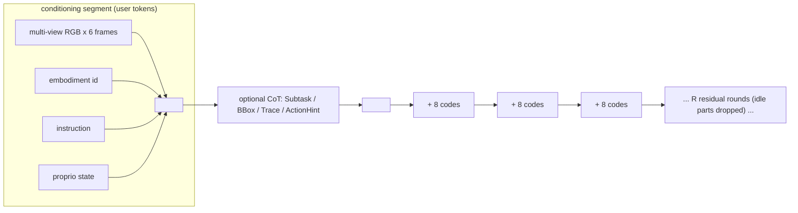

# Galaxea G0.5: 统一自回归 VLA 基础模型（技术报告）

- 本地 PDF：`papers/architecture/G0.5_tech_report.pdf`
- 技术报告链接：https://opengalaxea.github.io/G05/Galaxea_G0_5.pdf （无 arXiv 编号；项目页 https://opengalaxea.github.io/G05/）
- 年份：2026（技术报告；引用了多篇 2026 年工作如 π0.7、FASTer ICLR 2026、MEM）
- 团队：Galaxea Team（Project PI: Hang Zhao；R1-Lite/R1-Pro 平台）
- 阶段：把 VLA 的主流路线（VLM 当编码器 + 外挂 flow-matching expert）拉回到"单个自回归 decoder 同时产推理与动作"，并用跨本体 action codec + 原生 CoT + 视觉记忆把 AR 路线推回 foundation-model 规模

> **注意（本地 PDF 损坏）**：本地文件 `G0.5_tech_report.pdf` 第 12-30 页内容流损坏（MuPDF 报 `object is not a stream` / `cannot find XObject`，渲染为空白），可读的只有第 1-11 页（摘要、引言、相关工作、模型设计、预训练、5.1 DROID 评测开头）。本笔记的 5.1 之后的评测数据、消融与附录均从官方完整版 PDF（上述链接，32 页）提取核对。**声明：本文为厂商技术报告，其中与 π0.5、GR00T-N1.7 的对比均为厂商自行训练与评测的结果，无独立第三方复现验证——商业声明，无独立评测验证。**

## 一句话总结

G0.5 以 Qwen3.5 2B 为底座，用单一 next-token cross-entropy 目标在同一个 token 流里生成 CoT（Subtask/BBox/Trace/ActionHint 四种可组合模板）和离散动作码：动作经一个可学习的跨本体 RVQ tokenizer 压成"运动部件分组 + 每轮 8 个码"的稀疏序列，闲着的自由度直接不出 token；在 14 种本体、27 维统一动作空间上预训练 120K 步后，报告 7 个评测域的成绩（LIBERO 98.9%、RoboTwin 2.0 93.3%、SimplerEnv-Bridge 87.3%、DROID 零样本 82.5%、真机微调 76.7%、BEHAVIOR-1K 挑战赛 0.3136、PP Bench 50H 语言跟随 84.4%），并论证 AR 接口让 prompt 可以直接干预动作、RL 微调（GRPO）天然可用。

## 核心技术

1. **统一自回归流（VLM as actor）**：多视角 RGB + embodiment id + 指令 + 本体状态序列化进 conditioning 段，CoT 与动作码在 generative 段由同一个 decoder 生成，只有 Eq. (1) 的一个 next-token 损失，没有辅助回归或 expert 蒸馏。
2. **跨本体 ActionCodec**：采用 FASTer 的 action grouping + ActionCodec 的训练配方——机器人拆成运动部件（left_control / right_control / left_gripper / right_gripper / lower_body），各部件 pad 到统一维度后训练残差向量量化（RVQ），外加时间对比目标提升相邻动作的 token 一致性；生成时按"当前激活的部件标记 + 8 个动作码"为一轮、共 $R$ 轮展开，未激活部件整组跳过（图 1 里 step 02 的 idle 右臂 token 组整体消失）。与 FAST 的固定 DCT + BPE 不同，codec 是学习得到的且按结构对齐设计，新增本体不需要在 tokenizer 或动作头加任何参数。
3. **原生 Chain-of-Thought**：四种自描述推理目标（`Subtask:` 任务分解、`BBox:` 关键物体定位、`Trace:` 2D 末端轨迹、`ActionHint:` 动作提示），每步从 8 种组合（含 no-CoT）加权采样一种，subtask 文本权重更高；评测固定用 no-CoT 格式，CoT 能力在推理时可开关。
4. **视觉记忆（Visual Memory）**：沿 π0.7 / MEM，在 ViT 内每 4 层插入分解的 spatial-temporal attention，把约 5 秒（6 帧、间隔 1 秒）历史注入视觉编码器；最后一层丢弃全部历史 token，训练时以 30% 概率随机丢历史帧防过拟合；本体状态用连续 embedding 替代文本 tokenizer 与帧对齐。
5. **可选 flow-matching 头**：仅在推理期作为 AR trunk 之上的加速/探索选项，不参与预训练；5.6 与 5.7 节专门用它做对照实验。
6. **自动标注管线**：规则时序分段 → 多模态大模型 API（Gemini 3 / Doubao Seed 2.0）生成动作提示、原子任务与整段指令 → 基础模型 + SAM3 tracking 出逐帧框与掩码 → 正运动学算双臂末端并投影到头相机平面得 2D 轨迹。

## 底层原理与数学推导

### 1. 单一自回归目标

所有输入输出串成一条序列，损失只加在 generative 段的 token 上（$G$ 为其下标集合，$q$ 为模型参数）：

$$
\mathcal{L}(q) = -\sum_{i \in G} \log p_q\left(x_i \mid x_{<i}\right)
$$

这一个目标同时监督文本、CoT 和动作码——CoT 与动作只是同一个词表里的 token，由同一次前向产生。相比 VLM-as-encoder 方案（VLM 出 condition、expert 出连续动作、两个目标两套参数），这里推理到动作的"接口"就是解码器自己，这就是论文全部结构性主张的来源：prompt 可以改变下一个 token 的分布，因此可以改变行为。

### 2. 结构化 RVQ 动作编码

设某部件的动作块为向量 $x$，残差向量量化用 $L$ 级码本逐级量化残差：

$$
r_0 = x, \qquad c_l = \arg\min_{c \in \mathcal{C}_l} \lVert r_l - c \rVert, \qquad r_{l+1} = r_l - c_l, \qquad \hat{x} = \sum_{l=0}^{L-1} c_l
$$

序列化时再加结构标记：每轮先输出激活部件标记（如 `<left_control_2>`），后跟 8 个量化码。它解决两个老问题：(a) 扁平化离散化让 token 数随总自由度线性涨、且语义纠缠，跨本体迁移差；(b) 无结构约束时语义相近的动作码 Hamming 距离大，给 VLM 的监督信号噪声大——时间对比目标直接压这个距离。

### 3. token 预算：为什么 AR 能活下来

早期 AR VLA（RT-2/OpenVLA）逐维逐时刻 binning，一个高频双臂任务的序列长度是 $O(T \times D)$（$T$ 个时刻、$D$ 维动作）。G0.5 的两个压缩把负担降下来：chunk 化把 $T$ 压成 $R$ 轮（每轮覆盖一段时间），稀疏激活让 $D$ 只算动了的部件。以统一 27 维空间为例：

$$
\text{tokens} \approx R \times 8 \times |\{\text{active parts}\}| + |\{\text{active parts}\}|
$$

而不是 $R \times 27 \times B$（$B$ 为 binning 精度对应的每维 token 数）。这是"AR 范式不是瓶颈，过度 tokenization 才是"这一论点的量化基础。

### 4. AR vs flow-matching 在 RL 下的似然差异

GRPO 需要 token 级对数概率来算策略比率。AR 策略天然给出：

$$
\nabla_\theta \log \pi_\theta(a \mid o) = \sum_i \nabla_\theta \log p_\theta(c_i \mid c_{<i}, o)
$$

而 flow-matching 的确定性问题没有显式似然，RLinf 一类做法要在去噪过程注入 SDE、把去噪轨迹当 Markov 过程来近似 $\log \pi$，引入离散化与噪声调度的额外选择。报告用这一差异解释 5.7 节 AR 收敛更快、方差更小的现象。

### Token 流模板

## 物理直觉解释

**外挂 expert 的 VLM 像「顾问只能递纸条」。** VLM-as-encoder 架构里，预训练攒下的所有推理本领（分步、指代消解、上下文学习）都要被压缩成一份 condition 传给动作专家，专家怎么用这份 condition 是它自己的事——prompt 里说"竖着放"，影响的只是纸条内容，不是动作分布本身。G0.5 把推理和动作放进同一条流，等于让同一个人边想边做：说"竖着放"直接改变了它下一个 token 会是什么。5.6 节那些"push it in hard / vertically 会改变 rollout"的定性观察就是这个机制浮出水面的样子。

**ActionCodec 像给不同国家的机器人发统一的乐谱。** π0 的做法是把所有机器人 pad 成 18 维并集（不会弹的声部也印在谱上），GR00T 用每本体一套 MLP 编解码器（每种乐器自带翻译）。G0.5 则先按身体部位分声部，再用 RVQ 把每个声部的一段旋律压成 8 个离散音符，只演奏正在响的声部。这样"左臂向左移 5cm"在 R1-Lite 和 R1-Pro 上是同一串 token，模型学的是乐理而不是某个琴的指法——新增本体时不用改谱子。

**视觉记忆像做题时允许回头看草稿。** 单帧观测下，机械臂挡住目标的那两秒是世界"消失"的两秒，策略只能瞎猜；但 naive 地堆历史帧会让序列平方级变长并且一旦遇到没见过的时序模式就漂移。把时序混合放进视觉编码器内部、最后丢掉历史 token，相当于"看完总结成印象，不带原始笔记上场"，既保留了识别遮挡和发现失败的能力，又不给推理加负担。

## 工程细节与实操指南

- **底座与规模**：初始化自 Qwen3.5 2B（视觉塔全程不冻结）；报告未在正文给出总参数量之外的模型规模细节，参数量与训练算力总量未公开——待确认：正文与附录均未列出 GPU 总卡时。
- **统一动作空间**：27 维 = left_control(9) + left_gripper(1) + right_control(9) + right_gripper(1) + lower_body(7)；本体不具备的槽位在合并时填 noop token，因此共享一个输出头、无 per-robot adapter。
- **预处理按源单独配置**：每个数据源各自决定归一化模式（z-score with tail clipping 或 q01/q99 分位缩放）与逐通道动作滤波，不做 mixture-wide 统一。
- **预训练配方**：单阶段；AdamW，$\beta = (0.9, 0.95)$，weight decay $10^{-2}$，峰值 lr $10^{-5}$；4000 步线性 warmup，恒定学习率到训练进度的 92%，最后余弦衰减到峰值的 30%（降到 floor 而非 0）；共 120K 步。观测 6 帧、间隔 1 秒、覆盖 5 秒窗口；30% 概率丢全部历史帧。
- **数据配比**：机器人数据覆盖 14 种本体（真机+仿真）；VQA 共训约 100M（50M 通用 web VQA + 50M embodied VQA + 5M 自建标注），VQA : 动作 = 1 : 4。动作/物体词频长尾分布（Fig. 5），高频动作集中在 pick/place/move/put。
- **下游微调参考配置**：LIBERO 用 lr $10^{-5}$、wd $10^{-2}$、100K 步；RoboTwin 2.0 用 2500 clean + 25000 randomized 演示、4 epochs、lr $4 \times 10^{-5}$、global batch 1024、每任务 100 trials；Bridge/WidowX 后训 80K 步、lr $3 \times 10^{-5}$、state-free 输入；真机 R1 系列统一 16 卡 H20、同 wall-clock（4-10 小时）、交错评测。
- **已知短板（作者自述）**：低对比度半透明柜体/抽屉定位弱（无标记时 towel→drawer 仅 60%，加橙色高对比卡后到 100%，而 π0.5-DROID 90%→基本不变）；视觉记忆只有秒级历史；lower body 在动作空间里有表示但未单独评测。
- **复现提示**：评测固定用 no-CoT 提示模板；CoT 组合 8 种含 no-CoT 基线，subtask 权重更高；2D Trace 来自正运动学投影，不要用相机外参反推。

## 消融实验与分析

G0.5 是技术报告，正式的组件级消融有限；这里用其**推理时开关实验（单 checkpoint、零微调）**作为核心消融表，并补充评测配置行。

**CoT x 解码头 零样本探针（R1-Lite；PP Bench 64 rollouts，两个长视野任务各 n=5）**

| 配置 | PP Bench 语言跟随 (%) | Air Fryer 进度分 (0-5) | Cook Bacon 进度分 (0-5) |
|---|---|---|---|
| AR, no CoT | 65.6 | 2.4 | 1.5 |
| AR, CoT | 67.2 | 3.8 | 3.4 |
| FM, no CoT | 59.4 | 2.1 | 1.2 |
| FM, CoT | 60.9 | 2.7 | 2.0 |

**核心结论**：单阶段的 PP Bench 上 CoT 几乎无效（至多约 1.6 个百分点），五阶段任务上 AR+CoT 的进度分提升最大（Air Fryer 2.4→3.8、Bacon 1.5→3.4）；同 CoT 下 AR 优于 FM（语言跟随 Air Fryer 72 vs 48、Bacon 64 vs 44），而人工标注 CoT 质量两解码头相当（约 90%/85%/80%），作者据此把差距归因于解码接口——AR 的动作 token 能直接 attend CoT，FM 只能读池化后的隐状态。此为作者自评实验。

** referring context 消融（PP Bench 50H）**：Name-only 84.4% / 75.0%；+ Box Coord. 85.9% / 76.6%（几乎无增益，作者归因于坐标 token 偏离预训练指令分布）；+ Target Visual（裁剪目标与容器的图像块拼入观测）98.4% / 84.4%——视觉指代上下文的收益远大于文本坐标。

**评测配置行（替代传统消融，数字为报告值）**

| 评测域 | G0.5 | 最强对照 | 备注 |
|---|---|---|---|
| LIBERO 平均（Spatial/Object/Goal/Long = 98.4/100/98.6/98.6） | 98.9 | Xiaomi-Robotics-0 98.7 | 100K 步微调 |
| RoboTwin 2.0（clean 93.7 / rand 92.8） | 93.3 | Fast-WAM 91.8 | 最弱任务 Hanging Mug 仅 40/56 |
| SimplerEnv-Bridge（spoon 97.5 / carrot 75.0 / stack 83.3 / eggplant 93.3） | 87.3 | Xiaomi-Robotics-0 79.2 | WidowX 后训 80K 步 |
| DROID 环境与物体级零样本 | 82.5 | π0.5-DROID 57.5 | 无标记 drawer 任务反输 60% vs 90% |
| 真机微调 6 设置平均（process score 129.2 vs 105.2 / 68.9） | 76.7 | π0.5 53.3 | 唯一败项：R1-Pro box transfer 80.0 vs 93.3 |
| BEHAVIOR-1K 挑战赛 Task Success Score | 0.3136 | π0.5(4ep) 0.2626、第一名 RLC 0.2605 | 29/50 任务领先 π0.5 |
| PP Bench 50H（语言跟随/成功） | 84.4 / 75.0 | π0.5 68.8 / 65.6 | G0.5 零样本即 65.6 / 59.4 |

**核心结论**：仿真短视野任务上领先幅度小（LIBERO 仅 +0.2），差距主要出现在语言跟随、长视野与跨设置一致性上，与论文"AR 保护 VLM 能力"的主张一致；但所有对照均为厂商自训自测，LIBERO/SimplerEnv 等有公开排行榜可交叉验证，真机与挑战赛数字目前只能当作单方声明。**商业声明，无独立评测验证。**

**RL 微调（GRPO，LIBERO 四任务，每任务 1 条演示起步）**：AR 从 63.0% 收敛到 97.4%，FM 从 62.5% 到 92.9%，AR 更快更稳、方差更小——AR 接口对 ratio-based RL 更友好。

## 技术权衡（Trade-off）

1. **AR 生成动作 vs 推理频率**：自回归逐 token 出动作天然慢，靠 chunk + 稀疏激活 + 可选 FM 头补救；作者保留 FM 头正说明纯 AR 在低延迟场景仍吃紧。
2. **CoT 开销 vs 长视野收益**：CoT 在单步任务上是纯开销（PP Bench 几乎无效），只在多阶段任务上兑现收益；评测时固定关 CoT 也说明其推理成本不可忽略。
3. **统一词表 vs per-embodiment 精度**：noop 填充 + 共享输出头牺牲了本体专用调优空间，换来加新本体零新参数。
4. **视觉记忆 vs 延迟与漂移**：分解时空注意力 + 末层丢历史是折中；作者承认秒级记忆远不够长期任务（BEHAVIOR 里需要记住"哪些东西已经搬过"）。
5. **学得 codec vs 固定 DCT(FAST)**：可学习、结构对齐、跨本体一致，但引入 tokenizer 训练这一额外阶段，且其质量直接决定上限（时间对比目标只是缓解 token 不一致）。
6. **CLIP 式语言底座的知识 vs 控制专用优化**：G0.5 保 VLM 通用能力，代价是动作头没有被专门压榨到极限——LIBERO 上 98.9 的领先幅度很小暗示短视野闭环控制上 AR 并不占便宜。

## 技术价值与演进定位

这份报告的真正论点不是"G0.5 分数高"，而是一个架构判断：VLM-as-encoder 把预训练的推理能力锁在条件瓶颈后面，而 anti-forgetting（Knowledge Insulation）与 VLA-0 的结果已经暗示 AR 动作监督本身就是保护 VLM 能力的信号。G0.5 把这个信号推到 foundation-model 规模，补齐了 AR 路线此前缺的三块拼图——跨本体 tokenizer、流内 CoT、视觉记忆——并用"单 checkpoint 赢多 checkpoint 挑战赛方案"作为预训练先验含金量的证据。它对领域的意义在于重新把"端到端 AR VLA"变成可讨论的主线选项，与 π0 系（VLM+flow expert）、GR00T 系（System 2/1 分层）形成三足格局。

对本库课程的意义：它是 RT-2/OpenVLA 离散 token 路线的当代形态，和 π0（外挂 expert）、π0.5（开源世界泛化）放在一起读，才能看清"动作接口设计"这一条轴上的取舍。

## 与其他论文的关系

- **π0 / π0.5** — 主要对照：π0 引入 VLM+独立 flow-matching expert 模板，π0.5 加开源世界泛化；G0.5 的全部动机就是反对这个模板，并在 BEHAVIOR-1K（单 checkpoint 0.3136 vs 0.2626）与真机 6 设置（76.7% vs 53.3%）上直接对打——均为厂商自训对比。
- **RT-2 / OpenVLA / VLA-0** — AR 路线的前身与佐证：RT-2/OpenVLA 逐维 binning 被 FAST 判定为高频数据瓶颈；VLA-0 用"未修改 VLM 直接 AR 学动作"打过 π0.5-KI 等模型，是 G0.5"AR 不是瓶颈"论点的关键文献。
- **FAST / FAST+ / FASTer / ActionCodec** — tokenizer 谱系：FAST 的 DCT+BPE 是固定管线且逐本体；FASTer 提供 action grouping（结构分解），ActionCodec 提供 RVQ 训练配方，G0.5 = 两者组合 + 跨本体统一词表 + 稀疏激活。
- **ECoT / TraceVLA / CoT-VLA / Emma-X** — CoT 注入方式的对照：ECoT 与 G0.5 最接近（同一 AR decoder），差别在 G0.5 把 BBox+Subtask+Trace+ActionHint 三原语放进一个共享词表并做成 prompt 可切换模板，且 CoT 在预训练期就与动作同监督。
- **Knowledge Insulation (π0.5-KI) / MEM / π0.7** — 反方证据与组件来源：KI 停梯度 + 辅助 AR 目标保护 VLM（隐式承认 AR 监督的价值）；视觉记忆直接沿用 π0.7 与 MEM 的分解时空注意力设计。
- **RLinf + GRPO (DeepSeekMath)** — 5.7 节 RL 实验的方法来源：FM 侧的 SDE 似然近似来自 RLinf，AR 侧直接用 token 级 log-prob，结论是 AR 接口对 RL 更友好（63.0%→97.4% vs 62.5%→92.9%）。
- **BEHAVIOR-1K / LIBERO / RoboTwin 2.0 / SimplerEnv / DROID** — 评测坐标系：长视野移动操作（BEHAVIOR-1K，单集平均 6.6 分钟）、指令跟随四件套（LIBERO）、双臂仿真（RoboTwin）、real-to-sim（SimplerEnv）、真实平台泛化（DROID），七个域各测一种能力。

## 精读问题

1. **零样本 82.5% 的口径**：DROID 评测是"在 DROID 数据上后训、在留出的环境与物体实例上零样本"（Fig. 5 标题），与摘要里"zero-shot DROID (82.5%)"的表述存在措辞差——真正的零样本（不同机器人本体不经后训）能力由哪一节数据支撑？
2. **CoT 收益的边界条件**：5.6 显示 CoT 只在"每阶段单独给指令"的长视野任务上有效；如果阶段指令是外部给的，那"模型自己分解任务"的价值到底在 BEHAVIOR-1K 那种一次性整段指令任务里占了多少？有没有把"CoT 生成质量"与"stage-conditioned 提示结构"两个因素分开的实验？
3. **FM 头输给 AR 的机制**：作者归因于"AR 能直接 attend CoT、FM 只读池化隐状态"，但 FM 头是推理期可选组件、其训练量与 AR 不同——这个对照是否控制了两个头的训练充分程度？CoT 质量相当（约 90%/85%/80%）能否排除"FM 读到了质量相同但格式不适合自己"的信息？
4. **挑战赛单 checkpoint 主张的强度**：G0.5 用 1 个 checkpoint 0.3136 超过 4 checkpoint 的第一名 0.2605，但 G0.5 的后训数据是全部 10,000 episodes 联合训练、评测时模型选择自由度不同——这个比较里"单/多 checkpoint"差异数值上值多少个点？
5. **预训练数据长尾的因果性**：作者用"预训练以 pick-and-place 为主 → 挑战赛上 open-space pick-and-place 强、container-interaction 弱（microwave popcorn 0.15 vs π0.5 0.95）"解释强弱分布，4 epochs 后 cook hot dogs 从 0.45 追到 0.90——这更支持"数据分布决定"还是"后训量决定"？如何设计实验区分？
