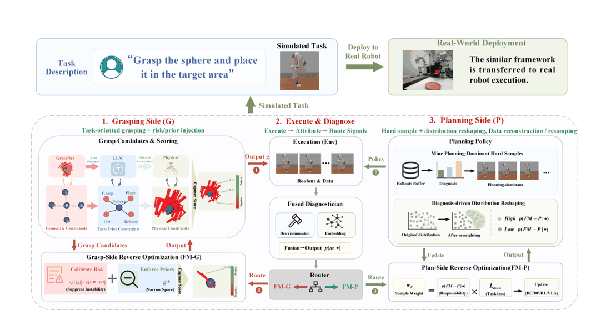
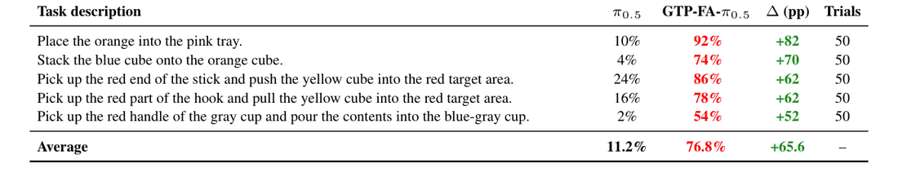
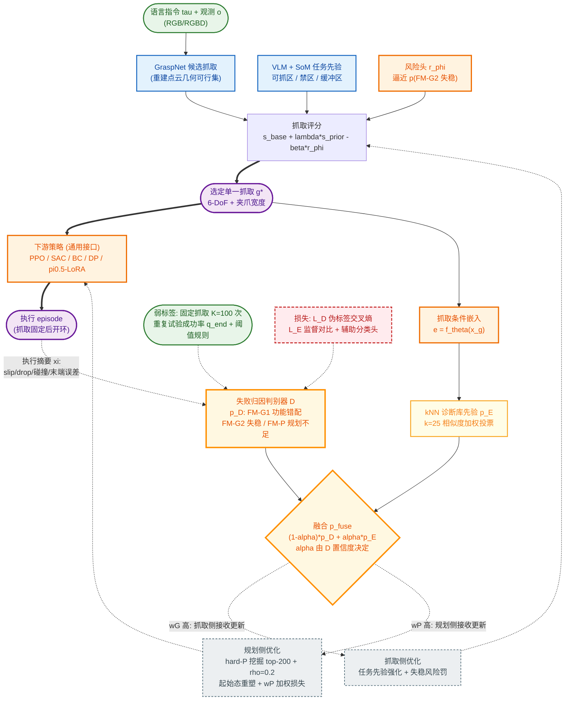

# Grasp-Then-Plan with Failure Attribution: A Closed Two-Stage Framework for Precise and Generalizable Robotic Manipulation

- arXiv: https://arxiv.org/abs/2606.03385
- Source: https://arxiv.org/abs/2606.03385
- Project: https://sites.google.com/view/gtp-fa/
- Local PDF: `/Users/luogu/physical_intelligence/papers/architecture/GTP-FA_2606.03385.pdf`
- Year: 2026
- Category: closed-loop manipulation / failure attribution
- Priority: high

## 一句话总结

（Problem）抓取与下游规划强耦合，同一表面失败可能是抓错部位、抓不稳或策略不足，端到端微调把抓取错误错记在策略头上、污染训练数据 →（Insight）先用「固定抓取条件重复试验」的弱监督学一个三模态失败归因器，把责任拆到抓取侧 vs 规划侧，再按诊断路由优化压力 →（Mechanism）Failure Attribution Discriminator D + 抓取条件诊断嵌入空间 E（kNN 先验融合）→ 双向优化：抓取侧加任务先验与失稳风险罚、规划侧挖 hard-P 起始态做分布重塑 + 责任加权损失 →（Evidence）ManiSkill3 八任务五类学习器（PPO/SAC/BC/DP/π0.5）终态成功率平均 +31.3/+7.7/+54.0/+25.7/+17.8pp，且单侧优化与无归因联合优化大量负增益；真机 Franka FR3 五任务 π0.5 平均 11.2% → GTP-FA-π0.5 76.8%（+65.6pp，各任务 50 次实测）。

## 九问速览

1. **Problem**：长程操作中抓取决定可行性；失败数据在强耦合抓取-执行体系里纠缠两类成因，无归因的微调会让策略学错。
2. **Bottleneck**：失败归因标签人工标注昂贵且主观；归因器在未见抓取姿态上预测不稳。
3. **Insight**：固定抓取条件重复 K 次试验的终态成功率可区分「此抓取下任务可不可行」（P）与「抓不稳」（G2）。
4. **Method**：三失败模式 {FM-G1 功能错配, FM-G2 失稳打滑, FM-P 规划不足}；D/E 融合诊断驱动抓取侧评分修正 + 规划侧 hard-P 分布重塑。
5. **Evidence**（带关键数字）：真机五任务 10%→92%、4%→74%、24%→86%、16%→78%、2%→54%；消融 01（仅规划侧）令 SAC −54.5pp、10（仅抓取侧）令 π0.5 −54.0pp，唯全 GTP-FA 五学习器全正增益。
6. **Ablation**：弱标签阈值 (θlow,θhigh)=(0.2,0.8) 最优，终态成功率 80.7%，宽松 (0.45,0.45) 掉到 59.3%；归因质量 macro-F1 在合理阈值带近饱和。
7. **Assumption**：抓取条件诱导相似 post-grasp 初始态 → 失败模式分布局部相似（嵌入空间先验）；执行摘要 ξ 可观测。
8. **Failure**：闭环迭代曲线非单调、部分任务增益依赖任务；自认局限——归因仍靠重复试验弱监督与可观测事件，更丰富在线反馈可再提升。
9. **Opportunity**：更多平台/物体/开放世界任务；细粒度在线反馈接入归因；归因接口与任意 base learner 组合的系统化。

| 维度 | 论文答案 |
|---|---|
| Perception | 多视角 RGB/RGBD（问题定义）；GraspNet 在重建点云上出候选抓取；VLM+SoM 标注生成任务先验区域；诊断嵌入用抓取后状态特征 xg（物体位姿/相对夹爪位姿/接触区域，仿真内可得） |
| Closed-loop | 闭环在系统/训练层：execute–diagnose–update 大循环（Niters=2）迭代挖难例并更新两侧；单 episode 内抓取固定后由下游策略执行，非运行时逐步闭环 |
| Correction | 卖点所在：三模态归因 D(τ,o,g,ξ)→p(m)，弱标签由固定抓取 K=100 次重复试验的成功率 q̂end 加阈值规则构造；kNN 邻域先验稳住未见抓取；责任权重 wG/wP 决定更新路由，防止抓取失败污染策略训练数据 |
| Deployment | Franka Research 3 + Robotiq 夹爪 + 底座/腕部 D435i；RTX 4090 推理；GTP-FA-π0.5 与 π0.5 共用 300 条真机专家轨迹，5 任务 × 50 实测试验 |

## 核心技术

信息流拆解（Input→Representation→Decision→Action→Training Signal）：

*论文 Figure 1（p4）：Figure 1: Overview of GTP-FA. Given a task description, GTP-FA performs task-aware grasp*

- **Input**：语言指令 τ + 视觉观测 o（RGB/RGBD）+ 选定抓取 g ∈ SE(3)×R（6-DoF 位姿 + 夹爪宽度）+ 执行摘要 ξ（slip/drop 指示、碰撞事件、末端误差、持握时长）。
- **Representation**：GraspNet 从点云生成几何可行候选集 G(o)；Grasp-conditioned 嵌入 e=fθ(xg) 把「抓取后初始态」映射进诊断空间（监督对比 + 辅助分类头训练，相似诊断属性的抓取聚簇）。
- **Decision**：失败归因分布 p_fuse(m)；责任权重 wG=p(G1)+p(G2)、wP=p(P)；据此路由——抓取侧还是规划侧接收更新。
- **Action**：两阶段。第一段选抓取 g* = argmax[s_base + λ·s_prior − β·r_ϕ]（任务先验 s_prior 来自 VLM 对「可抓区/禁区/缓冲区/几何规则」的结构化输出，风险头 r_ϕ 逼近 p(FM-G2)）；第二段下游策略 π(a_t|s_t,o_t,τ,g) 在固定抓取条件下出动作序列（RL/BC/DP/VLA 均可）。
- **Training Signal**：归因器 D 用高置信伪标签交叉熵训练；嵌入 E 用监督对比损失 + 成功/失败与失败模式辅助头；规划侧用责任加权损失 min E[wP·L_down]（L_down 为对应 base learner 自身目标）+ 起始态分布重塑 g~(1−ρ)Unif(G_full)+ρUnif(G_hardP)（训练 ρ=0.2，评估恒 ρ=0）。

**训练/冻结情况**：π0.5 底座用 LoRA 微调（gemma_2b_lora / gemma_300m_lora 变体），sim 100 条转换专家轨迹、real 300 条（两法同源）；D、E、TaskScore/风险头均为轻量独立模块（各自 80/200/50 epochs）。

**Loss**：L_D = −E[log p_D(m̃|·)]（伪标签 CE）；L_E = L_con + λ·L_aux（监督对比 + 辅助 CE）；下游 min E[wP·L_down(θ)]，L_down 随 base learner 替换（RL 损失 / BC 损失 / DP 训练损失 / VLA 微调目标）。

## 底层原理与数学推导

**1. 弱监督归因标签的构造**（§4.2, Eq.6；附录 A.1.1）。对每个抓取条件 g 固定抓取重复 K 次试验（仅换随机种子或加微扰），统计终态成功率：

$$
\hat{q}_{end}(g) = \frac{1}{K}\sum_{k=1}^{K}\mathbb{I}\{y^{(k)}_{end}=1\},\qquad K=100
$$

打标规则按优先级「先分 G1、再分 P vs G2」：明显功能/接触区错配 → FM-G1；非 G1 样本中若 q̂end ≥ θ_high（任务在此抓取下通常可完成，失败更可能是策略问题）→ FM-P；若 q̂end ≤ θ_low 且有 slip/drop 事件或高非平稳比例（frac_unstable = 成功过但终态失败）→ FM-G2；θ_low<q̂end<θ_high 的模糊样本丢弃或软标签。直觉：**q̂end 剥离了「这次运气差」与「这个抓取根本不行」的混淆**——同一抓取反复能成而这次失败，责任在策略；反复都失败且打滑，责任在抓取。

**2. 邻域诊断先验与 D/E 融合**（§4.3, Eq.8-9；附录 A.1.3）。未见抓取时 D 不稳，用嵌入空间 k 近邻加权投票出平滑先验再按 D 的置信度融合：

$$
\tilde{p}_E(m\,|\,e)=\sum_{j\in N_k(e)} w_j\,\mathbb{I}\{m_j=m\},\quad w_j=\frac{\exp(\mathrm{sim}(e,e_j)/t)}{\sum_{\ell\in N_k(e)}\exp(\mathrm{sim}(e,e_\ell)/t)}
$$

$$
p_{fuse}(m\,|\,\tau,o,g,\xi,e) = (1-\alpha)\,p_D(m\,|\,\tau,o,g,\xi) + \alpha\,\tilde{p}_E(m\,|\,e)
$$

α 由 D 置信度决定（实现：置信阈值 0.97、switch 规则、k=25、温度 0.2、融合范围 g2p_top2）——D 自信听 D、D 犹豫问邻居，本质是把归因问题局部化为「相似初始态应有相似失败分布」的流形假设。

**3. 抓取侧评分修正**（§4.4, Eq.12；附录 A.2.3, Eq.37）：

$$
g^* = \arg\max_{g\in\mathcal{G}(o)}\Big[\,s_{base}(g;o) + \lambda_s\,s_{prior}\big(g;\pi_{VLM}(\tau)\big) - \beta\,r_\phi\big(z(g)\big)\Big]
$$

s_base 是基础抓取模型的几何可行/稳定性分；s_prior 把 VLM 结构化任务先验（preferred/forbidden_grasp_region 等）转成候选打分或过滤掩码，主要压 FM-G1；r_ϕ(z(g))≈p_fuse(FM-G2|·) 由诊断信号训练的轻量风险头预测失稳风险，主要压 FM-G2。

**4. 规划侧 hard-P 筛选与分布重塑**（§4.4, Eq.13-15；附录 A.2）：

$$
\mathcal{G}^{P}_{hard}=\{g\,:\,\bar{p}_P(g)\ge 0.65,\ \bar{p}_{G1}(g)\le 0.20,\ \bar{p}_{G2}(g)\le 0.25,\ n(g)\ge 5\}
$$

$$
g \sim (1-\rho)\,\mathrm{Unif}(\mathcal{G}_{full}) + \rho\,\mathrm{Unif}(\mathcal{G}^{P}_{hard}),\qquad \min_\theta\ \mathbb{E}\big[w_P\cdot \mathcal{L}_{down}(\theta)\big]
$$

筛选取 top-200 个「抓得进但规划难」起始态；μ_ρ 混合采样等价于对基线分布的显式重要性加权（ω_ρ(g)=μ_ρ(g)/μ_full(g)），训练时 ρ=0.2、评估恒 ρ=0 保证对比公平；w_P 加权让 grasp 诱导的失败样本对策略更新的贡献变小，杜绝「拿抓取错误教策略」的数据污染。

## 物理直觉解释

**类比：手术台上区分「器械不对」和「手法不对」。** 一台手术失败，可能是拿错了器械（抓取部位/方式与任务功能冲突——FM-G1）、器械没握稳（滑脱掉落——FM-G2）、或医生操作本身欠佳（策略不足——FM-P）。混在一起复盘只会让医生背器械的锅。GTP-FA 的做法是「同一器械连做 100 台」：若这台器械下多数能成功而这次失败，多半是手法问题；若 100 台大多失败且伴随打滑，就是器械（抓取）问题。q̂end 这个朴素统计量之所以锋利，是因为它把 episode 内随机性平均掉后，剩下的方差只归属于抓取条件本身——这是整篇论文最干净的一步物理推理。

**类比：给抓取候选装「任务眼镜」和「风险黑名单」。** GraspNet 的候选集只懂几何稳不稳，不懂任务：钩子的弯钩端几何上完全可抓，但抓了它就没法勾方块。VLM+SoM 先验像给每个候选贴上「此处可抓/此处是功能区禁抓/此处留作释放缓冲」的标签（压 FM-G1），风险头 r_ϕ 像一本从历史失败学来的黑名单——这个候选抓上后大概率滑（压 FM-G2）。真机倒水任务从 2% 到 54% 的跃升正是这个机制在起作用：π0.5 不是不知道要倒水，是它经常抓杯身而不是红把手，导致抓后姿态根本不利于倾倒；先验强制抓把手，下游策略才拿到一个「可执行的初始态」。

**类比：诊断路由 = 给两个科室分诊，而不是全院开会诊。** 端到端微调像全院大会诊：每个失败样本都同时震动抓取组和策略组，梯度互相打架（消融中 11 无归因联合优化令 PPO −6.0、SAC −8.2pp）；单科室治疗更糟（01 仅策略组令 SAC −54.5pp，10 仅抓取组令 π0.5 −54.0pp——一侧修好另一侧没跟上，系统反而更失衡）。GTP-FA 的分诊台按 p_fuse 把每个失败样本挂号到正确科室，并给策略科一份「hard-P 名单」（抓取没问题但规划棘手的起始态，按 20% 概率加练）。这解释了为何归因本身而非任何单侧优化才是关键机制：**系统瓶颈的定位能力，比任何一处的增强能力都稀缺**。

## 工程细节与实操指南

**基础学习器配置**（附录 A.6, Table 3；均 ManiSkill3 pd_joint_delta_pos 控制 + PhysX CUDA 后端，3 seeds=0,1,2）：

- PPO：2048 并行环境，rollout 16 步，8 epochs，minibatch 32，总 50M 步，lr 3×10⁻⁴，γ=0.8，GAE λ=0.9；终评 8 环境 × 12,500 步。
- SAC：64 环境，rollout 50，1M 步，replay 1M，batch 1024，策略/Q lr 均 3×10⁻⁴，γ=0.8，τ=0.01，熵系数 α=0.2 自动调；终评 500 episodes。
- BC：5-10K 迭代，batch 1024，lr 3×10⁻⁴，200 条示范，episode 上限 50 步，状态归一化。
- DP：100K 迭代，batch 1024，lr 1×10⁻⁴，200 条示范，obs horizon 2 / action horizon 8 / prediction horizon 16，U-Net [64,128,256]，diffusion-step 嵌入 64 维。
- VLA（π0.5 LoRA）：sim 100 条转换轨迹，20K 步，batch 32，action horizon 10，输入 224×224，LoRA 变体 gemma_2b_lora / gemma_300m_lora；评估 100 episodes × seeds 0,1,2，chunks 500。

**GTP-FA 专属超参**（Table 4）：闭环迭代 Niters=2；ρ 首轮 0、之后 0.2、评估恒 0；FAD rollout 512 环境，每抓取条件 K=100 重复试验；弱标签阈值 (θ_low,θ_high)=(0.2,0.8)；数据 0.8 分割（seed 0）；D 训 80 epochs（batch 1024，lr 3×10⁻⁴，val 0.2，加权采样）；E 训 200 epochs（batch 256，lr 3×10⁻⁴，G2 分数阈 0.25，成功阈 0.95）；D/E 融合 k=25、温度 0.2、switch 规则、置信阈 0.97；hard-P top-200、最小计数 5；TaskScore/风险头 50 epochs、上限 200K 样本。

**部署要点**：真机管线 = 点云重建 → GraspNet 候选 → VLM/SoM 任务先验过滤 → 风险校准选唯一执行抓取 → 抓取后交给 π0.5 微调版执行。倒水任务成功判据为 ≥90% 塑料颗粒入杯。算力：PPO/SAC/BC/DP 于 2×RTX 4090（Ryzen 9 9950X）；VLA 于 3×A100；真机部署 RTX 4090 + Xeon Gold 6226R。

## 实验协议清单

| 项目 | 论文设置 | 来源与备注 |
|---|---|---|
| 观测 | 多视角 RGB/RGBD（问题定义 §3）；VLA 输入 resize 224×224；真机底座+腕部 D435i；RL/IL 具体观测模量未详述 | §3, Table 3 |
| 动作空间 | 抓取 g∈SE(3)×R（6-DoF + 夹爪宽度）；下游动作为 pd_joint_delta_pos 关节增量；DP action horizon 8 / VLA horizon 10 | §3, Table 3, A.6 |
| 控制频率 | 未报告 | 待确认：sim 控制模式已报，Hz 未报 |
| 重规划频率 | 抓取每 episode 一次（选定后固定）；闭环大循环 Niters=2 次诊断-更新；episode 内无逐步重规划 | §4.4, Table 4 |
| 动作 horizon | DP：action 8 / prediction 16 / obs 2；VLA：10；PPO/SAC/BC 逐步（未报 horizon） | Table 3 |
| 数据 | BC/DP 各 200 条示范；VLA sim 100 条转换轨迹、real 300 条（两法同源）；FAD 诊断 rollout 512 环境 × 每抓取 K=100 次；TaskScore 上限 200K 样本 | §5.1, A.6, Table 4 |
| 奖励 | RL 学习器自身任务奖励（细节未报告）；GTP-FA 无奖励函数，监督来自弱标签（q̂end + 事件 ξ）；真机无 RL | Table 3, §4.2 |
| Reset | 训练时起始态按 μ_ρ 混合采样（hard-P 注入 ρ=0.2）；评估恒 ρ=0 统一起始分布 | §4.4, A.2.2 |
| 成功定义 | sim 双指标：success_once（曾达成功态）/ success_at_end（终态仍成功）；VLA 仅 success_at_end；真机任务级终态判定（堆叠需释放后稳定、倒水 ≥90% 颗粒入杯等） | §5.1, A.6.3 |
| 评估次数 | sim RL/IL 终评 500 episodes；VLA 100 episodes × 3 seeds × chunks 500；真机每任务 50 次物理试验 | Table 3, Table 2 |
| 随机种子 | sim PPO/SAC/BC/DP：seeds 0,1,2（3 seeds）；VLA 评估 seeds 0,1,2；真机未报告 | A.6, Table 3 |
| 扰动测试 | 无系统扰动/OOD 章节；目标含 task与环境 variation（Eq.5）；真机为固定 5 场景重复 50 次 | §3, Table 2 |
| 真机 | Franka Research 3 + Robotiq 夹爪 + 底座/腕部 D435i；5 任务：橙入盘/叠方块/棍推方块/钩拉方块/抓把手倒水 | §5.4, A.6.3 |
| 算力 | 2×RTX 4090 + Ryzen 9 9950X（PPO/SAC/BC/DP）；3×A100 + EPYC 7453（VLA）；真机 RTX 4090 + Xeon Gold 6226R | A.6.2, Table 5 |
| 特权信息 | 诊断嵌入 xg 与执行摘要 ξ（物体位姿、slip/collision 事件）在 sim 内由仿真器状态直接给出；真机经感知重建点云（GraspNet）近似 | §4.2, A.5.2 |

**附录陷阱自查**：
- privileged 信息：sim 归因用仿真器全状态（物体位姿 GT、碰撞/滑脱事件真值）；真机侧 xg 与 ξ 的获取方式仅含糊表述为「感知重建」，事件检测在真机如何实现未报告——归因器 sim2real 迁移的证据链偏弱
- reward shaping：RL 内在奖励设计未披露；GTP-FA 弱标签对阈值敏感——(0.2,0.8) 得 80.7% 而 (0.45,0.45) 掉到 59.3%，说明「归因质量→最终性能」的传导真实存在但需小心调阈值
- reset 难度：训练分布重塑（ρ=0.2 hard-P）与评估（ρ=0）明确分离，公平性处理到位，是加分项；但 hard-P 由当前策略 rollouts 挖掘，随策略变化而漂移
- eval budget：sim 500 episodes × 3 seeds 充分；VLA 100×3；真机 50 trials/任务亦充分；无一处「少次数放大结论」
- 底层控制栈：sim 用 pd_joint_delta_pos + PhysX CUDA 已报；真机控制频率、EEF/关节接口、抓取执行器如何与 π0.5 输出衔接未报告
- 数据优势：真机两法共用 300 条轨迹、sim 共用 100 条，控制变量做得好；但 GTP-FA 的诊断 rollout（512 env × K=100）与 GraspNet+VLM 先验是基线没有的额外算力/组件——收益中多少来自「更好的抓取器」而非「归因闭环」需靠 11 消融部分剥离（11 有先验无归因，π0.5-11 仅 +4.9pp，说明归因才是大头）

## 消融实验与分析

*论文 Table 2（p9）：Table 2: Real-robot evaluation protocol and results. Each task is evaluated over 50 real-robot trial*

| 消融项 | 设置 | 结果（success_at_end 平均 Δ vs 00） | 来源 |
|---|---|---|---|
| 仅规划侧 01 | 只 hard-P 重塑 + 策略更新，抓取不优化 | DP +8.8pp 唯一正；PPO −27.9、BC −9.4、SAC −54.5、π0.5 −31.4pp | Table 1 |
| 仅抓取侧 10 | 只任务先验 + 风险罚选抓取，策略不更新 | 五学习器全负：PPO −38.6、SAC −54.5、π0.5 −54.0pp | Table 1 |
| 无归因联合 11 | 双侧都更新但不做失败归因 | BC +23.9、DP +18.2、π0.5 +4.9，但 PPO −6.0、SAC −8.2pp（不稳定） | Table 1 |
| 完整 GTP-FA | 归因 + 路由 + 双侧优化 | 全正：PPO +31.3、BC +54.0、DP +25.7、SAC +7.7、π0.5 +17.8pp | Table 1 |
| 弱标签阈值 | (θlow,θhigh) 八组扫描（重训 D/E + 全闭环） | (0.2,0.8) 最优 80.7%；(0.45,0.45) 最低 59.3%；macro-F1 在 (0.2,0.8)/(0.2,0.7)/(0.3,0.7)/(0.3,0.6) 近饱和 | Fig.3, A.1.1 |

**核心结论**：归因机制是系统能否稳定变好的开关——任何单侧优化或多侧无归因优化都会在部分学习器上严重翻车，唯有诊断路由让五类范式（RL/IL/DP/VLA）一致受益；且归因质量（macro-F1）与终态成功率正相关。

**证据是否支持机制的点评**：这是消融设计的高分样本——00/01/10/11/Full 的 2×2+1 因子设计正是「No X / Partial X / Shuffled X」式的机制检验，11（双侧优化但去归因）直接隔离了归因变量本身而非其副作用；阈值扫描还建立了「标签纯度→归因 F1→任务成功率」的因果链。两点保留：(1) 弱标签由 q̂end 阈值规则生成，而评估归因质量的 macro-F1 也是对着这些伪标签算的——自证循环，缺人工标注的独立真值集；(2) FM-G1 的判定与 s_prior 生成同源于 VLM 语义判断，G1 相关的归因可能有系统性偏置未被检查。

## 技术权衡（Trade-off）

| 优势 | 劣势与工程代价 |
|------|---------------|
| Base-learner 无关接口：同一归因层适配 PPO/SAC/BC/DP/VLA 五类范式 | 诊断 rollout 成本高：512 环境 × 每抓取条件 100 次重复试验，真机不可复制的标签生产方式 |
| 显式责任拆分杜绝「抓取错误教策略」的数据污染，长程强耦合任务收益巨大（真机 +65.6pp） | 抓取每 episode 只选一次，episode 内的执行失败仍无运行时纠错——闭环在训练层而非控制层 |
| 训练/评估分布显式分离（ρ=0.2 vs 0），消融公平性处理规范 | 闭环仅迭代 2 轮且曲线非单调，收敛性与更多轮的收益未知 |
| VLM 只出粗粒度区域先验不做连续位姿预测，规避了 VLM 数值精度短板 | 任务先验高度依赖人工化 prompt 模板（A.3.2 逐任务手写规则），新任务泛化要重写先验 |
| 弱监督标签全自动生成，无需人工逐条标注 | 标签阈值 (0.2,0.8) 敏感（59.3%~80.7% 摆幅 21pp），跨任务/跨平台迁移需重调 |
| 真机两法共用同一份 300 条轨迹，变量控制干净 | sim 归因依赖仿真特权状态与事件真值，real 端归因器如何获得同等质量输入未交代 |

## 技术价值与演进定位

定位：把「失败归因」从 VLM 事后解释（Aha、FailSafe、RoboFAC 一类）下沉为**可微入训练管线的 credit assignment 信号**，并给出 base-learner 无关的标准接口。其真正贡献不是某个更强的抓取器或策略，而是一个负结果的反面证明：在强耦合 grasp-plan 系统里，不解决「失败算谁的」就无法稳定变强（01/10/11 三组大面积负增益是全文最有说服力的证据）。真机 π0.5 平均 11.2%→76.8% 同时说明：2026 年的通用 VLA 在接触密集真机任务上的短板往往不在「理解」而在「初始抓取条件」，一个显式抓取接口的边际收益可以大过策略本身。边界也明确：归因停留在 episode 级（三分类）、标签生产依赖仿真重复试验、闭环只在训练层。演进方向是细粒度（步级/事件级）在线归因与真机可用的标签替代源。

## 与其他论文的关系

- **π0.5** — 下游 VLA 底座与真机对照组：原始 π0.5 直接从视觉+语言出动作，真机平均仅 11.2%；GTP-FA-π0.5 证明其瓶颈在抓取条件而非语义理解，是「给强 VLA 配显式抓取接口」的最直接证据
- **Diffusion Policy** — 五类 base learner 之一与经典对照：DP-00 在多任务近乎全零，GTP-FA-DP +25.7pp 说明归因接口对弱学习器的放大效应，也复证了 DP 对分布偏移的敏感性
- **π0.7 (π0.6 经验学习线)** — 同样关心「从失败中变强」：π0.6/0.7 用大规模真机经验+蒸馏做隐式 credit assignment，GTP-FA 用显式三模态归因做结构化路由，粒度可解释性 vs 规模的两种取舍
- **Embodied-R1.5** — 纠错能力的两种实现：ER1.5 把检测→定位→纠错训练进单一 VLM（运行时自纠错），GTP-FA 把归因做成外挂轻量模块（训练时分诊）；前者闭环在执行层、后者在优化层，正交互补——ER1.5 的 Corrector 标签恰需 GTP-FA 式的重复试验弱监督
- **OpenVLA** — VLA 微调范式的开源基座参照：GTP-FA 的 wP 加权损失与 hard-P 数据重塑可视为对该类 VLA 微调目标的一般化改造（任意 L_down 可插拔）
- **Gemini Robotics** — 端到端统一模型路线代表：其隐式抓取-执行耦合正是 GTP-FA 批评的对象；GTP-FA 真机结果提示统一模型内部同样需要等价的归因机制（哪怕隐式）
- **GR00T N1** — 双系统 VLA + RL 基线谱系：GTP-FA 对 RL 类学习器（PPO +31.3、SAC +7.7）的增益说明归因信号对交互式学习同样有效，不止于数据驱动方法

## 精读问题

1. 真机端归因器的输入从哪来？sim 的 xg（物体位姿 GT）与 ξ（slip/collision 事件真值）在 real 侧无法直接获得，论文只说感知重建点云喂 GraspNet——real 上 D/E 是用 sim 训练版直接推理还是重新标定？若是前者，做一组「sim 训练归因器在 real 事件上的 macro-F1」测量是补齐证据链的关键实验。
2. FM-G1 的弱标签与 s_prior 同源于 VLM 语义判断：先验过滤掉的抓法恰会被标成 G1，11 消融中 grasp 侧收益是否因此被系统性高估/低估？用「先验盲」的第三方标注重审 G1 子集可检验该循环。
3. wP 加权会降低 grasp 诱导失败样本的策略梯度权重，但这些样本对抓取侧的更新同样经由 p_fuse 传导——两侧更新的有效样本量此消彼长，是否存在某个失败构成比（G:P 比例）使路由退化为单侧？扫描真实失败构成比 vs 最终成功率的鲁棒性曲线有实践价值。
4. hard-P 由当前策略 rollouts 挖掘且仅迭代 2 轮：若策略改进后「规划难」的定义漂移，top-200 集合是否快速过期？把 Niters 从 2 推到 5-10 并观察非单调曲线是否收敛，能回答「这是迭代算法还是一次性数据增强」。
5. success_once 与 success_at_end 的巨大落差（如 PPO-00 StackCube 65.2% vs 29.1%）说明「达到成功态却保持不住」是主要失败形态——归因体系把「保持失败」记给谁？三模态（G1/G2/P）是否应该引入第四模态（如放置后稳定性），用终态扰动测试分离「到达」与「稳定」？
6. 倒水任务 2%→54% 后仍有 46% 失败：这些失败的归因分布是什么？若大头仍是 FM-P（倾倒轨迹控制），说明抓取接口收益已榨干、下一步瓶颈回到策略侧——论文未报告按归因分解的失败分析，补上它才能判断该框架的收益上界。
7. 真机 300 条轨迹两法同源，但 GTP-FA 的数据重构相当于对 hard 样本过采样：两法的有效训练步数/见样次数是否对齐？一个「π0.5 + 等量均匀过采样」对照可剥离「数据量」与「定向重采样」的贡献。

