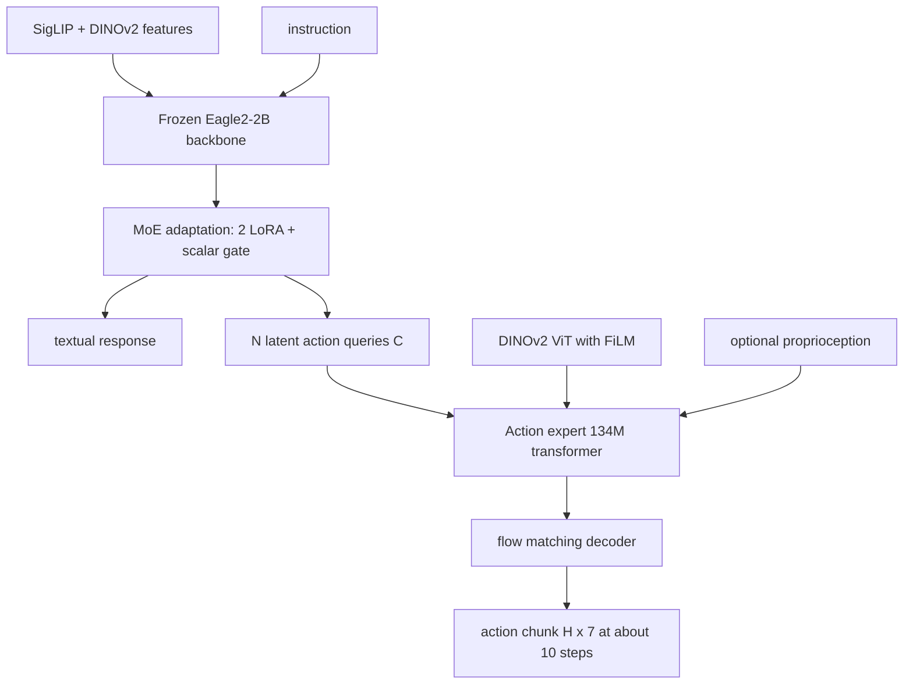

# InstructVLA: Vision-Language-Action Instruction Tuning from Understanding to Manipulation

- 本地 PDF：`papers/architecture/InstructVLA_2507.17520.pdf`
- arXiv：https://arxiv.org/abs/2507.17520
- 项目：含开源 VLA-IT 数据集与代码（HuggingFace ShuaiYang03/VLA_Instruction_Tuning，GitHub InternRobotics/InstructVLA）
- 年份：2025（ICLR 2026，v2 更新于 2026-03）
- 团队：上海人工智能实验室 + 浙江大学 + 中国科学技术大学（Shuai Yang / Hao Li 共同一作，Jiangmiao Pang 通讯）
- 阶段：VLA 指令微调范式（VLA-IT）—— 用 latent action 查询 + MoE 适配保住 VLM 多模态能力，同时换取推理引导的操作执行

## 一句话总结

InstructVLA 回答「VLA 微调是否必然摧毁 VLM 的多模态推理」这一开放问题：它在 Eagle2-2B 主干上加 $N{=}64$ 个可学习 latent action query 作为「动作输出轴」，用两阶段训练（650M 参数的动作预训练 → 仅 220M 参数的 MoE 适配指令微调）同时保持视觉问答能力并生成 flow matching 动作块。自建 SimplerEnv-Instruct（80 任务 / 1.1K trials）上，Generalist 版本达 46.2%，比微调后 OpenVLA 高 96%、比 GPT-4o 当外挂解释器的级联方案高 29%；SimplerEnv 上 Expert 版比 SpatialVLA 高 33.3%；多模态榜（MMMU 44.2、MMStar 56.2）几乎无损于基座 Eagle2，而 OpenVLA 微调后 MMMU 从 0 到 26.0 无法恢复。

## 核心技术

1. **Latent action query 接口** — $N$ 个可学习查询 attend 到 VLM 隐状态抽取任务相关 latent $\mathcal{C}\in\mathbb{R}^{N\times D}$，动作专家从 latent 生成动作而非直接从 VLM 词表生成；低层控制学习被隔离在 VLM 语义空间之外，这是防灾难遗忘的第一道墙；扫描实验显示 64 个 token 最优（16 太少限制行为多样性、128 训练效率下降）
2. **MoE 适配双路输出** — 冻结主干上挂两个 LoRA adapter（action adapter 与 language adapter）+ 一个 scalar head（4 层 MLP 按 token 隐状态分类出 gate 系数 $\lambda_i$），同一模型在文本回答与 latent 规划间自适应切换；激活可视化显示系统提示主要走语言支路、latent 生成时动作支路强激活且更关注名词/动词
3. **两阶段配方** — Stage 1 在异构操作数据上以 $\mathcal{L}=\mathcal{L}_{LM}+\mathcal{L}_{FM}$ 预训练动作专家与 latent embedding（含 language motion 文本监督）；Stage 2 以 1:7 的多模态-操作交错配比做指令微调（对比 ECoT/ChatVLA 的 1:3），额外混入通用多模态语料巩固理解
4. **Language motion 监督** — 把末状态窗口位移量化为 $v\in\{-1,0,1\}^6$ 离散运动码，经固定词表映射为「move forward / tilt up / close gripper」等自然语言口令，使 VLM 的词向量空间与末端运动原语对齐
5. **数据与基准** — GPT-4o 以每条 episode 首/中/尾三帧 + 真值指令标注出四类注释（场景 captioning、QA、command rewriting、context creation）构成 650K 样本 VLA-IT 集；并提出 SimplerEnv-Instruct 基准：50 个任务聚合题（新动词/多语言/属性指代/OOD 物体）+ 30 个情境推理题（隐式意图与子目标分解）

## 底层原理与数学推导

### 1. 语言运动码的构造（附录 D.1）

单帧状态为 $s_t = (p_t,\, q_t,\, g_t)$，其中 $p_t \in \mathbb{R}^3$ 为末端位置、$q_t \in \mathbb{R}^4$ 为 xyzw 四元数、$g_t$ 为夹爪标量。取长 $n$ 的重叠窗口求位移：

$$\Delta p = p_{t+N} - p_t, \qquad \Delta q = q_{t+N} \otimes q_t^{-1}, \qquad \Delta g = g_{t+N} - g_t$$

$\Delta q$ 转 XYZ Euler 角后取 pitch/yaw 分量，与裁剪后的平移、夹爪变化拼成 6 维描述子 $d = (d_x, d_y, d_z, d_{pitch}, d_{yaw}, d_{grip})$，再按对称阈值 $\theta$ 逐维三值化：

$$v_i = \begin{cases} +1, & d_i > \theta \\ 0, & |d_i| \le \theta \\ -1, & d_i < -\theta \end{cases}$$

全零编码记作 stop。这个 $\{-1,0,1\}^6$ 码经固定词典渲染成短语序列，作为语言损失的目标——相当于给轨迹打了可读的「运动字幕」。

### 2. MoE 门控的统一前向

冻结主干权重 $W_0$ 与两个 LoRA（$\mathrm{rank}{=}128$, $\alpha{=}256$）组合，scalar head 输出的门控系数按 token 重标定缩放因子：

$$h = W_0 x + \sum_{i=0}^{K} B_i A_i x \cdot \alpha_i \cdot \lambda_i, \qquad \alpha_i^{*} = \alpha_i \cdot \lambda_i$$

不同于 X-LoRA 分别训练 scalar head 与 adapter，本文 Stage 1 先按标准 LoRA 流程预训 action adapter，Stage 2 再引入 language adapter 与 scalar head 整体联合训练，且不加任何辅助均衡损失。

### 3. Flow matching 动作专家

动作块 $A \in \mathbb{R}^{H\times 7}$（$H{=}16$，7 维含夹爪），插值噪声样本 $A_\tau = \tau A + (1-\tau)\epsilon$，$\epsilon \sim \mathcal{N}(0, I)$：

$$\mathcal{L}_{FM} = \mathbb{E}\big[\| V_\theta(A_\tau, q_t) - (\epsilon - A) \|_2\big], \qquad \mathcal{L} = \mathcal{L}_{LM} + \mathcal{L}_{FM}$$

时间步按 $p(\tau) = \beta\!\left(\frac{s-\tau}{s};\, 1.5, 1\right)$ 采样（$s{=}0.999$，侧重高噪时刻）；推理用 $N{=}10$ 步 Euler 积分 $A_{\tau+1/N} = A_\tau + \frac{1}{N} V_\theta(A_\tau, q_t)$，从纯噪声起步。语言部分是标准交叉熵，两项以 1:1 直接相加。

### 4. 推理加速

自回归只生成到第一个 action query token 出现为止（贪心搜索），剩余 $N$ 个 latent query 在单次前向中并行解码；文本响应跨多个动作步缓存（利用其时间稳定性），latent action 每 2 步复用一次。A100 BF16 实测：带语言生成 2.51 Hz、纯动作 3.50 Hz、latent 缓存 4.96 Hz。

## 物理直觉解释

**Latent action query 像给 VLM 装了一条「隔离变压器的低压输出端」**。如果让一个 2B VLM 直接在词表里吐机器人关节 token（OpenVLA 路线），梯度会沿着整张语言网络回传，把本用来理解图灵奖冷知识和比萨斜塔的那套表征全部拉去拟合「夹爪闭合 0.3 秒」这种低层物理。InstructVLA 的做法是在主干旁边引出 64 个查询单元，让它们去「问」主干要任务意图摘要，再把这份摘要交给一个只有 134M 的小专家去做 flow matching。变压器的比喻恰如其分：高压侧（VLM 语义空间）电压等级不变，低压侧（控制回路）随便折腾，两侧只通过 latent 向量耦合。后果有两个：一是主干的多模态知识在微调后仍接近基座水平（MMStar 56.2 vs Eagle2 56.4），二是动作专家可以单独冻结或替换——作者甚至证明指令微调时冻结动作专家也够用。

**MoE 双 adapter 像「同一位翻译的两本词典」+ 一名调度员**。Language adapter 保持预训练习得的对话能力，action adapter 承载 Stage 1 学到的操作规划，两者共享同一个冻结主干。scalar head 逐 token 看一眼当前语境（隐状态分类），决定这笔账该往哪本词典里翻：可视化显示系统提示几乎全走语言支路，而生成 latent 时动作支路的蓝色激活显著加深，且动作支路对生成文本里的名词和动词格外敏感——这说明门控真正学到了「这句话里哪个词决定抓什么」。关键是没有任何辅助负载损失，机制上类似 X-LoRA 但训练流程一体化（220M 可训练参数完成整个第二阶段），远小于全量微调的代价。

**Language motion 像「教练口令教学法」**。零基础的学员不需要理解动力学，只需要记住「前进」「上抬」「顺时针转」「合爪」这几个口令的组合顺序就能开车。论文把每段轨迹压成六个维度的三值开关再加一句人类可读的口令序列，硬生生在连续控制量与 VLM 的词语空间之间架了桥。消融说明这不是可有可无的装饰：去掉 language motion 后总成功率掉 9.3%（Ave 52.9 → 48.4），因为视觉线索必须依附在可命名的运动概念上才能被 VLM 的注意力稳定锁定。

**Test-time thinking 是「把陌生题目翻译成自己做过的题」**。遇到「我想清理桌子，帮我挑个合适的工具」这类没有明确动作词的指令，模型先生成一段文字分析（桌上有什么、哪个物体满足功能要求），这段文字随后作为条件引导 latent 动作——相当于自产 System 1 提示。关掉思考直译执行时总分明显更低（整体相对增益 36.1%），最大涨幅集中在工具选择类常识题；这也暴露了一个反向教训：π0 在算术抓取真机测试中接近随机瞎抓，且把题板相机遮住后行为不变，说明它完全无视推理线索、过拟合到了腕部视野的抓取姿势——先想后动必须有保得住的 VLM 能力作为前提，否则 thinking 无从谈起。

## 工程细节与实操指南

- **模型尺寸速览**：VLM 主干 Eagle2-2B（语言侧 1.5B），动作专家 12 层 transformer、hidden 768、约 134M（约为 π0 的 300M 专家的一半不到）；Stage 1 只调 latent embedding + action LoRA 共 650M 参数，Stage 2 只调 MoE 适配共 220M 参数；两路输入分辨率不同（VLM 448×448，action expert 224×224）
- **标注流水线**：GPT-4o + 每条 episode 三帧（首/中/尾）+ **真值指令**打分器；论文明说仅靠 GPT-4o 会犯具身错误，这也是它做不了 OpenVLA 外挂解释器的根因；Bridge 数据集中无有效指令的 episode 被剔除
- **数据配比与训练时长**：Stage 2 以 1:7 多模态-操作交错采样；完整预训练约 27 小时@64×A100，VLA-IT 约 12 小时@64×A100；低配复现只用 8×A800 跑 2.5 天，Google Robot 各项还略高于主表（如 Apple In 39.3 vs 33.1）
- **推理部署**：单卡 A100 BF16；预测 16 步动作块但只执行 1 步（未开 chunking）；thinking 模式下每 20 个专家步触发一次自回归语言生成；实测三种模式频率 2.51 / 3.50 / 4.96 Hz
- **基准构成**：SimplerEnv-Instruct 共 80 任务 / 1.1K trials（约为 SimplerEnv 体量的三分之一），OOD 对象与指令由三人交叉校验；其中情境推理题要求推断隐式目标（如「我渴了但不要饮料」需选橙子）
- **真机协议**：WidowX-250 零样本厨房任务（Bridge 场景系）+ Franka Research 3 少样本（货架抓放与算术抓取）；算术任务对每个 case 用三种目标物各测一次，250 条训练样本与评测集分离
- **LIBERO 细节**：加入腕部视角图像（主图与腕图拼接缩放到一帧送 VLM）训练，8×A800、全局 batch 256；有腕视 95.8%、无腕视 89.2%，腕部信息价值 6.6 个点
- **状态输入的双刃剑**：论文假设本体状态帮助保留操作技能但可能损害 OOD 指令泛化——无需语言响应时带状态的版本更好，涉及指令跟随时增益有限，待确认（假设未经受控实验验证）

## 消融实验与分析

架构与监督消融（Table 3，WidowX Bot / Google Bot / Ave 成功率）：

| 动作专家配置 | WidowX Bot | Google Bot | Ave |
|---|---|---|---|
| 去 DINOv2 视觉输入 | 4.2 | 32.4 | 23.0 |
| 去 FiLM（仅 DINO） | 25.0 | 56.3 | 45.9 |
| 去 Language Motion 监督 | 15.3 | 65.0 | 48.4 |
| 完整 InstructVLA | 29.1 | 64.8 | 52.9 |

指令微调数据消融（Table 5 与 Table 11，SimplerEnv-Instruct 成功率）：

| 配置 | Task Agg. | Situated Reasoning | Overall |
|---|---|---|---|
| Expert（无任何 VLA-IT 数据） | 20.8 | 10.4 | 15.6 |
| Generalist (Bridge only) | 18.4 | 24.9 | 21.7 |
| **Generalist (Bridge + Fractal)** | **43.3** | **48.8** | **46.0** |
| OpenVLA(OXE) 直接评测 | 14.8 | 13.6 | 14.2 |
| OpenVLA + 同款多模态集 | 28.3 | 19.5 | 23.9 |
| OpenVLA + VL + VLA-IT | 30.5 | 17.4 | 24.0 |
| OpenVLA + VL + GPT-4o 解释器 | 38.8 | 32.4 | 35.6 |

主结果关键行（Table 2）：SimplerEnv 平均成功率 SpatialVLA-3B 45.9 / GR00T-N1.5-3B 36.0 / π0-3B 41.7 / Magma-8B(采样) 43.6 / OpenVLA(FT) 39.0 / OpenVLA(FT&GPT) 35.6 / **InstructVLA-Expert(S.) 61.2 / Generalist 49.7 / Generalist(S.) 54.9**；SimplerEnv-Instruct 总分 Generalist(S.) 46.9、Generalist 46.2；多模态 MMMU/MMStar InstructVLA 44.2/56.2 vs 微调后 OpenVLA 26.0/28.2 vs 基座 Eagle2 43.1/56.4。数据多样性消融（Table 4）：加 QA & captioning 使 41.7 → 46.2（+10.8%）。

**核心结论**：两组表共同支撑一个明确的因果链——动作性能的门槛在感知通路（去 DINOv2 使 Ave 从 52.9 跌到 23.0，加 FiLM 再捞回 7.0），而推理能力的保留必须在参数层面设闸：同样喂 VLA-IT 语料，靠全量微调的 OpenVLA 在 Situated Reasoning 上纹丝不动（19.5 → 17.4 甚至倒退）、Task Aggregation 也只到 30.5，而带着 MoE 闸门的 InstructVLA 达到 46.0，两者差距就是「训练范式」而非「数据」本身的贡献；外部挂一个 GPT-4o 也只能救到 35.6，因为 GPT-4o 自己都难以正确改写具身指令。另一条重要副线是指令覆盖面的作用：Situated Reasoning 对数据组成极敏感（Expert 10.4 → 加 Bridge 24.9，+139.4%），而 Task Aggregation 几乎不动（20.8 → 18.4），说明「语言多样性」与「情境接地能力」吃的是两种不同的营养。

## 技术权衡

| 选择 | 收益 | 代价 |
|------|------|------|
| Latent query 解耦动作生成 | 保住多模态能力 + 小型动作专家可独立替换/冻结 | VLM 与动作之间只有一个 bottleneck 向量，无法传递像素级细粒度线索，必须再给专家配一路 DINOv2+FiLM 补偿 |
| MoE 适配（冻结主干） | 220M 参数即可同时维持双能力，免灾难遗忘 | 干扰了「重训练策略改善操作上限」的可能：Expert 版 SimplerEnv-Instruct 只有 17.3/20.7，Situated 推理天花板低于敢全量微调的 OpenVLA-OFT 类方案 |
| Test-time thinking | 相对 +36.1%，复杂指令几乎免费提分 | 生成语言拖慢推理至 2.51 Hz，需要缓存与异步解码技巧才回到接近 5 Hz；语言输出错了会误导下游动作 |
| GPT-4o 自动标注 650K 样本 | 低成本高规模地造指令微调语料 | 论文自己承认 GPT-4o 有具身错误率，因此依赖真值指令兜底；该方法只能用在自带可靠指令的数据集（Fractal/Bridge） |
| 状态注入（可选） | 操作技能保留更好（Expert(S.) 61.2 vs 50.9） | 复杂指令跟随场景收益消失甚至负向，OOD 泛化风险增加 |

## 技术价值与演进定位

这篇工作的定位是「VLA 时代的 instruction tuning 教科书」：它把视觉指令微调（Visual Instruction Tuning）的概念完整搬进了具身领域，给出了从数据配方（650K 注释 + 四种类型学分类法）、架构闸门（latent query + MoE）到评测体系（SimplerEnv-Instruct 两套能力维度）的全套基础设施，且全开源。最有引用价值的实证结论是表 1 那一列惨烈的数字：auto-regressively 微调后的 OpenVLA 十三项多模态指标全线崩塌（MMMU 归零后再难恢复到 26.0），ECoT 连指令跟随本身都丢了（只会生成操作风格 CoT）——这说明「通用底座 + 具身微调」的默认做法在 2025 年以前一直在系统性透支 VLM 资产。工程角度它证明了小模型路线可行：1.5B 主干 + 134M 专家的总成本低于主流 7B 方案，却在 SimplerEnv-Instruct 反超 7B 全微调近一倍。局限在于闭环带宽：带 thinking 的 2.51 Hz 与不做推理的 3.50 Hz 仍然偏慢，SimplerEnv-Instruct 绝对分数也只有 46% 左右，情境推理的失败案例集中在长链工具使用与工件状态判断，这些是下一步（配合世界模型或记忆机制）的空间。

## 与其他论文的关系

- **OpenVLA / OpenVLA-OFT** — 同源对照的「反例组」：auto-regressive 全量微调让 OpenVLA 多模态能力归零且微调无法恢复（表 1 中 OpenVLA(FT) 各项均在个位到几十位徘徊），即便换上 OFT 的 FiLM/并行解码架构在推理型任务也不行（Fig. 6b 中 FFT 垫底）；本文则证明知识保留问题必须靠参数结构解决而非数据配比
- **π0 / π0.5（Knowledge Insulation）** — π0 用独立 flow matching 专家 + 隔离损失防止语言能力被动作梯度侵蚀，本文是同一哲学的不同实现（latent query 接口 + LoRA MoE），并在「thinking 是否反哺操作」上给出 π0 缺席的证据（算术抓取中 π0 忽略题板线索接近随机）
- **Magma / RT-2** — 自回归统一建模路线的代表：co-training 能保全一些多模态能力但操作上限不足（Magma-8B 采样后 43.6 仍落后 Generalist 约 6 个点），Fig. 6b 显示 AR 范式双指标皆输
- **ECoT** — 把 CoT 写进操作数据的先行者，但依赖 OpenVLA 式全参微调造成遗忘，且思维链模板固定（子任务+grounding）表达能力受限；本文换成自由形式文本推理 + 可关断的模式切换
- **SpatialVLA** — in-domain SimplerEnv 上最强专用专家之一（45.9），被 Expert(S.) 的 61.2 拉开 33.3%，用于论证 latent 预训练 +language motion 并不牺牲纯操作性能
- **RT-H（Belkhale et al.）/ LLARVA** — language motion 与「视觉-动作指令微调」概念的来源，本文将其扩展为四类注释 + 开放词汇改写的完整指令生态
- **GPT-4o（外挂 System 2）** — 大模型当解释器的级联方案天花板 35.6，止步于具身指令改写错误率高；这是对「API 大模型 + 小执行器」流行的 agentic 组合的一次实测反驳

## 精读问题

1. **Scalar head 的门控为何不需要辅助负载损失**：传统 MoE 若无均衡约束常出现专家坍塌，这里双 adapter 一路连接预训练能力、一路承载新任务，天然梯度冲突是否本身就是一种隐式均衡？若再加第三个 adapter（比如世界知识支路）该假设是否依旧成立？
2. **64 个 latent token 的最优性是否随任务复杂度漂移**：原子指令或许 16 个就够，长链情境推理（先选工具再开抽屉再放置）可能需要超过 128 个的时间结构；论文只在 WidowX/Google 平均分上扫了一遍，按推理深度分层统计后这个最优值还会保持吗？
3. **GPT-4o 标注误差上限是多少**：论文指出仅凭 GPT-4o 做具身指令解释会产生错误，那么 VLA-IT 这 650K 样本中「ground-truth instruction 兜底」实际拦截了多少比例的错误标签？有没有对标注一致性的抽检数字？
4. **状态输入伤害 OOD 泛化的假设如何证伪**：作者提到带状态模型在指令跟随任务上增益有限，但没有做「移除状态再评估已训好模型」的反事实实验，与 WholeBodyVLA 中 state 消融出现的反号现象是否指向同一机理？
5. **Thinking 何时反而有害**：36.1% 的平均增益掩盖了逐题方差（Fig. 10 显示少数 Situated 任务关掉 thinking 更稳），什么样的指令特征预示自回归分析会把动作引偏？能否学习一个动态决定是否触发语言的元控制器？
6. **1:7 的多模态-操作配比是怎么定的**：相比 ECoT/ChatVLA 的 1:3 减少了维护多模态能力的开销，但若降到 1:15 或升到 1:1，MMStar 与 SimplerEnv-Instruct 的帕累托前沿会移向哪里？论文为何没有给出这条扫参曲线？
