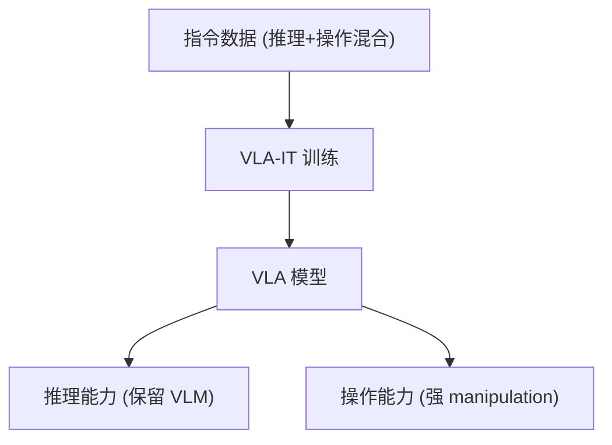

# InstructVLA: Vision-Language-Action Instruction Tuning

- 本地 PDF：`papers/architecture/InstructVLA_2601.03947.pdf`
- arXiv：https://arxiv.org/abs/2601.03947
- 年份：2026 (ICLR 2026)
- 团队：多机构
- 阶段：VLA 指令微调 — 保留 VLM 推理 + 强 manipulation

## 一句话总结

InstructVLA 提出 VLA 指令微调范式 (VLA-IT)：在保持 VLM 推理能力的同时获得强 manipulation 性能。SimplerEnv 上比 SpatialVLA 提升 33.3%，新 80 任务 benchmark 上比 OpenVLA 微调提升 96%。解决了 VLA 微调后"推理能力退化"和"操作能力不足"的冲突。

## 核心技术

1. **VLA-IT 训练范式** — 同时保留 VLM 推理 + 学习 manipulation
2. **指令微调** — 用指令数据微调，而非纯操作数据
3. **双能力保持** — 推理（VLM）和操作（VLA）同时优化

## 底层原理与数学推导

**核心机制**：VLA-IT 用混合指令数据训练——推理指令（"这个场景应该先做什么"）和操作指令（"执行这个动作"）联合优化，使模型同时保留 VLM 的推理和获得 VLA 的操作。

## 物理直觉解释

"VLA-IT"的直觉：传统 VLA 微调像"专攻一门课"——学会操作但忘了推理。VLA-IT 像"同时上课"——推理和操作两门课一起学，互相促进（推理帮助理解任务，操作验证推理）。结果是"既会想又会做"的机器人模型。

## 工程细节与实操指南

- 指令数据：推理指令 + 操作指令混合
- 训练：联合优化推理和操作目标
- 评估：SimplerEnv + 80 任务新 benchmark

## 消融实验与分析

| 消融/对比 | 结论 |
|---------|------|
| VLA-IT vs 纯操作微调 | 推理保持 + 操作更强 |
| 指令数据配比 | 推理/操作比例的影响 |
| vs SpatialVLA | SimplerEnv +33.3% |

## 技术权衡（Trade-off）

| 优势 | 劣势 |
|------|------|
| 推理+操作双能力 | 指令数据构建成本 |
| 大幅超越专用微调 | 双目标训练复杂度 |
| 直接服务"边想边做" | 推理与操作冲突的调和 |

## 技术价值与演进定位

InstructVLA 回答了一个核心问题：**VLA 微调是否必然牺牲 VLM 推理？**——答案是否定的，用 VLA-IT 范式可以同时保持。这直接关系到"机器人是否能用同一个模型既思考又行动"（G0.5 的 Native CoT 也在这个方向）。

## 与其他论文的关系

- **G0.5** — Native CoT 推理+动作统一序列；InstructVLA 用指令微调保持推理
- **SpatialVLA / OpenVLA** — 被超越的 VLA baseline
- **XL-VLA (CVPR 2026 Highlight)** — 跨具身 VLA，同方向

## 精读问题

1. VLA-IT 的指令数据配比——推理指令 vs 操作指令的比例？
2. 推理能力保持的机制——参数隔离还是多任务梯度平衡？
3. 推理增强操作——指令推理是否真的帮助了 manipulation？
