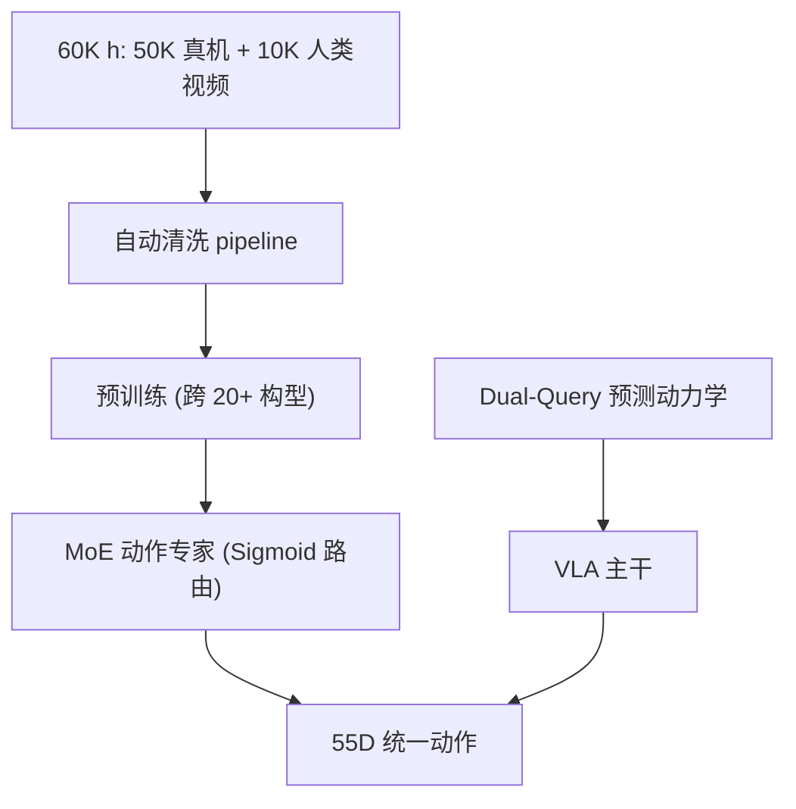

# LingBot-VLA 2.0: From Foundation to Application — Improving VLA Models in Practice

- 本地 PDF：`papers/architecture/LingBot-VLA2_2607.06403.pdf`
- arXiv：https://arxiv.org/abs/2607.06403
- 代码：https://github.com/robbyant/lingbot-vla-v2
- 年份：2026（7 月）
- 团队：蚂蚁灵波 (Robbyant, Ant Group)
- 阶段：工业级 VLA 2.0 — 60K 小时数据 + 20+ 构型 + MoE 架构

## 一句话总结

LingBot-VLA 2.0 是蚂蚁灵波的第二代工业级 VLA：60,000 小时预训练数据（50K 真机 + 10K 人类 egocentric 视频），覆盖 17 家厂商 20+ 机器人构型，统一 55 维动作空间（双臂关节+末端+夹爪+灵巧手+腰部+头部+底盘），MoE 动作专家（共享专家 + 多路由专家），dual-query 预测动力学蒸馏。GM-100 双臂操作超越 π0.5 和 GR00T N1.7，RTX 4090 推理 <130ms。全开源（GitHub + HF + 魔搭）。

## 核心技术

1. **60K 小时数据** — 50K 真机轨迹（20+ 构型）+ 10K 人类 egocentric 视频；自动化清洗（jerk 平滑度、URDF 投影对齐、SLAM 手轨迹恢复）+ 18 个原子动作标签自动标注
2. **55 维统一动作空间** — 14 臂关节 + 14 末端位姿(7×2) + 2 夹爪 + 12 灵巧手 + 4 腰部 + 2 头部 + 3 底盘 + 预留；零填充适配低 DoF 机器人
3. **MoE 动作专家** — 共享 expert（通用机器人先验）+ 多路由 expert（本体特定模式），Sigmoid 路由替代 Softmax（独立激活），可学习路由偏置做负载均衡
4. **预测动力学 (Dual-Query Distillation)** — 当前状态 query Q_t + 未来状态 query Q_{t+δ}；几何监督（LingBot-Depth 老师）+ 时序监督（DINO-Video, DINOv3 基础）

## 关键结果

| Benchmark | LingBot-VLA 2.0 | π0.5 | GR00T N1.7 |
|-----------|----------------|------|-----------|
| GM-100 (AgileX) | **66.2%** progress | 59.1% | 36.3% |
| GM-100 (Galaxea R1) | **34.6%** | 27.4% | - |
| 冰箱分拣 ID | **77.1%** | 65.3% | - |
| 冰箱分拣 OOD | **37.0%** | 30.3% | - |

## 底层原理与数学推导

**55D 动作空间**：14 臂关节 + 14 末端(7×2) + 2 夹爪 + 12 灵巧手 + 4 腰部 + 2 头部 + 3 底盘 + 预留。低 DoF 机器人零填充。

**MoE**：$a = \sum_k g_k(x) \cdot E_k(x)$，Sigmoid 路由 $g_k = \sigma(x \cdot W_k + b_k)$ 独立激活（非 Softmax 竞争），$b_k$ 可学习负载均衡偏置。

**Dual-Query Distillation**：$Q_t$（当前状态）+ $Q_{t+\delta}$（未来状态）两个 learnable query，几何监督（LingBot-Depth）+ 时序监督（DINO-Video）。

## 物理直觉解释

"55 维统一动作"的直觉：给所有机器人定一个"标准动作表"——不管你是双臂还是人形，动作都写在这个表里，用不上的维度填零。就像国际音标——不同语言都能用同一套符号标注。

"Sigmoid 路由"的直觉：Softmax 是"只能选一个专家"（竞争），Sigmoid 是"每个专家独立决定是否激活"（协作）——不同的机器人构型可以同时激活多个共享模式 + 自己的特定模式。

## 工程细节与实操指南

- 数据清洗：jerk 平滑度过滤、URDF 投影对齐、SLAM 手轨迹恢复
- 标注：18 个原子动作标签自动标注
- 推理：RTX 4090 <130ms
- 开源：GitHub + HuggingFace + 魔搭

## 消融实验与分析

| 消融 | 结论 |
|------|------|
| 相对 vs 绝对关节动作 | 相对 55.0% vs 绝对 33.7% |
| MeanStd vs MinMax 归一化 | MeanStd 保留纠错动态范围 |
| L2 vs L1 | L2 55.0% vs L1 46.4% |
| MoE vs Dense | MoE 验证误差更低 |
| 末端 vs 关节空间 | 关节利于大调整，末端利于接触 |

**核心结论**：工业 VLA 的"配方"是数据清洗 + 相对动作 + MeanStd 归一化 + L2 loss + MoE——每个工程决策都有量化依据。

## 技术权衡（Trade-off）

| 优势 | 劣势 |
|------|------|
| 60K 小时工业级数据 | 清洗 pipeline 复杂 |
| 55D 统一空间跨本体 | 简单本体冗余 |
| <130ms 推理 | 大规模预训练成本 |

## 技术价值与演进定位

LingBot-VLA 2.0 是"世界模型 VLA 路线工业化"的里程碑——同一团队 6 个月内从 LingBot-VA (RSS 2026 论文) 到 2.0 产品。它和 XR-1 (ICML Oral) 构成 2026 年开源 VLA 双标杆：XR-1 偏学术突破（UVMC 表征），LingBot 2.0 偏工业落地（数据工程 + MoE + 部署优化）。

## 与其他论文的关系

- **LingBot-VA (RSS 2026)** — 前身：因果视频-动作世界模型；2.0 加入 MoE + 55D 空间 + 预测动力学
- **XR-1** — 开源 VLA 对标：UVMC vs LingBot 数据工程
- **π0.5 / GR00T N1.7** — 被超越的 baseline
- **Green-VLA** — 同为工业 VLA，五阶段训练 vs LingBot 的 MoE+数据

## 精读问题

1. 55 维动作空间对灵巧手的覆盖——12 维灵巧手是否足够复杂操作？
2. DINO-Video 时序监督的细节——3D RoPE + 因果时序注意力的设计？
3. MoE 路由的负载均衡机制——Sigmoid 路由偏置如何避免 expert 坍塌？
4. 60K 小时数据的清洗 pipeline 哪些环节可复用？
