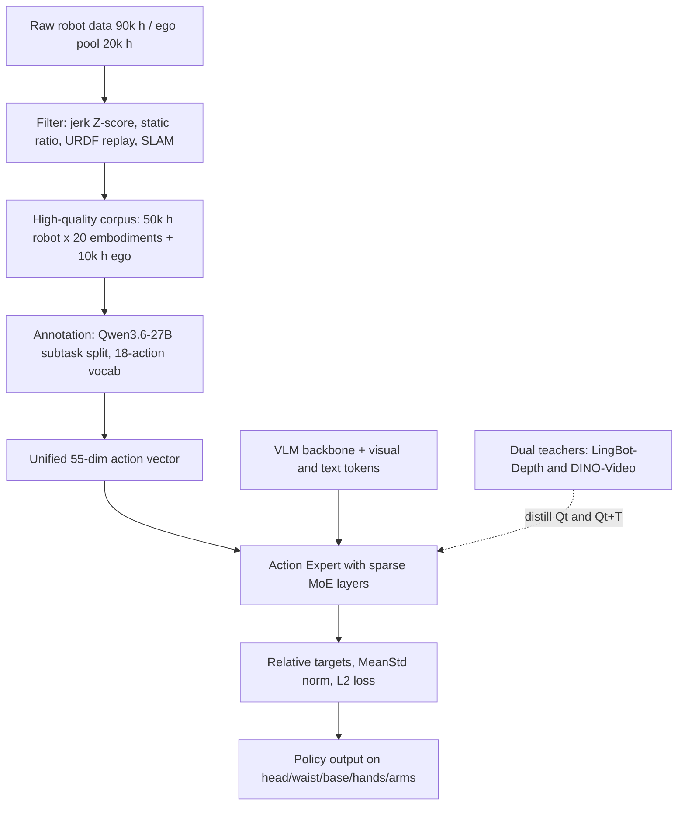

# LingBot-VLA 2.0: From Foundation to Application — Improving VLA Models in Practice

- 本地 PDF：`papers/architecture/LingBot-VLA2_2607.06403.pdf`
- arXiv：https://arxiv.org/abs/2607.06403
- 代码：https://github.com/robbyant/lingbot-vla-v2 （checkpoints：HuggingFace robbyant/lingbot-vla-v2）
- 年份：2026（工业技术报告，2026-07，未标注会议）
- 团队：蚂蚁灵波 Robbyant（Kecheng Zheng 任 Project Lead；致谢 Ant Digital Technologies Phecda Laboratory 与 Genrobot.ai 提供 egocentric 数据）
- 阶段：工业级 VLA 系统报告 —— 60K 小时多构型数据引擎 + 55 维全身动作空间 + token-level 无辅助损失 MoE + 双 query 预测蒸馏

## 一句话总结

LingBot-VLA 2.0 沿三个功能域推进前代：重构数据管线并整理约 60,000 小时预训练语料（约 90K 小时原始真机数据清洗出 50K 小时、覆盖 20 个机器人构型；约 20K 小时 egocentric 视频池过滤出 10K 小时）；把动作空间从标准双臂扩展为含头部 2 维、腰部 4 维、底盘 3 维、灵巧手 12 维的 55 维统一向量；以 LingBot-Depth（几何）与自研 DINO-Video（因果时序）为双教师，对当前/未来两个可学习 query 做预测蒸馏。GM-100 九任务 generalist 混合训练设定下，Agilex Cobot Magic 上 progress/success 达 66.2/34.4，高于 π0.5 的 59.1/32.2、GR00T N1.7 的 36.3/17.8 和前代 LingBot-VLA 1.0 的 58.2/30.0；并在 Astribot S1 与 Cobot Magic-ARX X5 两个移动平台上完成长时程移动操作验证。

## 核心技术

1. **Sigmoid 路由的退化防线**：**大规模异构数据引擎** — 20 个构型的单臂/双臂/半人形/人形平台（含 Franka、AgileX、Astribot S1、Unitree G1、Fourier GR-2 等），总自由度跨度 8~32 DoF；三段式清洗：动作/状态的 jerk 三阶差分与速度/加速度 Z-score 过滤（阈值按构型单独设定）、静止信号占比 >95% 剔除、URDF 投影重放由人工核对视频-状态错位；egocentric 侧用 VLM 预筛选 + SLAM + MANO 手姿重建出世界系手部轨迹
2. **Dual-Query 两个查询的分工**：**55 维统一动作表示** — 14 臂关节 + 14 末端位姿（每臂 XYZ+四元数共 7 维）+ 2 夹爪 + 12 灵巧手关节 + 4 腰部 + 2 头部 + 3 移动信号，剩余 4 维预留；低维构型对应字段补零填充；以策略频率 30 Hz 为主（Galaxea R1Pro/R1Lite 为 15 Hz）
3. **相对目标在双臂任务上的失效**：**Token-level 无辅助损失稀疏 MoE** — MoE 层替换动作专家全部 transformer block 的 FFN；采用 fine-grained expert segmentation + shared expert isolation（1 个共享专家保留通用先验，多个路由专家提供特化容量）；Sigmoid 亲和度替代 Softmax 路由（沿用 DeepSeek-V3），修正偏置只参与 Top-K 选择、不进入混合权重，实现动作学习主目标之外的免辅助损失负载均衡
4. **单任务回退被均值掩盖**：**Dual-Query 蒸馏的预测动力学** — 在视觉与文本 token 之外追加两个 query：$Q_t$ 指向当前观测、$Q_{t+T}$ 指向前瞻 T 步（即 action chunk 大小）；深度教师 LingBot-Depth 以 L1 监督几何，因果视频教师 DINO-Video（DINOv3 初始化 + 块状因果时序注意力 + 3D-RoPE，5M 视频 clip 训练）以 Frobenius 范数监督运动感知表征
5. **MeanStd 长尾的建模替代**：**自动标注闭环** — Qwen3.6-27B 将视频切分为子任务并生成指令，动作词表封闭为 18 类（15 个操作原语 move/pour/push/pull/rotate/open/close/fold/unfold/wipe/stir/cut/press/attach/detach + 辅助标签 transit/idle/other）；同一交互的抓-搬-放合并为一个子任务，仅在物体改变、动作类型改变或持续停顿时切分边界

## 底层原理与数学推导

### 1. 世界系轨迹存储与相机系训练

Egocentric 手部轨迹统一存放在世界坐标系，训练采样到第 $t$ 帧时再用该帧外参变换到相机系：

$$p_\tau^{C} = T_{C_t \leftarrow W} \, p_\tau^{W}$$

其中 $p_\tau^{W}$ 为世界系手部轨迹，$T_{C_t \leftarrow W}$ 为采样帧 $t$ 的相机外参。这一设计把「存储格式」（世界系，跨视频可拼接）与「训练表示」（当前相机系，与图像特征对齐）解耦，并在推理期将手部运动与头盔相机的自身运动分离。

### 2. Sigmoid 路由的无辅助损失 MoE

MoE 层接收调制后的输入 $u^{\ell,t}$（第 $\ell$ 层 token $t$），输出为共享专家加 $\lambda$ 缩放的路由专家组合：

$$m^{\ell}(u^{\ell,t}) = E^{(s)}_{\ell}(u^{\ell,t}) + \lambda \sum_{j \in R(u^{\ell,t})} g_{\ell,j}(u^{\ell,t}) \, E^{(r)}_{\ell,j}(u^{\ell,t})$$

每个专家是中间宽度更小的 SwiGLU MLP：

$$E(u) = W_{down}\big(\mathrm{SiLU}(W_{gate}\,u) \odot W_{up}\,u\big)$$

路由器在 FP32 下计算线性 logits $z_{\ell,j} = u_{\ell,t}^{\top} e_{\ell,j}$（$e_{\ell,j}$ 为可学习路由嵌入），然后用 Sigmoid 而非 Softmax 得到亲和度：

$$s_{\ell,j}(u^{\ell,t}) = \mathrm{Sigmoid}(z_{\ell,j}(u^{\ell,t}))$$

关键在于「选择」与「加权」解耦——选中集合由带偏置亲和度决定，而混合权重仍由无偏亲和度归一化：

$$g_{\ell,j} = \frac{s_{\ell,j}}{\sum_{k \in R(u)} s_{\ell,k}}, \qquad R(u) = \mathrm{TopK}_j\big(s_{\ell,j} + b_{\ell,j},\, K\big)$$

偏置按负载偏差符号缓慢更新（跨 micro-batch 与分布式 rank 累计计数 $n_{\ell,j}$）：

$$b_{\ell,j} \leftarrow b_{\ell,j} - \gamma \cdot \mathrm{sign}\Big(n_{\ell,j} - \frac{1}{N_r}\sum_{k=1}^{N_r} n_{\ell,k}\Big)$$

由于 $b_{\ell,j}$ 不出现在 $g_{\ell,j}$ 中，梯度不会因均衡压力而被污染——这是论文明确强调的理由：保持动作控制学习的主目标纯净。

### 3. 双教师的蒸馏目标

深度教师 $[D_t, D_{t+T}]$ 与视频教师 $[Z_t, Z_{t+T}]$ 分别来自 LingBot-Depth 与一次因果前向的 DINO-Video，投影模块带 cross-attention 做维度对齐：

$$
\begin{aligned}
L_{depth} &= \mathbb{E}\Big[\big\|\mathrm{Proj}_{depth}(Q_t) - D_t\big\|_1 + \big\|\mathrm{Proj}_{depth}(Q_{t+T}) - D_{t+T}\big\|_1\Big] \\\\
L_{video} &= \mathbb{E}\Big[\big\|\mathrm{Proj}_{video}(Q_t) - Z_t\big\|_F^2 + \big\|\mathrm{Proj}_{video}(Q_{t+T}) - Z_{t+T}\big\|_F^2\Big]
\end{aligned}
$$

DINO-Video 老师是本文的系统级投入之一：块状因果时序注意力保证每个时刻的特征只依赖当前与过去帧（与 VLM 的因果推理结构一致），3D-RoPE 提供时空位置编码，16 帧均匀采样并按有效帧率赋绝对时间编码，以区分真实时长不同的 clip。在 LARYBench 四项评测中它拿到三项最佳：Composite Robot 71.97（vs V-JEPA 2 的 70.43、DINOv3 的 69.06）、RoboCOIN 0.20、AgiBotWorld-Beta 0.19（越低越好）。

## 物理直觉解释

**相对动作像学「打方向盘的微调」而不是背「城市地图」**。绝对关节角要求模型记住每个任务里机械臂摆出的全局姿态，而不同任务、不同物体摆放下的绝对姿态差异巨大；相对目标只需预测「这一步往哪儿动多少」。论文给出的量化证据是：四个评测任务上 relQpos 的标准差只有 absQpos 的 31%~37%，池化后从约 0.80 降到 0.28——预测目标从「回归一个远处的全局姿态」变成「回归一簇集中在零附近的小修正」，学习难度对应的方差被直接压缩了 65%。同样的道理，人类学写字时记的是笔画运笔而非每个字的绝对坐标位置。

**Sigmoid 路由像「医院分诊台」而不是「选秀节目」**。Softmax 让所有专家在同一分母下互相竞争，得分低者几乎拿不到流量——这对语言建模合理，但机器人数据里的相似动作可能同时需要「通用关节协调」与「构型特定动力学」两种能力叠加；独立 Sigmoid 激活允许一个 token 同时挂靠多个专家，如同病人可以同时看全科与专科。而无辅助损失的偏置机制则像分诊台的**挂号名额调配**：负载过热的专家降一点挂号优先级（Top-K 选择层面冷 却），但真正出诊时的贡献权重仍按医术（无偏亲和度）分配——管理压力与专业判断互不干扰。

**Dual-Query 蒸馏像驾驶培训里「先预判、再看结果」**。模型必须同时回答两个问题：现在的把手离杯子有多深、盒子边缘朝哪个方向（几何，问 LingBot-Depth 老师），以及照这样下去画面会怎么演化（因果时序，问 DINO-Video 老师）。深度老师提供的是静态但精确的空间骨架，视频老师提供的是动态但模糊的趋势感；两者互补的原因是几何监督无法表达「碰撞后物体会倒」这类事件级动力学，而纯视频表征又缺乏毫米级的距离信息。给未来帧 $Q_{t+T}$ 也接上这两个监督，等于强迫当前网络在做动作之前就形成对动作后果的预期表征。

**55 维统一向量像一个万能转接插座**。所有构型的状态与动作都写进同一张表：用不到的字段填零。这个做法的代价是稀疏（Astribot S1 总共只用约 25 维有效字段），收益则是跨本体共享一套动作专家参数——任何构型的数据都在为同一个网络做梯度更新，而不是每种机器各训一个头。世界系轨迹存储则好比导航软件把路网存在统一的地理坐标系里，导航时才投影到你眼前的行车视图。

## 工程细节与实操指南

- **真机数据清洗规则（可直接复用）**：
  - jerk（三阶有限差分）与速度/加速度的一阶、二阶导数 Z-score 超阈值即弃，阈值**按构型分别标定**
  - 一段 episode 中全部状态与动作信号几乎不变的时长占比 >95% 即剔除（防静止垃圾数据）
  - 用 URDF 把机器人重放进图像平面，人工标注员比对投影与视频找错位（视频-状态时间轴不一致）
  - 模糊、严重遮挡、丢帧、多视角错位的视频由人工在标注流程中过滤
- **Egocentric 数据链路**：VLM 预筛（剔除非第一人称、漫游拍摄、无清晰手-物交互、无可操作物体、出现非操作者手部的视频，节省后续 SLAM 与手姿估计成本）→ 无标注视频跑 egocentric SLAM 取内参与逐帧外参 → MANO 手姿估计恢复相机系手关节 → 结合相机位姿提升至世界系 → 质控（有效手部帧占比 <20% 剔除、SLAM 相机运动的二阶突变检测、违反人体生理学的手势/双手间距/活动范围样本剔除）
- **标注工程**： overhead 视角与腕部相机联合送入 Qwen3.6-27B 以消歧夹爪-物体交互；物体词表开放（word cloud 高频为 cup/bottle/box/bowl），动作词表封闭 18 类；子任务时长分布中 move 占频率 58.2%、transit 占 22.1%，fine-grained 操作如 cut（平均时长 35.6s）、fold（32.4s）频率极低但时长长；idle 被过滤不进训练
- **MoE 实现要点**：路由 logits 必须用 FP32 计算（数值稳定性）；$\lambda$ 是路由输出的缩放因子；每个 MoE 层 1 个共享专家 + $N_r$ 个路由专家、每 token 仅激活 K 个；偏置每轮更新后可选居中以阻止累计漂移；待确认：论文未披露 $N_r$、$K$、$\gamma$ 与 chunk 大小 $T$ 的具体数值
- **动作空间消融基线配置**：相对关节目标 + joint 动作空间 + MeanStd 归一化 + L2 损失（四任务平均成功率 55.0）
- **开源情况**：代码、checkpoint 在 GitHub/HuggingFace 公开；论文未报告推理延迟与部署硬件占用，外部流传的「RTX 4090 <130ms」说法在本 PDF 正文与表格中均无对应实验，商业声明待确认：仅见于项目主页/社区口径，无论文级验证
- **VLM 骨干**：正文只说 v2.0 换用了 grounding 能力更强的 VLM 骨干，未点名具体型号，待确认

## 消融实验与分析

四项设计选择在 GM-100 的 4 个真实双臂任务上消融（Barcode Scan / Scoop Rice / Squeeze Ketchup / Take Bowl from Microwave），成功率为 %，默认配置为加粗行：

| 配置对比 | Barcode | Scoop Rice | Ketchup | Microwave | 平均 |
|---|---|---|---|---|---|
| 绝对关节目标 absQpos | 13.3 | 22.7 | 55.0 | 43.8 | 33.7 |
| **相对关节目标 relQpos（默认）** | 58.7 | 42.7 | 41.7 | 76.8 | **55.0** |
| EEF 末端空间替代关节空间 | 24.0 | 60.0 | 81.7 | 58.3 | 56.0 |
| MinMax 归一化 | 48.0 | 26.7 | 61.7 | 53.6 | 47.5 |
| Q01-Q99 分位数归一化 | 42.7 | 44.7 | 63.3 | 39.1 | 47.4 |
| **MeanStd 归一化（默认）** | 58.7 | 42.7 | 41.7 | 76.8 | **55.0** |
| L1 损失 | 45.0 | 28.7 | 61.7 | 50.0 | 46.4 |

支撑性统计量（解释上面每一行的机理）：

| 分析对象 | 关键数值 |
|---|---|
| relQpos 方差压缩 | 池化标准差 0.80 → 0.28；四任务分别为 abs 的 31%/34%/36%/37% |
| 任务-池化分布对齐 Gap（joint / EEF） | Barcode 0.68 / 1.73；Scoop Rice 0.55 / 1.09；Ketchup 1.59 / 0.96；Microwave 0.71 / 0.72 |
| MinMax 归一化后分布 | 标准差 0.15，1%-99% 区间约 [-0.42, 0.40]，超出 $\vert x\vert>1.5$ 占比 0.0% |
| Q01-Q99 归一化后分布 | 标准差 0.32，主体区间约 [-0.96, 1.01]，实际实现不做裁剪，超界占比 0.2% |
| MeanStd 归一化后分布 | 标准差 0.95，区间约 [-3.22, 3.30]，超界占比 10.0%（长尾真实保留） |
| MoE vs Dense（等激活参数） | Dense 0.6B 对照 MoE 1.6B-A-0.6B，10k~50k step 内 MoE 训练损失与验证动作误差全程更低 |

**核心结论**：这份消融给出的是一条完整的「动作配方」证据链——相对目标用方差压缩把平均成功率从 33.7 拉到 55.0（+21.3）；MeanStd 以 0.95 的归一化标准差保住长尾大幅纠偏动作，超 MinMax/Q01-Q99 约 7.5~7.6 个点，且问题不是裁剪丢信息（Q01-Q99 不裁剪也只有 47.4），而是动态范围被压扁；L2 比 L1 高 8.6 个点，因为相对目标的高密度区就在零附近的小修正区。同时它诚实地暴露了规则的边界：EEF 与 joint 平均值接近（56.0 vs 55.0）但偏好相反——Barcode 上分布对齐 Gap 解释了胜负（joint 0.68 远小于 EEF 1.73），而 Scoop Rice 上 EEF 以更大的 Gap 反超、Microwave 上两者 Gap 几乎相同却 joint 更好，说明分布对齐只是必要条件之一，任务的动作空间物理结构（笛卡尔轨迹规整度 vs 姿态可达性）同样决定成败。

## 技术权衡（Trade-off）

| 选择 | 收益 | 代价与证据 |
|------|------|-----------|
| Generalist 混合任务训练 | 单策略共享原语、跨任务泛化（Retrieve keychain 在 Cobot Magic 上达 100.0/100.0） | 部分任务峰值受损：Block sorting 成功率从前代 10.0 掉到 0.0；Sort snacks 进度分 74.4 → 66.2；R1 Pro 微波炉取碗从前代 97.5/100.0 跌到 65.0/30.0 |
| 55 维统一动作空间 | 跨构型共享一套动作专家 | 低维构型大量补零字段（如 Moz1 有效仅 16 维），有效容量稀释；Bowl/Microwave 结果表明构型间仍有视角与运动学差异（两平台整体差距 31.6 个进度点） |
| 相对动作目标 | 目标方差缩小到 31%~37%，总体提升明显 | 全局配置信息丢失：Ketchup 上反而劣于绝对目标（41.7 vs 55.0），接触丰富任务的终点姿态仍需绝对参考 |
| 预测蒸馏（双教师） | 未来 query 迫使表征具备后果预期， grounding 相关任务涨点最多（toy bone 两平台 +17.5/+25.0） | 需额外训练并维护 LingBot-Depth 与 DINO-Video 两个教师模型，且感知收益主要以定性图（Fig. 13）呈现，缺少量化消融，待确认其独立贡献幅度 |
| OOD 泛化 | 姿态扰动 + 未见过物体的双重变化下仍全面领先 π0.5（冰箱任务 37.0/13.3 vs 30.3/6.7） | 冰箱分拣从域内 77.1/60.0 崩到 OOD 37.0/13.3，同时换物体类别与初始位姿的组合扰动仍是最大软肋 |

## 技术价值与演进定位

这篇报告的价值在「配方公开」而非单点算法创新：MoE 均衡公式取自 DeepSeek-V3，视频老师建立在 DINOv3 之上，双系统架构沿袭 π0 系列——但它把这些建筑材料组装成了一份**可复现的工业级 VLA 生产流程**，且全链路开源（数据管线规则、18 类动作词表、normalize/loss/target 的四种消融结论都写进了正文）。数据侧的杠杆尤其值得记录：20K 小时 egocentric 池最终只留 10K 小时（50% 留存率）、90K 小时真机原始数据只留 50K 小时（56% 留存率），说明规模化路线的真实成本主要发生在清洗与质控，而非采集。评价维度上也做了稀缺的诚实处理：既报 progress 也报 success，暴露了大量「进展高但最后放置/释放失败」的任务（Pack eggs 进度 44.4 但成功率 0.0）；既报域内也报 OOD。对业界而言，它是「20 构型 + 全身 DoF（头/腰/底盘/灵巧手）+ 移动操作」这条产品化路线目前最完整的技术披露；相比之下，延迟、功耗、成本与安全等部署指标完全缺席，仍是博客层信息。

## 与其他论文的关系

- **π0 / π0.5** — 同样的「VLM 骨干 + 独立动作专家」双系统骨架；差异有三处：π0.5 的动作专家是密集 FFN + flow matching，本文换成全 MoE 化的动作专家并用回归式连续动作；π0.5 靠开放环境家庭数据打开放世界泛化，本文靠 20 构型数据打跨本体泛化。GM-100 上直接对比 66.2 vs 59.1（Cobot Magic）、34.6 vs 27.4（R1 Pro），但注意 π0.5 并非在其原生训练数据上评估
- **GR00T N1 / N1.7** — NVIDIA 的开源跨本体路线，同样包含 flow-matching 动作头与跨构型预训练；在 GM-100 两个平台上均为最弱 baseline（36.3/17.8 与 16.4/5.6），提示其人形导向的数据分布在桌面双臂任务上的迁移代价较大
- **OpenVLA** — 自回归离散 token 动作的单臂时代代表；本文用 55 维连续向量 + 整块相对目标回归取代离散化，并以 mixture 训练覆盖到全身 DoF；两者代表了「离散生成式」与「连续回归式」两条动作解码路线
- **DeepSeek-V3** — 本文 MoE 的方法来源：Sigmoid 亲和无偏加权 + 偏置只进 Top-K 的 auxiliary-loss-free 负载均衡，首次被移植到大规模多构型 VLA 预训练，论文甚至专门论证了为什么不能引入会污染动作梯度的辅助均衡损失
- **LingBot-VLA 1.0（A Pragmatic VLA Foundation Model）** — 直接前代与最强对照：v2.0 在相同 generalist 评测下整体高出 8.0/4.4 个点（Cobot Magic），增量全部来自数据扩容、动作空间扩展与预测蒸馏三项，构成少见的「可控变量升级」案例
- **ForceVLA / SAMoE-VLA / AtomicVLA** — 均为 MoE-VLA 变体，但它们按单一维度给专家预设语义（力反馈、场景层级、原子技能）；本文反其道行之，让 token 依自身特征自由选专家，相关工作中被列为对照而非被继承
- **DINOv3 / V-JEPA 2** — 作为潜在视频老师的候选在同台评测（LARYBench，Table 3）：DINO-Video 在 Composite Robot 与两个回归指标上超过二者，论证了「因果时序注意力 + 机器人数据继续自蒸馏」相对通用视频基础模型的必要性

## 精读问题

1. **Sigmoid 路由的退化防线**：Sigmoid 路由去掉了专家间的强竞争，但同时引入了独立激活的多专家叠加——在没有 Softmax 归一化的情况下，是什么防止所有 token 收敛到「人人抢同一个共享专家」的退化状态？偏置更新的步速 $\gamma$ 若设置过大，是否会在 Top-K 层面制造振荡？
2. **Dual-Query 两个查询的分工**：Dual-Query 蒸馏中 $Q_t$ 与 $Q_{t+T}$ 各自查什么：前者从深度老师那里学到的是当前场景几何还是当前臂端可达性？后者在 chunk 末端步长 $T$ 取多大时会开始失去因果一致性？论文未披露 $T$ 的数值，其敏感性如何验证？
3. **相对目标在双臂任务上的失效**：相对动作目标在 Squeeze Ketchup 上反而失败（41.7 vs 绝对目标的 55.0），而该任务恰好是双臂协同挤压——相对目标是否天然不利于需要绝对基准姿态的双臂闭合任务？能否按任务自适应地在 rel 与 abs 之间插值？
4. **单任务回退被均值掩盖**：混合任务训练让 R1 Pro 的微波炉取碗从前代 97.5/100.0 掉到 65.0/30.0，generalist 平均增益掩盖了哪些单任务灾难性回退？这些回退与新 VLM 骨干的替换有无因果关系？
5. **MeanStd 长尾的建模替代**：MeanStd 归一化保留了 10% 超出 $\vert x\vert>1.5$ 的长尾样本，这暗示相对动作分布本身具有何种重尾结构？换成 tanh-squash 或分位数回归建模动作分布，能否既保住 MeanStd 的动态范围又抑制尾部噪声？
6. **padded 零字段的语义歧义**：20 个构型共享 55 维向量，padded 字段的监督信号为零——attention 是否会把「字段恒为零」错误地理解为「身体部位静止」？若某个任务需要灵巧手而训练时它从未被激活，路由 experts 会学出怎样的表征？
