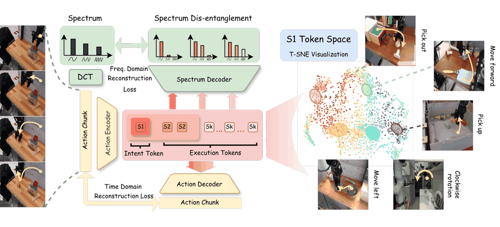
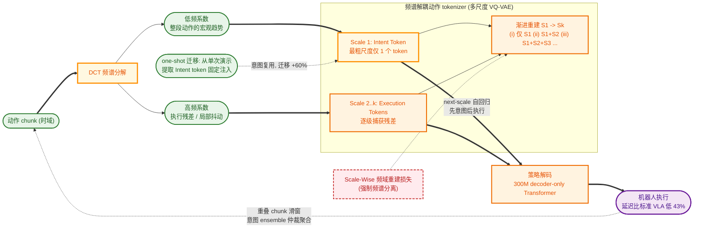

# MINT: Mimic Intent, Not Just Trajectories

- 本地 PDF：`papers/architecture/MINT_2602.08602.pdf`
- arXiv：https://arxiv.org/abs/2602.08602
- 代码：https://github.com/RenMing-Huang/MINT
- 年份：2026 (RSS 2026)
- 团队：上海交大 + 上海创新研究院
- 阶段：频域意图-执行解耦 —— DCT 分解动作频谱

## 一句话总结

MINT 提出模仿学习应模仿"行为意图"而非"轨迹细节"。用 DCT 将 action chunk 分解为低频 Intent Token 和高频 Execution Tokens，多尺度 VQ-VAE 强制频谱分离。one-shot 迁移比 baseline 高 60%。RSS 2026。

## 九问速览

1. **Problem**：模仿学习逐帧复制轨迹细节，换布局/换任务/延长视野即失效，技能无法复用
2. **Bottleneck**：时域 token 化把宏观趋势与高频残差混在同一表示里，策略过拟合执行细节而非行为意图
3. **Insight**：DCT 频谱天然分层——低频系数编码整段动作的意图，高频系数只是执行残差，可分而治之
4. **Method**：多尺度 VQ-VAE 渐进重建强制频谱分离（S1 意图 token + 多级执行 token），next-scale 自回归 + 意图 ensemble
5. **Evidence**：LIBERO 平均 98.7%、CALVIN ABCD→D 链长 4.57（π0.5 为 4.15）；one-shot 迁移 0.77 vs 微调 0.17
6. **Ablation**：Scale-Wise 频域 loss 把 LIBERO-Long 82.8%→93.4%（时域反降）；Intent ensemble 85.8%→93.2%
7. **Assumption**：意图可由动作低频成分承载；频谱切分点设定合理；意图跨任务/环境可复用
8. **Failure**：DCT 切分点需手动设定且随任务/本体变化；意图多样性受训练集上限约束；长视野仍需组合
9. **Opportunity**：语言条件化意图、意图级规划、切分点自适应搜索未探索

| 维度 | 论文答案 |
|---|---|
| Perception | RGB + 语言指令 + 本体状态（策略输入含 proprio）；真机双相机 RGB；无深度/触觉 |
| Closed-loop | 闭环：重叠 chunk 滑窗 + 意图 token 仲裁的 ensemble 聚合；推理延迟比标准 VLA 低 43% |
| Correction | 无显式重规划；靠意图一致性调制重叠 chunk 权重保持长程稳定 |
| Deployment | BridgeDataV2 60k 轨迹预训练 tokenizer/动作头 → 真机每任务仅约 20 demos（2.4k 帧、10Hz）多任务微调 |

## 核心技术

1. DCT 频域分解：低频系数 → Intent Token, 高频系数 → Execution Tokens

*论文 Figure 1（p1）：Fig. 1: Left: We propose Spectrally Disentangled Action Tokenizer, which encodes action chunks into*

2. 多尺度 VQ-VAE + 渐进重建，强制频谱分离
3. Intent-to-Execution 自回归推理
4. One-Shot 迁移：提取单次演示的 Intent token 驱动新任务执行

## 底层原理与数学推导

**1. DCT 频域分解**：将 action chunk 沿时间维做离散余弦变换，每个动作维度 $d$ 的系数为

$$
F_{k,d} = \sum_{h=0}^{H-1} \hat{A}_{h,d} \cos\left[\frac{\pi}{H}\left(h + \frac{1}{2}\right) k\right], \quad k = 0, \ldots, H-1
$$

其中 $\hat{A}$ 为分块后的动作序列，$F \in \mathbb{R}^{H \times D}$ 为频域表示。低频系数 $F_{0:d_1}$ 编码整段轨迹的宏观趋势（意图），高频系数编码局部抖动与精细运动（执行细节），由此 $c_{1:k_1}$ → Intent (S1)，$c_{k_1+1:k_2}$ → S2，依此类推。

**2. 多尺度残差量化（SDAT）**：连续潜变量 $f^{(0)}$ 通过多尺度残差量化分解为离散 token 集 $S = \{s_1, \ldots, s_K\}$（$s_k \in \{1,\ldots,V\}^{l_k}$，V 为 codebook 大小），尺度越粗 token 越少（最粗的 S1 仅 1 个 token），细尺度逐步捕获残差。

**3. 渐进重建目标**：模型被训练为分别用 (i) S1 单独、(ii) S1+S2、(iii) S1+S2+S3 ... 渐进重建频域轨迹，配合频域重建 loss，强制不同尺度的 codebook 专门化于不同频率分量。推理时 Intent-based ensemble 用意图 token $s_1$ 的兼容性动态调制重叠 chunk 的聚合权重，比时域/动作域 ensemble 更优（详见消融表）。

## 物理直觉解释

**人类看别人操作一遍就能模仿，因为学的是"意图"而不是"动作细节"**：你学会了"用手把杯子拿起来放到嘴边"这个意图，而不是记住"肘关节转 37.5 度、手腕转 12.3 度"这些执行细节；换一个起点、换一个杯子的位置，你仍能完成喝水。MINT 用 DCT 把一段动作轨迹"翻译"成频谱：低频系数描述"这一整段动作在干什么"（宏观趋势，即意图），高频系数描述"手抖了一下、手指微调了 2 毫米"这类执行残差。Intent Token = 意图，Execution Token = 细节——这就是"Mimic Intent, Not Just Trajectories"的含义。

**多尺度 token 就像画一幅画的分层过程**：先用 1 个 token 定下"这是一只猫"（S1 最粗尺度），再加几个 token 画出轮廓（S2），最后加大量 token 填充毛发细节（S3+）。渐进重建训练强制每一层只负责它那一层的"信息量"——如果让 S1 直接重建全部细节，它就会偷懒去记高频噪声，频谱分离就失效了。消融表里 Scale-Wise Time-Domain 降到 82.8%（过拟合高频噪声）正是这个失败的实证。

**Intent token 的复用价值在 one-shot 迁移**：迁移时只需从一次演示中提取 S1 意图 token 并固定它，让策略重新生成执行 token。这相当于"照着教练的动作要领，用自己的身体做一遍"——意图跨任务、跨环境可复用（+60% 迁移性能），而执行 token 则随本体和场景自适应生成，这是时域 tokenizer 无法做到的解耦。

- **Tokenizer**: 多尺度 VQ-VAE, 3-4 个 scale levels
- **Policy**: Next-scale autoregression, LeRobot 兼容
- **训练**: LIBERO, Calvin, MetaWorld, Raven, BridgeData v2
- **真机**: Franka, ~20 demos/task

## 工程细节与实操指南

- **Tokenizer**: 多尺度 VQ-VAE, 3-4 scale levels, DCT 频谱分解
- **Policy**: Next-scale autoregression from Intent (S1) to Execution (S2-Sk), LeRobot 兼容
- **Training**: LIBERO, Calvin, MetaWorld, Raven, BridgeData v2 联合训练
- **Real robot**: Franka, ~20 demos/task, one-shot transfer via Intent token injection
- **Inference**: 43% lower latency than standard VLA (Intent token enables early planning)
- **Disturbance robustness**: Success rate drop only 5.1% under perturbations (baseline 22.7%)

## 实验协议清单

| 项目 | 论文设置 | 来源与备注 |
|---|---|---|
| 观测 | RGB + 语言 + 本体状态；真机为 6-DOF Piper-X 双相机 RGB；仿真用 LIBERO/CALVIN/MetaWorld 官方观测 | Sec.5.D、附录 |
| 动作空间 | 连续动作 chunk 的多尺度离散 token（VQ-VAE codebook 256-1024，码维 32-64）；MINT-4B 动作专家为 300M decoder-only Transformer | 附录 Table V/VI |
| 控制频率 | 真机演示以 10 Hz 录制；执行频率未单独报告 | 附录 real-world 细节 |
| 重规划频率 | 滑动窗口重叠 chunk，逐 chunk 重观测 + 意图 ensemble 聚合 | Sec.3 |
| 动作 horizon | H=16（LIBERO/MetaWorld/BridgeV2）、32（CALVIN）；真机演示 horizon 90 帧 | 附录 Table V |
| 数据 | 预训练：BridgeDataV2 60k+ 轨迹（24 环境 13 技能）；真机每任务 20 demos 共 2.4k 帧（5.4K 样本）；迁移评测基于 LIBERO-90 去除 LIVING ROOM 子集 | Sec.5.C/D |
| 奖励 | 无(RL-free)：渐进重建（频域）+ next-scale 自回归交叉熵 | Sec.3 |
| Reset | 未报告（沿用各基准协议） | — |
| 成功定义 | LIBERO/MetaWorld 成功率；CALVIN 连续 5 任务链长（500 指令链）；真机 Bayesian 后验成功率（字母标记统计可区分性） | Sec.5 |
| 评估次数 | CALVIN 500 指令链；真机每任务 20 trials；one-shot 迁移三设定（New Task/Layout/Extended Horizon） | Sec.5.B-D |
| 随机种子 | 未报告 | — |
| 扰动测试 | 有：LIBERO-PLUS 七类扰动（光照/视点/指令等），avg 80.1 vs OpenVLA-OFT 71.4、π0.5 65.0 | Table II |
| 真机 | 有：Piper-X 4 任务（3 seen + 1 零样本 Stack Cups）×20 trials，超 π0/π0.5* 约 29% | Sec.5.D |
| 算力 | 未报告 GPU 型号/数量/时长；推理延迟比标准 VLA 低 43% | 摘要、Sec.5 |
| 特权信息 | 无 | — |

**附录陷阱自查**：
- privileged 信息：无
- reward shaping：无（重建+自回归损失）
- reset 难度：未报告（基准默认）
- eval budget：真机 20 trials/任务并做 Bayesian 后验分析，统计规范
- 底层控制栈：无强 controller 兜底
- 数据优势：无——真机每任务 20 demos 与基线同源；π0.5* 用同一 VLM 骨干+同数据对照，控制变量充分

## 消融实验与分析

| 消融因子 | 设置对比 | CALVIN 平均链长 | LIBERO-Long 成功率 |
|---------|---------|----------------|-------------------|
| 重建目标 | 仅 Terminal 时域 loss | 4.36 | 87.8% |
| 重建目标 | +Terminal 频域 loss | 4.41 | 88.2% |
| 重建目标 | +Scale-Wise 时域 loss | 4.06 | 82.8%（过拟合高频噪声而退化） |
| 重建目标 | +Scale-Wise 频域 loss（Ours） | 4.54 | 93.4% |
| 动作集成 | 无 ensemble | 4.09 | 85.8% |
| 动作集成 | Temporal-based ensemble | 4.32 | 89.2% |
| 动作集成 | Action-based ensemble | 4.10 | 90.4% |
| 动作集成 | Intent-based ensemble（Ours） | 4.57 | 93.2% |

**核心结论**：频谱解耦目标与意图集成的贡献可独立验证——Scale-Wise 频域重建相比时域重建把 LIBERO-Long 从 82.8% 拉到 93.4%（CALVIN 链长 4.06→4.54），证明强制频谱层级分离是"意图与执行解耦"的必要条件；Intent-based ensemble 又在此基础上把无集成基线的 85.8% 提升到 93.2%，说明意图 token 不仅用于迁移，还能在重叠 chunk 聚合时充当"语义一致性"的仲裁信号，两者叠加共同构成 MINT 的增益。

## 技术权衡（Trade-off）

| 优势 | 劣势 |
|------|------|
| LIBERO 平均 98.7%、CALVIN ABC→D 链长 4.57（超过 π0.5 的 4.15、RoboVLMs 的 4.49） | DCT 最优频谱切分点需手动设定，不同任务/本体可能不同 |
| LIBERO-PLUS 七类扰动泛化 avg 80.1 vs 最强基线 OpenVLA-OFT 71.4、π0.5 65.0；论文报告扰动下成功率比最强基线高 15% | 多尺度 VQ-VAE 训练复杂度高，渐进重建需精心调度 |
| One-shot 迁移 +60% over baselines；真机仅需 ~20 demos/task，超越 π0.5 达 29% | 意图 token 的可迁移性受数据集意图多样性上限约束 |

## 技术价值与演进定位

MINT 和 FAST Tokenizer 是 2025-2026 年动作 tokenization 的两条互补路线——FAST 用 DCT 做频域压缩（效率优先），MINT 用 DCT 做频谱解耦（泛化优先）。MINT 的核心价值在于把"意图"变成了可操作的计算对象：意图 token 既可以用于 one-shot 迁移（+60%）、又可以充当推理时 ensemble 的仲裁信号（85.8→93.2%）、还可以解释策略的扰动鲁棒性（LIBERO-PLUS 七类扰动全维度领先）。这为后续"语言条件化意图""意图级规划"等工作提供了离散、可注入、可复用的中间表示，是"频域思考动作"范式从效率向语义泛化的关键一步。

## 与其他论文的关系

- **FAST Tokenizer** — 同为 DCT 频域路线：FAST 用 DCT 系数量化做压缩与 token 效率，MINT 用 DCT 做语义频谱解耦，两者可组合（π0-FAST 即 FAST 的落地案例）
- **XR-1** — UVMC 统一 vision-motion coding，在表示层面做统一；MINT 在动作侧的频域分解是另一层解耦，正交互补
- **π0.5** — 主要对比基线：CALVIN 链长 4.57 vs 4.15、真机 +29%，MINT 以 4B 参数达到更强长程组合泛化
- **UnifiedVLA / RoboVLMs** — 时域动作 tokenization 的代表：有离散 token 但无频域语义结构，在 CALVIN 5 任务成功率（86.1% vs 82.6%）上被 MINT 超越

## 精读问题

1. DCT 分解的意图/执行边界在哪？最优频谱切分点如何确定，是否可端到端学习而非手动设定？
2. Intent token 的跨任务泛化——不同类任务的 Intent 是否共享相似 codebook 分布？如何量化"意图空间"的结构？
3. Scale-Wise 时域 loss 为何会过拟合高频噪声（82.8% 退化）？频域 loss 与时域 loss 的梯度景观差异如何解释这一现象？
4. Intent-based ensemble 的权重调制具体如何计算（$s_1$ 兼容性的度量方式）？与 temporal ensembling 在动态场景下的相对优劣？
5. MINT-Zero（无语言条件）的意图注入机制能否扩展到跨本体迁移（不同机械臂的意图 token 对齐）？
6. 粗尺度 S1 仅 1 个 token 的容量上限——极长 horizon 任务的意图是否需要多 token 分层意图表示？
