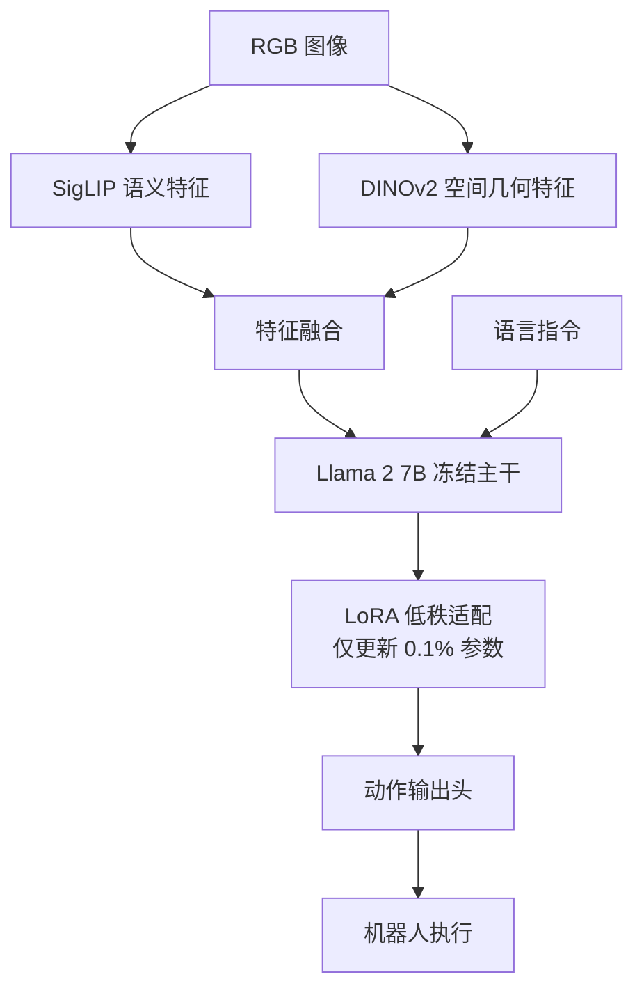

# OpenVLA: An Open-Source Vision-Language-Action Model

- 本地 PDF：`papers/architecture/OpenVLA_Open_Source_Vision_Language_Action_Model_2406.09246.pdf`
- arXiv：https://arxiv.org/abs/2406.09246
- 年份：2024
- 阶段：开源端到端 VLA

## 一句话总结

OpenVLA 是首个完全开源、可商用、性能比肩闭源 RT-2 的 7B 级端到端 VLA 模型，基于双视觉编码器（DINOv2+SigLIP）和 Llama 2 7B 骨干，在 Open X-Embodiment 97 万条轨迹上预训练，通过 LoRA 实现消费级 GPU 低成本微调。

## 核心技术

1. **双视觉编码器（DINOv2 + SigLIP）** — SigLIP 提取语义特征以支撑常识推理，DINOv2 提取空间几何特征以支撑精细操作，二者融合实现语义与空间的双重精准感知
2. **LoRA 高效微调** — 冻结预训练主干权重，仅在 Transformer 注意力层插入低秩矩阵，实现单张 24G 显存 GPU 上完成 7B 模型的全流程微调
3. **大规模 VLM 预训练权重复用** — 基于 Llama 2 7B 语言模型骨干，完美继承大模型的语义常识推理与开放世界理解能力

## 底层原理与数学推导

OpenVLA 是首个完全开源、可商用、性能比肩闭源 RT-2 的端到端 VLA 模型。它基于开源 VLM 骨干，在 Open X-Embodiment 数据集的 97 万条机器人轨迹上进行预训练，完美继承了大模型的语义常识推理能力，同时实现了端到端的动作输出，是 2024 年工业落地的首选开源方案。

**1. 双视觉编码器架构**

OpenVLA 采用双视觉编码器融合架构，兼顾语义理解与空间特征提取：
- **SigLIP 编码器**：负责提取图像的语义特征，理解物体的类别、属性与功能，支撑模型的常识推理能力；
- **DINOv2 编码器**：负责提取图像的空间几何特征，精准定位物体的位置与姿态，支撑模型的精细操作能力。

两个编码器的特征融合后输入 Llama 2 7B 语言模型骨干，实现了语义与空间的双重精准感知。动作输出沿用 RT-2 的离散化方案：动作向量 $a$ 被均匀分箱为 token

$$
a_{tok} = \lfloor (a - a_{min}) / \Delta \rfloor, \quad \Delta = \frac{a_{max} - a_{min}}{N_{bin}}
$$

（论文取 $N_{bin} = 256$ 档），LLM 以自回归方式逐 token 生成 7 维动作，再解码回连续值执行。

**2. LoRA 高效微调核心数学推导**

OpenVLA 的核心工程突破，是实现了在单张 24G 显存 GPU 上，即可完成 7B VLA 模型的全流程微调。LoRA（低秩适配）是核心解决方案。

LoRA 的核心思想是冻结预训练模型的主干权重，仅在 Transformer 的注意力层中插入低秩矩阵，通过更新低秩矩阵来完成微调，大幅降低了显存占用与训练成本。核心公式如下：

$$
W = W_0 + \frac{\alpha_{lora}}{r} \Delta W, \quad \Delta W = A B^T
$$

其中：
- $W_0$ 为预训练模型的原始权重，冻结不更新；
- $A$ 和 $B$ 为可学习的低秩矩阵，秩为 $r$，远小于权重矩阵的原始维度；
- $\alpha_{lora}$ 为缩放系数，用于平衡微调的更新幅度，避免破坏预训练权重。

**OpenVLA 的双视觉编码器就像人类的两套视觉系统**：SigLIP 像大脑的"这是什么"通路（腹侧视觉通路），识别物体的类别和功能——这是一个杯子、可以用来喝水；DINOv2 像大脑的"它在哪"通路（背侧视觉通路），精准判断物体的位置和姿态——杯子在桌子右上角、杯把朝左。两套系统协同工作，既知道"拿什么"，也知道"怎么拿"。消融实测印证了这一分工：去掉 DINOv2 后成功率从 45.6% 跌到 40.6%，而完全去掉 OpenX 大规模预训练则从 76.3% 暴跌到 45.6%——语义与空间信息缺一不可。

**LoRA 微调像在已有知识基础上做"页边批注"**——不重写整本教科书（冻结 Llama 2 7B 主干），只在注意力层插入低秩矩阵 $\Delta W = AB^T$ 记录"新技能要点"。这样既保住 VLM 预训练的常识（知道杯子能装水），又学会机器人特有的操作映射（看到杯子→输出抓取动作）。相比全量微调，可训练参数仅占 0.1% 左右，单张 24G 显卡即可完成，学习率必须压到 $5\times10^{-5}$——批注太重会撕毁原书。

**动作离散化的"选档"逻辑**：7B LLM 不能直接输出连续浮点数，OpenVLA 把每个动作维度均匀分成 256 档（像收音机的调频刻度），LLM 自回归"报档位"。离散化的代价是精度受档位宽度限制（不如扩散模型连续），但换来的是完全复用 LLM 的自回归生成机制——这是它 10Hz 实时推理与 RT-2 同源架构的根源。

## 工程细节与实操指南

**1. LoRA 微调超参工业最佳实践**
- 秩 $r=32$ 或 $64$，$\alpha_{lora}=64$ 或 $128$；
- 学习率：$5 \times 10^{-5}$，远低于全量微调的学习率，避免灾难性遗忘，破坏 VLM 原有的语义常识；
- 梯度累积：24G 显存仅能支持 Batch Size=4~8，必须设置梯度累积步数=4，等效实现大 Batch Size 的稳定更新。

**2. 部署优化**：采用 INT4 量化 + KV-Cache 优化后，7B 模型可在单张 RTX 4070Ti GPU 上实现 10Hz 的实时推理，满足工业落地要求。

**3. 核心性能**：零样本场景下，在 WidowX、UR5、RT-1 机器人上的表现比肩 550 亿参数的闭源 RT-2-X 模型，平均成功率超越 Octo 与 RT-1-X。

## 消融实验与分析

BridgeData V2 8 任务平均成功率（表 9）：

| 消融因子 | 设置对比 | 平均成功率 |
|---------|---------|-----------|
| OpenX 预训练 | OpenVLA（OpenX 全混合 + 双编码器） | 76.3 ± 4.8% |
| OpenX 预训练 | OpenVLA-Bridge（仅 Bridge 数据） | 45.6 ± 5.6%（-30.7 绝对） |
| 双视觉编码器 | OpenVLA-Bridge-SigLIP（仅 SigLIP） | 40.6 ± 5.5%（-5.0） |
| 量化精度（阻断控制速度混淆） | bfloat16 | 70.0 ± 5.1% |
| 量化精度 | int8 | 74.4 ± 4.9% |
| 量化精度 | int4 | 68.8 ± 5.2% |
| 量化精度（原始速度混合评估） | bfloat16 / int8 / int4 | 71.3% / 58.1% / 71.9% |

**核心结论**：OpenX 大规模预训练是最大增益来源——仅用 Bridge 单数据集微调使成功率从 76.3% 跌至 45.6%（-30.7 绝对），且降幅集中在物理泛化与语义泛化类别，语言 grounding 不受影响，说明数据多样性解锁的是泛化而非指令跟随；双编码器中 DINOv2 再贡献 5.0 个点（45.6→40.6）；量化消融则表明 int4 在阻断速度混淆后性能与 bf16 持平（68.8% vs 70.0%），int8 反而最高（74.4%），为部署精度选择提供了依据。

## 物理直觉解释

OpenVLA 像一个"会看图的通用翻译官"——看一张操作场景的图片，听一句"把杯子放到盘子上"，直接输出"机械臂往右前方移动 15cm，夹爪闭合"。之前的 RT-2 也做这件事，但 RT-2 是闭源的 55B 巨无霸，OpenVLA 用 7B 开源模型 + LoRA 微调就做到了同等水平。

双视觉编码器（DINOv2 + SigLIP）是关键——DINOv2 擅长理解空间结构（"杯子在盘子的左上方"），SigLIP 擅长理解语义（"这是杯子、这是盘子"）。两者互补，缺一不可。就像一个人需要"空间感"和"常识"两种能力才能操作物体。

## 技术权衡（Trade-off）

| 优势 | 劣势与工程代价 |
|------|----------------|
| 首个完全开源可商用的 7B 级端到端 VLA 模型，性能比肩闭源 RT-2，零样本泛化能力远超同期开源小模型 | 7B 模型的推理部署依然需要中端以上 GPU，边缘端部署难度较大 |
| 双视觉编码器架构，兼顾语义理解与空间感知，完美适配开放世界的复杂语言指令任务 | 回归输出头在多模态动作分布上的拟合能力弱于扩散模型，高频精细操作表现不及 Octo |
| LoRA 微调方案实现了消费级 GPU 的低成本微调，大幅降低了工业落地的门槛 | 微调超参敏感，学习率过高极易导致灾难性遗忘，丢失预训练的语义常识能力 |

## 技术价值与演进定位

OpenVLA 是开源 VLA 模型的工业级标准。它彻底打破了闭源模型的垄断，让普通开发者与企业可以低成本、低门槛地使用、微调、部署端到端 VLA 模型，是 2024 年 VLA 模型从实验室走向工业规模化落地的核心推手。技术层面的遗产同样深远：双视觉编码器（SigLIP 语义 + DINOv2 空间）成为后续 VLA 视觉融合的常见范式；LoRA + 量化（int4 部署仅 7.0GB 显存）确立了消费级 GPU 微调 7B 级策略的工程配方；其对 OpenX 数据价值的量化（-30.7 绝对成功率）反过来论证了数据基础设施（Open X-Embodiment 的 RT-X 混合）的不可替代性，为后续 π0/π0.5 以更大数据规模超越它提供了清晰的对标坐标。

## 与其他论文的关系

- **RT-2** 是 OpenVLA 的开源对标目标，OpenVLA 首次在开源生态中实现了比肩 RT-2 的端到端 VLA 性能。
- **Open X-Embodiment** 是 OpenVLA 的预训练数据底座（97 万条轨迹），提供了跨机型多任务训练数据。
- **Octo** 与 OpenVLA 形成开源路线的两种代表：Octo 以扩散策略和小参数量见长，OpenVLA 以大模型语义推理见长，二者在适用场景上互补。
- **Mobile ALOHA / ACT** 的动作分块与 CVAE 技术为 OpenVLA 所继承，作为其模仿学习的基础动作生成范式。
- **LoRA** 技术源自 NLP 领域的参数高效微调（Parameter-Efficient Fine-Tuning），OpenVLA 首次将其大规模应用于机器人 VLA 模型的微调。

## 精读问题

1. OpenVLA 的双视觉编码器（SigLIP + DINOv2）特征是如何在模型中融合的？是拼接、加权求和还是注意力融合？融合位置（输入层 vs 深层）对性能的影响？
2. OpenVLA 的动作输出头具体采用什么结构？与 RT-2 的离散化动作 Token 输出有何本质差异？
3. LoRA 的秩 $r$ 和缩放系数 $\alpha_{lora}$ 如何影响微调效果？是否存在最优组合的理论依据？
4. 7B 模型在 INT4 量化 + KV-Cache 优化下实现 10Hz 推理，量化对动作精度的具体影响有多大？为何 int8 在阻断控制后反而最高（74.4%）？
5. 256 档离散化在精细操作（毫米级插接）上的精度上限如何评估？档位数与 LLM 自回归生成成本如何权衡？
6. 双编码器的互补性是否随任务类型变化——语义泛化任务（如"取出紫色葡萄"）与物理泛化任务的增益分别来自哪个编码器？
