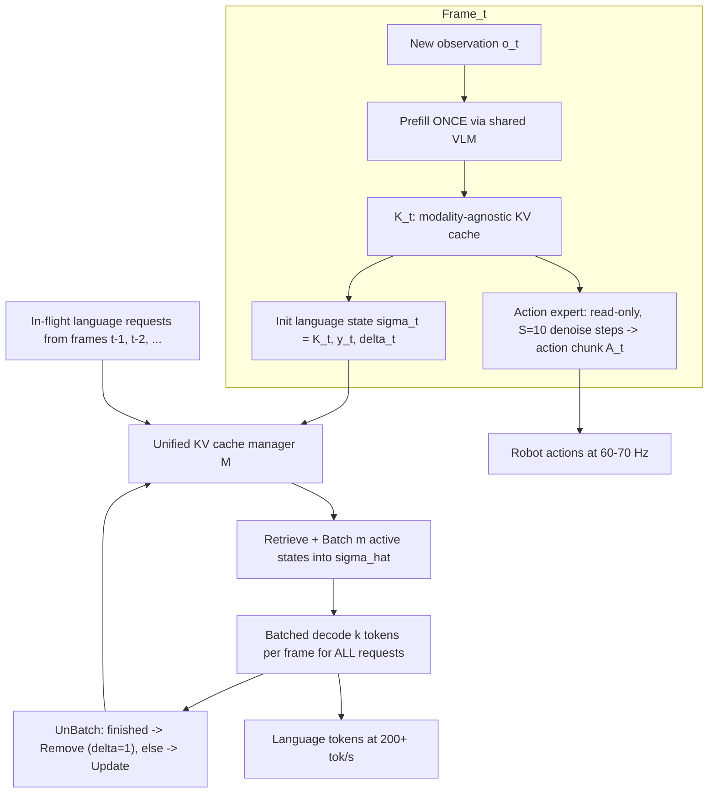
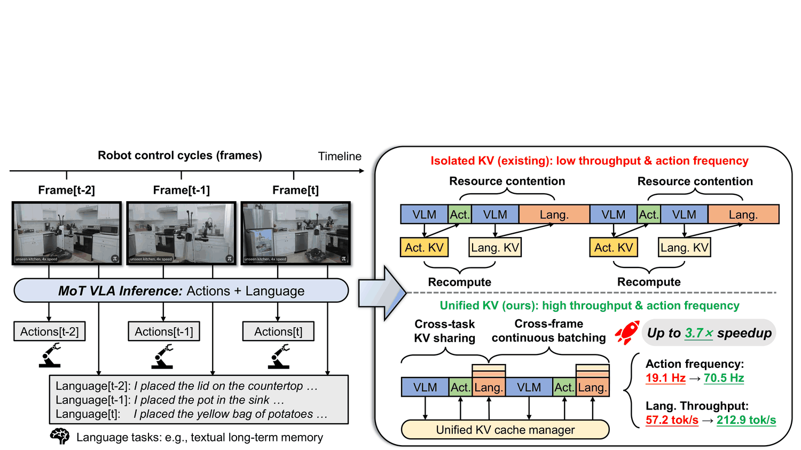
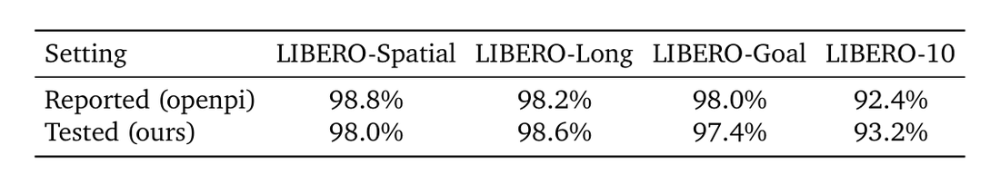

# OxyGen: Unified KV Cache Management for Vision-Language-Action Model Inference under Multi-Task Parallelism

- arXiv: https://arxiv.org/abs/2603.14371
- Source: https://arxiv.org/abs/2603.14371
- Project: 
- Local PDF: `/Users/luogu/physical_intelligence/papers/architecture/OxyGen_2603.14371.pdf`
- Year: 2026
- Category: VLA inference systems / KV cache
- Priority: medium

## 一句话总结

**问题**：MoT 结构 VLA（如 π0.5）架构上支持动作+语言多任务并行，但现有推理系统孤立执行——同一观测被每个任务重复 prefill、语言解码阻塞动作硬实时，端侧单 GPU 上动作频率与语言吞吐此消彼长；**洞察**：共享观测产生的 KV cache 本身是模态无关的一等共享资源，瓶颈在"孤立 KV 管理"而非算力；**机制**：统一 KV 管理器实现跨任务 KV 共享（一次 prefill 扇出到只读的动作专家与追加式的语言专家）+ 跨帧连续批解码（在飞语言请求跨帧组批、每帧推进 k 步）；**证据**：相对孤立执行最高 3.7× 加速，动作频率 19.1→70.5 Hz、语言吞吐 57.2→212.9 tok/s 同时达成，真机 Jetson AGX Thor 每帧推理 1030→393 ms 且动作关键路径 198 ms < 333 ms 执行窗口。

## 九问速览

1. **Problem**：端侧机器人要边操作边说话/记记忆，MoT VLA 多任务推理在单 GPU 上重复 prefill + 互相阻塞，频率吞吐只能二选一
2. **Bottleneck**：孤立 KV cache 管理：重复 prefill 致 1.4× 慢化；任务争抢致 2.6× 慢化（基线 49.9→19.1 Hz）
3. **Insight**：共享观测的 KV cache 模态无关，可跨任务复用（消重复计算）、跨帧续批（消资源争抢）
4. **Method**：统一 KV 管理器 M：跨任务 KV 共享 + 跨帧连续批解码；可恢复状态 σ=(K,y,δ)，每帧预算 k 步离线校准
5. **Evidence**：最高 3.7× 加速；动作 19.1→70.5 Hz、语言 57.2→212.9 tok/s；真机 Thor 每帧 1030→393 ms
6. **Ablation**：仅 KV 共享短解码 1.4×；加跨帧批解码后长解码维持 ~60 Hz（RTX 4090）/~27 Hz（Thor）
7. **Assumption**：MoT 骨干（π0.5 类双专家）；动作专家只读 prefill cache；k 可离线校准、负载近似稳定
8. **Failure**：只验证 π0.5 两专家；单帧多观测到达时 prefill 主导、单请求动作频率下降；其他 MoT 骨干未验证
9. **Opportunity**：K>2 专家（共享 VLM+多 LoRA）；投机/并行解码锚定 σ；与 token 剪枝、异步执行管线正交叠加

| 维度 | 论文答案 |
|---|---|
| Perception | 输入流：每帧新观测 o_t（多路 RGB，真机 3 路 224×224 + 语言指令）只 prefill 一次成模态无关 KV，动作/语言专家共享消费 |
| Closed-loop | 高频反馈闭环能力：每控制周期产新动作块——RTX 4090 实测 70.5 Hz 峰值/~60 Hz 持续、Jetson Thor ~27 Hz；真机动作关键路径 198 ms，嵌入 333 ms 执行窗口 |
| Correction | 推理延迟对纠错的影响：基线每帧 1030 ms 阻塞下一控制周期（无法及时响应扰动）；OxyGen 393 ms/帧、且语言生成 195.4 ms 藏在动作执行之后，下一帧即可感知-纠错 |
| Deployment | 端侧算力约束：面向单 GPU 机器人平台（RTX 4090 / Jetson AGX Thor）；内存开销 +15%（6.43→7.41 GB 峰值），平均功耗最高降 47%（293.5→154.4 W），每请求能耗降 78%（117.4→25.8 mJ） |

## 核心技术

*论文 Figure 1（p1）：Figure 1 | Left: An example of deploying a Mixture-of-Transformers (MoT) Vision-Language-Action (VLA*

信息流拆法（把"每帧的算力账单"重排）：

1. **旧范式（isolated execution）**：动作任务一次前向（prefill+去噪）、语言任务另一次前向（prefill+逐步解码），同一观测被编码两遍、产生两份相同 KV；语言不解码完不结束，帧预算被击穿。openpi 官方框架即此范式；Parallel 基线用 CUDA MPS 把两任务放两进程共抢一块 GPU，仍不消重复 prefill。
2. **新范式两段式（Algorithm 1）**：第一段——新观测 o_t 只 prefill 一次得 K_t，向内扇出两个"KV 视图"：动作专家把 K_t 当只读上下文跑 S 步去噪出动作块 A_t；语言侧初始化可恢复状态 σ_t=(K_t, y_t, δ_t) 并登记请求号 r_t。第二段——管理器把全部在飞请求（含历史帧的）沿 batch 维堆成 σ̂，一次前向给每个请求解 k 个 token，完成的 Remove、未完成的 Update 持久化到下一帧。
3. **两个 MoT 特有难点的解法**：(a) 异质专家 KV 语义——动作专家只读、语言专家追加，naive 共享可变 cache 会把语言侧 append 混进动作侧只读视图，故共享只发生在"本帧 prefill 快照"层面，语言追加发生在各自请求状态里；(b) 帧约束解码——LLM 服务的 continuous batching 让每个请求一口气跑完，但控制环要求语言每帧只前进 k 步且跨帧可无损续跑，σ_t 的 (K 增量, token 缓冲, 终止位) 三元组就是"断点续传"的全部上下文。
4. **训练/冻结关系**：零训练——OxyGen 是纯推理调度层，π0.5 权重完全冻结，实现于 openpi（官方框架，10k+ GitHub stars）之上；唯一离线步骤是按目标帧率与硬件校准每帧解码预算 k。
5. **无 loss**：没有可训练目标；性能目标即吞吐约束式（见下节 Eq.3），由调度达成而非梯度下降。

## 底层原理与数学推导

**KV cache 复用的形式化**。MoT VLA 把推理分解为模态无关 prefill + 模态专属生成。第 t 帧观测 o_t 经共享 VLM 骨干 Θ_VLM 一次编码（Eq.1）：

$$\{(h_{t,l}, K_{t,l}, V_{t,l})\}_{l=1}^{L} = \Theta_{VLM}(o_t), \qquad \mathcal{K}_t = \{(K_{t,l}, V_{t,l})\}_{l=1}^{L}$$

关键性质是 $\mathcal{K}_t$ 模态无关：它编码的是观测本身，不承诺任何输出模态，因此动作与语言专家都可条件于它而非原始 o_t（Eq.2）。语言专家自回归分解、动作专家对整块动作联合 S 步去噪（Eq.5/6）：

$$p_{\Theta_{Lang}}(y_t \mid \mathcal{K}_t) = \prod_{j=1}^{N} p_{\Theta_{Lang}}(y_{t,j} \mid y_{t,1:j-1}, \mathcal{K}_t), \qquad A_t = \mathrm{Denoise}^{(S)}_{\Theta_{Act}}(\epsilon, \mathcal{K}_t),\ \ \epsilon \sim \mathcal{N}(0, I)$$

跨任务共享的语义即：孤立执行每帧成本 ≈ 2·C_prefill + C_denoise + C_lang_block（每个任务各 prefill 一遍），统一管理降为 1·C_prefill + C_denoise + C_batch(k)——重复编码被整块消除（实测短解码场景 1.4× 加速即此贡献）。

**调度形式化与吞吐模型**。动作任务有硬截止（最低控制频率 f_min，如灵巧操作 50 Hz），语言任务软截止跨帧。设动作 horizon H、稳态平均 batch B、每帧解码步数 k、端到端每帧延迟 T，则动作频率 f=H/T、语言吞吐 τ=Bk/T，系统目标（Eq.3）：

$$\max_{\tau}\ \ \tau = \frac{Bk}{T} \qquad \mathrm{s.t.}\qquad f = \frac{H}{T} \geq f_{\min}$$

两个优化方向（降 T、升 Bk）在孤立系统里互斥——语言要么帧内一口气解码完（violates f_min），要么每帧限几 token（饿死 τ）。OxyGen 用"跨帧组批"同时拿下两者： Fig.3 的解析示例——每请求 N=12 token、B=3 个并行请求、每请求每帧 k=4，孤立式每帧延迟 T（纯顺序）对 OxyGen 为 T+ΔT（批量解码的额外开销），加速比 clean 地等于 1+ΔT/T；且平均 batch B=N/k，故 k 越小批越大、硬件并行度吃得越满（Fig.5：N=30 时 k=1 约 3.4–3.7×，k=10 降至约 2.1–2.2×）。

**可恢复状态与批状态**。跨帧续解码要求每个请求携带足以无损恢复的全部上下文（Eq.4/7）：

$$\sigma_t = (\mathcal{K}_t,\ y_t,\ \delta_t),\quad \delta_t \in \{0,1\}; \qquad \hat{\sigma} = (\hat{K}, \hat{y}, \hat{\delta}),\ \ \hat{K} = \{\mathrm{stack}_{\mathrm{batch}}\ \mathcal{K}_{t_i}\}_{l=1}^{L},\ \ m = |\mathcal{R}|$$

管理器 M 对 σ 提供 CRUD（Store/Retrieve/Update/Remove，请求号顺序分配，单请求/帧时 r_t=t）与 Batch/UnBatch 两个批转换算子；解码后 σ'_t 的 K' 在 K 上追加新 token 的 KV、y' 追加 k 个 token、δ' 在 EOS 或长度 N 时置 1。每帧 k 由离线校准确定：使"典型批大小下的批量解码"恰好塞进动作去噪后的剩余帧时间，从而保住 f_min 的同时让 τ 随活跃批线性扩展。

## 物理直觉解释

**KV cache 是"共享记忆"，管理器是"总线仲裁器"**。孤立执行像两个部门各自买了一份同样的报纸、各自雇人朗读——信息本身只值一份钱，重复采购纯属浪费（1.4× 的重复计算税）；更糟的是两个部门还挤在一张办公桌上轮流干活，谁也快不了（2.6× 的争抢税）。OxyGen 的做法是把"对当前场景的理解"（KV cache）当作公司唯一的共享记忆库：观测进来，理解一次，存档一份，动作组和语言组拿着各自的阅读权限（只读 vs 可追加批注）同时查阅。**这本质上是把操作系统的资源抽象——共享内存 + 总线仲裁——下沉到了 VLA 推理层**，让"缓存"从每个任务的私产变成调度器统一分配的一等公民。

**动作是"心跳"，语言是"后台批处理"**。控制环的硬实时像心脏跳动：每一拍（帧）都必须在窗口内完成，晚一拍机器人就抖、就撞。语言生成像编译大工程：没有单条指令的截止时间，只有整体进度要求。孤立执行的错误在于让心跳等编译——语言一帧内不解完不撒手，把 1030 ms 的活塞进 333 ms 的心跳窗口。OxyGen 的跨帧连续批解码是典型的**实时系统设计哲学：硬实时任务保截止、软实时任务切片调度**——每帧只给语言 k 步的"时间片"，剩下的状态冻结在 σ_t 里下帧续跑；而在飞的多个语言请求合并成批，就像后台作业系统把零散任务打包成一个大 job 吃满 CPU 的 SIMD 宽度，吞吐随批规模增长（B=N/k），心跳却几乎不被打扰。

**端侧 GPU 是"小厨房"，批是"一锅出"**。数据中心 LLM 服务的前提是算力过剩、并发海量，prefix cache（vLLM/SGLang）解决的是"多租户别重复算"；机器人端侧是单灶小厨房、且灶台还被控制环包场——直接搬 prefix cache 只省了备菜（重复 prefill），上菜顺序依旧混乱（语言照样堵动作）。OxyGen 的两个洞察因此缺一不可：跨任务共享管"省"（一份 KV 两用），跨帧批解码管"顺"（语言退到心跳间隙排队）。能耗数字印证了这个直觉：批解码让一次前向服务多个请求，VLM 权重从显存搬运的次数摊薄，平均功耗 293.5→154.4 W、每请求能耗 117.4→25.8 mJ——**省的不是计算，是内存带宽的来回跑**。

## 工程细节与实操指南

- **硬件平台**：NVIDIA GeForce RTX 4090（桌面代表）+ NVIDIA Jetson AGX Thor（端侧代表，也是真机机载算力）；真机为人形机器人，机载 Thor 跑 π0.5 多任务（型号未报告）。
- **模型与配置**：π0.5（MoT：共享 VLM 骨干 + 动作专家 + 语言专家），实现于 openpi；三套观测规格配置 LIBERO / DROID / ALOHA（对齐相机路数/分辨率与控制维度）；默认 H=10（动作 horizon）、S=10（去噪步）、N∈{5,10,15,20,30}（语言总步数）、k∈{1,5,10}（每帧解码步）。
- **实测延迟表（真机 Jetson AGX Thor，3 路 RGB 224×224、H=10、S=10、N=30、k=5，Fig.8）**：

| 阶段 | Baseline (ms) | OxyGen (ms) | 备注 |
|---|---|---|---|
| 视频流 | 9.4 | 9.4 | 感知，不变 |
| Prefill + 去噪（动作关键路径） | 207.5 | 198.0 | 须 < 333 ms 执行窗口 |
| 语言生成 | 822.3 | 195.4 | 4.2× 削减，藏在动作执行后 |
| 动作通信 | 0.6 | 0.6 | — |
| 动作执行窗口 | 333.0 | 333.0 | 下位机执行 |
| 每帧合计 | 1030 | 393 | 基线超窗阻塞控制环 |

- **与 isolated 执行对比（端到端）**：RTX 4090 LIBERO 下动作频率 19.1→70.5 Hz、语言吞吐 57.2→212.9 tok/s（同为 3.7×）；持续能力 >200 tok/s @ 60 Hz（RTX 4090）/ 27 Hz（Thor）；加速主要随 N 增大、随 k 减小而增大（B=N/k），对配置（LIBERO/ALOHA/DROID）与去噪步 S 不敏感（Fig.5/10）。
- **资源开销（Tab.2，RTX 4090）**：Baseline 峰值内存 6.43 GB / 平均功耗 293.5 W / 每请求能耗 117.4 mJ；Parallel（MPS）12.49 GB（近翻倍）/ 324.4 W / 120.9 mJ（+3%）；Ours 无批 6.43 GB / 287.9 W / 97.7 mJ（−16.8%）；Ours 批 2：7.35 GB / 173.3 W / 39.1 mJ（−66.7%）；批 4：7.41 GB / 154.4 W / 25.8 mJ（−78.0%）。
- **部署要点**：(1) k 必须按目标帧率 + 硬件离线校准，负载分布突变（多观测/帧）时 prefill 成本主导、单请求动作频率下降，但总动作/秒仍升（Uniform 到达下 +4.4×）；(2) 动作质量无损验证：π0.5-LIBERO 官方 checkpoint，LIBERO-Spatial/Long/Goal/10 成功率 98.0/98.6/97.4/93.2% vs openpi 报告 98.8/98.2/98.0/92.4%（±0.8% 内）；(3) 语言生成部分基于社区复现（openpi 未放出官方语言生成代码）；(4) 接口不绑定两专家/逐 token 解码：K>2 专家可共享 VLM+多 LoRA（S-LoRA/Punica 式），σ 状态与投机/并行解码兼容。

## 实验协议清单

| 项目 | 论文设置 | 来源与备注 |
|---|---|---|
| 观测 | 每帧新观测 o_t：多路 RGB + 语言指令（真机 3 路 224×224）；按 LIBERO/DROID/ALOHA 官方输入规格（相机路数/分辨率/控制维度） | §4.1.1、§4.6 |
| 动作空间 | π0.5 连续动作块（flow/diffusion 专家 S=10 步去噪生成）；控制维度随配置 | §4.1.3 |
| 控制频率 | 实测动作频率：RTX 4090 峰值 70.5 Hz、持续 ~60 Hz；Jetson AGX Thor ~27 Hz（长解码下近常数） | Fig.1、§1、§4.3 |
| 重规划频率 | 每控制周期一个新观测→一次新 prefill+新动作块；语言每帧推进 k 步（k∈{1,5,10}，离线校准） | §3.2、Fig.2 |
| 动作 horizon | H=10（openpi 默认） | §4.1.3 |
| 数据 | 不适用（零训练推理系统）；评测用 π0.5-LIBERO 官方 checkpoint + 三配置规格 | §4.1.1 |
| 奖励 | 不适用（无 RL/训练目标；性能目标为 Eq.3 吞吐约束式） | §3.1 |
| Reset | 不适用；语言请求以 EOS 或最大长度 N 终止并 Remove 逐出 | §3.2 |
| 成功定义 | 速度指标：动作频率/语言吞吐/批大小/内存/功耗/能耗；质量指标：LIBERO 四套件成功率与 openpi 报告差 ≤±0.8% | §4.1.3、Tab.1 |
| 评估次数 | 未报告（LIBERO 成功率评估的回合数未披露；吞吐实验设定已列明 k/N 扫描） | §B.2 |
| 随机种子 | 未报告 | — |
| 扰动测试 | 负载泛化：均匀到达（1/4–4 请求/帧）、泊松到达（λ=0.5–2.0）、随机长度请求（5 或 20 token，长短比 1/9–9/1）——均保持高于基线的动作频率 | §4.4、Fig.7 |
| 真机 | 有：人形机器人机载 Jetson AGX Thor 跑 π0.5，操作+语言多任务交错；逐帧延迟实测（1030→393 ms，动作路径 198 ms<333 ms 窗口） | §4.6、Fig.8 |
| 算力 | 部署硬件：NVIDIA GeForce RTX 4090 + Jetson AGX Thor（单 GPU 端侧约束；峰值内存 6.43→7.41 GB，+15%） | §4.1.1、Tab.2 |
| 特权信息 | 无特权观测概念；唯一先验是每帧预算 k 的离线校准依赖目标帧率与硬件平台知识 | §3.2 |

**附录陷阱自查**：
- privileged 信息：无 RL 特权观测；但 k 离线校准隐含"负载与硬件已知"的先验——到达率突变或换硬件需重校准，论文未给出在线自适应机制
- reward shaping：不适用（无训练目标）；注意 Eq.3 的 f_min 是外部设定的超参（如 50 Hz），论文未报告各实验的具体 f_min 取值
- reset 难度：不适用；语言请求生命周期清晰（EOS/N 终止），无隐藏的清理逻辑
- eval budget：吞吐实验扫描充分（k∈{1,5,10}×N∈{5..30}×3 配置×2 平台），但均为稳态测量；LIBERO 成功率回合数与重复次数未报告，±0.8% 的波动区间无统计显著性说明
- 底层控制栈：openpi 默认 H=10/S=10；真机动作执行窗口 333 ms、视频流 9.4 ms、通信 0.6 ms——但机器人本体型号、关节数、下位机控制模式未报告
- 数据优势：无训练数据可言；"不降动作质量"的结论依赖单一官方 checkpoint（π0.5-LIBERO），未在 DROID/ALOHA checkpoint 上验证成功率

## 消融实验与分析

*论文 Table 1（p20）：Table 1 | Task success rate (%) on LIBERO test suites. Our results match the performance reported by*

两组件贡献拆解（§4.3，LIBERO 配置，k=5，总解码步数 5→30 增大；Fig.6）：

| 系统 | 动作频率表现（RTX 4090） | 动作频率表现（Jetson Thor） | 定量依据 |
|---|---|---|---|
| Baseline（顺序孤立） | 49.9 Hz（短解码）→ 19.1 Hz（N=30），衰减 2.6× | 同趋势更低 | §4.3 |
| Parallel（MPS 多进程） | 相对 baseline 提升有限；峰值内存近翻倍 12.49 GB、每请求能耗 +3% | 同 | §4.1.2、Tab.2 |
| Ours w/o Batching（仅跨任务 KV 共享） | 短解码场景 1.4× 加速；N 增大后随基线一同衰减 | 同趋势 | §4.3 |
| **Ours（+跨帧连续批解码）** | **长解码（N≥10）维持 ~60 Hz 近常数** | **维持 ~27 Hz 近常数** | §4.3、Fig.6 |
| Batching Upper Bound（单帧 oracle，丢弃 N−k） | 略高于 Ours；差距=跨帧调度开销，两平台均 modest | 同 | §4.3 |

端到端与真机数字汇总：

| 指标 | Baseline | OxyGen | 加速 |
|---|---|---|---|
| 动作频率（RTX 4090，LIBERO） | 19.1 Hz | 70.5 Hz | 3.7× |
| 语言吞吐（同上） | 57.2 tok/s | 212.9 tok/s | 3.7× |
| 动作频率加速（Jetson Thor） | — | — | 最高 3.3× |
| 加速范围（k/N 扫描、三配置） | — | — | 1.2–3.7×（Pareto 前沿双轴同扩） |
| 真机每帧推理（Thor） | 1030 ms | 393 ms | 约 2.6×（由两数推得） |
| 真机语言生成（Thor） | 822.3 ms | 195.4 ms | 4.2× |

**核心结论**：(1) 两优化分工明确——跨任务 KV 共享负责"消重复 prefill"，在短解码/长上下文时是主要收益（1.4×）；跨帧连续批解码负责"长解码不塌"，N≥10 后把动作频率钉在 ~60/~27 Hz 近常数，而基线按 2.6× 衰减——说明资源争抢（而非重复计算）才是重负载下的主瓶颈；(2) 加速的驱动变量是平均批大小 B=N/k（k 越小批越大），配置与去噪步 S 影响很小——收益来自调度而非模型结构；(3) naive 并行（MPS）几乎无效反证"重复计算不消除、并行只是排队换抢座"；(4) 与 oracle 上界的差距小说明跨帧调度的工程开销可控；(5) 负载泛化（均匀/泊松/随机长度）确认高到达率下单请求频率降但总吞吐升（+4.4×），系统行为符合排队论直觉；(6) 能耗侧收益（−47% 功率/−78% 能耗）源于批解码摊薄 VLM 权重的内存访问，与速度收益同源。

## 技术权衡（Trade-off）

| 优势 | 劣势与工程代价 |
|------|---------------|
| 最高 3.7× 加速且动作频率/语言吞吐双轴同升（不此消彼长） | 仅在 π0.5（MoT 双专家）上验证；其他 MoT 骨干（WALL-OSS、Xiaomi-Robotics-0）未实测 |
| 零训练、模型权重零改动，纯调度层，可叠加模型侧优化（剪枝/量化/异步管线） | 峰值内存 +15%（6.43→7.41 GB），在内存极度紧张的端侧仍是净增开销 |
| 语言延迟藏进动作执行窗口，真机 393 ms/帧嵌入 333 ms 窗口节奏 | 每帧预算 k 需离线校准且静态——负载/硬件变化需重调，无在线自适应 |
| 能效显著：功耗 −47%、每请求能耗 −78%（批解码摊薄权重访存） | 高到达率（多观测/帧）时 prefill 主导，单请求动作频率下降；语言请求墙钟延迟随批增大（排队论代价） |
| 管理器接口通用：K>2 专家、多 LoRA、投机/并行解码均有清晰扩展路径 | 跨帧批解码依赖"语言可切片"的假设——若上游任务需要低延迟短回答（对话回合），k 调度收益缩窄 |
| 动作质量无损（±0.8% 内复现官方成功率） | 语言生成基线基于社区复现代码（openpi 未官方发布），对比基准的绝对性能存疑 |

## 技术价值与演进定位

OxyGen 的贡献是把分布式系统/操作系统的成熟抽象——**共享资源 + 仲裁调度 + 断点续传**——第一次系统地移植到 MoT VLA 的端侧推理，并指出该场景与云端 LLM 服务的本质差异：云端目标是"算力过剩下最大化聚合吞吐"，端侧目标是"算力紧缺下保住一个物理硬实时约束（f_min）再谈吞吐"。这一 reframing 让 prefix caching（vLLM/SGLang）与 continuous batching 这两件 LLM 服务器的标配武器在机器人上真正可用——不是直接搬，而是补上"只读/追加异质 KV 语义隔离"与"帧预算切片"两块缺失的拼图。在 VLA 演进谱系上，它标记了一个转折：π0→π0.5 一脉解决了"一个模型能不能多任务"（架构问题），OxyGen 解决"一个模型多任务跑得动跑不动"（系统问题）——当 VLM 骨干越来越重、机器人越来越多并发职责（记忆 MEM、对话、规划、控制），推理调度层将从可选件变成部署的必选项。它与模型侧效率工作（FAST token 化、token 剪枝、量化、层跳跃）完全正交，预告了"模型压缩 × 调度管理"两条线的乘法空间。局限在于验证面窄（单一模型、双专家）与静态校准，这两点正是后续系统工作的切入口。

## 与其他论文的关系

| 论文（库内路径） | 关系 |
|---|---|
| π0（`notes/architecture/pi0.md`） | 动作专家形态的原型：π0 的 flow-matching 动作块（S 步去噪条件于 VLM 上下文）正是 OxyGen 动作侧"只读 prefill KV"语义的来源；OxyGen 的加速对象就是这类结构的推理 |
| π0.5（`notes/architecture/pi05.md`） | 直接宿主模型：OxyGen 实现于 π0.5 官方 openpi 框架之上，权重冻结；π0.5 的 MoT 双专家（共享 VLM + 动作/语言专家）提供了跨任务 KV 共享的架构前提——分离模型（VLA+VLM 各跑一份）则无共享可言 |
| FAST Tokenizer（`notes/architecture/fast-tokenizer.md`） | 模型侧效率 vs 系统侧效率的对照：FAST 用 DCT+BPE 把动作 chunk 压成少量自回归 token（省序列长度），OxyGen 引 FAST [23] 作为离散 VLA 背景；两者正交——FAST 省的是解码步数，OxyGen 省的是重复 prefill 与调度浪费，可叠加 |
| FP3（`notes/architecture/fp3.md`） | 3D 基础策略路线的效率对照：FP3 在模型/表征侧做文章（点云 DiT、LoRA 快速适配），OxyGen 在推理系统侧做文章；若 FP3 类模型走向 MoT 多任务化，同样需要 OxyGen 式 KV 管理 |
| vLLM PagedAttention / SGLang | 技术源头与边界：prefix caching 解决云端多租户复用；OxyGen 明确指出其两条假设（同质自回归读者、请求一口气跑完）在 MoT VLA 上双双失效，并给出对应改造（KV 视图隔离 + 帧预算切片）——是从 LLM serving 到 embodied serving 的迁移论文 |
| KV-Efficient VLA [44] | 同域不同层：算子级选择性激活 KV cache（需改模型）vs OxyGen 模型级统一管理（零改动）；互补关系 |
| RTC / SmolVLA / VLA-RAIL | 应用层异步动作管线（action chunking + 推理执行重叠），但 action-only；OxyGen 自述与其正交，可组合成"异步执行 + 多任务调度"的完整部署栈 |
| Flower（`notes/architecture/flower.md`） | 高效 flow VLA（模型侧小型化/flow 提效），与 OxyGen 的系统侧调度正交；两者叠加是端侧部署的典型组合拳 |

## 精读问题

1. 每帧预算 k 静态离线校准是当前最大的工程假设：能否做成在线控制器（如根据在飞批大小与帧剩余时间自适应 k），在保 f_min 的前提下逼近 oracle 上界？Fig.6 中 Ours 与上界的差距随 N 怎样变化？
2. 动作专家只读、语言专家追加的 KV 视图隔离是共享的前提——若引入第三个专家（如视觉分割、世界模型预测）其 KV 读写语义如何设计？共享 VLM + 多 LoRA 的方案（作者提议）中 LoRA 适配器的 KV 是否可跨任务合并？
3. 语言请求墙钟延迟随批增大而上升（排队代价）：对需要短延迟回答的人机对话场景，k 调度与 beam/投机解码（σ 状态兼容）哪个更划算？论文未测端到端对话延迟，这是一个明显的实验缺口。
4. 单帧多观测到达时 prefill 主导、单请求动作频率下降：能否把跨帧批解码的思想逆用到 prefill 侧（跨帧 prefill 合并/观测 KV 增量更新），利用相邻帧观测的时间冗余进一步压缩 9.4 ms 视频流之外的编码成本？
5. 加速比对配置（LIBERO/DROID/ALOHA）与去噪步 S 不敏感、只随 B=N/k 走——这暗示瓶颈纯在访存带宽而非算力：换更低带宽硬件（如 Jetson Orin NX、NPU）时 3.7× 会放大还是缩小？缺乏对硬件 roofline 的建模。
6. 真机验证只给了延迟分解，没给闭环任务成功率对比（多任务并行下操作是否真的更稳）：把 OxyGen 接入 333 ms 窗口的控制环后，操作质量（如扰动恢复率）相对基线阻塞式执行的增益需要行为级实验补齐。
