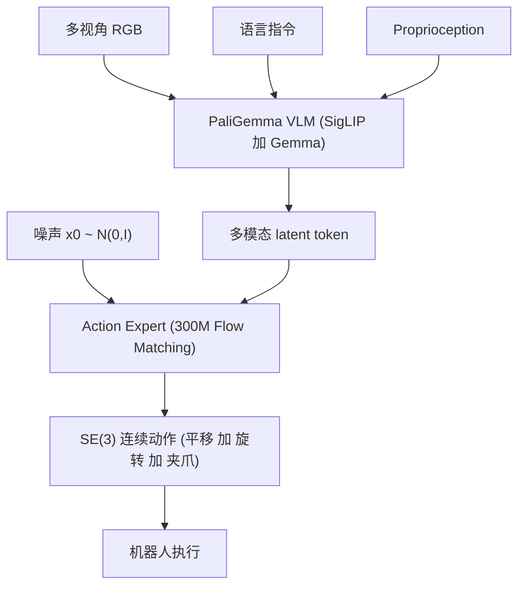

# π0: A Vision-Language-Action Flow Model for General Robot Control

- 本地 PDF：`papers/architecture/pi0_2410.24164.pdf`
- arXiv：https://arxiv.org/abs/2410.24164
- 年份：2024 (v4: Jan 2026)
- 团队：Physical Intelligence
- 阶段：通用 VLA 基础模型 —— Flow Matching 动作生成 + 跨具身预训练

## 一句话总结

π0 是 Physical Intelligence 的通用机器人策略基础模型，基于 VLM 骨干 (PaliGemma) + Flow Matching 动作专家，在 7 种机器人配置、68 个任务上预训练，可通过 prompt 直接执行或微调适配复杂多阶段任务。

## 核心技术

1. **Flow Matching 动作生成** — 用连续归一化流替代扩散模型，将动作去噪建模为 ODE 求解，10 步推理生成 SE(3) 连续动作
2. **VLM 骨干 + Action Expert** — PaliGemma 作为视觉语言骨干，额外 300M action expert 通过 flow matching 输出连续动作
3. **跨具身多任务预训练** — 7 种机器人配置（单臂、双臂、移动操作），68 个灵巧操作任务
4. **直接 Prompt + 微调双模式** — 预训练后可通过语言指令直接执行，或 finetune 到特定长序复杂任务

## 底层原理与数学推导

### 1. Flow Matching 核心公式

给定噪声 $x_0 \sim \mathcal{N}(0, I)$，flow matching 学习一个时间相关的向量场 $v_\theta(x_\tau, \tau, c)$：

$$\frac{dx_\tau}{d\tau} = v_\theta(x_\tau, \tau, c)$$

从 $\tau=0$ 积分到 $\tau=1$ 得到动作：

$$a = x_0 + \int_0^1 v_\theta(x_\tau, \tau, o, l) d\tau$$

其中 $o$ 为观测，$l$ 为语言指令。条件流匹配 (Conditional Flow Matching) 的损失：

$$L_{CFM} = \mathbb{E}_{t, x_0, x_1} \left[ \| v_\theta(x_\tau, \tau, c) - (x_1 - x_0) \|^2 \right]$$

### 2. 与扩散模型的区别

扩散模型建模随机微分方程 (SDE)，flow matching 建模常微分方程 (ODE)。ODE 路径更直，因此推理步数更少（10 vs 16-100）。

### 3. 系统架构

## 物理直觉解释

**Flow matching 好比"顺流而下"而非"随机游走"**：扩散模型像在迷宫里随机游走寻找出口（每一步都在猜方向、路线弯曲），flow matching 学习的是一个向量场——从噪声 $x_0$ 出发，每一步都沿着"这条流线上该走的方向"前进，路径是一条近乎直线的流线，因此只需 10 步积分就到达目标动作。物理直觉上，它学的是"动作分布的流场"：水流方向即最优动作趋势，位置越高（噪声越多）水流越急，越接近终点越平缓。

**VLM 骨干 + Action Expert 的分工像"大脑 + 小脑"**：VLM 骨干（PaliGemma，3B）负责语义理解——识别"这是衬衫""指令是把它叠起来"（常识大脑）；300M 的 action expert 负责高频连续动作生成（肌肉记忆/小脑），只在需要精确控制时激活，两者通过 attention 机制沟通。这种分工是 π0 能同时做到"理解复杂指令"和"50Hz 高频精细动作"的结构基础。

**预训练/后训练数据分工像"泛读 + 精读"**：预训练用 1 万小时异构数据（7 种机器人、68 任务）让模型见过各种失败与恢复场景（泛读，学会常识与纠错），后训练用高质量一致策略数据"精读"特定任务（学会流畅执行）。消融证据：compute parity 版本（160k 步）仍胜过 OpenVLA 与 Octo，甚至 470M 的 π0-small（无 VLM 初始化）也优于两者——说明跨具身数据配方与连续动作架构本身贡献巨大，VLM 预训练进一步放大这些优势。

## 工程细节与实操指南

- 数据：7 种机器人配置 × 68 任务，涵盖单臂/双臂/移动操作
- 微调后执行复杂长序任务：洗衣折叠（从烘干机取出 → 装篮 → 运到折叠桌 → 折叠多件衣物）、组装盒子、擦桌子
- 支持高频精细动作（10Hz+ 推理）
- VLM 提供语义 grounding，action expert 提供精准动作

## 消融实验与分析

Out-of-box 评估（5 个任务、10 次 episode 平均归一化分数）：

| 消融因子 | 设置对比 | 结果 |
|---------|---------|------|
| VLM 预训练 | π0 全模型（700k 步，VLM 初始化） | 全面最优，衬衫折叠近乎满分 |
| 计算量 parity | π0 parity（仅 160k 步） | 仍超越 OpenVLA（160k 步）与 Octo（320k 步）全部基线 |
| VLM 预训练 | π0-small（470M，无 VLM 初始化，从零训练） | 仍优于 OpenVLA 与 Octo |
| 跨具身数据 | OpenVLA（仅 UR5e 数据微调） | 优于原版 OpenVLA，但仍远低于 π0 |
| 动作表征 | OpenVLA（自回归离散 token） | 不支持动作分块，任务表现最差 |

**核心结论**：消融链条证明 π0 的性能来自三块可分离的贡献——(1) 跨具身 1 万小时预训练数据配方：compute parity（160k 步）即可压过 OpenVLA/Octo 全部基线；(2) 连续动作 + 动作分块的 flow matching 架构：OpenVLA 因自回归离散化不支持 action chunk 而在长程任务上垫底；(3) VLM 预训练：π0-small（470M、无 VLM 初始化）虽优于 OpenVLA 但与全模型差距明显，说明 Internet-scale 语义先验在高难度灵巧任务上不可替代。

## 技术权衡（Trade-off）

| 优势 | 劣势与工程代价 |
|------|----------------|
| Flow matching 10 步推理，比扩散快 | 连续动作在离散动作空间场景下需额外处理 |
| VLM 骨干提供 Internet-scale 语义知识 | 大模型推理延迟仍在 100ms+ |
| 跨具身预训练使其可泛化到不同平台 | 7 种配置仍有限，未覆盖人形机器人和灵巧手 |
| 微调后可执行 10+ 分钟长序任务 | 训练数据工程极其昂贵 |

## 技术价值与演进定位

π0 是 VLA 基础模型的工程标杆——证明了 VLM + Flow Matching 的组合可以产生精确、流畅的连续动作，其"VLM 骨干 + 动作专家"的双模块架构与"预训练 1 万小时异构数据 + 后训练高质量数据"的训练配方，成为 Physical Intelligence 后续所有工作（π0.5、RL Token、G0.5 等）的技术底座。它在方法论上的贡献包括：把 flow matching 从生成模型领域引入机器人动作生成并验证其相对扩散的效率优势（10 步 vs 16+ 步）、以 compute parity 消融确立了"数据配方与架构 > 单纯算力"的证据（160k 步即超全量 OpenVLA）、以及通过动作分块 + 连续动作解决长程多阶段任务的工程范式。π0.5 在其基础上将泛化推向开放世界，但 π0 本身的结构定义了 Physical Intelligence 的 VLA 技术路线。

## 与其他论文的关系

- **π0.5** 直接基于 π0 架构，通过异构数据联合训练实现开放世界泛化
- **Diffusion Policy** 是动作扩散的里程碑，π0 用 flow matching 替代扩散
- **OpenVLA** 同为 VLA，但省去了专门的 action expert（直接回归）
- **RT-2** 用离散 token 输出动作，π0 用连续 flow matching，精度更高

## 精读问题

1. Flow matching 的 10 步 ODE 求解用的是什么求解器？Euler vs RK4 的精度差异？步数与动作精度/推理延迟的最优折中？
2. Action expert 的 300M 参数与 VLM 骨干的参数量比例如何？是否可进一步精简？expert 与骨干之间的 attention 信息流如何组织？
3. 跨具身预训练中，不同机器人平台的动作空间如何统一？SE(3) 是否适用所有场景？7 种配置之外的新本体需要多少数据才能适配？
4. π0-small（470M）相对 OpenVLA（7B）的优势来自动作分块还是 flow matching？能否分解各自的贡献？
5. 预训练数据中 9.1% 的开源数据（OXE/Bridge/DROID）与自采 1 万小时数据各自贡献了什么？混合比例如何影响下游微调？
6. 直接 prompt 模式与微调模式的性能差距有多大？什么条件下直接 prompt 足够、什么条件下必须微调？
