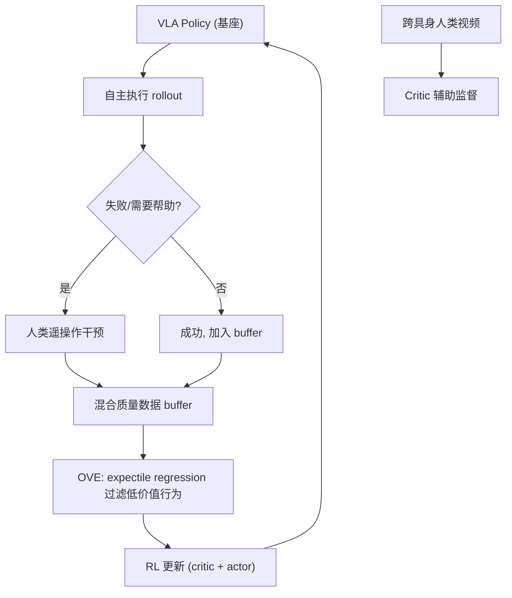

# ROVE: Unlocking Human Interventions for Humanoid Manipulation via Reinforcement Learning

- 本地 PDF：`papers/architecture/ROVE_2606.17011.pdf`
- arXiv：https://arxiv.org/abs/2606.17011
- 年份：2026（6 月）
- 团队：**小鹏机器人** + 复旦大学 + 港中文 + 上海交大
- 阶段：人形 VLA 后训练 —— 从不完美人类干预数据中 RL 迭代改进

## 一句话总结

ROVE 解决人形机器人 VLA 部署后的核心痛点：人类遥操作干预数据本身是不完美的（犹豫、错误、重映射噪声）。提出乐观价值估计（OVE）——用 expectile regression 从混合质量干预数据中抽取高价值行为，配合跨具身人类视频增强，实现 VLA 策略的迭代 RL 改进。

## 核心技术

1. **人在环数据采集流水线** — 针对人形灵巧手遥操作的完整 pipeline：收集部署中的数据 + 人类干预片段 + 适应延迟/犹豫/重映射噪声
2. **乐观价值估计 (Optimistic Value Estimation, OVE)** — 使用 TD bootstrapping + expectile regression 从混合质量轨迹中筛选高价值行为，不对所有数据无差别模仿
3. **跨具身人类视频监督** — Critic 同时从人类执行同类任务的视频中学习，为长尾失败和恢复模式提供监督信号（无需机器人对齐的动作）
4. **迭代改进循环** — rollout → 人类干预 → OVE 过滤 → RL 更新 → 再次 rollout，多轮迭代持续提升

## 底层原理与数学推导

OVE 的核心——expectile regression 替代 standard TD。给定长度为 H 的 transition 段，先用 EMA 目标 critic $V_{\bar{\phi}}$ 构造 H 步 TD bootstrap 目标

$$
\hat{V}_t = \sum_{i=t}^{t+H-1} \gamma^{i-t} r_i + \gamma^H V_{\bar{\phi}}(s_{t+H})
$$

再以非对称二次损失拟合状态价值：

$$
L_{OVE}(\phi) = \mathbb{E}_{(s,\xi)\sim\mathcal{D}}\left[ \left| \tau - \mathbf{1}\{\hat{V}_t - V_\phi(s) < 0\} \right| \cdot \left(\hat{V}_t - V_\phi(s)\right)^2 \right]
$$

其中 $\rho_\tau(\cdot)$ 是 expectile loss（对高价值过估计容忍、对低价值惩罚），论文取 $\tau = 0.7$——价值估计倾向乐观方向，自动过滤犹豫和错误。价值头与动作头均在冻结的 VLM backbone 上训练（8 块 GPU、8000 步、批大小 64、首轮 lr 1e-4 后续 1e-5），critic 每轮从上一轮 checkpoint 热启动。

## 物理直觉解释

**传统的 interactive imitation learning 假设人类干预 = 最优行为，ROVE 认为这个假设在人形灵巧手上不成立**：操作员隔着 VR 头显、用动作捕捉对齐机器人的 20+ 自由度，自己也在"试错"——第一次插面包片没对准、犹豫了一下、第二次调整角度才成功。把犹豫和错误动作原样教给策略，等于教它"先失败一次"。ROVE 的关键洞察：不要平等对待所有干预数据，用价值函数来挑——插进去的那次比犹豫的那几次更"值钱"。

**OVE 的 expectile regression 像一个"乐观的面试官"**：标准 TD 对所有候选者（轨迹）一视同仁地取平均打分，混合了成功恢复和失败尝试后分数毫无区分度；OVE 用非对称损失（$\tau=0.7$）只惩罚"低于高分段的尾部"，相当于只录取表现最好的前 30% 行为。价值函数因此能在同一段轨迹里标出"负优势区"（擦黑板中途放弃的动作）和"正优势区"（重新擦拭恢复进度的动作），为策略提取出尖锐的训练信号。

**跨具身人类视频监督解决"长尾失败没见过"的问题**：自主 rollout 里机器人很少恰好停在"擦了一半的板书"这种中间状态，价值函数没见过就没法估计。人类执行同类任务的视频提供了这些稀有的"半成品状态"及恢复方式——虽然动作空间不匹配（人没有机械关节），但**状态进度与恢复模式是跨具身共享的**。实测无人类视频的 critic 会高估部分擦除状态，而有人类视频的 critic 价值曲线贴合真实任务进度。

## 消融实验与分析

| 消融因子 | 设置对比 | Erase whiteboard | Toaster |
|---------|---------|-----------------|---------|
| 迭代轮数 | Iter 1 → Iter 3（真实世界 rollout+干预数据） | 45.0% → 80.0% | 56.7% → 86.7% |
| 价值估计 | OVE vs MC 价值估计（同一 held-out 轨迹） | OVE 产生结构化价值曲线与负优势区 | MC 噪声大、区分度低 |
| 人类视频辅助 | 有/无人类视频训练 critic | 无视频：部分擦除状态被高估 | 有视频：价值曲线贴合任务进度 |
| 演示微调 | SFT vs ROVE（同批遥操作演示） | ROVE 超过 SFT | ROVE 超过 SFT |
| 对比基线 | HG-DAgger / standard RL | ROVE 领先 | ROVE 领先 |

**核心结论**：定量证据链支持"乐观过滤 + 跨具身监督"的完整设计——三轮迭代真实成功率 45.0→80.0%（擦黑板）与 56.7→86.7%（放面包）说明闭环改进有效且未见饱和；价值估计分析显示 OVE 相对 MC 的关键优势在于能区分"远离完成的动作"与"可恢复的进展"（负优势区），而人类视频则补齐了自主 rollout 覆盖不到的长尾中间状态，两者分别解决"价值信号不尖锐"与"价值信号不完整"的问题。

## 技术权衡（Trade-off）

| 优势 | 劣势与工程代价 |
|------|----------------|
| 从不完美人类数据中学习，不需要高质量遥操作 | OVE 的 expectile 参数 τ 需要调优 |
| 迭代改进循环无需离线重训整个 VLA | 人在环采集速度受限于操作员带宽 |
| 跨具身人类视频提供低成本额外监督 | 人类视频的 embodiment gap 限制监督精度 |

## 技术价值与演进定位

ROVE 是极少数聚焦 **VLA 后训练迭代** 的工程化论文——填补了"从部署到持续改进"的空白。与 RL Token (PI, 2026) 和 SimpleVLA-RL (2025) 形成 VLA+RL 后训练的三条技术路线——ROVE 的独特贡献是针对**人形灵巧手遥操作干预数据的噪声问题**：其他工作假设可用的高质量奖励/数据，ROVE 则直面"人在环干预本身就是噪声"的现实，用乐观价值估计把数据质量筛选变成学习过程的一部分。其工程价值在于：无需离线重训 VLA 全模型（只训价值头与动作头）、每轮迭代只需有限次真实 rollout + 干预、critic 可吸收跨具身人类视频这类低成本监督，构成了一个可持续的闭环改进框架，对人形机器人"部署后越用越好"的演进路径有直接示范意义。

对你个人来说：这是小鹏的论文，你在小鹏工作，直接可以找作者聊。

## 工程细节与实操指南

- **平台**：小鹏人形机器人，灵巧手遥操作，人在环数据采集
- **数据**：自主执行 + 人类干预 + 跨具身人类视频，混合质量
- **OVE 关键参数**：expectile τ > 0.5（倾向乐观过滤）
- **多轮迭代**：rollout→干预→OVE 过滤→RL 更新→rollout

## 精读问题

1. OVE 的 expectile 参数 τ 在不同任务类型中是否需要独立调整？τ 与干预数据噪声水平之间是否有可预测的关系？
2. 人类干预和自主 rollouts 的最优比例是什么？干预过密是否会抑制策略的自主探索？
3. 多轮迭代是否存在性能天花板？第 4 轮以后的成功率增益是否衰减？
4. H 步 TD bootstrap 的 H 取值与任务 horizon 的关系——H 过小是否会让价值估计退化为纯 MC？
5. 人类视频的 critic 监督如何避免 embodiment gap 引入偏差（人类的"恢复"在机器人上可能不可行）？是否需要动作可行性过滤？
6. 价值头与动作头在冻结 VLM backbone 上训练——若放开 backbone 微调，OVE 的增益是否会被 SFT 追平？
7. OVE 的乐观偏差是否会导致策略偏好"高风险高回报"行为？安全约束如何注入价值估计？

## 与其他论文的关系

- **RL Token (PI, 2026)** — online RL 精调 VLA：RL Token 用稀疏"token 级"奖励信号做在线 RL，ROVE 聚焦人在环干预数据的价值过滤，两者可组合（ROVE 的 OVE critic 可作为 RL Token 的价值函数）
- **SimpleVLA-RL (2025)** — 全模型 offline RL 后训练：SimpleVLA-RL 依赖离线数据集质量，ROVE 处理的是"自主 rollout + 噪声干预"混合数据这一更贴近部署的现实
- **FlashSAC (RSS 2026 Best Paper)** — RL 底层算法：FlashSAC 解决低 UTD 高吞吐训练，ROVE 的 critic/actor 更新可直接采用该策略梯度框架
- **Human-as-Humanoid (2026)** — 人类视频 → 机器人动作的跨具身迁移：ROVE 反向使用人类视频，不生成动作而只提供 critic 监督信号，对对齐精度要求更低
