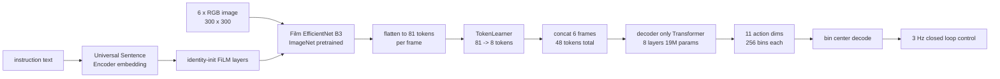

# RT-1: Robotics Transformer for Real-World Control at Scale

- 本地 PDF：`papers/architecture/RT-1_Robotics_Transformer_2212.06817.pdf`
- arXiv：https://arxiv.org/abs/2212.06817
- 年份：2022 (arXiv preprint，后续发表于 RSS 2023)
- 团队：Robotics at Google + Everyday Robots + Google Research Brain Team
- 阶段：机器人 Transformer + 13 万 episode 大规模真机数据的动作 token 化起点

## 一句话总结

RT-1 把语言指令、图像和连续机器人动作全部编码为紧凑 token，用一个 35M 参数的 Transformer 在 130k 条真机示教（13 台机器人、17 个月、700+ 指令）上做行为克隆，在 200+ 训练指令上做到 97% 成功率、以 3 Hz 闭环控制真机，首次证明「高容量 Transformer + 大规模多样数据」在真实机器人上同时可行。

## 核心技术

1. **每维 256 bin 均匀离散化动作表示**：11 个动作维度（7 维机械臂 $x,y,z,\text{roll},\text{pitch},\text{yaw}$ + 夹爪开度，3 维底盘 $x,y,\text{yaw}$，1 维终止/模式切换离散变量）各自均匀切成 256 个 bin，用 categorical cross-entropy + causal masking 训练，非自回归地一次输出整组动作 token
2. **FiLM-EfficientNet-B3 早融合语言条件**：6 张 300x300 历史图像过 ImageNet 预训练 EfficientNet-B3（16M 参数，26 层 MBConv），指令经 Universal Sentence Encoder 嵌入后通过 identity-initialized FiLM 层注入卷积特征，输出 9x9x512 特征图展平为 81 个视觉-语言 token；早融合让图像 token 只保留与当前指令相关的特征
3. **TokenLearner 压缩 + Token 复用的实时推理**：TokenLearner 把 81 个视觉 token 软选择压缩到 8 个，6 帧历史拼接为 48 个 token 送入 8 层 decoder-only Transformer（19M 参数）；配合「每帧只算一次视觉 token 并跨重叠滑窗复用」，两招分别带来 2.4 倍与 1.7 倍加速，把推理压到 15 ms，满足 3 Hz（<100 ms 预算）的真机控制需求
4. **"Robot Classroom" 规模化数据采集**：13 台 Everyday Robots 移动操作臂在模拟真实厨房的教室环境里跑 17 个月，产出约 130k episode、744 条指令（pick / move near / place upright / knock over / open drawer / close drawer / place into receptacle / pick-and-place 等 skill 组合）

## 底层原理与数学推导

RT-1 的形式化设定是语言条件下的视觉模仿学习。设第 $n$ 条示教轨迹为 $\mathcal{D}^{(n)} = \big(i^{(n)}, \{(x_t^{(n)}, a_t^{(n)})\}_{t=0}^{T^{(n)}}\big)$，其中 $i$ 是语言指令，$x_t$ 是图像观测，$a_t \in \mathbb{R}^{11}$ 是动作向量（7 维臂 + 3 维底盘 + 1 维模式）。行为克隆最小化负对数似然：

$$\mathcal{L}_{BC}(\pi) = -\mathbb{E}_{(i,x,a)\sim\mathcal{D}}\Big[\sum_{k=1}^{11}\log p_\theta\big(b_k(a) \mid i, x_{t-H+1:t}\big)\Big]$$

其中 $b_k(a)$ 是第 $k$ 个维度的分箱编号，$H=6$ 是图像历史长度。注意这不是自回归的链式分解——RT-1 明确弃用了 Gato/Decision Transformer 式的自回归动作生成（见消融表 Table 13：加入 auto-regressive actions 推理从 15 ms 涨到 36 ms 且 seen task 反而下降 12 个点），11 个维度是在同一个 forward 里并行预测的，causal masking 只用于约束序列结构而非逐维依赖。

**前向离散化**：每个动作维度的物理限位 $[a_k^{\min}, a_k^{\max}]$ 被均匀切成 256 段，连续值按下式映射为整数 token：

$$b_k = \text{clip}\left(\text{floor}\left(\frac{a_k - a_k^{\min}}{a_k^{\max} - a_k^{\min}} \cdot 255\right),\ 0,\ 255\right), \quad b_k \in \{0,1,\dots,255\}$$

**逆向反解**（部署时取分箱中心值，量化误差上界为半个 bin 宽度）：

$$\hat{a}_k = a_k^{\min} + \frac{b_k + 0.5}{255}\left(a_k^{\max} - a_k^{\min}\right), \qquad |\hat{a}_k - a_k| \le \frac{a_k^{\max}-a_k^{\min}}{510}$$

**为什么分类比高斯回归更适合多峰分布**：若动作头输出对角多元高斯 $\mathcal{N}(\mu_\theta, \Sigma_\theta)$ 并配 MSE/最大似然损失，对同一观测下存在两种有效解（如从左/右两侧抓同一杯子）的数据集，最优单模态解会收敛到两个模式的均值——一个悬在半空、两边都抓不到的动作。而每维 256 类的 categorical 分布可以显式表达多峰：

$$p(b_k \mid x, i) = \frac{\exp(z_{k,b})}{\sum_{j=0}^{255}\exp(z_{k,j})}$$

多个 bin 可以同时具有高概率，采样任一模式都是有效动作。这也是消融中「continuous actions」一项全面崩塌（seen 97 到 68、distractors 83 到 37）的机制解释。

**条件化的早融合（identity-initialized FiLM）**：USE 句嵌入 $e_i$ 经过两层全连接产生仿射参数 $\gamma(e_i), \beta(e_i)$，对 EfficientNet 中间特征图 $F$ 做 FiLM 调制：

$$\tilde{F} = (1+\gamma(e_i)) \odot F + \beta(e_i)$$

关键工程点是 $\gamma, \beta$ 的生成层权重初始化为零，使 FiLM 初始时等价于恒等映射，从而不破坏 ImageNet 预训练权重的功能——论文特别指出普通做法（随机初始化插入预训练网络内部）会打乱中间激活、抵消预训练收益。

**token 数量对推理成本的影响**：self-attention 计算量随 token 数平方增长，这是 RT-1 架构设计的核心驱动。原始流水线是 $81 \times 6 = 486$ 个视觉 token，经 TokenLearner 压到 $8\times6 = 48$ 个后注意力开销降为原来的约 $(48/486)^2 \approx 1\%$：

## 物理直觉解释

RT-1 解决的第一个问题是**让一个大网络「吃得下」17 个月的异构经验，还能在 100 ms 内吐出答案**。Transformer 的容量足够大，但标准 Vision Transformer 会把图像切块成上千个 patch token，注意力层立刻成为延迟瓶颈。Robotics Transformer 的答案是三层漏斗：卷积先把 300x300 像素蒸馏成 81 个带语义的 token，TokenLearner 再按信息量软筛选出 8 个，最后 6 帧历史只留 48 个 token 进 Transformer。这就像**请一位教授开会前先让助理把一千页资料浓缩成一页摘要**——教授（Transformer）只在浓缩过的要点上做深度思考，会议才能开得又快又好。

第二个问题是**动作该怎么表示才学得动**。机器人的关节轨迹天然是连续的，传统做法是回归一个实数向量。但人类示教充满了「等效但不相同」的解法：同一个杯子可以从左边绕过去也可以从右边绕过去，同一个瓶子可以用两种握法扶正。对这些多峰分布，回归损失会让模型输出所有示教的平均值——好比**问一群人「去机场走哪条路」，把答案平均后得到一条笔直穿过楼群的路线**，谁也到不了机场。离散成 256 个 bin 后，模型可以在「左路 bin」和「右路 bin」上各放一半概率，执行时任取其一都是通的。

第三个问题是**语言指令要在哪一层进入网络**。晚融合（Gato 式：先提纯视觉特征、再把文本向量拼到最后）等于让模型先看图、看完再被告知要干什么，于是大量无关背景细节都被保留下来，干扰物一多就分心。RT-1 用 FiLM 把指令直接调制进每一层卷积激活，相当于**在侦探勘察现场之前就告诉他案情——他只会盯着与案件有关的鞋印和指纹**。消融表里 Gato 在 distractors 上只有 43% 而 RT-1 有 83%，注意力可视化（Layer 2 Head 6 聚焦待抓物体、Layer 4 Head 2 聚焦抽屉）也印证了这一点。

## 工程细节与实操指南

**架构与超参速查（均出自 PDF Sec. 5.1 / Appendix E）**
- 总参数 35M：FiLM-EfficientNet-B3 16M（26 层 MBConv）+ decoder-only Transformer 19M（8 层 self-attention）
- 输入：6 帧 300x300 图像历史 + 语言指令（USE 嵌入）
- Token 流：81 -> 8（TokenLearner）/帧 -> 48 token 全序列
- 动作：11 维 x 256 bin，含 1 维 terminate/mode 切换变量，非自回归并行解码
- 控制：3 Hz 闭环，直到输出 terminate 或到达步数上限；网络推理 15 ms（系统还剩约 85 ms 给相机与通信延迟）

**推理加速的两个可复用手段**（Sec. 5.1）
1. TokenLearner 压缩：81 -> 8，2.4 倍加速。本质是 element-wise attention 软选择，可在任何「视觉 token 太多」的策略里移植
2. 视觉 token 复用：滑动窗口内重叠的旧帧不需要重算卷积特征，缓存后直接进 Transformer，1.7 倍加速

**数据采集（Robot Classroom）的可借鉴设计**
- 用「模拟真实环境的训练场」（partial counters 拼出的假厨房）做大规模采集，再到两个真实厨房测泛化，避免在昂贵真实空间里高频作业
- 按 skill x object 组合扩展指令：Table 1 显示 Move Object Near Object 占 337 条、Pick Object 130 条、Pick-from-Receptacle 162 条，而 Open/Close Drawer 各只有 3 条——刻意让组合型任务吃掉大部分数据预算
- 数据占比与结果强相关：见下方消融，删 25% 任务种类比删 49% 样本伤害更大，所以扩 diversity（新物体、新组合）优先于堆同质 episode

**复现检查清单**
- 确认动作归一化边界 $a_k^{\min}, a_k^{\max}$ 与真机限位一致，否则反解后的命令会被限幅截断造成系统性偏差
- 若换底座视觉编码器，保留 identity-initialized FiLM（零初始化 $\gamma,\beta$ 生成层）以免破坏预训练表征
- 需要 ≤3 Hz 控制频率时先做 token 削减（TokenLearner 或池化），其次才是砍层数
- Kuka 等异构数据混合时的动作空间对齐方案可直接照抄 Appendix D.2：roll/pitch 置零、二值夹爪转连续开度、无文本标注的 RL 数据统一重标为 "pick anything"，混合比例 EDR:Kuka = 2:1

## 消融实验与分析

### 模型设计消融（Appendix Table 13，括号为相对完整 RT-1 的变化）

| 模型变体 | Seen Tasks | Unseen Tasks | Distractors | Backgrounds | 推理时间 |
|---|---|---|---|---|---|
| RT-1（完整） | 97 | 76 | 83 | 59 | 15 ms |
| w/o ImageNet 预训练 | 84 (-13) | 43 (-33) | 60 (-23) | 41 (-18) | 15 ms |
| w/ continuous actions（高斯 + MSE） | 68 (-29) | 43 (-33) | 37 (-46) | 35 (-24) | 16 ms |
| w/o history（单帧输入） | 82 (-15) | 62 (-14) | 50 (-33) | 59 (+0) | 15 ms |
| w/o Transformer（仅 EfficientNet） | 86 (-13) | 62 (-14) | 67 (-16) | 59 (+0) | 26 ms |
| w/ auto-regressive actions | 85 (-12) | 71 (-5) | 67 (-16) | 65 (+6) | 36 ms |

**核心结论**：换成连续高斯动作头是伤害最大的单项改动（distractors 直落 46 个点），说明每维 256 bin 离散化承载了多峰动作分布的表达力；ImageNet 预训练主要买来泛化与鲁棒性（unseen tasks -33）；6 帧历史几乎不影响 backgrounds 但显著影响 distractor 干扰下的表现；而自回归动作建模只会拖慢推理超过 2 倍、不带来收益，最终版因此弃用。

### 数据规模 vs 多样性消融（Table 7）

| 配置 | % Tasks | % Data | Seen Tasks | All 泛化均值 | Unseen Tasks | Distractors | Backgrounds |
|---|---|---|---|---|---|---|---|
| 完整数据 | 100 | 100 | 97 | 73 | 76 | 83 | 59 |
| 每任务封顶 200 条样本 | 100 | 51 | 71 | 50 | 52 | 39 | 59 |
| 每任务封顶 100 条样本 | 100 | 37 | 55 | 46 | 57 | 35 | 47 |
| 每任务封顶 50 条样本 | 100 | 22 | 59 | 29 | 14 | 31 | 41 |
| 删除数据最少的 25% 任务 | 75 | 97 | 86 | 54 | 67 | 42 | 53 |

（All 列为论文原文给出的泛化三项平均值；封顶采样是在保持任务种类不变的前提下删掉大户任务的富余样本。）

**核心结论**：删掉 25% 的任务种类造成的泛化损失，等同于砍掉近一半（49%）的样本量——在已有大容量的多任务模型上，数据多样性比数据数量更重要，这直接决定了后续 OXE 走「跨具身拼多样性」而不是单平台刷 episode 数的路线。

### 异构数据吸收（Tables 4 & 5）

| 训练数据 | Classroom eval | Bin-picking eval | Sim 物体 Seen Skill | Sim 物体 Unseen Skill |
|---|---|---|---|---|
| 仅 EDR 真实数据 | 92 | 22 | 23 | 7 |
| EDR + 209k Kuka QT-Opt episode（2:1） | 90 (-2) | 39 (+17) | — | — |
| 仅 Kuka bin-picking 数据 | 0 | 0 | — | — |
| EDR 真实 + 518k 仿真轨迹 | — | — | 87 (+64) | 33 (+26) |

**核心结论**：掺入另一台形态完全不同的机器人（Kuka IIWA，RL 自主采集）或仿真域的数据，原本任务性能只掉 2 个点，却在相近场景的新评估上翻倍（22 到 39）、并让仿真独有物体的真机成功率从 23% 提到 87%——但单独只用 Kuka 数据在两个评估上都是 0%，说明吸收能力来自「以广泛本体系数据为锚」的联合训练，而非单纯的域迁移技巧。

### 综合对比基线（Tables 2 & 3）

| 模型 | Seen | Unseen | Distractors | Backgrounds | 真实厨房三级泛化 All |
|---|---|---|---|---|---|
| Gato（37M 重训版） | 65 | 52 | 43 | 35 | 30 |
| BC-Z | 72 | 19 | 47 | 41 | 45 |
| BC-Z XL | 56 | 43 | 23 | 35 | 55 |
| RT-1 | 97 | 76 | 83 | 59 | 70 |

（附 SayCan 长程任务：Kitchen1 执行成功率 RT-1 67% vs BC-Z 53% vs Gato 33%；Kitchen2 RT-1 保持 67%、Gato 归零；最长串联 50 步。）

## 技术权衡（Trade-off）

| 收益 | 代价 |
|------|------|
| 每维 256 bin 分类头可表达多峰动作分布，规避回归「平均动作」陷阱（消融 -29~-46 点验证） | 离散化引入 $|\hat a - a| \le (a^{\max}-a^{\min})/510$ 的固有量化误差，动作呈台阶状；需要亚毫米级平滑控制的任务会受限 |
| 早融合 FiLM 让图像 token 只携带任务相关信息，抗干扰物能力强（83%） | 离散词表大小随维度线性增长（11 维就是 2816 个 bin-token），细化分辨率或加维度都要付显存与 softmax 代价 |
| 35M 参数达到 3 Hz 真机闭环，是当时少有的「够快的大模型策略」 | 速度预算反过来封顶了容量：无法像 LLM 那样靠堆参数涨性能，作者自己指出机器人这边瓶颈是延迟而非参数量 |
| 数据吸收性强，混入仿真、其他机器人的数据不掉原有性能 | 纯模仿学习上限被示教质量锁死，作者明言「可能无法超越示教者」；对新技能只学到已见动作的组合，完全没见过的 motion 学不会 |
| 700+ 指令、97% 训练任务成功率，足以支撑 SayCan 50 步长程串联 | 指令泛化仍限于已见概念的重组（unseen instructions 是 held-out 组合，不是全新任务），背景/环境变化仍是弱项（59%） |

## 技术价值与演进定位

RT-1 回答的是 VLA 谱系的第一性问题：**能否用一个统一的序列模型，把语言、图像、动作放进同一条流水线并在真机上实时运行**。它的答案是肯定的，且给出了三个长期有效的组件——动作离散 token 化（被 RT-2 直接继承进 VLM 词表）、以开放任务无关方式大规模积累真机数据的采集体系（Robot Classroom 成为 OXE 的模板之一）、以及「token 削减换取实时性」的工程范式（后续 Octo/OpenVLA 都还在处理同样的延迟问题）。

在本库的演进链条中，RT-1 的位置是「数据与动作表示的地基」：它证明了规模（130k episode、3000+ 次真机评测）与多样性（75% 任务多样性 ≈ 49% 数据量）才是泛化的来源，这一结论随后在 OXE/RT-X 的 21 语言 × 22 机器人混合中被再次放大；它暴露的两个缺陷——离散动作精度不足、语义理解缺失——则分别由 Diffusion Policy/Flow Matching 一线和 RT-2/PaLM-E 一线接手解决。

## 与其他论文的关系

- **RT-2** — 直接继承 RT-1 的 256-bin 动作离散化与同一套真机数据（Appendix B 说明机器人数据集即 Brohan et al. 2022），差异仅在把动作 token 从独立策略网络的输出搬进 PaLI-X / PaLM-E 的文本词表；对比实验显示两者 seen tasks 相当（92-93%），差距全部拉开在 unseen 泛化（RT-1 平均 32% vs RT-2 两版均 62%）
- **SayCan** — RT-1 作为下游低层策略被 SayCan 调用，15 条长程指令（平均 9.6 步）上 Kitchen1 执行成功率达 67%（vs BC-Z 53%、Gato 33%），并支撑起 50 步级任务；反过来 SayCan 的实验也说明低层策略 97% 的单步成功率是长程任务可行的前提
- **OXE / RT-X** — RT-1 的 "Robot Classroom" 数据协议与「diversity > quantity」结论是跨具身数据混合的直接前身；OXE 用 22 种机器人、100 万+ 轨迹的混合进一步验证了 RT-1 在单平台上观察到的正迁移效应
- **Gato / BC-Z** — 论文的主要对照：同为 Transformer 的 Gato（重训到 37M 以满足实时性）败在晚融合与无语言预训练嵌入（distractors 43% vs 83%），ResNet 系的 BC-Z 推理极快（5.3 ms）但泛化差（unseen 19%）；这组对比把「架构融合方式」与「预训练先验」确立为两条独立的提升轴
- **QT-Opt** — 提供 209k Kuka 抓取 episode 作为异构数据源，其 RL 自主采集的动作分布与人示教截然不同，却能在 2:1 混合后被 RT-1 吸收并让 bin-picking 提升 17 个点，是「RL 数据可为模仿模型供氧」的早期实证

## 精读问题

1. **离散化粒度与任务适配**：论文把所有 11 个维度统一切成 256 bin，但夹爪开度实际是准二值的、终止位是完全离散的，而末端位移精度要求最高——统一 bin 数是否浪费了词表预算？如果按维度分配不同 bin 数（例如平移 1024、夹爪 3），在保持总词表不变的前提下能否进一步提升精度？
2. **auto-regressive 的意外现象**：Table 13 中给动作加自回归建模反而让 backgrounds 从 59 升到 65（+6）、unseen 从 76 只降到 71，论文却因速度问题放弃——这个 +6 是否暗示历史动作包含未被利用的环境线索？在推理算力充裕的今天（如云端部署），这个取舍应该重判吗？
3. **数据多样性的度量缺陷**：「删 25% 任务 ≈ 删 49% 样本」的结论建立在一个 700+ 指令、单一厨房场景的数据集上；当任务种类继续扩大到 OXE 的量级时，「多样性」本身该怎么定义和度量——按指令数、skill 数还是语义嵌入聚类？
4. **仿真数据的正迁移边界**：Real+Sim 实验里 sim 物体的真机成功率高达 87%，但 sim 数据来自 real2sim 重建 + MT-Opt 多任务 RL，envionment 几何与真机教室完全一致。如果仿真环境的视觉风格或物理参数偏离更大（例如标准的桌面抓取 benchmark），+64 这个数字还能保住多少？
5. **FiLM 早融合与容量的耦合**：移除整个 Transformer（w/o Transformer）后 distractors 掉到 67、推理升到 26 ms，说明 Transformer 主要贡献的是时间维度上的信息整合；那么如果历史长度 H 从 6 增到 12，TokenLearner 的软选择是否会丢掉动态信息？RT-1 结论部分自己也提到「改进 reaction speed 和 context retention」是未来工作。
