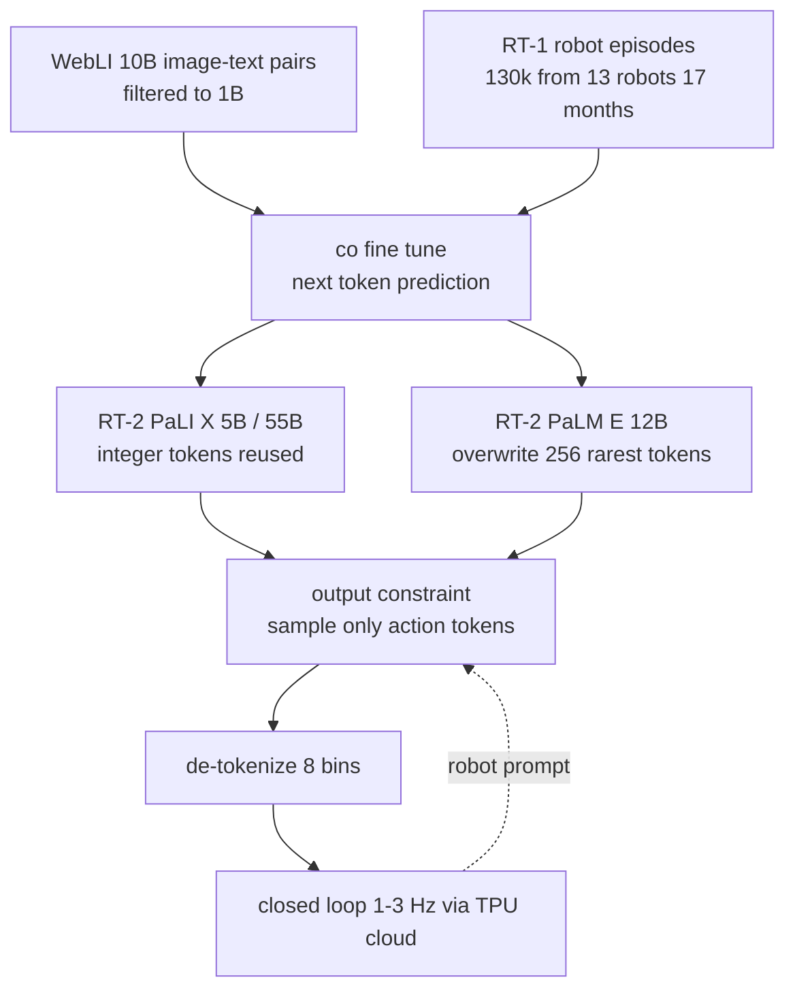

# RT-2: Vision-Language-Action Models Transfer Web Knowledge to Robotic Control

- 本地 PDF：`papers/architecture/RT-2_Vision_Language_Action_Models_2307.15818.pdf`
- arXiv：https://arxiv.org/abs/2307.15818
- 年份：2023
- 团队：Google DeepMind
- 阶段：VLM 直接输出动作 token 的端到端 VLA，涌现语义泛化

## 一句话总结

RT-2 不设计任何新架构、不加任何动作专用层，只把机器人动作按 RT-1 方式切成整数 token、当作普通文本放进 VLM 的训练目标里 co-fine-tune（PaLI-X 5B/55B 与 PaLM-E 12B），就让互联网级语义知识直接进入闭环控制——在约 6000 次真机评测中，泛化成功率相对 RT-1 翻倍（平均 32% 到 62%），并在符号理解、推理、人物识别上拿到 60% vs 17% 的 3 倍以上优势。

## 核心技术

1. **动作即文本 token（零新增参数）**：沿用 RT-1 的动作离散化，动作空间为末端执行器 6 自由度位移与旋转增量 + 夹爪开度 + 一个终止命令的离散维，连续维均匀切 256 bin，整条动作用 8 个 token 表示成字符串 `"terminate dx dy dz droll dpitch dyaw gripper"`（如 `"1 128 91 241 5 101 127"`），以标准 VQA 格式 `Q: what action should the robot take to [instruction]? A:` 直接作为语言建模目标
2. **两种 VLM 的 token 复用方案**：PaLI-X 对 1000 以内的整数都有专属 token，直接把 bin 序号映射到对应整数 token；PaLM-E 没有数字友好型 tokenizer，就覆写词表中 256 个使用频率最低的 token 作为动作词表（本质是 symbol tuning）
3. **Co-Fine-Tuning 训练配方**：机器人数据不是单独微调，而是与原 VLM 的 web 数据（WebLI 约 10B 图文对过滤后 1B）混采——PaLI-X 版把机器人数据加权到约占训练混合的 50%，PaLM-E 版约 66%；保留原始数据防止微调期遗忘 web 概念
4. **Output Constraint 推理约束**：当 prompt 是机器人任务时只在合法动作 token 内采样，普通视觉语言任务仍开放全部词表，同一套权重同时服务两种任务
5. **云端推理协议**：55B 模型部署在多 TPU 云服务、机器人经网络查询，达 1-3 Hz；5B 版本约 5 Hz。这是当时用于直接闭环控制的最大的模型（比此前大一个数量级以上）

## 底层原理与数学推导

**统一目标函数**。设图文任务样本为 $(I, q, y)$（图像、问题、文本答案），机器人样本为 $(I_r, i, \mathbf{a})$（相机图像、指令、动作向量）。两者被写成同一种序列格式后共用同一个 next-token prediction 目标：

$$\mathcal{L}(\theta) = -\mathbb{E}_{(I,q,y)\sim p_{VL}}\Big[\sum_{t}\log p_\theta(y_t \mid I, q, y_{<t})\Big] - \mathbb{E}_{(I_r,i,\mathbf{a})\sim p_{rob}}\Big[\sum_{k=1}^{8}\log p_\theta(c_k(\mathbf{a}) \mid I_r, i, c_{<k})\Big]$$

其中 $c_k(\mathbf{a})$ 是第 $k$ 个动作维度对应的词表 token。论文明确指出：这个 next-token prediction 目标**等价于机器人学习中的 behavior cloning 损失**——这正是该范式无需改损失函数的原因。

**离散化映射**。除终止维外每个连续维度 $j$ 按 $[\text{min}_j, \text{max}_j]$ 均匀量化：

$$c_j = \text{token}\left(\text{floor}\left(\frac{a_j - \text{min}_j}{\text{max}_j - \text{min}_j}\cdot 255\right)\right), \qquad j \in \{\Delta x, \Delta y, \Delta z, \Delta \text{roll}, \Delta \text{pitch}, \Delta \text{yaw}, g\}$$

8 个 token 以空格拼接为一个字符串目标，例如 `"1 128 128 128 128 128 128 127"` 表示终止位为 1 的平移/旋转居中指令。注意动作是逐 token 自回归生成的（和文本一样走 causal mask），但整个动作串只需一次前向传播内完成短序列解码。

**符号 grounding 的机制解释**。RT-2 的语义泛化并非来自新增的推理模块，而是因为「物体的名字」和「操作它的动作」在同一个 Transformer 的隐状态里相遇。设 VLM 中概念 $w$（如 mug）的语义向量由预训练固定其几何位置，co-fine-tune 只学习从语义向量到动作 bin 分布的条件映射 $f_\theta(\cdot)$。对于未在机器人数据中出现的物体名 $w'$，只要其嵌入与某个已见物体 $w$ 在预训练空间中邻近，就有：

$$d_{emb}(e(w'), e(w)) \;\text{小} \;\Rightarrow\; p_\theta(\mathbf{a}\mid w') \approx p_\theta(\mathbf{a}\mid w)$$

这解释了为什么「move apple near the sum of two plus one」这类指令能工作：算术部分完全依赖预训练的文本推理能力，机器人数据只需要提供「apple 该怎么搬」。也因此出现了有趣的分化——Math 类任务上 PaLM-E-12B 得 35%，反超主打视觉预训练的 PaLI-X-55B 的 25%（论文归因于两者预训练混合比例不同）。

**权重规模与泛化的关系**。消融显示模型容量的收益集中在泛化轴而非 seen 任务轴：

## 物理直觉解释

RT-2 的第一步是一个**「把动作当成一门外语来教」的翻译观**。传统做法里，「看懂场景」与「决定怎么动」分属两个模型，中间靠人类定义的接口（如抓取框、目标位姿）衔接。RT-2 干脆让一个读过整个互联网的 VLM 兼任翻译官：输入法文句子（图像 + 指令），输出的不是英文而是中文——只不过这门「外语」的单词表只有 256 个数字词。因为它不做架构改造，VLM 在亿万图文中学会的一切细节（什么是 fragile、什么颜色配什么容器、Taylor Swift 长什么样）都还在权重里，随时可以被调用到动作决策里。

第二步是**用「不遗忘」换「会推理」**。朴素微调就像让学生只刷一套题库直到肌肉记忆——很快就会忘掉之前读过的所有书。消融数据清晰地展示了这一点：5B 模型从头训只有 9% 平均泛化、仅微调 42%、加回 web 数据的 co-fine-tune 提升到 44%；而 55B 从 52% 升至 63%。所以 co-fine-tuning 扮演的角色相当于**边刷题库边继续课外阅读**：机器人的示教教它「手该怎么动」，web 数据不断提醒它「世界是什么样」，两路梯度缺一不可。

第三步是关于**能力边界最关键的区分**：web 知识只能迁移「怎么选」，不能迁移「怎么做」。RT-2 能拿起用来当锤子的石头（chain-of-thought 推理后先输出 "Rocks." 再输出动作 token），却学不会擦桌子的新手腕动作；它能在仿真 Language-Table 里推没见过的 pen 和 banana 时看清目标却控制不住它们的滚动动力学。可以类比为**一位博学的指挥家拿到一件从未摸过的乐器——他知道自己想表达什么乐句（语义层完整），但手指的力度分布（动力学层）必须来自练琴本身**。这决定了 VLA 后续所有工作都要回答同一个问题：语义先验之外，动作数据自身还差多少。

## 工程细节与实操指南

**超参速查（Appendix E，均为 PDF 原文数值）**

| 模型 | 参数量 | 学习率 | Batch Size | 梯度步数 | 控制频率 |
|---|---|---|---|---|---|
| RT-2-PaLI-X-55B | 55B | 1e-3 | 2048 | 80K | 1-3 Hz |
| RT-2-PaLI-X-5B | 5B | 1e-3 | 2048 | 270K | 约 5 Hz |
| RT-2-PaLM-E-12B | 12B | 4e-4 | 512 | 1M | 1-3 Hz |
| RT-2-PaLI-3B（Language-Table 仿真） | 3B | 1e-3 | 128 | 300K | 5 Hz |

其余训练设置一律沿用 PaLI-X / PaLM-E 原论文的学习率调度与正则化，论文没有引入新的优化器技巧。

**底座结构参考**
- PaLI-X：ViT-22B 编码 $n$ 张图得到 $n\times k$ 个 patch token，经投影层送入 32B 参数、50 层、UL2 风格的 encoder-decoder，自回归生成输出 token
- PaLM-E-12B：decoder-only LLM，用 ViT-4B 把图像投影进语言嵌入空间，天然支持多种传感器模态拼接
- PaLI-3B（Language-Table）：ViT-G/14（2B）+ UL2-3B；动作格式特化为 `"X Y"`，X/Y 取 -10 到 +10 共 21 个值，代表末端 2D delta 笛卡尔 setpoint

**复现要点**
1. **数据混合比例优先于一切技巧**：机器人数据占混合 50%（PaLI-X）/ 66%（PaLM-E）；若从头造 VLA，先扫这个比例再调其他
2. **动作 token 选用**：若基座 tokenizer 有数字 token（如 0-1000 各一词）直接复用；否则覆写最低频 token，注意统计真实语料频率避免撞上有意义的 rare word
3. **prompt 格式**保持 VQA 形式（`Q: ...? A:`），这让机器人样本与 web 样本共享模板，减少分布切换带来的损失尖峰
4. **推理需双通道采样约束**：检测任务类型决定是否将 logits 屏蔽到 256 个动作 token，否则偶发的自然语言输出会直接打断闭环控制
5. **部署路径**：若模型过大放不上机载 GPU，参照论文的多 TPU 云端服务 + 网络查询方案，但要把网络往返延迟计入 1-3 Hz 的预算

**已知失效模式（Appendix G，可直接用作评测 checklist）**
- 抓不住指定部位（如把手）
- 完全未见过的动作类型（毛巾擦拭、工具使用）
- 高精度灵巧操作（叠毛巾）
- 多层间接推理
- 未见过物体的推动动力学（笔滚落桌面、香蕉质心偏移）

## 消融实验与分析

### 总体性能与泛化（Appendix Table 4）

| 模型 | Seen Tasks | Unseen Objects E/H | Unseen Backgrounds E/H | Unseen Environments E/H | Unseen Average |
|---|---|---|---|---|---|
| RT-1（35M） | 92%| 31% / 43%| 71% / 9%| 26% / 14%| 32%|
| MOO（VLM 作感知模块） | 75%| 58% / 48%| 38% / 41%| 19% / 3%| 35%|
| VC-1（机器人视觉预训练） | 63%| 34% / 10%| 13% / 3%| 0% / 0%| 10%|
| R3M（Ego4D 表征） | 45%| 32% / 14%| 13% / 9%| 0% / 2%| 12%|
| RT-2-PaLI-X-55B | 91%| 70% / 62%| 96% / 48%| 63% / 35%| 62%|
| RT-2-PaLM-E-12B | 93%| 84% / 76%| 75% / 71%| 36% / 33%| 62%|

**核心结论**：在 seen tasks 上 RT-2（91/93）与 RT-1（92）几乎打平，说明动作能力来自机器人数据不变；差距全部出现在三个 unseen 轴——两个 RT-2 版本平均泛化是 RT-1 与 MOO 的约 2 倍、是 VC-1/R3M 的约 6 倍，并且 "hard" 档的跌幅远小于基线（背景 hard 上 RT-1 从 71 跌到 9，RT-2-PaLM-E 反而升到 71），证明增益确实来自 web 预训练迁移的语义鲁棒性而非容量堆叠。

### 涌现能力评测（Appendix Table 5）

| 模型 | Symbol Understanding 均值 | Reasoning 均值 | Person Recognition 均值 | 总均值 |
|---|---|---|---|---|
| RT-1 | 16%| 16%| 20%| 17%|
| VC-1 | 11%| 10%| 13%| 11%|
| RT-2-PaLI-X-55B | 82%| 46%| 53%| 60%|
| RT-2-PaLM-E-12B | 36%| 43%| 53%| 40%|

（细分中最鲜明的对照：Symbol 1 类指令 "move coke can near X / near 3 / near Y"，PaLI-X-55B 达 93 而 RT-1 为 27；Math 子项 PaLM-E-12B 35 % 高于 PaLI-X-55B 的 25%。）

**核心结论**：最优 RT-2 在从未有对应示教的指令上是次优基线（RT-1）的 3 倍以上（60 vs 17），且这些动作技能本身都在 RT-1 数据分布之内——证明「新能力」不是新运动，而是旧技能被 web 语义重新组合调用；不同 VLM 底座的预训练混合会让强项错位（PaLI-X 强符号理解、PaLM-E 强算术），意味着底座选择本身就是 VLA 设计的一个自由度。

### 规模与训练策略消融（Appendix Table 6，仅泛化评估）

| 模型 | Size | 训练方式 | Unseen Objects E/H | Unseen Backgrounds E/H | Unseen Environments E/H | 平均 |
|---|---|---|---|---|---|---|
| RT-2-PaLI-X | 5B | from scratch | 0% / 10%| 46% / 0%| 0% / 0%| 9%|
| RT-2-PaLI-X | 5B | 仅机器人数据 fine-tune | 24% / 38%| 79% / 50%| 36% / 23%| 42%|
| RT-2-PaLI-X | 5B | co-fine-tune | 60% / 38%| 67% / 29%| 44% / 24%| 44%|
| RT-2-PaLI-X | 55B | 仅机器人数据 fine-tune | 60% / 62%| 75% / 38%| 57% / 19%| 52%|
| RT-2-PaLI-X | 55B | co-fine-tune | 70% / 62%| 96% / 48%| 63% / 35%| 63%|

**核心结论**：跳过 VLM 预训练从零训 5B 只有 9%（作者因此放弃跑更大的 from scratch 实验），pre-trained 初始化是前提条件；co-fine-tune 一致优于纯 fine-tune（5B 44 vs 42、55B 63 vs 52），且模型越大 co-fine-tune 的增益越明显——web 数据防遗忘的价值随容量增长而放大。

### 开源基准交叉验证（Language-Table 仿真，Table 1）

| 模型 | 成功率 |
|---|---|
| BC-Zero | 72% ± 3|
| RT-1 | 74% ± 13|
| LAVA | 77% ± 4|
| RT-2-PaLI-3B | 90% ± 10|

**核心结论**：即使换成小型 3B 底座、另一套仿真环境与另一种动作空间（2D delta setpoint），co-fine-tuned VLA 依旧领先最好的非 VLA 基线 13 个点，且同一 checkpoint 能做域外行为（推没见过的物体），支持该范式的通用性而非特定于 Google 厨房数据。

## 技术权衡（Trade-off）

| 收益 | 代价 |
|------|------|
| 语义知识零成本迁移：无新参数、无动作专用层，unseen 泛化翻倍、涌现能力 3 倍 | 运动技能上限锁死在机器人数据分布内，web 数据带不来任何新 motion（擦桌子、工具使用均失败） |
| 单一 next-token 目标同时承载 VQA 与控制，一次训练保住两种能力 | 55B 模型只能部署在云端多 TPU，靠网络查询做到 1-3 Hz；高频控制或低成本硬件场景即刻成为瓶颈 |
| Co-fine-tune 让模型容量越大收益越大（55B 提 11 点） | 训练代价随底座急剧上升：55B 用 2048 batch 只跑 8 万步，而 12B 需要一百万步，调参余量被计算预算吃掉 |
| 动作 bin 复用现有词表（整数 token 或低频 token），tokenizer 改造成本近乎为零 | 输出必须靠 output constraint 保护，否则自回归采样可能逸出动作词表——引入了一条新的失败模式 |
| 同一权重可继续做纯 VQA 任务，模型可复用性强 | 7 DoF 移动操作臂 + 厨房数据的窄谱系，跨具身兼容性尚未验证（OXE 同年指出这一缺口） |

## 技术价值与演进定位

RT-2 是 VLA 这个名词的定义性论文：它把「机器人策略」从一个独立的网络设计问题，改写成「给 VLM 加一种输出模态」。最有信息量的实证是那个看似平淡的结果——seen tasks 上 91-93% 与 RT-1 的 92% 几乎相同，而 unseen average 从 32% 跳到 62%。这说明**在本库演进链条中，RT-2 的贡献点是「语义泛化」而不是「动作质量」**：动作能力仍然完全由 130k 条示教决定，改变的是这些技能能否被从未见过的指令调用。

由此确立的三条后续主线都已在 RT-2 里埋下伏笔：(1) 云端推理瓶颈催生了 FAST Tokenizer 式的动作压缩与小模型路线（OpenVLA 用 7B 复现）；(2) 运动多样性不足指向大规模视频/人类数据学习；(3) chain-of-thought 变体只用几百个梯度步就能让模型先输出 Plan 再输出 Action，直接预告了后续「reasoning-action 融合」方向（PaLM-E 的规划式输出、F1-VLA 等）。它也留下了当时无法解决的问题——单具身厨房数据撑不起语义覆盖面，这个问题要到 OXE 的 22 机器人混合数据才有答案。

## 与其他论文的关系

- **RT-1** — 提供了 RT-2 的全部下游资产：256-bin 动作离散化、8 token 动作字符串格式、13 台机器人 17 个月的厨房数据集；对比实验证明在同一份机器人数据上加入 VLM 预训练把 unseen 平均从 32% 提到 62%，而 seen 任务不动（92 vs 91/93）
- **PaLM-E** — 既是 RT-2 的两个底座之一（12B 版），也是方法论上的前身：PaLM-E 证明了具身图像可以作为 token 进入 LLM 并保留推理能力，但输出停留在高层规划文本，需要外部低层控制器执行；RT-2 把这条链路的最后一环（语义到动作）闭合了
- **PaLI-X** — 另一个底座（5B/55B），ViT-22B + 32B UL2 结构；RT-2 与 PaLI-X 的对比消融显示两种底座各自携带的预训练偏置会决定 VLA 的强弱项（符号理解 vs 数学推理），提示后续 OpenVLA 选 Llama-2 骨干时的同类抉择
- **SayCan / 传统分层方法** — RT-2 把 SayCan 式的「LLM 规划 + 独立低层策略」两层结构压进一个模型：chain-of-thought 变体输出 "Plan: pick rxbar chocolate. Action: 1 128 ..." 说明规划与控制在同一自回归流中可以做，且只需几百个梯度步的额外微调
- **MOO / CLIPort** — 代表「VLM 当感知插件」的替代路线：MOO 用 VLM 标记目标像素再喂给 RT-1 主干拿 35% 平均泛化，与 RT-2 的 62% 对照出结论——VLM 的表征价值在于参与策略学习，而不是仅仅提供一张语义掩码
- **VC-1 / R3M** — 代表「非 VLM 的机器人专用视觉预训练」路线，平均泛化只有 10/12，甚至低于不加预训练思路的 MOO，说明在语义泛化这件事上「互联网级图文共训」不可被单模态视觉预训练替代

## 精读问题

1. **Seen 任务为何纹丝不动？** RT-2-PaLI-X-55B 在 200+ 训练指令上拿 91%，比 35M 的 RT-1 还低 1 个点。既然参数大了三个数量级，为什么动作能力毫无提升——是被 256-bin 量化截断封顶，还是被机器人数据占比 50% 的混合比例稀释，抑或高斯式的巨大容量反而难以在 80K 步内收敛到精确控制？
2. **Emergent 数字的统计强度**：Table 5 中每条指令只跑 5 次、A/B 测试四模型轮换，RT-2-PaLI-X-55B 与 RT-1 在 Person Recognition 上是 53 vs 20——在这类低重复次数的真机评测下，多大的差异才值得写入结论？换成一个 95% 置信区间框架，哪些子项会被归入「尚不能区分」？
3. **两个底座的错位是否可迁移利用**：PaLI-X-55B 在 Symbol Understanding 上 82 vs PaLM-E-12B 的 36，而 Math 上 25 vs 35。如果做底座集成（两个 VLA 各出一票）或者用 PaLI-X 底座重放 PaLM-E 的预训练混合，能否叠加两侧优势？这暗示「预训练混合配方」应被当作 VLA 设计的一等公民超参吗？
4. **Output Constraint 的信息论代价**：屏蔽到 256 个动作 token 意味着策略永远不能「说不知道」。如果让模型在低置信时输出一个额外的拒答 token 并触发兜底控制器，能否换来整体成功率的提升——还是说这本质上需要机器人数据里有对应的失败标注？
5. **Chain-of-thought 的最小充分条件**：论文只用了几百个梯度步的数据增强（Plan 字段 + 文本）就激活了先规划后行动的行为。这说明推理能力完全存在于 VLM 预训练中、只需对齐输出格式；那么计划的质量上限是不是也被 8 token 的动作串封死——复杂多步任务是否会卡在「计划正确但步间状态跟踪缺失」？
