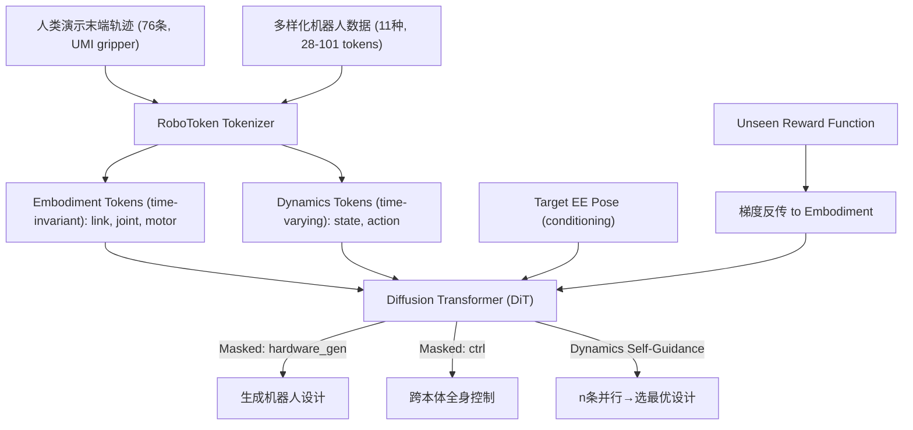

# Transformer Transformer: A Unified Model for Motion-Conditioned Robot Co-design

- 本地 PDF：`papers/architecture/TransformerTransformer_2509.26633.pdf`
- arXiv：https://arxiv.org/abs/2509.29500（待确认ID）
- 项目页：https://transformer-transformer.github.io
- 年份：2026
- 团队：Stanford + Columbia (Huy Ha, Karen Liu, Shuran Song)
- 阶段：机器人协同设计 —— 从人类运动轨迹自动生成最优机器人形态

## 一句话总结

Transformer Transformer (T2) 提出一个统一的 DiT 模型，将任意机器人构型、状态和动作编码为 RoboTokens（统一的连续 token 序列），同一架构同时做两件事：(1) 给定目标末端轨迹和 reward，生成最优机器人设计（臂长/关节数/底盘类型），(2) 给定机器人设计，做跨本体全身控制。Dynamics Self-Guidance：推理时把 reward-agnostic 的动力学预测转为 reward-specific 梯度，零样本引导扩散过程优化未见过的 reward。ALOHA 优化后织物展开任务跟踪误差降 73%。

## 核心技术

1. **RoboTokens** — 统一的机器人 token 化方案，任意铰接机器人（固定臂/四足/双足/人形/灵巧手）都编码为连续 token 序列。6 种 token 类型：link、joint（fixed/sliding/rotating/ball）、motor、link state、joint state、action。token 间通过 ID 指针表示连接关系
2. **统一 DiT 架构** — 同一个扩散 Transformer 通过不同的 masking scheme 实现三种功能：generator（生成设计）、critic（评估设计的 reward）、controller（执行控制）
3. **Dynamics Self-Guidance** — 不用训练额外 reward 网络。模型预测的 noisy reward 对 embodiment token 做梯度反传，在扩散去噪过程中引导设计向高 reward 方向移动（n 条并行引导轨迹 → 选最优）
4. **跨本体控制** — 以 RoboTokens 为条件，同一个模型控制从未见过的机器人构型——因为 RoboTokens 的 completeness 已经包含了运动学/动力学/驱动能力信息

## 底层原理与数学推导

**RoboToken 编码**：link token 包含 primitive type/size/inertia；joint token 包含类型和连接的 link IDs；motor token 包含控制的 joint ID。状态 token 每帧独立，通过 timestep ID 和 embodiment ID 建立对应关系。总长度 28-101 tokens（vs MJCF 文本数百 tokens）。

**DiT 训练**：DDIM scheduler，每个 token 类型有独立的 linear projection 到 DiT latent space + learned embedding of token IDs。利用 SE(2) equivariance（平面变换增强，非 SE(3) 因为有重力方向）。

**Dynamics Self-Guidance 公式**：在扩散步 k，DiT 预测噪声 $\epsilon_k$，用于将 token 从步 k 去噪到步 k-1。给定可微 reward $R$，对 embodiment token 做梯度：

$$\tilde{\epsilon}_k = \epsilon_k - \sqrt{1-\bar{\alpha}_k} \cdot \nabla_{x_k} R(\hat{x}_0(x_k))$$

其中 $\hat{x}_0(x_k)$ 是从噪声 $x_k$ 预测的干净 embodiment token。n 条并行引导，返回 reward 最高的设计。

## 物理直觉解释

**为什么要重新设计机器人？** 人类做演示时用的是自己的手——人手有 27 个自由度、特定长度的手指和关节角度范围。把这条轨迹直接映射到 ALOHA（特定臂长/关节限位）时，ALOHA 的手臂可能根本够不到某些位置，或者要做出很别扭的姿态。Transformer Transformer 反其道行之——**"不是让机器人学人的动作，而是根据人的动作设计机器人"**。人演示了一条"往右上方甩布料"的轨迹，算法就给你算出来：臂长应该再长 5cm、底座应该偏左 10cm——这样甩起来最省力。

**Dynamics Self-Guidance 的直觉**：这就像在黑暗中找最高点——进化算法蒙着眼睛随机走 1000 步，选最高的一次。Dynamics Self-Guidance 是"用你自己的世界模型来指路"——DiT 内部已经学会了"长臂 = 惯量大 = 跟踪慢"，所以它能用这个隐式知识直接梯度上山，效率高几个数量级。

## 工程细节与实操指南

- **训练数据**：76 条 UMI gripper 人类演示轨迹（56 train, 20 val），含投掷/拧螺丝/开抽屉/擦洗等单臂运动 + UMI 双臂洗碗演示
- **设计空间**：固定臂（运动学）、四足操作臂（动力学控制）、双臂移动操作（任务复杂度）
- **控制**：固定臂/移动臂用 Mink diff IK；四足用 RL（128 个 expert per discrete variation + continuous variation in obs）
- **DiT config**：small/medium/large，AdaLN modulation，DDIM
- **时序采样**：8 timesteps per sequence（随机采样 for generation，连续采样 for control）
- **制造验证**：优化后的 ALOHA 被实际 3D 打印和装配

## 消融实验与分析

| 消融 | 关键发现 |
|------|---------|
| T2 vs 进化算法 baseline | T2 性能优且 runtime 短几个数量级 |
| Dynamics Self-Guidance vs 无 guidance | Self-guidance 在 challenging landscape 中显著加速收敛 |
| 跨本体控制泛化 | 同一模型可控制未见过的机器人构型 |
| 设计流形限制 | 生成的设计在训练分布内插值——不能生成六足（仅四足训练数据） |
| ALOHA 物理验证 | 跟踪误差降 73%，最大关节速度降 30% |

## 技术权衡（Trade-off）

| 优势 | 劣势与工程代价 |
|------|----------------|
| 统一架构（generator+critic+controller）消除多模块累积误差 | RoboTokens 仅支持刚体铰接机器人（与 MJCF 同范围），几何表示限于 primitive |
| Dynamics Self-Guidance 零样本优化 unseen reward | Self-guidance 需要 reward 函数可微 |
| 跨本体控制无需 per-embodiment 训练 | 生成的设计受训练域限制（不能外推） |
| ALOHA 物理验证证明了 practicality | 设计空间目前限于运动学/几何参数，未涉及驱动器选型/材料 |

## 技术价值与演进定位

这篇工作在"机器人设计"和"机器人学习"之间架了一座桥——它证明了一个统一 DiT 模型可以同时理解"设计"和"控制"，且二者可以互相增强。对丁 lab 的意义：如果他真的要搭建定制化 manipulation 平台（如 PAIRS Lab 的硬件规划），T2 提供了一个从任务需求自动推导最优设计的计算工具——不再需要人工反复试错"臂多长合适"。

## 与其他论文的关系

- **ALOHA / Mobile ALOHA** — T2 优化了 ALOHA 设计并验证；T2 的 UMI gripper 继承自 ALOHA 生态
- **Diffusion Policy / π0** — 动作空间扩散，T2 是"形态+动作"联合扩散——多了一个 embodiment 维度
- **OmniRetarget** — 人类→机器人运动重定向，T2 反其道——根据人类运动设计机器人
- **Fabrica (CoRL Best Paper)** — CAD→装配，T2 是轨迹→设计→控制，覆盖更上游

## 精读问题

1. RoboTokens 能否扩展到软体机器人/连续体？刚性铰接的假设是根本性限制还是暂时的？
2. Dynamics Self-Guidance 在多目标 reward（如轻量化 + 精确跟踪）的 Pareto 前沿上表现？
3. 制造验证仅做了 ALOHA 一种设计——T2 对其他设计空间（四足/人形）的物理制造可行性？
4. 8 timesteps 的时序采样是否丢失了高频动力学信息？
5. 训练数据：76 条轨迹是否足以覆盖多样化的操作场景？scaling 效应？
