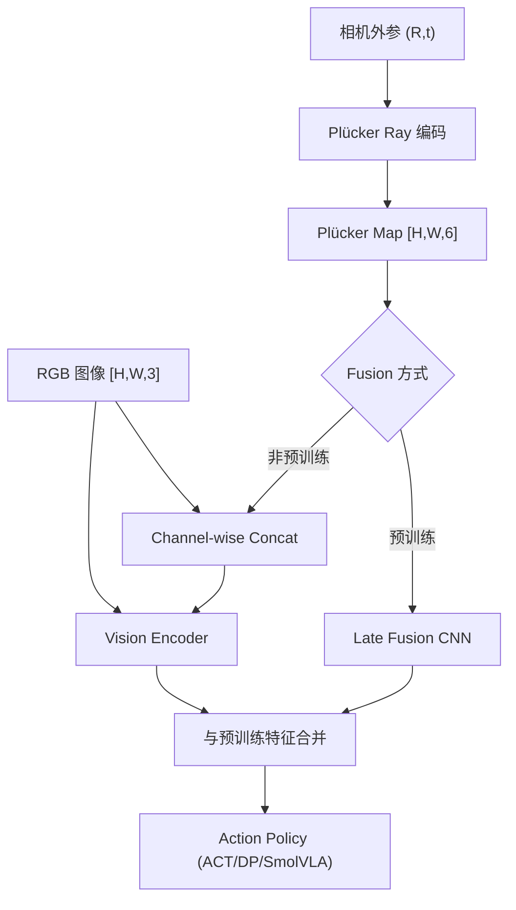

# Do You Know Where Your Camera Is? View-Invariant Policy Learning with Camera Conditioning

- 本地 PDF：`papers/architecture/ViewInvariant_2510.02268.pdf`
- arXiv：https://arxiv.org/abs/2510.02268
- 项目页：https://ripl.github.io/know_your_camera/
- 代码：https://github.com/ripl/CamPoseOpensource
- 年份：2025 (ICRA 2026 Best Paper on Robot Learning)
- 团队：TTIC, Waymo, JHU, TRI (Anand Bhattad 等)
- 阶段：视角鲁棒策略 —— 相机移动后策略不失效

## 一句话总结

当相机被移动或重新定位后，现有模仿学习策略大概率失效。这篇论文提出将策略条件化到相机外参（用 Plücker ray 编码每个像素的 3D 射线），使策略天然对相机视角鲁棒，在 6 个新操作任务上系统性超越 SOTA。ICRA 2026 Best Paper on Robot Learning。

## 核心技术

1. **Plücker Ray 编码** — 每个像素不再只是 RGB，而是 (R, G, B, d_x, d_y, d_z, m_x, m_y, m_z)——6D 射线表示（方向+动量），显式编码该像素在 3D 空间中的位置
2. **Camera Conditioning** — 策略以 Plücker map 为附加输入：(1) 非预训练 encoder：channel-wise concat 到 RGB 图像；(2) 预训练 encoder：late fusion 小 CNN
3. **联合随机裁剪** — 图像和 Plücker map 联合随机裁剪，去除背景姿态 shortcut
4. **6 个新 benchmark 任务** — RoboSuite + ManiSkill，配对固定视角/随机视角变体

## 底层原理与数学推导

**1. Plücker Ray 的几何定义**：给定相机内参 $K$ 与外参 $(R, t)$，像素 $(u,v)$ 的光线方向与其矩为

$$
d(u,v) = R \cdot K^{-1} \cdot [u, v, 1]^T, \qquad m = t \times d
$$

每个像素从纯 RGB 变为 6 维射线表示 $(d_x, d_y, d_z, m_x, m_y, m_z)$，叠加 RGB 后形成 [H,W,9] 输入。关键性质：**Plücker 坐标对相机位姿是等变的**——相机移动后，同一 3D 点在图像中的像素位置变了，但其射线 $d$ 在 3D 世界坐标系下不变（或者说变换方式完全由 $(R,t)$ 决定），策略因此能把"像素位置"翻译成"3D 空间位置"来决策。

**2. 策略条件化形式**：策略 $\pi_\theta(a_t \mid s_t, \mathcal{P}(K,R,t))$ 在观测 $s_t$ 之外额外接收整张 Plücker map。非预训练 encoder 直接 channel-wise concat；预训练 encoder（如 SmolVLA）用小 CNN 处理 Plücker map 后与视觉特征 late fusion，避免污染预训练权重。

**3. 联合随机裁剪**：对图像与 Plücker map 施加**完全相同的**空间裁剪（crop 区域一致），既提供数据增强，又防止裁剪区域内的背景纹理泄露相机位姿（背景 shortcut）。

## 物理直觉解释

**为什么相机一动策略就崩？** 现有策略学的往往是"在像素 (200, 300) 的位置做动作"——换了个相机角度，(200, 300) 的像素对应的是完全不同的 3D 位置。这就像一个人只靠"窗外第 3 棵树的方位"认路，窗子被挪到另一面墙后自然迷路。Plücker ray 给每个像素加了一个"3D 坐标标签"：每个像素不再是"图像的某个位置"，而是"从相机原点出发、沿某条射线射向物理世界的光线"。策略因此学会了用 3D 空间中的位置做决策，而不是死记像素坐标，相机移动后只需知道新的外参 $(R,t)$，射线表示自动随之更新。

**这相当于给策略配了一副"可校正的眼镜"**：正常人眼看东西时，大脑会用双眼视差和头部运动感知 3D 位置，即使头动了也不会觉得世界在转。Plücker conditioning 就是把这套"头动补偿"机制外置——外参 $(R,t)$ 相当于头的姿态，Plücker map 相当于每只眼睛射出的视线方向。论文实测发现**固定背景（fixed setting）下 conditioning 也有增益**（不只是随机背景），说明即使策略能靠场景结构推断相机位姿，显式输入 3D 信息仍减少了推断负担，就像给经验丰富的司机也配上 GPS。

**联合随机裁剪的妙处**：裁剪同时作用于图像和 Plücker map，保持像素一一对应——相当于"戴上眼镜再转动头部"的虚拟相机增强，一个 batch 内生成大量不同内参/视角的虚拟视图，策略被迫学会不依赖任何特定相机参数的表征，泛化能力因此更强。

## 消融实验与分析

| 模型 | 任务 | 无 conditioning（%） | 有 conditioning（%） | 增益 |
|------|------|---------------------|---------------------|------|
| ACT | Lift | 33.6 | 60.6 | +27.0 |
| ACT | Pick Place Can | 26.7 | 30.9 | +4.2 |
| ACT | Assembly Square | 10.8 | 18.7 | +7.9 |
| DP | Lift | 29.1 | 51.1 | +22.0 |
| DP | Push | 20.0 | 30.3 | +10.3 |
| SmolVLA | Lift | 19.6 | 54.4 | +34.8 |
| SmolVLA | Pick Place Can | 56.0 | 70.0 | +14.0 |
| 背景设置（ACT，全部 6 任务平均） | Fixed vs Randomized | Randomized 下基线更差 | conditioning 在两种设置均有利 | Randomized 下增益最大 |
| 联合随机裁剪 on/off | 3 个 RoboSuite 任务 | 无裁剪 | 有裁剪 | 所有任务一致提升 |

**核心结论**：camera conditioning 的收益在全部 3 种架构（ACT/DP/SmolVLA）与全部 6 个任务上一致为正（Lift 任务增益 +22.0~+34.8 最大），且增益在基线最差的设置下最大——随机背景、困难任务（Assembly Square 10.8→18.7）与无裁剪时的提升最明显，说明 Plücker conditioning 的主要作用不是锦上添花，而是消除策略对固定像素坐标与背景线索的依赖（shortcut），迫使策略真正使用 3D 几何信息。

- **Plücker Ray 计算**：给定相机内参 K 和外参 (R,t)，每像素 (u,v) 的 Plücker ray = (direction, moment)，direction = R @ K^{-1} @ [u,v,1]^T
- **输入格式**：RGB [H,W,3] + Plücker map [H,W,6] → channel-wise concat [H,W,9]
- **预训练 encoder 适配**：late fusion——小 CNN 处理 Plücker map → 特征与预训练 encoder 的视觉特征合并
- **联合随机裁剪**：图像和 Plücker map 做相同的 spatial crop，防止背景泄露相机位姿信息
- **硬件**：UR5 机械臂 + 3 个可移动第三视角相机
- **任务**：Pick Place, Plate Insertion, Hang Mug 等 6 个新 benchmark

## 精读问题

1. Plücker ray 编码对相机内参变化的鲁棒性？不同焦距/畸变参数是否需要重新编码？
2. Late fusion 对预训练 encoder 的特征是否会产生分布偏移？
3. 动态相机（手持或机械臂上安装）的场景是否适用？
4. Plücker 表示在相机平移远大于旋转时是否退化？矩 $m = t \times d$ 在大基线场景下如何保持数值稳定性？
5. 外参标定误差（平移/旋转噪声）对 conditioning 增益的敏感性如何？能否用自监督方式在推理时在线估计 $(R,t)$？
6. 联合随机裁剪的裁剪比例与位置分布是超参还是可自适应？裁剪是否等效于"虚拟相机内参增强"从而可以替代真实内参随机化？

## 工程细节与实操指南

- **Plücker Ray 计算**: direction = R @ K^{-1} @ [u,v,1]^T, moment = t × direction
- **输入格式**: RGB [H,W,3] + Plücker map [H,W,6] → channel-wise concat [H,W,9]
- **预训练 encoder 适配**: late fusion via small CNN for Plücker → merge with frozen encoder features
- **联合随机裁剪**: 图像和 Plücker map 做相同的 spatial crop, 防止背景泄露相机位姿
- **Hardware**: UR5 + 3 movable third-person cameras
- **Tasks**: Pick Place, Plate Insertion, Hang Mug 等 6 个新 benchmark (RoboSuite + ManiSkill)
- **Code**: github.com/ripl/CamPoseOpensource

## 技术权衡（Trade-off）

| 优势 | 劣势与工程代价 |
|------|----------------|
| 即插即用，不修改策略架构 | 需要知道相机外参（标定） |
| Plücker ray 是通用表示，适配任何策略 | 6 通道额外输入增加了 encoder 计算量 |
| 6 个新 benchmark 填补了评估空白 | 仅限于静态场景的相机移动，未涉及运动中相机 |

## 技术价值与演进定位

这篇工作的意义不仅是"解决了相机移动后策略失效"——它论证了**3D 视觉对机器人学的关键价值**（与 FP3 异曲同工）。Plücker ray 提供了一个轻量级的"2D 图像 + 3D 信息"融合方案，比 FP3 的全 3D 点云更轻量（只需外参，无需重建几何），比纯 2D 图像更鲁棒（对视角变化天然不变）。它在部署层面的价值在于"即插即用"：不修改策略架构、不重训预训练权重（late fusion），任何现成 BC 策略（ACT/DP/SmolVLA）加上 6 通道输入即可获得视角鲁棒性，且 6 个配对固定/随机视角的 benchmark 填补了"视角鲁棒性"这一维度的评估空白，为后续工作提供了标准测试协议。

## 与其他论文的关系

- **FP3 (ICRA 2026 Finalist)** — 全 3D 点云方案，camera conditioning 是更轻量的替代：FP3 重建点云输入，本工作只编码"光线方向"即可获得大部分鲁棒性收益
- **3D Foresight** — 3D 辅助任务增强策略：Foresight 从输出/预测层面注入 3D，camera conditioning 从输入层面解决视角问题，两者可叠加
- **ACT / Diffusion Policy / SmolVLA** — 被增强的 baseline 策略架构：论文证明三种代表性动作生成范式（CVAE chunking / 扩散 / 预训练 VLA）均受益于 conditioning
- **手眼标定 / visual-SLAM / SfM 系工作** — 外参 $(R,t)$ 可从数据集元数据获得，或用经典手眼标定、visual-SLAM、structure-from-motion 方法估计；本工作把"知道相机在哪"作为前提，与位姿估计管线正交衔接
