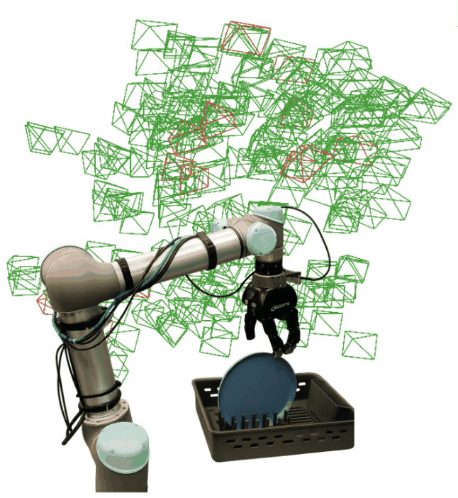
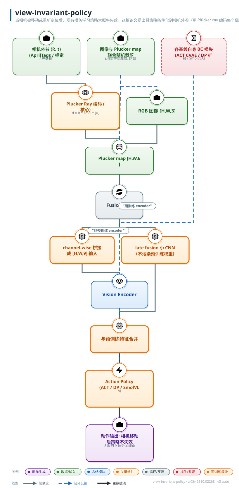

# Do You Know Where Your Camera Is? View-Invariant Policy Learning with Camera Conditioning

- 本地 PDF：`papers/architecture/ViewInvariant_2510.02268.pdf`
- arXiv：https://arxiv.org/abs/2510.02268
- 项目页：https://ripl.github.io/know_your_camera/
- 代码：https://github.com/ripl/CamPoseOpensource
- 年份：2025 (ICRA 2026 Best Paper on Robot Learning)
- 团队：TTIC, Waymo, JHU, TRI (Anand Bhattad 等)
- 阶段：视角鲁棒策略 —— 相机移动后策略不失效

## 一句话总结

当相机被移动或重新定位后，现有模仿学习策略大概率失效。这篇论文提出将策略条件化到相机外参（用 Plücker ray 编码每个像素的 3D 射线），使策略天然对相机视角鲁棒，在 6 个新操作任务上系统性超越 SOTA。ICRA 2026 Best Paper on Robot Learning。

## 九问速览

1. **Problem**：相机被移动或重新安装后，模仿学习策略大概率失效——视角变化是部署期最常见的扰动
2. **Bottleneck**：策略从像素坐标学 shortcut（背景纹理泄露相机位姿），换视角即分布外；随机视角训练需数倍相机
3. **Insight**：把相机外参显式条件化进策略——每像素编码 Plücker 射线（方向+矩），像素位置可翻译成 3D 空间位置
4. **Method**：RGB+6 通道 Plücker map 拼接（预训练 encoder 用 late fusion 小 CNN）；图像与 Plücker 联合随机裁剪防背景 shortcut
5. **Evidence**：3 种架构 6 任务全部为正增益：ACT Lift +27.0、SmolVLA Lift +34.8（19.6→54.4）；基线越差增益越大
6. **Ablation**：联合随机裁剪一致提升；固定背景（可推断位姿）下 conditioning 仍有增益——显式 3D 输入减轻推断负担
7. **Assumption**：相机外参已知（AprilTags/标定/元数据可得）；场景静态（不处理运动中的相机）
8. **Failure**：外参估计错误时无鲁棒性分析；动态相机（手持/机载）场景未验证；6 通道输入增加计算量
9. **Opportunity**：内参变化鲁棒性、外参自估计联合训练、与 3D 表示（FP3）叠加均待探索

| 维度 | 论文答案 |
|---|---|
| Perception | RGB + 每像素 6 维 Plücker 射线 map（[H,W,9] 输入）；真机 3 路可动第三人称相机；无深度图但射线编码 3D 几何 |
| Closed-loop | 闭环（继承 ACT/DP/SmolVLA 的 chunk 级闭环）；控制频率未报告 |
| Correction | 无重规划机制；贡献仅在输入表示层 |
| Deployment | 训练时每条演示后移动 1 台相机（n=3, m=1 随机化）→ 测试 7 个随机机位×选 2 相机；绿布遮背景去除静态线索 |

## 核心技术

1. **Plücker Ray 编码** — 每个像素不再只是 RGB，而是 (R, G, B, d_x, d_y, d_z, m_x, m_y, m_z)——6D 射线表示（方向+动量），显式编码该像素在 3D 空间中的位置

*论文 Figure 1（p1）：Fig. 1: Visualization of camera poses in the real-robot*

2. **Camera Conditioning** — 策略以 Plücker map 为附加输入：(1) 非预训练 encoder：channel-wise concat 到 RGB 图像；(2) 预训练 encoder：late fusion 小 CNN
3. **联合随机裁剪** — 图像和 Plücker map 联合随机裁剪，去除背景姿态 shortcut
4. **6 个新 benchmark 任务** — RoboSuite + ManiSkill，配对固定视角/随机视角变体

## 底层原理与数学推导

*架构速览：当相机被移动或重新定位后，现有模仿学习策略大概率失效。这篇论文提出将策略条件化到相机外参（用 Plücker ray 编码每个像素的 3D 射线），使策略天然对相机视角鲁棒，在 6 个新操作任务上系统性超越 SOTA。I*

**1. Plücker Ray 的几何定义**：给定相机内参 $K$ 与外参 $(R, t)$，像素 $(u,v)$ 的光线方向与其矩为

$$
d(u,v) = R \cdot K^{-1} \cdot [u, v, 1]^T, \qquad m = t \times d
$$

每个像素从纯 RGB 变为 6 维射线表示 $(d_x, d_y, d_z, m_x, m_y, m_z)$，叠加 RGB 后形成 [H,W,9] 输入。关键性质：**Plücker 坐标对相机位姿是等变的**——相机移动后，同一 3D 点在图像中的像素位置变了，但其射线 $d$ 在 3D 世界坐标系下不变（或者说变换方式完全由 $(R,t)$ 决定），策略因此能把"像素位置"翻译成"3D 空间位置"来决策。

**2. 策略条件化形式**：策略 $\pi_\theta(a_t \mid s_t, \mathcal{P}(K,R,t))$ 在观测 $s_t$ 之外额外接收整张 Plücker map。非预训练 encoder 直接 channel-wise concat；预训练 encoder（如 SmolVLA）用小 CNN 处理 Plücker map 后与视觉特征 late fusion，避免污染预训练权重。

**3. 联合随机裁剪**：对图像与 Plücker map 施加**完全相同的**空间裁剪（crop 区域一致），既提供数据增强，又防止裁剪区域内的背景纹理泄露相机位姿（背景 shortcut）。

## 物理直觉解释

**为什么相机一动策略就崩？** 现有策略学的往往是"在像素 (200, 300) 的位置做动作"——换了个相机角度，(200, 300) 的像素对应的是完全不同的 3D 位置。这就像一个人只靠"窗外第 3 棵树的方位"认路，窗子被挪到另一面墙后自然迷路。Plücker ray 给每个像素加了一个"3D 坐标标签"：每个像素不再是"图像的某个位置"，而是"从相机原点出发、沿某条射线射向物理世界的光线"。策略因此学会了用 3D 空间中的位置做决策，而不是死记像素坐标，相机移动后只需知道新的外参 $(R,t)$，射线表示自动随之更新。

**这相当于给策略配了一副"可校正的眼镜"**：正常人眼看东西时，大脑会用双眼视差和头部运动感知 3D 位置，即使头动了也不会觉得世界在转。Plücker conditioning 就是把这套"头动补偿"机制外置——外参 $(R,t)$ 相当于头的姿态，Plücker map 相当于每只眼睛射出的视线方向。论文实测发现**固定背景（fixed setting）下 conditioning 也有增益**（不只是随机背景），说明即使策略能靠场景结构推断相机位姿，显式输入 3D 信息仍减少了推断负担，就像给经验丰富的司机也配上 GPS。

**联合随机裁剪的妙处**：裁剪同时作用于图像和 Plücker map，保持像素一一对应——相当于"戴上眼镜再转动头部"的虚拟相机增强，一个 batch 内生成大量不同内参/视角的虚拟视图，策略被迫学会不依赖任何特定相机参数的表征，泛化能力因此更强。

## 工程细节与实操指南

- **Plücker Ray 计算**: direction = R @ K^{-1} @ [u,v,1]^T, moment = t × direction
- **输入格式**: RGB [H,W,3] + Plücker map [H,W,6] → channel-wise concat [H,W,9]
- **预训练 encoder 适配**: late fusion via small CNN for Plücker → merge with frozen encoder features
- **联合随机裁剪**: 图像和 Plücker map 做相同的 spatial crop, 防止背景泄露相机位姿
- **Hardware**: UR5 + 3 movable third-person cameras
- **Tasks**: Pick Place, Plate Insertion, Hang Mug 等 6 个新 benchmark (RoboSuite + ManiSkill)
- **Code**: github.com/ripl/CamPoseOpensource

## 实验协议清单

| 项目 | 论文设置 | 来源与备注 |
|---|---|---|
| 观测 | RGB + 6 维 Plücker ray map（channel concat 或 late fusion）；仿真 2 相机（n=3,m=1 随机化）；真机 3 路可动第三人称相机，AprilTags 估计位姿 | Sec.III、附录 A-B |
| 动作空间 | delta 动作（消融含绝对动作空间对比；delta 在其设定下成功率 >99% 量级优势） | Fig.7 |
| 控制频率 | 未报告 | — |
| 重规划频率 | 继承各基线的 action chunk 机制（ACT/DP/SmolVLA 原设定） | — |
| 动作 horizon | 未报告（沿用基线默认） | — |
| 数据 | 真机：3 任务×20 条 VR 遥操作演示；仿真：各基准标准演示量 + 相机位姿随机化变体 | 附录 B |
| 奖励 | 无(RL-free)：各基线 BC 损失（ACT CVAE / DP 扩散 / SmolVLA） | Sec.IV |
| Reset | 真机：标记物体初始位置并跨方法一致复位；绿布遮背景消除静态线索 | 附录 B |
| 成功定义 | 仿真：成功率；真机：成功 + half-success 两级（抓起但滑落/碰到挂钩等记半成功） | 附录 B |
| 评估次数 | 真机：7 随机机位×选 2 相机=21 rollouts/设定；仿真按收敛后取值（ACT 30k epochs 每 1k 评一次） | 附录 B、附录 A.8 |
| 随机种子 | 未报告 | — |
| 扰动测试 | 有（核心设定）：相机位姿随机化（训练期 m=1 变换、测试期 7 机位）+ 随机背景 | Sec.IV |
| 真机 | 有：UR5+Robotiq 三指爪 3 任务（Pick Place/Plate Insertion/Hang Mug），ACT 与 DP 两策略 | 附录 B |
| 算力 | 未报告 GPU 型号/数量；训练 epochs：ACT 30k、DP 60-80k、SmolVLA 预训练权重微调 | 附录 A.8、B |
| 特权信息 | 训练与测试均输入相机真值外参（AprilTags 估计）——这是方法前提而非泄漏 | Sec.III |

**附录陷阱自查**：
- privileged 信息：相机外参显式提供（方法设定如此）；未测试外参估计误差的影响
- reward shaping：无
- reset 难度：正常（物体位置标记并一致复位）；背景被绿布遮蔽以去除静态线索——环境比常规更难依赖背景
- eval budget：真机 21 rollouts/设定偏小但跨 3 任务一致；half-success 提供更细粒度
- 底层控制栈：无
- 数据优势：无（与无 conditioning 基线同数据同训练预算对照）

## 消融实验与分析

| 模型 | 任务 | 无 conditioning（%） | 有 conditioning（%） | 增益 |
|------|------|---------------------|---------------------|------|
| ACT | Lift | 33.6 | 60.6 | +27.0 |
| ACT | Pick Place Can | 26.7 | 30.9 | +4.2 |
| ACT | Assembly Square | 10.8 | 18.7 | +7.9 |
| DP | Lift | 29.1 | 51.1 | +22.0 |
| DP | Push | 20.0 | 30.3 | +10.3 |
| SmolVLA | Lift | 19.6 | 54.4 | +34.8 |
| SmolVLA | Pick Place Can | 56.0 | 70.0 | +14.0 |
| 背景设置（ACT，全部 6 任务平均） | Fixed vs Randomized | Randomized 下基线更差 | conditioning 在两种设置均有利 | Randomized 下增益最大 |
| 联合随机裁剪 on/off | 3 个 RoboSuite 任务 | 无裁剪 | 有裁剪 | 所有任务一致提升 |

**核心结论**：camera conditioning 的收益在全部 3 种架构（ACT/DP/SmolVLA）与全部 6 个任务上一致为正（Lift 任务增益 +22.0~+34.8 最大），且增益在基线最差的设置下最大——随机背景、困难任务（Assembly Square 10.8→18.7）与无裁剪时的提升最明显，说明 Plücker conditioning 的主要作用不是锦上添花，而是消除策略对固定像素坐标与背景线索的依赖（shortcut），迫使策略真正使用 3D 几何信息。

- **Plücker Ray 计算**：给定相机内参 K 和外参 (R,t)，每像素 (u,v) 的 Plücker ray = (direction, moment)，direction = R @ K^{-1} @ [u,v,1]^T
- **输入格式**：RGB [H,W,3] + Plücker map [H,W,6] → channel-wise concat [H,W,9]
- **预训练 encoder 适配**：late fusion——小 CNN 处理 Plücker map → 特征与预训练 encoder 的视觉特征合并
- **联合随机裁剪**：图像和 Plücker map 做相同的 spatial crop，防止背景泄露相机位姿信息
- **硬件**：UR5 机械臂 + 3 个可移动第三视角相机
- **任务**：Pick Place, Plate Insertion, Hang Mug 等 6 个新 benchmark

## 技术权衡（Trade-off）

| 优势 | 劣势与工程代价 |
|------|----------------|
| 即插即用，不修改策略架构 | 需要知道相机外参（标定） |
| Plücker ray 是通用表示，适配任何策略 | 6 通道额外输入增加了 encoder 计算量 |
| 6 个新 benchmark 填补了评估空白 | 仅限于静态场景的相机移动，未涉及运动中相机 |

## 技术价值与演进定位

这篇工作的意义不仅是"解决了相机移动后策略失效"——它论证了**3D 视觉对机器人学的关键价值**（与 FP3 异曲同工）。Plücker ray 提供了一个轻量级的"2D 图像 + 3D 信息"融合方案，比 FP3 的全 3D 点云更轻量（只需外参，无需重建几何），比纯 2D 图像更鲁棒（对视角变化天然不变）。它在部署层面的价值在于"即插即用"：不修改策略架构、不重训预训练权重（late fusion），任何现成 BC 策略（ACT/DP/SmolVLA）加上 6 通道输入即可获得视角鲁棒性，且 6 个配对固定/随机视角的 benchmark 填补了"视角鲁棒性"这一维度的评估空白，为后续工作提供了标准测试协议。

## 与其他论文的关系

- **FP3 (ICRA 2026 Finalist)** — 全 3D 点云方案，camera conditioning 是更轻量的替代：FP3 重建点云输入，本工作只编码"光线方向"即可获得大部分鲁棒性收益
- **3D Foresight** — 3D 辅助任务增强策略：Foresight 从输出/预测层面注入 3D，camera conditioning 从输入层面解决视角问题，两者可叠加
- **ACT / Diffusion Policy / SmolVLA** — 被增强的 baseline 策略架构：论文证明三种代表性动作生成范式（CVAE chunking / 扩散 / 预训练 VLA）均受益于 conditioning
- **手眼标定 / visual-SLAM / SfM 系工作** — 外参 $(R,t)$ 可从数据集元数据获得，或用经典手眼标定、visual-SLAM、structure-from-motion 方法估计；本工作把"知道相机在哪"作为前提，与位姿估计管线正交衔接

## 精读问题

1. Plücker ray 编码对相机内参变化的鲁棒性？不同焦距/畸变参数是否需要重新编码？
2. Late fusion 对预训练 encoder 的特征是否会产生分布偏移？
3. 动态相机（手持或机械臂上安装）的场景是否适用？
4. Plücker 表示在相机平移远大于旋转时是否退化？矩 $m = t \times d$ 在大基线场景下如何保持数值稳定性？
5. 外参标定误差（平移/旋转噪声）对 conditioning 增益的敏感性如何？能否用自监督方式在推理时在线估计 $(R,t)$？
6. 联合随机裁剪的裁剪比例与位置分布是超参还是可自适应？裁剪是否等效于"虚拟相机内参增强"从而可以替代真实内参随机化？
