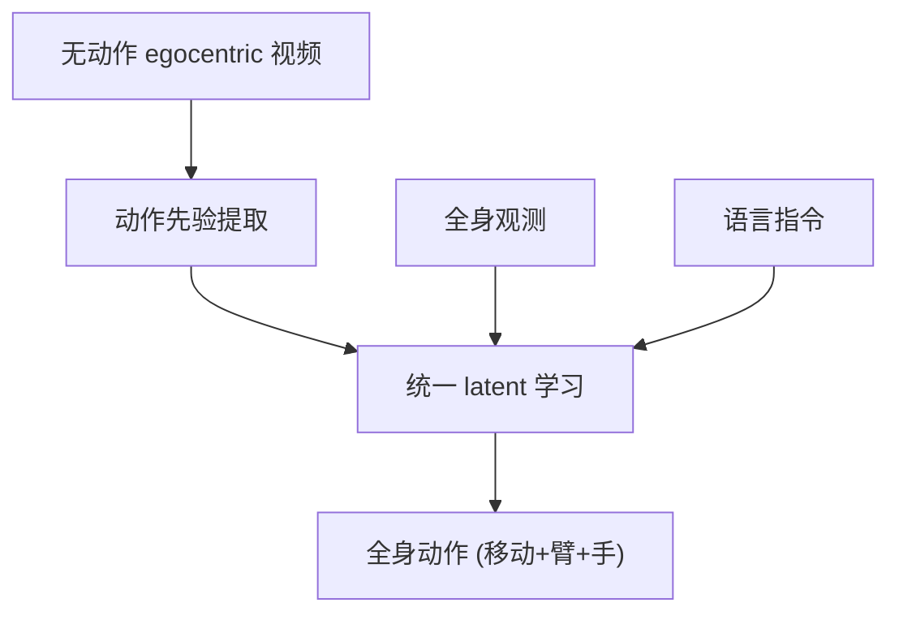

# WholeBodyVLA: Towards Unified Latent VLA for Whole-body Loco-manipulation Control

- 本地 PDF：`papers/architecture/WholeBodyVLA_2509.22642.pdf`
- arXiv：https://arxiv.org/abs/2509.22642
- 代码：https://github.com/OpenDriveLab/WholebodyVLA
- 年份：2026 (ICLR 2026)
- 团队：OpenDriveLab
- 阶段：全身人形 VLA — 统一 latent 学习，从无动作 egocentric 视频学习

## 一句话总结

WholeBodyVLA 是面向人形全身 loco-manipulation（移动+操作一体）的统一 latent VLA：从无动作 egocentric 视频学习动作先验，在 AgiBot X2 人形上以 78% 平均任务成功率超越 GR00T (42-57%) 21.3%。解决了人形全身控制的两大挑战：高维动作空间（几十 DoF）和动作数据稀缺。

## 核心技术

1. **统一 latent VLA** — 视觉/语言/动作统一到 latent 空间学习
2. **无动作 egocentric 视频学习** — 从第一人称人类视频提取动作先验，缓解人形动作数据稀缺
3. **全身 loco-manipulation** — 同时控制移动底盘 + 机械臂 + 灵巧手

## 底层原理与数学推导

**核心机制**：统一 latent VLA 把视觉/语言/动作映射到同一 latent 空间，从无动作 egocentric 视频提取动作先验（逆动力学），缓解人形动作数据稀缺。

## 物理直觉解释

"从 egocentric 视频学"的直觉：第一人称视频（"我看到我伸手拿杯子"）包含丰富的动作信息——即使没有标注动作，模型也能从"视觉变化"推断"手做了什么"。这像"看别人第一视角操作视频学做事"——不需要正式教学，看多了就会。

## 工程细节与实操指南

- 数据：无动作 egocentric 视频
- 架构：统一 latent VLA
- 评估：AgiBot X2 人形
- 对比：GR00T (42-57%)

## 消融实验与分析

| 对比 | 成功率 |
|------|--------|
| WholeBodyVLA | **78%** |
| GR00T | 42-57% |

## 技术权衡（Trade-off）

| 优势 | 劣势 |
|------|------|
| 全身统一控制 | 高维动作空间训练难 |
| 无动作视频利用 | embodiment gap |
| 超越 GR00T 21.3% | 需人形硬件验证 |

## 技术价值与演进定位

WholeBodyVLA 是"全身人形 VLA"方向的代表——和 GR00T N1（双系统）、Human-as-Humanoid（硬件对齐）形成对照：WholeBodyVLA 用统一 latent 端到端学习全身控制，无需显式系统分离。

## 与其他论文的关系

- **GR00T N1** — 双系统（System 2+1）；WholeBodyVLA 统一 latent 端到端
- **Human-as-Humanoid** — 硬件对齐零样本；WholeBodyVLA 数据驱动
- **UniFP** — 力位统一；WholeBodyVLA 全身动作统一
- **π0.5** — 桌面 VLA；WholeBodyVLA 扩展到全身

## 精读问题

1. 统一 latent 与显式系统分离（GR00T）的取舍——端到端 vs 可解释？
2. 无动作视频的动作先验提取——逆动力学精度？
3. 全身控制的 reward 设计——移动+操作的联合优化？
