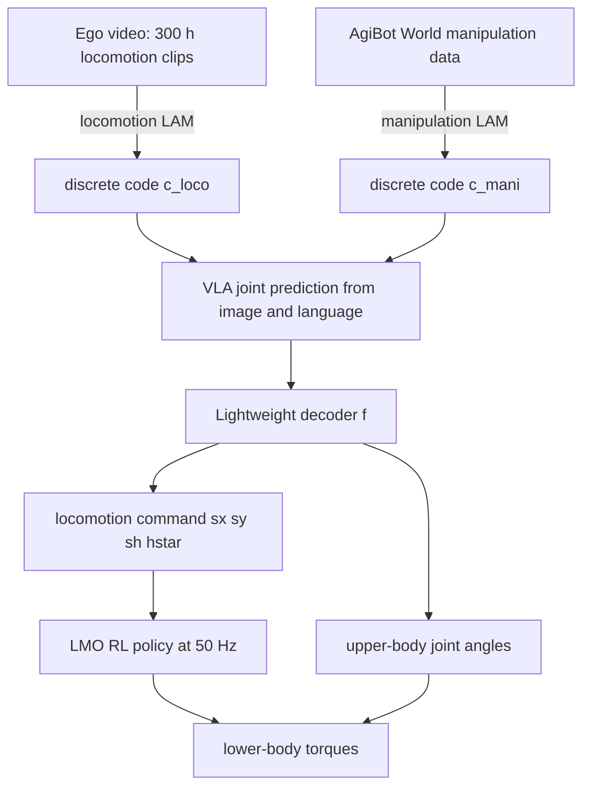

# WholeBodyVLA: Towards Unified Latent VLA for Whole-Body Loco-Manipulation Control

- 本地 PDF：`papers/architecture/WholeBodyVLA_2512.11047.pdf`
- arXiv：https://arxiv.org/abs/2512.11047
- 项目：https://opendrivelab.com/WholeBodyVLA （代码：github.com/OpenDriveLab/WholebodyVLA）
- 年份：2025（Preprint v2，2025-12；接收于 ICLR 2026）
- 团队：OpenDriveLab & MMLab@HKU + 复旦大学 + AgiBot + SII（Haoran Jiang / Jin Chen 共同一作，Hongyang Li、Zhihui Peng 共同 lead）
- 阶段：人形全身 loco-manipulation 统一框架 —— 双 latent action model 补"数据稀缺"，离散指令 LMO RL 补"决策-执行错位"

## 一句话总结

WholeBodyVLA 在 AgiBot X2 人形上实现首个大空间端到端 loco-manipulation：用一个 VQ-VAE 式的 manipulation LAM（学自 AgiBot World）与一个 locomotion LAM（学自自采 300 小时单人头戴相机 egocentric 视频）分别把无动作视频压成离散 latent 动作，VLM 主干（Prismatic-7B 初始化）联合预测两类 latent token，再由轻量 decoder 落到上身关节角 + 三元离散移动指令 $[s_x, s_y, s_\psi, h^*]$，最后由 Loco-Manipulation-Oriented（LMO）RL 控制器以 50 Hz 执行。三任务套件平均成功率 78.0%，比 OpenVLA-OFT w/ LMO 高 21.3 个点、比速度跟踪 RL 版本高 24.0 个点；去掉 latent 预训练直接掉到 39.3%。

## 核心技术

1. **分离式统一潜在学习** — 分别训练 manipulation LAM 与 locomotion LAM：混合训练单一 LAM 会因「操作视频相机基本静止 vs 行走视频相机持续运动」产生冲突的注意力目标与歧义 latent 编码（同一个臂-环境相对位置变化，一个来源归因手、另一个来源归因相机）；两个 LAM 的离散 codebook 作为伪动作标签共同监督 VLA 训练
2. **低成本 egocentric 数据管线** — 单个操作员戴头挂相机（RealSense D435i RGB-D 或 GoPro），执行前进/侧移/转身/下蹲等八类 canonical 运动原语并向潜在操作目标靠近，无需 MoCap 与遥操作；共采约 300 小时
3. **LMO RL：离散指令接口替代速度跟踪** — 下身控制建模为 goal-conditioned regulation：指令只有前/横/转三元 flag 加目标站姿高度，配 tanh 软门控参考整形、两阶段课程（先基础步态后精度稳定）、以 AgiBot World 手臂运动片段回放做结构化扰动
4. **三级执行链路** — VLA（~10 Hz，RTX 4090 工作站）输出 latent → lightweight decoder 映射为上身 14 关节目标 + 移动指令 → LMO RL（50 Hz，NanoPi 板载计算机）转成下身力矩，ZeroMQ over Ethernet 通信
5. **评测协议** — 三任务（bag packing / box loading / cart pushing）各 2 个子目标 ×25 次试验，双盲评审员裁定成功并按序传播失败（第一子目标失败则第二子目标记败）

## 底层原理与数学推导

### 1. 潜在动作模型（VQ-VAE 两段式）

LAM encoder $E_i$ 是建立在 DINOv2 特征上的时空 transformer。给定相邻帧 $(o_t, o_{t+k})$ 先产出连续潜向量再量化到码本：

$$c_t = \mathrm{quantize}(z_t) := \arg\min_{c \in \mathcal{C}_i} \| z_t - c \|_2, \quad z_t = E_i(o_t, o_{t+k})$$

其中 $i \in \{\mathrm{mani}, \mathrm{loco}\}$ 区分两个 LAM。decoder 由前一帧与量化 latent 重建后一帧 $\hat{o}_{t+k} = D_i(o_t, c_t)$，以 MSE 加标准 VQ 目标联合训练：

$$\mathcal{L}_{LAM} = \mathcal{L}_{mse} + \| \mathrm{sg}[c_t] - z_t \|_2^2 + \beta \| c_t - \mathrm{sg}[z_t] \|_2^2$$

$\mathrm{sg}[\cdot]$ 为 stop-gradient，$\beta$ 为 commitment cost。VLA 端以极大似然同时预测两类 latent：

$$\min_\theta \; -\log \pi_\theta(c^{\mathrm{mani}}_t, c^{\mathrm{loco}}_t \mid o_t, \ell)$$

即 Cross-Entropy 联合监督迫使策略在同一空间里学习移动与操作的耦合。

### 2. LMO 的软门控参考整形

三元 flag 不是阶跃信号——先经指数滑动平均平滑，再过饱和非线性映射为目标速度：

$$v^{ref}_k(t) = v^{goal}_k \tanh\big(\alpha (s_k - \bar{s}_k(t))\big), \qquad \bar{s}_k(t) \leftarrow (1-\lambda)\,\bar{s}_k(t-1) + \lambda s_k$$

$k \in \{x, y, \psi\}$，$\bar{s}_k$ 为平滑后的 flag。这保证开/关切换可预期，隐式约束加速度上界，避免传统速度跟踪下不同目标速率诱发的碎片化步态。

### 3. 精度与稳定的显式惩罚项

第二阶段用终止偏差衡量方向保真：episode 从任一轴 flag 从 0 翻转到 ±1 起、回到 0 且机身稳定止，

$$J_{dir} = \big| \mathrm{wrap}(\psi_{end} - \psi_{start}) \big|, \qquad J_{stand} = \| a^{leg}_i \|_2^2 \;\; (\text{仅静止 episode})$$

结构化扰动通过时间轴重参数化回放 AgiBot World 手臂轨迹片段：$\omega_{i+1} = \min(L,\ \omega_i + (\gamma + \delta_i)\Delta t)$，$\omega_0=0$，其中 $L \sim \mathrm{Unif}[0.8, 2.5]$、$\gamma \sim \mathrm{Unif}[0.8, 1.5]$、$\delta_i \sim \mathrm{Unif}[-0.25, 0.25]$，逐步目标 $q^{tar}_i = q_{arm}(\omega_i) + \epsilon_i$，$\epsilon_i \sim \mathcal{N}(0, 0.05^2)$。

### 4. 评估指标

仿真稳定性用质心摆动（CoMS）：$CoMS = \sqrt{\tfrac{1}{T}\int_0^T \| c(t) - \bar{c} \|^2 dt}$，$c(t) \in \mathbb{R}^2$ 为水平面质心投影。LAM 质量提出 Relative Reconstruction Gain：$RRG = \frac{MSE_{base} - MSE_{recon}}{MSE_{base}}$，其中 baseline 直接复制前一帧，RRG 越高说明 latent 越具预测力——这样 LAM 好坏不必等下游策略跑完才知道。

## 物理直觉解释

**为什么要拆成两个 LAM——像分清「我动了」还是「世界动了」**。人在前进拍摄时画面里物体向后掠过，此时手臂与杯子的相对位置变化来自脚步而非手臂；而固定机位的操作视频里同样的相对位置变化只能来自手。混在一起训，逆动力学模型就得学会「同一种像素变化对应两种完全不同的身体意图」，latent 编码自然含糊。论文的处理是把两种注意力诉求分开养：manipulation LAM 只盯手臂区域，locomotion LAM 盯整幅场景变化，然后用两个码本同时当老师教 VLA。代价是每个数据源只用一半容量的风险，但 RRG 表显示分离版几乎在每个原语上都更高（例如 Bag Packing 的 Grasp：21.78 vs shared 19.70）。

**离散指令接口像扳道岔而不是踩油门**。传统速度跟踪控制器像一个只看仪表盘速度的司机——永远在追赶一个速度设定值，起步慢半拍、刹不住车、转弯带漂移；对巡航够用，但对「走到刚好能抓到杯子的位置」这类事是灾难性的。LMO 把控制目标改成三个方向开关加一个下蹲高度，本质上是把「以什么速度走」换成「是否走、朝哪走」这种**离散且可验证**的语义，起停边界被写进了奖励函数里（$J_{dir}$ 只罚终端航向偏差）。tanh 软门控则是机械层面的缓冲器：开关信号不再瞬间顶满油门，而是像变阻器一样平滑爬升，gaits 不再碎裂。

**从无动作视频学 loco-manipulation 像「看视频学做饭」**。你不需要师傅身上绑着动捕服也能学会颠勺——因为视频本身就泄露了移动方向、末端轨迹和物体可供性。Latent action learning 把这个直觉形式化：帧间视觉变化被压缩进离散码本，这些码不含任何本体相关的关节值，所以同一段语义（Go Forward / Turn Left / Squat）能同时检索出人类第一人称片段与机器人遥操片段（Fig. 8），形成跨具身共享的动作空间。这也解释了为什么数据缩放实验中，「50% 以上人类视频预训练 + 仅 25 条遥操微调」能达到「不足 25% 视频预训练 + 200 条遥操微调」的水平——预训练买断的是知识，微调买的只是接地。

**结构化扰动的价值在于它是「真实的重物」而不是「随机的推搡」**。随机噪声外力教会腿部泛泛地抗干扰，但真实的抓取-搬举给躯干的是有节奏、有方向偏好的惯性耦合。把 AgiBot World 里真实的手臂运动片段加速到 2.0 倍、放大 1.5 倍幅度再加高斯噪声后回放到上肢，等于让练深蹲的人背上会晃动的杠铃——腿必须提前对抗系统性倾斜而非乱抖，这正是 Table 3 中 standing/squatting CoMS 均值压到 0.03 m 的来源。

## 工程细节与实操指南

- **硬件栈**：AgiBot X2 样机（双臂各 7 DoF + Omnipicker 夹爪、6 DoF 双腿、1 DoF 腰、头部 RealSense D435i 第一人称相机）；部署分层——VLA 跑 RTX 4090 工作站约 10 Hz，LMO RL 跑 NanoPi 板载 50 Hz，两者经 ZeroMQ/Ethernet 流式通信
- **训练配方**：VLA 以 Prismatic-7B 初始化，预训练 20k steps、总 batch 1024；LAM 训练 30k steps、batch 256；微调用 LoRA、10k steps、batch 64；全部 LAM/VLA 训练在 8×H100 上完成，RL 在单张 H100；主表实验是一个模型在三个任务上联合微调（非逐任务微调）
- **数据采集**：遥操作 = Meta Quest Pro VR 上身控制 + joystick 发移动指令，每任务 50 条；egocentric 行走视频约 300 小时，单操作员头挂 D435i 或 GoPro 即可采，要求覆盖八类运动原语并以「接触潜在操作目标」为目的导向行走
- **域随机化要点**（Table 5）：连杆质量 [0.8, 1.2]、摩擦系数 [0.1, 3.0]、躯干负载 [-5, 10] kg、PD 增益 [0.9, 1.1]、推撞至 0.5 m/s 每 4 s 一次、action lag [2,8] 步、IMU lag [1,10] 步；Stage II 显著提高扰动强度与频率
- **奖励权重摘录**（Table 4，Stage I→II）：forward intent 1.5→1.8、lateral 1.0→1.2、yaw intent 恒 2.0、垂直速度抑制 -0.5→-0.75、roll action zero penalty -0.05→-0.1、stand-still penalty -0.05→-0.1
- **评测细节**：25 trials/子目标，两名不知情的独立裁判盲评并对齐共识；MuJoCo 里步态精度测试为 5 s 恒定指令 + 10 s 归位期，误差只在归位期结算；稳定性测试中手臂轨迹按 2.0× 速度、1.5× 幅度回放并叠加最高 150 N 水平推力与 30 Nm yaw 力矩
- **执行耗时**（Table 8，秒）：WholeBodyVLA 六个子目标 18.4 / 29.7 / 16.8 / 7.6 / 11.3 / 12.7，全面快于 GR00T w/ LMO（26.3 / 38.6 / …）与 OpenVLA-OFT w/ LMO（33.2 s 的 Rise & Turn 明显拖慢流程）；Modular Design 因人类接管导航部分环节更快（如 Move & Squat 23.0 vs 29.7）
- **proprioceptive state 消融的反常现象**：Table 7 显示视觉扰动设置下去掉状态注入反而均分更高（76.7% vs 64.0%），正文以方差增大解释但数字方向相反，判读需谨慎，待确认：论文未给出该反常的显著性检验
- **扩展任务成绩范围**：五项扩展场景（长时程多步、崎岖地形、擦污渍、吸尘、视觉导航标记跟随）成功率落在 32.0%~88.0% 区间，其中地形穿越最低（32.0%）、单任务-数值对应关系请对照原文 Fig. 3(c)，图中标注顺序存在排版歧义，待确认

## 消融实验与分析

主消融（Table 2，三任务六子目标，25 trials/subgoal，Avg 为全六项均值）：

| 方法 | Grasp Bags | Move & Squat | Squat & Grasp | Rise & Turn | Grab Handle | Push Ahead | Avg |
|---|---|---|---|---|---|---|---|
| Modular Design（人工导航 + 本系统操作） | 22/25 | 12/25 | 9/25 | 9/25 | 22/25 | 22/25 | 64.0% |
| GR00T w/ LMO | 20/25 | 10/25 | 6/25 | 4/25 | 12/25 | 11/25 | 42.0% |
| OpenVLA-OFT w/ LMO | 19/25 | 6/25 | 12/25 | 12/25 | 22/25 | 14/25 | 56.7% |
| **WholeBodyVLA** | 23/25 | 13/25 | 19/25 | 17/25 | 23/25 | 22/25 | **78.0%** |
| w/ velocity-based RL（换 HOMIE 式控制器） | 22/25 | 1/25 | 16/25 | 3/25 | 24/25 | 15/25 | 54.0% |
| w/o LAM（直接 Prismatic-7B 微调） | 15/25 | 4/25 | 8/25 | 6/25 | 16/25 | 10/25 | 39.3% |
| w/ manip. LAM only | 24/25 | 7/25 | 17/25 | 11/25 | 20/25 | 14/25 | 63.3% |
| w/ shared LAM（混数据单码本） | 18/25 | 11/25 | 16/25 | 16/25 | 20/25 | 18/25 | 66.0% |

LMO 内部消融（Table 3，MuJoCo，位置/航向误差 mean±std 与 CoMS sway，越低越好）：

| 配置 | 前&后退 | 左右横移 | 原地转向 | CoMS 站立 | CoMS 下蹲 |
|---|---|---|---|---|---|
| LMO（完整） | 0.21±0.01 / 0.05±0.01 | 0.55±0.01 / 0.06±0.01 | 0.05±0.01 / 0.19±0.01 | 0.03±0.02 | 0.03±0.02 |
| 去 $J_{dir}$ 方向精度项 | 0.24±0.02 / 0.07±0.01 | 0.61±0.02 / 0.09±0.01 | 0.05±0.01 / 0.28±0.02 | 0.04±0.03 | 0.03±0.02 |
| 去 Stage II | 0.27±0.02 / 0.09±0.01 | 0.72±0.03 / 0.11±0.02 | 0.20±0.01 / 0.32±0.03 | 0.05±0.04 | 0.07±0.03 |
| 去 Stage I | 0.30±0.03 / 0.11±0.01 | 0.66±0.04 / 0.13±0.03 | 0.46±0.01 / 0.34±0.04 | 0.05±0.03 | 0.04±0.03 |
| Vel.-based policy | 0.24±0.04 / 0.12±0.02 | 0.60±0.05 / 0.17±0.06 | 0.26±0.01 / 0.20±0.06 | 0.06±0.04 | 0.05±0.04 |

**核心结论**：这套表格把两根支柱的贡献完全拆开了。上游侧，latent 预训练带来 38.7 个点的绝对增益（39.3% → 78.0%），其中 locomotion LAM 单独贡献 14.7 个点（63.3% → 78.0%），最大涨幅集中在必须先行走的子目标上；分离双 LAM 再胜混训共享 LAM 12.0 个点（66.0% vs 78.0%），且有 RRG 表佐证其并非仅靠运气。下游侧，换回速度跟踪控制器让总分崩落 24.0 个点（54.0%），且这 24 个点的差距里 91.7% 都发生在含移动的第二子目标上——Move & Squat 从 13/25 直接掉到 1/25，说明瓶颈不在「想」而在「走得准不准」。RL 内部消融进一步给出明确的责任划分：Stage I 缺失造成全场最大转向误差（0.46 m），Stage II 缺失主要伤害下蹲稳定（CoMS 0.07），方向精度项缺失最伤航向一致性（0.28 rad）。作者把 w/o RL 一行留空也是诚实的：没有低层控制器，上身直接预测下身关节的策略根本无法站立完成评测。

## 技术权衡（Trade-off）

| 选择 | 收益 | 代价 |
|------|------|------|
| 双 LAM 分离预训练 | 避免注意力冲突，比共享码本高 12.0 个点 | 训练两条 VQ-VAE 与两套码本，推理时要同时查两个码本；300h 自采行走数据与 AgiBot World 体量不平衡，须 batch 内均衡采样 |
| 离散指令接口 | 起停语义显式、轨迹方差小、VLA 学习更稳 | 放弃连续速度调节能力：斜坡、缓转、非整数档位的精细机动不在接口表达范围内，适用面窄于人形巡航场景 |
| 10 Hz VLA + 50 Hz RL 分层 | 板载算力友好（RTX 4090 + NanoPi） | 高层带宽受限：灵巧精细操作与快速反应受限，作者自认长时程与灵巧任务仍是短板，需要引入轻量建图与主动感知 |
| 第一子目标失败的传播式计分 | 强制评测 loco-manipulation 全链条可靠性 | 第二子目标得分被上游错误绑架，难以区分「没走到」与「走到了抓不好」（Sankey 分析中 object/basket unreachable 占大头正源于此） |
| 视觉主导决策 | 展示了跨起始位姿/外观的泛化（1.0~1.5 m、±30°~60°、多种桌面高度与颜色） | 完全不看本体状态的版本在扰动下波动大；approach 阶段的微小站位/朝向误差会级联成 pick/place 失败 |

## 技术价值与演进定位

这篇工作回答了人形落地最有生产价值的两个问题：一是「没有人形全身遥操大数据怎么办」——答案是不发明新硬件管线，而是把地面上的两张现成牌（AgiBot World 操作集 + 300 小时单人自拍行走视频）通过双 LAM 变成可用监督，这让数据成本从「MoCap/遥操团队级」降到「一个实习生 + 一台 GoPro 级」；二是「为什么人形走不稳看起来是 RL 问题其实是接口问题」——把速度跟踪换成三元指令后在真实任务上拿到 24 个点的差距，说明很多被归咎于模型的翻车其实源于底层目标的错位。与 GR00T N1.5、OpenVLA-OFT 的对比设计得干净（共用同一 LMO 底层以隔离高层推理差异），但基线都未做过人形 loco-manipulation 预训练，21.3 个点的领先幅度需要在更公平的数据条件下复核，待确认：原文未报告三种方法的预训练数据总量对比。工程可实现性方面，其 50 Hz 板载 RL + 10 Hz 工作站 VLA 的分工对硬件预算敏感的团队有直接参考价值。

## 与其他论文的关系

- **GR00T N1/N1.5** — 同为人形 VLA 但只覆盖上身操作；被改为输出相同离散移动指令并接同一 LMO 后仍只得 42.0%，作者以此论证高层 latent 预训练（而非底层稳定性）是主要差异来源
- **OpenVLA-OFT** — 与 WholeBodyVLA 共享 Prismatic-7B 初始化的最强对照：56.7% vs 78.0%，排除了模型规模与架构差异，把提升归因到统一潜在学习本身
- **UniVLA / LAPA / Genie / IGOR** — latent action 学习谱系的前作；本文延续 UniVLA 的 task-centric 思路但指出桌面静态相机假设在人形行走数据上失效，因此拆分 mani/loco 两个 LAM，这是对整个 latent action 路线的修正性贡献
- **HOMIE** — 其速度跟踪 RL 被「复现并改良」作为 vel-based 基线（掉了 24.0 个点），同时其上身后姿势目标重采样方案被吸收进 LMO Stage I；属于「站在对手肩膀上的正面交锋」
- **LeVERB / Being-0 / HEAD / R2S2 / FALCON** — Table 1 对比的模块化路线：要么依赖云端感知/MoCap/导航目标点等额外信息，要么把移动与操作切成脆接缝；本文宣称在闭环、多任务、免外部信息三列全部打勾
- **π0 / π0.5 / RT-2 / RDT** — 代表上身 in-place 操作的主流 VLA 谱系，本文将其定位为缺少 locomotion primitive 的「半个问题」解法
- **Boston Dynamics Atlas LBM** — 演示层面最接近（vision+text 输入 + closed-loop 多任务），但受限于 MoCap 数据与小工作区；本文用无动作视频路线换取了大空间自由度

## 精读问题

1. **两个 LAM 的信息泄漏边界在哪里**：locomotion LAM 在行走视频中从未见过真实抓取力反馈，它对「接触前减速接近」这类操作耦合行为能否编码？若把八类运动原语的码本粒度做细（比如区分 45° 与 90° 转），RRG 和下游成功率会如何变化？
2. **分离式 LAM 相对共享 LAM 的 12 个点优势能否部分归因于码本容量翻倍**：Table 9 中 manip. lam 在 Box Loading 的 Place 原语上 24.73 高于 shared 25.69（例外），说明优势并非全面碾压，待确认——论文是否做过等容量控制的对照实验？
3. **离散指令的三元 flag 是否限制了地形的适应性**：Terrain Traversal 只有 32.0%，而速度型控制在崎岖路面通常更强，能否设计 hybrid 接口让 flag 加微调偏置兼得起停精度与连续调节？
4. **Table 7 的反号结果如何解释**：视觉扰动下 w/o state 平均 76.7% 反超完整版 64.0%，正文却称去状态会降低性能——这是样本方差还是 decoder 对 state 过拟合？作者未做置信区间分析的原因是什么？
5. **91.7% 的差距集中在第二子目标意味着什么**：如果给 vel-based 控制器同样加上 $J_{dir}$ 终端偏差惩罚而不改接口，二者差距还能剩多少？即「接口离散化」与「奖励塑形」各自的贡献比例是多少？
6. **Cross-domain retrieval 显示的共享 latent（Go Forward/Turn Left/Squat）能推广到多细粒度语义**：一旦任务涉及双手协调节奏（如 cart pushing 的 Push Ahead 需要持续性发力），纯视觉帧对压缩出的 latent 是否还足以表达时长的累积效应？
