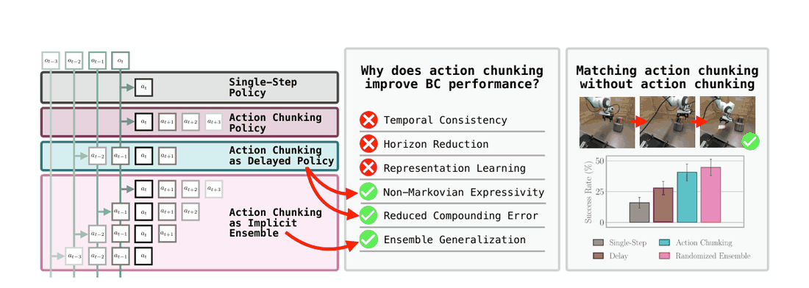
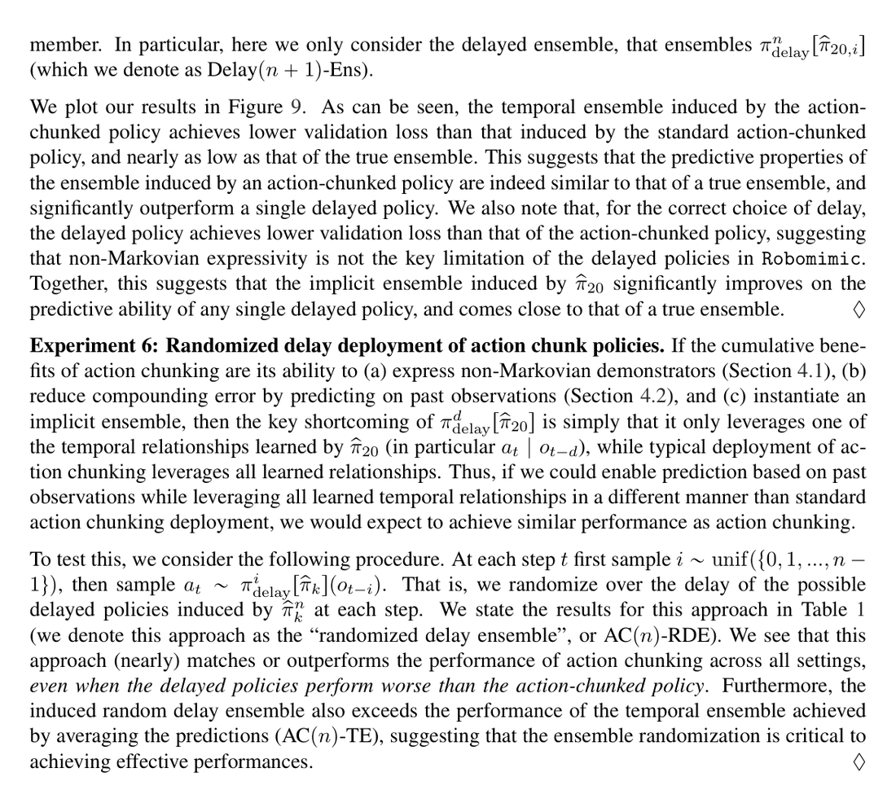
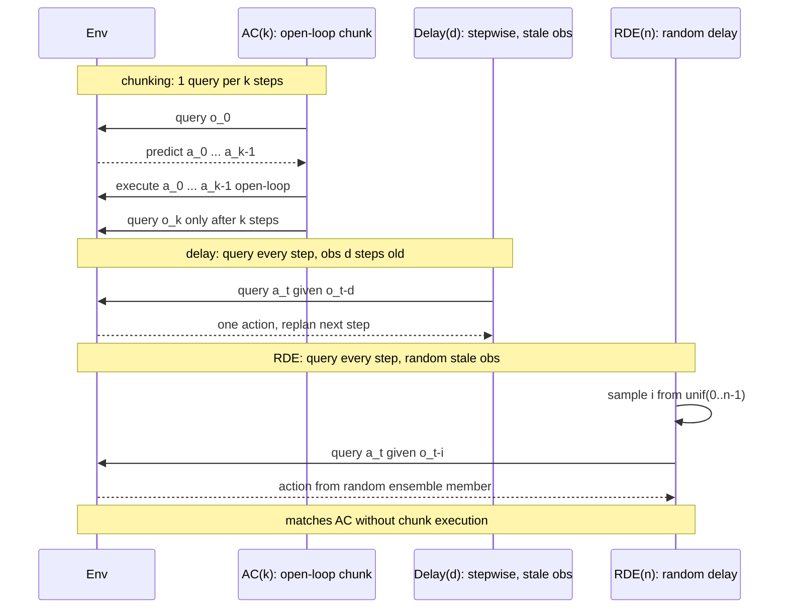

# Why Does Action Chunking Improve Behavioral Cloning Performance in Robotic Control?

- arXiv: https://arxiv.org/abs/2608.02547
- Source: Lazzati, Stachowicz, Chen, Metelli, Wagenmaker, Levine（Polimi + UC Berkeley）
- Project: https://action-chunking.github.io
- Local PDF: `papers/architecture/WhyChunking_2608.02547.pdf`
- Year: 2026
- Category: action chunking theory
- Priority: high

## 一句话总结

**Problem**：action chunking 是现代 BC 的标配但其收益机制不明（时序一致性/horizon 缩减/表征学习三大流行假设均无法解释）；**Insight**：chunking 收益 ≈ "基于延迟观测预测"（捕获人类非马尔可夫行为 + 降低复合误差）+ "隐式集成"（一个 π̂_k 同时学了 a_t|o_t, a_t|o_{t−1}, … 共 k 个时间关系）；**Mechanism**：把训练好的 chunk 策略改造成每步随机延迟采样的 RDE 部署即可复制 chunking；**Evidence**：RDE 在全部 9 个 benchmark 设置中匹配 AC（Tool Hang 71.8 vs 75.2），显式集成进一步反超（Transport 12.6→41.5，约 +30%），且真机 Franka 三任务 + π0.5 VLA 上同样成立。

## 九问速览

1. **Problem**：为何 chunking 提升 BC？文献三大假设（时序一致性、horizon 缩减、表征学习）逐一被证伪
2. **Bottleneck**：机制误解阻碍方法设计——把收益归错因，就无法放大它或替换它
3. **Insight**：π̂_k 等效 k 个延迟策略的隐式集成；延迟条件预测本身即可降复合误差
4. **Method**：机制隔离实验矩阵（Delay/Ordered/TE/RDE/Ens 对照同一 π̂_20）+ Lipschitz 理论（Thm 1-3）
5. **Evidence**：Delay 匹配 AC（Libero-90 94.0 vs 89.2）；RDE 全面匹配（9/9 设置）；集成反超 Transport +28.9 点
6. **Ablation**：AC(10)-Ordered 匹配 AC(10)（89.2→93.5）→ 时序一致性非必要；TE(42.2) < RDE(71.8) → 随机化是关键
7. **Assumption**：确定性 1-Lipschitz 平滑动力学；15-20Hz 控制；训练/测试初始分布一致；示教含人类停顿
8. **Failure**：50-60Hz 高频下 Delay 无法复制 chunking（需 5 步子块化）；开环不稳定系统不适用
9. **Opportunity**：自适应延迟选择、history-conditioning 与集成的兼容、显式集成 BC、推理暂停的分布偏移

| 维度 | 论文答案 |
|---|---|
| Perception | Robomimic 用低维真值状态（无图像），Libero 用 2×128×128×3 图像 + 本体感知；机制结论跨两种观测成立 |
| Closed-loop | 15-20Hz 下 chunk 长度≈反馈陈旧度：延迟 5-15 步不降反升；chunking 把"预测 k 步"与"开环执行 n 步"解耦成两个旋钮 |
| Correction | 无显式纠错机制；核心发现是"延迟重规划"等效——每步重算但条件于 o_{t−d}，纠错依赖 500Hz 底层跟踪 + 隐式集成鲁棒性 |
| Deployment | RDE 零训练改动即可部署；真机推理与执行交错（+1 步固有延迟）；推理暂停本身就是分布偏移源，chunking 天然减少暂停 |

## 核心技术

**理论框架：把"执行方式"从"训练目标"中剥离出来做受控对照。** 论文的关键构造是一套策略执行记号系统，让所有对照方法共享同一个训练好的 π̂_20，只改部署时的取数方式：

*论文 Figure 1（p2）：Figure 1: In this work we investigate why action chunking improves the performance of behavioral*

1. **π̂_n^k（部分执行 chunk）**：训练预测 k=20 步 chunk，只执行前 n 步再重规划。n=k 即标准 AC，n=1 即"训练带 chunk 但单步执行"。
2. **π^d_delay[π̂_k]（诱导延迟策略）**：从 π̂_k 在 o_{t−d} 上输出的 chunk 中取第 d+1 个动作——每步都重算，但条件于 d 步前的旧观测。这是"延迟重规划"的形式化。
3. **π̂_delay^d（直接训练的延迟策略）**：直接监督训练 a_t|o_{t−d}，检验诱导延迟与显式训练是否等价。
4. **AC(n)-TE（时间集成）**：对前 n 次预测线性平均（对比 ACT 原文指数加权 TE——指数加权会压掉集成效应）。
5. **AC(n)-RDE（随机延迟集成，本文提出）**：每步采样 i ~ unif{0,…,n−1}，执行 π^i_delay[π̂_k]——把隐式集成显式化为"随机抽成员"。
6. **AC(n)-Ens / Delay(n)-Ens（显式集成）**：独立训练 m 个 π̂_20 组成真集成，放大隐式集成效应。

**关键定义（被证伪与被证实的机制）**：
- *决策边界（decision boundary）*：任务中必须改变运动方向的时刻（如"拉开抽屉"中抓住把手处）。人类在此处一致地停顿若干步——状态没变但动作依赖历史，是**非马尔可夫行为**的典型来源；马尔可夫策略只能学出"等/走"混合的边缘分布而失稳。
- *隐式集成（implicit ensembling）*：训练 π̂_k 时每个动作 a_t 被以 k 种条件（o_t,…,o_{t−k+1}）重复监督，等效随机森林式"特征子集集成"，通过部署时的随机延迟激活。
- *验证误差 L_val*：采样动作的均值与示教动作的 MSE（避开扩散去噪损失无法按 chunk 内步位隔离的问题）。

## 底层原理与数学推导

BC 与 chunking 的训练目标（式 1/2）：

$$
\hat\pi = \arg\max_\pi \sum_{(o_t,a_t)\in D_{\text{train}}} \log \pi(a_t\mid o_t),\qquad
\hat\pi_k = \arg\min_\pi \sum_{(o_t,a_{t:t+k})\in D_{\text{train}}} \log \pi(a_{t:t+k}\mid o_t)
$$

**定理 1（马尔可夫策略的指数下界）**：在确定性动力学、P 与 r 均 1-Lipschitz、π̂ 1-Lipschitz 的假设下，存在环境与马尔可夫示教者，即使 π̂ 每步拟合误差被 W1 距离控制：

$$
\max_t \mathbb{E}_{\pi_{\text{demo}}}\big[W_1(\pi_{\text{demo}}(s_t),\hat\pi(s_t))\big] \le \epsilon
\;\Longrightarrow\;
J(\pi_{\text{demo}}) \ge J(\hat\pi) + \Omega(2^H\cdot\epsilon)
$$

构造是二维积分系统 s_{t+1}=s_t+a_t、奖励 r(s)=1−|s_1|：每步 ε 的横向偏差按 s_{t+1,1} = 2s_{t,1}+ε 累积为 ε(2^t−1)。

**定理 2（chunk/延迟策略的复合误差上界）**：若 π̂_n 在整个 chunk 上拟合误差有界（式 3），则对 k<n：

$$
\mathbb{E}_{\pi_{\text{demo}}}\Big[\max_{i\in[n]} W_1\big(\pi_{\text{demo}}(s_{t+i-1}),[\hat\pi_n(s_t)]_i\big)\Big]\le\epsilon
\;\Longrightarrow\;
J(\pi_{\text{demo}}) - J(\hat\pi_n^k) \le O\big((k{+}1)^{H/k}\cdot\epsilon\big),\quad
J(\pi_{\text{demo}}) - J(\pi^k_{\text{delay}}[\hat\pi_n]) \le O\big((k{+}1)^{H/k}\cdot\epsilon\big)
$$

证明核心是递推引理 δ_{t+1} ≤ δ_t + δ_{t−k} + ε ⟹ δ_t ≤ 2(k+1)^{⌊t/k⌋}ε（几何级数求和）。取 k=c·H 时 (k+1)^{H/k} ≈ H^{1/c} 是 H 的多项式——从 2^H 到多项式即"指数级改进"；但**延迟策略拿到完全相同的界**，说明在平滑确定性动力学下 chunking 对复合误差没有超出"延迟预测"的额外好处。绝对位置控制下界可改进为 Ω(H²ε) vs O(H²/k·ε)（脚注 3）。

**定理 3（chunk 策略的匹配下界，证明上界紧）**：同样构造下存在环境使任意满足 chunk 内一致 ε 拟合的 π̂_k：

$$
J(\pi_{\text{demo}}) \ge J(\hat\pi) + \Omega\big((k{+}1)^{H/k}\cdot\epsilon\big)
$$

三项定理合成一句话：复合误差率 Θ((k+1)^{H/k})，且 chunk 与延迟等效。附录 D.4 说明此 Lipschitz 假设与 Robomimic 实测相符：s_{h+1} ≈ s_{h−3} + a_{h−3}（500Hz 底层控制器跟踪 20Hz 指令的平滑滞后）。

## 物理直觉解释

**延迟策略像"看旧路牌开车"：只要路牌够新、路够直，盯着 0.3 秒前的路况开车反而更稳。** 这篇论文最反直觉的发现是：条件于 o_{t−10} 预测 a_t 比条件于当前 o_t 更准（Fig 2，验证误差在延迟 10 处最低）。物理上有两层原因：其一，人类示教本身是"延迟反馈"式的——视觉引导行为只在 2-10Hz 更新，20Hz 录制下来的动作天然带 5-15 步时序相关，马尔可夫策略强行用当前帧解释"过去的决定"就会在决策边界学出抖动的边缘分布；其二，复合误差使当前观测 s_t 已经偏出训练分布，反而是更早、更接近训练分布的 s_{t−k} 上做预测更可靠。**chunking 的本质因此不是"计划得远"，而是"用过去的、更干净的状态做决定"**——开环执行整段 chunk 只是实现这一点的最粗暴方式，每步重算但看旧观测（延迟策略）是更精细的等价物。

**隐式集成像"合唱团轮流领唱"而不是"永远同一个人唱"。** 单个延迟策略只激活了 π̂_20 学到的 20 个时间关系中的一个；标准 AC 每 k 步换一次观测锚点，粗粒度地轮换成员；TE 把所有成员的预测平均起来，反而让误差相互抵消成保守动作（Tool Hang 上 TE 只有 42.2 vs RDE 71.8）；RDE 每一步随机抽一个延迟成员，rollout 时间维度上等效真集成的成员采样。集成之所以有效，是因为每个成员在不同子空间（不同时刻的观测）上过拟合不同的噪声，聚合后方差下降——这正是随机森林的机制。**Transport 上显式集成把 12.6 拉到 41.5（+28.9 点）说明"集成深度"是 chunking 收益里被埋没最大的一块**：一个 π̂_20 只有 20 个成员，5 个独立 π̂_20 的集成有 100 个。

**推理暂停是真机上的"隐形税"，chunking 是天然的免税额度。** 仿真里策略推理不消耗世界时间，真机却不行：暂停等推理会让机器人漂移、状态在推理前后不同，制造训练（人类无暂停）与部署（机器人有暂停）之间的分布偏移，进一步喂大复合误差。论文的真机方案是把推理与执行交错、提前一步开始算下一动作（代价是所有方法 +1 步固有延迟）——这其实就是 RTC 家族异步推理思想的雏形。chunking 每 k 步才推理一次，天然把暂停税除以 k；而 RDE 虽然每步推理，但允许用任意旧观测，同样可以把推理完全藏进执行流水线里。**这解释了为什么"延迟"在真机上不是缺陷而是资源：延迟容忍度=异步化的空间。**

## 工程细节与实操指南

- **何时用大 chunk（n→k）**：控制频率高（50-60Hz）且任务需要时序平滑时——高频下人类示教动作强相关，Delay 会失效，此时把 5 步子块当"一个动作"（等效回到 10-20Hz 决策粒度）即可恢复性能；Robomimic Tool Hang 这类精密接触任务也从较长执行块获益（AC(10) 75.2 > AC(5) 65.2）。
- **何时用小 chunk/单步**：低频（15-20Hz）+ 开环稳定（EE 位置控制 + 高频底层跟踪）的桌面操作，Libero-90 上最优执行块可以到 n=1（Delay(6) 94.0 甚至高于 AC 89.2）；动态场景/需要快速反应的任务缩短执行块。
- **何时不用 chunk 而用 RDE**：推理预算紧张或想异步推理时——每步只取一个动作（从随机延迟位置），无需等整 chunk 生成；训练零改动，只改采样代码（每步 i~unif{0..n−1}，执行 π^i_delay[π̂_k]）。
- **想涨点时上显式集成**：3-5 个独立种子训练的 π̂_k 集成（随机抽成员或平均皆可），在困难任务上稳定 +10~+30 点（Transport 12.6→41.5，Tool Hang 75.2→87.6）；代价是 m 倍训练与内存。
- **数据少时 chunking 更重要**：AC(10)−AC(1) 差距从 N=50 示教的 0.20 涨到 N=10 的 0.39——小样本项目优先保 chunk/延迟，大数据项目可考虑省掉。
- **示教预处理会影响结论**：π0.5 的 Libero 微调数据删掉了停顿，其马尔可夫基线因此好得多（19.8→84.0）——如果你的数据管线做了 pause-removal，chunking 的非马尔可夫收益会缩水。
- **延迟量级选择**：验证误差扫描显示延迟 5-15 通常最优（Fig 2），不必扫全部；真机部署给 +1 步推理延迟即可实时化。

## 实验协议清单

| 项目 | 论文设置 | 来源与备注 |
|---|---|---|
| 观测 | Robomimic：低维状态（每臂 9 维本体感知 + 真值物体状态，无图像）；Libero：2 张 128×128×3 图像（前置+腕部）+ 9 维本体感知 + 90 维任务 one-hot（多任务单模型）；真机：120×120×3 图像 | 附录 A.2 (p20-21)、A.5 (p24) |
| 动作空间 | 7 维 delta 末端位姿 + 夹爪（Libero 全任务 / Robomimic 除 Transport）；Transport 双臂 14 维；真机 delta 关节位置控制（Robotiq 夹爪） | 附录 A.2、A.5 |
| 控制频率 | 仿真 20Hz（示教采集 20Hz；底层控制器 500Hz，每高层步 25×2ms 跟踪窗口）；真机 15Hz；附加讨论 50-60Hz 实验 | §8、附录 B.3 |
| 重规划频率 | AC(n)：每 n 步重规划（n∈{1,5,10,15,20}）；Delay(d)：每步重规划但条件于 o_{t−d}；RDE：每步随机延迟；真机全部 +1 步固有延迟 | §5-6、附录 A.4、A.5 |
| 动作 horizon | 训练 chunk k=20；执行 n≤20 扫描；π0.5 复验时 chunk=10 | §4、附录 B.5 |
| 数据 | Libero-90：每任务 50 条人类示教（90 任务）；Robomimic PH：每任务 200 条（Can/Square/Transport/Tool Hang 四个最难任务）；真机：每任务 50 条人类示教 | §4、§5、附录 A.2 |
| 奖励 | 0-1 成功奖励 J(π)=到达成功状态概率；无 RL | §3 |
| Reset | 仿真未报告；真机固定初始状态（模重置精度误差） | 附录 A.5 |
| 成功定义 | 任务二值成功（r(o)=1）；报告成功率均值±SEM | §3、附录 A.4.1 |
| 评估次数 | Robomimic 每 seed 250 rollouts（上限：Square 300 / Can 250 / Transport、Tool Hang 650 步）；Libero 每任务 40 rollouts（上限 400 步）；真机每方法 50 rollouts | 附录 A.4.1、A.5 |
| 随机种子 | Libero 表格 15 seeds（部分图 3 seeds）；Robomimic 10-15 seeds；集成=3 组×5 seeds | 附录 A.4.2-A.4.8 |
| 扰动测试 | 未报告（无显式部署时扰动实验；机制分析依赖验证误差 + 决策边界案例） | — |
| 真机 | Franka Emika，3 任务（carrot in bowl / bread toaster / sushi in cup），50 rollouts/方法，成功率为柱状图（具体数值未报告） | §6、Fig 10 |
| 算力 | 1×Nvidia H100 + 10×A100 | 附录 A (p20) |
| 特权信息 | Robomimic 用真值物体状态（特权低维观测）；Libero/真机为图像无特权 | 附录 A.2 |

**附录陷阱自查**：
- privileged 信息：Robomimic 低维真值状态简化感知，但结论在图像 Libero 与 VLA（π0.5）上复现，机制归因不受影响
- reward shaping：无（0-1 成功，无稠密奖励）
- reset 难度：真机固定初始状态降低方差；仿真未报告
- eval budget：充足（每 seed 250 rollouts Robomimic；Libero 40×90 任务；真机 50）——结论不太可能是评估噪声
- 底层控制栈：EE delta 位置控制 + 500Hz 底层跟踪 = 开环稳定动力学（论文理论的隐含前提，也是 chunking-exploratory 一文的核心条件）
- 数据优势：无外部数据；所有对照共享同一 π̂_20 仅改执行方式——机制隔离干净；但示教为人类遥操作（含停顿），对已做 pause-removal 的管线外推需谨慎

## 消融实验与分析

*论文 Table 1（p11）：Table 1: Comparison of success rates across Libero-90 and Robomimic. We see that action chunk-*

**Table 1（主结果，成功率 %）：同一 π̂_20 的五种部署方式**

| 任务 | Markov | AC(n) | Delay(n) | AC(n)-RDE | AC(n)-TE |
|---|---|---|---|---|---|
| Libero-90 | 68.9±0.6 | 89.2±0.2 | **94.0**±0.1 | 93.6±0.1 | 92.7±0.1 |
| Libero-10 | 19.8±1.5 | 88.7±0.4 | 86.8±0.4 | **88.5**±0.4 | 86.0±0.5 |
| Robomimic Can PH | 83.7±0.4 | **97.2**±0.3 | 93.5±0.4 | 96.7±0.2 | 96.2±0.3 |
| Robomimic Square PH | 69.0±0.8 | **85.4**±0.5 | 80.8±0.6 | 82.4±0.6 | 80.6±0.5 |
| Robomimic Transport PH | 3.3±0.3 | **12.6**±0.5 | 7.9±0.5 | 12.1±0.5 | 12.2±0.6 |
| Robomimic Tool Hang PH | 28.0±0.8 | **75.2**±0.5 | 51.6±0.9 | 71.8±0.8 | 42.2±1.0 |

**Table 2（显式集成反超 AC）**：Libero-90 AC-Ens 94.1 / Delay-Ens **95.0** / RDE-Ens 94.6；Tool Hang 87.6 / 84.9 / 86.4（vs AC 75.2）；Transport 41.5 / 38.9 / 38.4（vs AC 12.6，**+28.9 点**）。

**机制隔离实验（本文方法的精华）**：
1. **Delay vs AC（Exp 1-2）**：同一 π̂_20，逐步重算 vs 整块开环——Libero 上 Delay 反超（94.0>89.2），证明非马尔可夫表达 + 延迟预测已够；Robomimic 上 Delay 落后（Tool Hang 51.6<75.2），暴露缺失成分。
2. **ΔL_val vs ΔJ 相关性（Exp 3）**：以"马尔可夫与最优延迟策略验证误差之差"度量任务的非马尔可夫程度，与 chunking 增益**几乎不相关**——表达力只解释一部分。
3. **AC(10)-Ordered（附录 B.1，关键对照）**：按 0→9 顺序循环执行 10 个诱导延迟策略（保留逐步延迟与顺序、破坏 chunk 的联合时序一致性）：Libero-90 93.5、Tool Hang 75.2、Transport 12.5——全部匹配 AC(10)（89.2/75.2/12.6），**证伪时序一致性假设**（联合分布不重要，边缘够用）。
4. **TE vs RDE（Exp 5-6）**：线性平均预测（TE）在 Tool Hang 只有 42.2，随机抽成员（RDE）71.8——集成的价值在**随机化采样**而非预测平均。
5. **表征学习（Exp 4，Fig 7）**：π̂_20^1（训练 chunk 执行单步）> π̂_1（纯单步训练）说明有表征红利，但 π̂_delay^5 直接训练延迟策略即可复现——红利源于"延迟目标"而非"chunk 辅助损失"。
6. **数据规模（附录 B.2）**：N=10/25/50 示教下 AC(10)−AC(1) 差距 0.39→0.31→0.20，chunking 增益随数据量收敛。
7. **频率实验（§8）**：50-60Hz 下 Delay 无法复制 chunking，把 5 步打包为"一个动作"（等效 10-20Hz）后恢复——时序一致性只在超过人类 2-10Hz 反应带宽的高频下才必要。
8. **VLA 复验（附录 B.5）**：π0.5（chunk=10）上 Delay(6) 匹配 AC(10)（如 Libero-Goal 98.5 vs 97.5，RDE 99.0）。

**核心结论**：chunking 收益 = 延迟条件预测（非马尔可夫 + 复合误差，Delay 可复制）+ 隐式集成（RDE 可复制，Ens 可放大）——三因素几乎完全解释 chunking，且可以在不使用 chunking 的情况下匹配它。

## 技术权衡（Trade-off）

| 优势 | 劣势与工程代价 |
|------|---------------|
| 首次给出 chunking 收益的完整机制分解，三假设证伪 + 三机制证实，理论界与实验互相印证 | 结论依赖平滑动力学与 15-20Hz 控制频率；50-60Hz 或非平滑（接触丰富）场景结论改变 |
| RDE 零训练成本复制 chunking，且天然支持异步推理（延迟容忍） | RDE 每步都要一次前向（AC 每 k 步一次），推理总量更高；真机需交错推理工程 |
| 显式集成在困难任务上 +10~+30 点，是即插即用的涨点手段 | 集成 m 倍训练/内存成本；Transport 类任务的绝对成功率仍低（41.5%） |
| 理论（Thm 2）给出 chunk 长度的定量指导：k=cH 时多项式误差率 | 理论为渐近构造，未给出具体任务的 k 选择公式；绝对位置控制下界（H²/k）与实验规模有差距 |
| π0.5 复验证明结论外推到 VLA 与开源权重 | 真机仅 3 个桌面任务、单一 Franka 平台；动态/非结构化环境未覆盖 |

## 技术价值与演进定位

这是 action chunking 从"经验技巧"变成"可解释机制"的转折点论文。ACT（2023）提出 chunking 时给出的理由（复合误差、时序一致性）在此被拆解重审：复合误差收益真实存在但机制是"延迟条件"而非"horizon 缩减"；时序一致性在常规 15-20Hz 操作里基本不必要；真正的第三根支柱"隐式集成"是本文新发现的。它同时给出了两个可立即落地的产物——RDE 部署（不改训练复制 chunking + 异步推理空间）与显式集成 BC（稳定反超 chunking）。与同期控制论视角的 chunking-exploratory（2507.09061，Zhang et al.）形成互补：那篇回答"何时 chunking 强"（开环稳定系统），这篇回答"为何 chunking 有用"（统计机制），两篇合起来构成 chunking 理论化的双子星。对 VLA 工程的意义在于：chunk 长度不再是不敢动的玄学超参，而是"反馈陈旧度 × 集成深度 × 推理预算"三个可分离旋钮的乘积。

## 与其他论文的关系

- **notes/data/mobile-aloha-act.md（ACT 原文）**：ACT 的 chunking 动机（O(T²ε) 复合误差 + 时序一致性）被本文精确重审——复合误差收益归因修正为"延迟条件预测"，时序一致性被 AC(10)-Ordered 对照证伪；ACT 的 temporal ensemble（指数加权）被指出会压掉集成效应，线性 TE/RDE 才能激活（Tool Hang 42.2 vs 71.8）。
- **notes/architecture/diffusion-policy.md（Diffusion Policy）**：DP 的 receding horizon（预测 16 执行 8）在本文记号下就是 π̂_16^8，其"块内开环+块间重规划"被证明可整体替换为 π^8_delay[π̂_16]；DP 发现的 latency robustness（晚 4 步仍正确）正是"延迟策略等效性"的早期实验证据；本文全部实验用 DDPM 策略头，继承 DP 范式。
- **notes/architecture/pi0.md（π0）**：π0 的 H=50 chunk + 每 0.5s/0.8s 部分执行设计直接落在本论文的 π̂_50^n 框架内；B.5 用 π0.5（chunk=10，openpi 开源权重）复验 Delay/RDE 等效性，把结论从 MLP-DDPM 推到 3B 级 VLA flow 模型。
- **notes/briefs/action-chunking-brief.md（88 方法工作台）**：本文是分类轴 8"分析与理论"的两大支柱之一（"why it works"）；RDE 的"用旧观测换异步推理"与分类轴 2 RTC 家族（实时/异步推理）直接对话；"延迟 5-15 步最优"给分类轴 1（长度自适应）提供了选择依据——自适应的对象应是延迟而非 chunk 长度。
- **chunking-exploratory（2507.09061，库内姊妹篇）**：本文引用其为 Zhang et al. [51] 并对齐结论（控制论稳定性下 chunking 抑制复合误差）；两篇互补——该文证明"开环稳定系统里 chunking 有指数优势"，本文证明"常规操作设置里该优势可被延迟策略+集成复制"；本文发现的 50-60Hz 失效边界恰好是该文开环稳定性条件的统计侧镜像。
- **Simchowitz et al. 2503.09722（[50]）**：连续动作 IL 指数复合误差下界的来源，本文 Thm 1 的控制论近亲。

## 精读问题

1. 隐式集成的成员间相关性：π̂_20 内部 20 个延迟头共享同一骨干（数据/参数均同源），理论上集成多样性有限，为何 RDE 仍能逼近 5 个独立种子的显式集成（94.6 vs 95.0）？骨干共享时的集成有效性能否定量刻画？
2. 延迟量自适应：Fig 2 显示最优延迟任务相关（5-15 步），能否在线（如按验证误差置信度或 rollout 一致性）选择每步的延迟分布，把 RDE 的 uniform 采样升级为加权采样？论文 §8 明确将其列为开放问题。
3. 决策边界的检测与利用：非马尔可夫收益集中在"停顿型决策边界"（Fig 5-6 的 step 80 尖峰），能否先从示教中自动检测停顿段，再决定该任务用马尔可夫/延迟/chunk 策略，避免统一上 chunk 的开销？
4. 与 history-conditioning 的正面冲突：全历史策略（a_t|o_{≤t}）能表达非马尔可夫行为但样本复杂度爆炸（脚注 2），折中方案（如固定窗口 stacking + RDE）在什么窗口长度下超越单一延迟？
5. 推理暂停的定量税额：真机 +1 步交错推理是工程妥协，能否把"暂停次数×漂移量"建模进 Thm 2 的界，给出"chunk 长度 vs 推理延迟 vs 复合误差"的三方最优解（与 RTC 家族的 latency-accuracy 曲线对接）？
6. 集成聚合方式：Tool Hang 上 random 聚合远优于 mean（86.7-87.6 vs 71.9-74.9）而 Transport 相反（mean 41.5 vs random 22.8），聚合方式与任务结构（多模态强度？）的交互机制是什么？
7. 跨频率外推：人类 2-10Hz 反应带宽解释了 50-60Hz 失效，那么对非人类示教源（脚本专家、RL 策略、VLA 蒸馏）生成的数据，最优 chunk/延迟是否应该完全不同（对照 chunking-exploratory 的确定性专家实验）？

