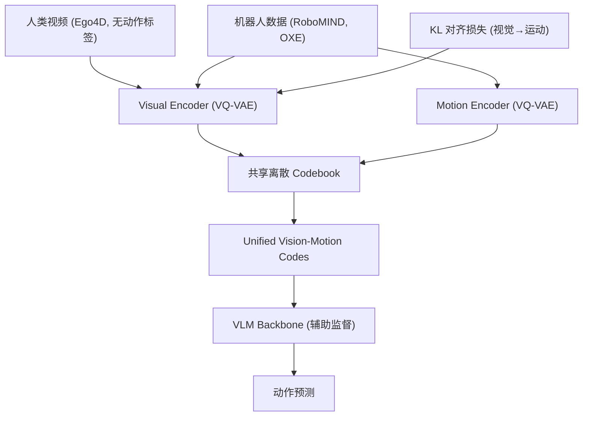

# XR-1: Unified Vision-Motion Codes for General-Purpose VLA Models

- 本地 PDF：`papers/architecture/XR-1_2511.02776.pdf`
- arXiv：https://arxiv.org/abs/2511.02776
- 代码：https://github.com/Open-X-Humanoid/XR-1
- 权重：https://huggingface.co/collections/X-Humanoid/xr-1
- 年份：2026 (ICML 2026 Oral, top 0.7%)
- 团队：北京人形机器人创新中心 + 北航 + 北大
- 阶段：开源 VLA 新标杆 —— UVMC 统一视动编码 + 三阶段训练 + 6 具身 120+ 任务

## 一句话总结

XR-1 提出 Unified Vision-Motion Codes (UVMC)：用双分支 VQ-VAE 将视觉动态和机器人运动联合编码到共享离散 latent 空间。三阶段训练（自监督 UVMC → VLA 预训练 → 任务适配），6 种具身形态、120+ 任务、14,000+ 真实 world rollouts 评估。平均成功率 72.0%（π0.5 仅 41.0%、π0 40.8%），few-shot 即可适配新任务，全套开源。ICML 2026 Oral。

## 核心技术

1. **UVMC (Unified Vision-Motion Codes)** — 双分支 VQ-VAE：视觉分支编码场景动态，运动分支编码机器人动作，共享离散 codebook。KL 对齐损失强制视觉编码向运动编码靠拢，使人类视频（无动作标注）也能参与训练
2. **三阶段训练** — Stage 1: 自监督 UVMC 学习（Ego4D + RoboMIND + OXE）→ Stage 2: UVMC 引导的 VLA 预训练（UVMC tokens 作为辅助监督注入 VLM backbone）→ Stage 3: 任务特定 post-training（20 demos 足矣）
3. **跨具身 codebook** — UVMC 的离散 codebook 天然具身无关，同一 code 可以表示"抓取"这一动作无论是在 UR5 还是人形机器人上
4. **全栈开源** — 模型权重 + RoboMIND 数据集 + 训练代码全部开源，首个通过国家标准测试的 VLA

## 底层原理与数学推导

UVMC 的核心公式——双分支 VQ-VAE 的联合优化：

$$\mathcal{L}_{\text{UVMC}} = \mathcal{L}_{\text{rec}}^{\text{vis}} + \mathcal{L}_{\text{rec}}^{\text{mot}} + \mathcal{L}_{\text{vq}} + \beta \cdot D_{\text{KL}}(q_{\text{vis}} \| q_{\text{mot}})$$

KL 对齐损失是关键——强制视觉编码分布向运动编码靠拢，使没有动作标签的人类视频也能学到有用的 motion prior。两个分支各自按标准 VQ-VAE 目标训练：

$$
\mathcal{L}_{vis} = \|\hat{c}_{t+h} - c_{t+h}\|_1 + \beta \left( \|sg(z_{vis}) - z_e^{vis}\|_2^2 + \|z_{vis} - sg(z_e^{vis})\|_2^2 \right), \quad \mathcal{L}_{mo} = \|\hat{a}_{t:t+h} - a_{t:t+h}\|_1 + \beta \left( \|sg(z_{mo}) - z_e^{mo}\|_2^2 + \|z_{mo} - sg(z_e^{mo})\|_2^2 \right)
$$

其中 $c_{t+h}$ 为未来第 k 帧视觉预测目标，$a_{t:t+h}$ 为动作序列，$sg(\cdot)$ 为 stop-gradient。Stage-2 中 VLM 通过可学习 token $t$ 预测 UVMC：

$$
\mathcal{L}_{uvmc} = \|F(l, o, t) - z_e^{uvmc}\|_2^2
$$

动作头则以 MSE 并行回归动作，UVMC token 作为辅助监督把视觉动态语义注入 VLM 骨干。

**XR-1 解决的核心问题："看到别人做"和"自己会做"之间缺一个翻译层**。人类视频告诉你"杯子被拿起来了"，但没有告诉你机械臂该转多少度。传统 VLA 直接映射像素到关节角——像素和关节角之间的距离太远，中间隔着场景理解、物体位姿、运动学反解等层层鸿沟，训练效率低。UVMC 在两个世界之间架了一座桥——把"看到杯子移动"（视觉动态）和"机械臂运动模式"（机器人运动）映射到**同一个离散 codebook** 里，VLM 只要学会说这种"通用动作语言"，就能把视觉翻译成动作。

**KL 对齐损失是这座桥的"桥墩"**：视觉分支编码的场景动态分布被强制向运动分支的分布靠拢（$D_{KL}(q_{vis} \| q_{mot})$），于是没有动作标签的 Ego4D 人类视频也能参与训练——模型在"看人类擦桌子"时学会了"擦桌子对应的 motion code"。这就像学外语时先建立"语义概念"与"发音"的双语词典，再多的无声电影（人类视频）也能扩充词汇量。消融中 w/o KL 使成功率从 66.7% 跌到 48.3%，motion-only（35.0%）与 vision-only（50.0%）都远低于完整模型，证明桥的两端缺一不可。

**数据规模呈现单调 scaling law**：Stage-1 预训练数据从 1% 增至 100%，平均成功率从 29.2% 单调爬升到 65.0%（1%→10%→50%→100% 对应 29.2→38.3→53.3→65.0）；而 100% 预训练 + 下游微调（81.6%）显著超越纯下游训练（66.7%），说明任务无关的 UVMC 预训练本身就在注入强归纳偏置——先学会"通用动作语言"，再学具体任务就事半功倍。

## 工程细节与实操指南

- **Stage 1 数据**：Ego4D 人类视频 + RoboMIND + Open X-Embodiment 机器人数据，异构联合训练
- **Codebook 大小**：VQ codebook 约 8192 个 code
- **VLM Backbone**：基于开源 VLM（论文未公开具体模型，但从架构描述类似 PaliGemma 或 Qwen-VL）
- **Stage 3 适配**：仅需 20 demos / 新任务，相比 π0.5 的 50+ demos 更高效
- **硬件**：UR-5e 单/双臂、Franka 双臂、AgileX Cobot Magic 2.0、天工 1.0/2.0 人形
- **评估**：14,000+ 真实 world rollouts

## 消融实验与分析

Table 3 消融（DUR-Clean/Find/Move/Stack/Sweep/Trans 六任务平均成功率；DT = 直接在下游任务数据上训练）：

| 消融因子 | 设置对比 | 平均成功率 |
|---------|---------|-----------|
| 完整模型 | XR-1（Stage1+2+3 全开） | 66.7% |
| 三阶段 vs 直接下游训练 | XR-1 DT DT（跳过 Stage 1/2 预训练） | 28.3%（-38.4） |
| 轻量变体 | XR-1-Light（× × Stage3） | 42.5%；DT 后 57.5% |
| KL 对齐损失 | w/o KL | 48.3%（-18.4） |
| 单分支 | motion-only | 35.0%（-31.7） |
| 单分支 | vision-only | 50.0%（-16.7） |
| 数据规模 | Stage-1 数据 1% → 10% → 50% → 100% | 29.2 → 38.3 → 53.3 → 65.0（单调 scaling） |
| 数据规模 + XR-D | 100% + 下游 XR-D 数据 | 81.6%（vs 纯下游训练 66.7%） |
| Ego4D 人类视频 | 10% 数据下 w/o Ego4D vs w/ Ego4D | 32.5% vs 38.3%（+5.8） |

**核心结论**：消融揭示了 XR-1 各阶段贡献的清晰层级——预训练本身价值最大（跳过 Stage1/2 从 66.7% 暴跌至 28.3%）；KL 对齐损失（-18.4）与双分支完整性（vision-only -16.7、motion-only -31.7）证明"视觉+运动统一编码"是 UVMC 的核心机制；数据规模呈现严格单调 scaling law（29.2→65.0），且 Ego4D 人类视频在数据稀缺时提供 +5.8 的可观增益。100% 预训练 + XR-D 达到 81.6%，说明"统一表示预训练 + 任务微调"的组合远超任何单一路线。

## 物理直觉解释

XR-1 要解决的核心问题：**"看到别人做"和"自己会做"之间缺一个翻译层**。人类视频告诉你"杯子被拿起来了"，但没有告诉你机械臂该转多少度。UVMC 在两个世界之间架了一座桥——把"看到杯子移动"和"机械臂运动模式"映射到同一个离散 codebook 里, VLM 学会说这种"通用动作语言"就能把视觉翻译成动作。

KL 对齐损失是这座桥的"桥墩"——视觉分支编码的场景动态被强制向运动分支靠拢, 于是没有动作标签的人类视频也能参与训练。就像学外语时先建立"语义概念"与"发音"的词典, 再多的无声电影也能扩充词汇量。

## 技术权衡（Trade-off）

| 优势 | 劣势与工程代价 |
|------|----------------|
| UVMC 架起人类视频→机器人动作的桥梁 | 双分支 VQ-VAE 训练复杂，codebook collapse 风险 |
| 20 demos 适配新任务，数据效率极高 | Stage 1 需要大规模的异构数据预训练 |
| 全栈开源，可直接复现 | 6 种具身形态仍以单/双臂为主，未全覆盖 |
| 首个通过国家标准测试的 VLA | 工业落地仍需更多场景验证 |

## 技术价值与演进定位

XR-1 代表 2026 年 VLA 的核心方向——**不是更大的模型，而是更聪明的中间表征**。UVMC 的思路和 FAST Tokenizer（DCT 频域压缩）、G0.5 ActionCodec（VQ 跨本体分词）形成互补——三者都在试图回答"动作应该怎么表示"。XR-1 的独特贡献是把视觉和动作统一到同一个 codebook 里，解决了 VLA 最根本的 grounding 问题：人类视频、异构机器人数据、多模态观测第一次共享同一套离散语义代码，模型由此获得跨具身、跨数据源的可迁移表示。作为首个通过国家标准的 VLA（待确认：出自项目页而非论文正文），且权重、RoboMIND 数据与训练代码全量开源，XR-1 也是国内人形 VLA 生态的基础设施级贡献，为后续以"表征学习"为核心的 VLA 路线（而非纯堆数据）提供了可复现的完整基线。

## 与其他论文的关系

- **π0.5** — XR-1 的直接对标和超越对象（70.3% vs 49.8%）
- **LingBot-VLA 2.0** — 同为开源 VLA 标杆，互补——XR-1 偏学术突破（UVMC），LingBot 偏工业落地（60K 小时数据）
- **FAST Tokenizer** — DCT 频域动作压缩，XR-1 用 VQ-VAE 做视觉+动作联合压缩
- **MINT (RSS 2026)** — 频域意图-执行解耦，XR-1 的 vision-motion 联合编码是另一种解耦思路

## 精读问题

1. UVMC codebook 的 8192 个 code 是否足够覆盖所有操作模式？codebook 增大是否能继续提升？
2. KL 对齐损失的 β 权重如何选择？视觉和运动编码分布的 alignment 程度如何量化评估？
3. Stage 3 的 few-shot（~20 demos）是否对所有任务类型都足够？contact-rich 精密任务是否需要更多？
4. 人类视频中的动作和机器人执行的 action 存在 embodiment gap——UVMC 是否能真正缩小这个 gap 还是仅仅在 latent space 中"看起来对齐"？
5. motion-only（35.0%）远差于 vision-only（50.0%）——为何"只有运动编码"比"只有视觉编码"损失更大？UVMC 的两分支不对称性如何解释？
6. 数据规模 scaling law（29.2→65.0）的收益主要来自 Ego4D 人类视频还是机器人数据？二者在 UVMC 预训练中的最优配比是什么？
