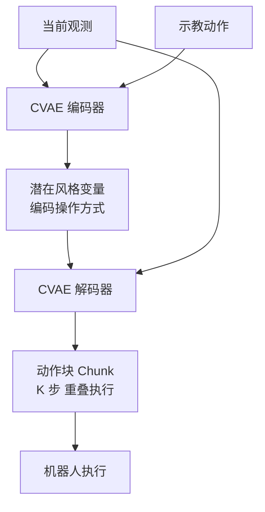

# Mobile ALOHA / ACT

- 本地 PDF：`papers/curriculum/Mobile_ALOHA_ACT_2401.02117.pdf`
- arXiv：https://arxiv.org/abs/2401.02117
- 年份：2024
- 阶段：低成本遥操作与动作分块

## 一句话总结

Mobile ALOHA 与 ACT 提供了低成本全身遥操作硬件方案与动作分块（Action Chunking）Transformer 架构，通过 CVAE 建模多模态示教分布并抑制复合误差累积，引爆了具身智能的规模化落地热潮。

## 核心技术

1. **条件变分自编码器（CVAE）** — 对人类示教的多模态动作分布进行概率建模，通过潜在变量编码不同操作风格，输出未来 K 步的连续动作序列
2. **动作分块（Action Chunking）** — 一次性预测未来 K 步动作组成的"块"，从根本上抑制单步自回归预测的复合误差累积
3. **低成本全身遥操作硬件方案** — 提供成本仅 2 万美元级别的全尺寸双臂遥操作硬件，相比传统方案成本降低 90% 以上

## 底层原理与数学推导

ACT 的核心突破是解决了单步自回归预测的**复合误差（Compounding Errors）**问题，同时通过 CVAE 对人类示教的多模态不确定性进行建模，完美适配机器人操作的多峰动作分布，是 2024 年开源 VLA 模型的标配技术。

**1. 复合误差问题的本质**

在纯模仿学习中，单步自回归预测每一步都依赖上一步的输出，一旦某一步出现微小误差，后续的误差会呈平方级放大。理论证明，若单步预测误差概率为 $\epsilon$，执行 $T$ 步后总误差的上界为 $O(T^2 \epsilon)$，长程任务的成功率会急剧下降。

ACT 的解决方案是：**一次性预测未来 K 步动作组成的"块（Chunk）"**，而非单步预测，从根本上抑制复合误差的累积。

**2. CVAE 核心数学推导**

ACT 采用条件变分自编码器，对人类示教的多模态动作分布进行建模，输入为当前图像观测 $x$，输出为未来 K 步的动作序列 $y$，潜在变量 $z$ 编码了人类操作的隐藏"风格"（如从左侧/右侧抓取）。

模型的优化目标为证据下界（ELBO），损失函数如下：

$$
\mathcal{L} = \mathbb{E}_{z\sim q(z|x,y)} \left[ \log p(y|x,z) \right] - \beta \cdot D_{KL} \left( q(z|x,y) || p(z|x) \right)
$$

其中：
- 第一项为动作重构损失，衡量模型预测动作与人类示教动作的拟合程度；
- 第二项为 KL 散度正则项，约束潜在变量 $z$ 的分布，$\beta$ 为权重系数；
- $q(z|x,y)$ 为编码网络，从示教轨迹中提取潜在风格变量；
- $p(y|x,z)$ 为解码网络，根据当前观测与风格变量，预测未来 K 步的动作序列。

## 物理直觉解释

ACT 的动作分块，就像人类开车时，不会只看眼前 1 米，而是会提前看好未来几十米的路线，一次性规划好接下来的一系列操作。单步预测就像蒙着眼睛开车，走一步看一步，很容易走偏；而动作分块就是提前看好路线，哪怕当前位置有一点偏差，也能按照提前规划的路线修正回来，从根本上避免了误差的累积。

而 CVAE 就像让模型学会了同一个任务的多种操作手法，不会像回归方法一样只会输出"平均动作"，而是能根据场景选择合适的操作方式。

## 工程细节与实操指南

- **硬件方案**：Mobile ALOHA 提供了一套成本仅 2 万美元级别的全尺寸全身遥操作硬件方案，相比之前几十万美金的遥操作设备，成本降低了 90% 以上，直接引爆了全行业的示教数据采集热潮。
- **动作分块超参**：工业最佳实践为 K=15~64 步，块与块之间重叠 50%~60%，平衡长程规划能力与实时修正能力。
- **落地场景**：完美适配炒菜、折衣服、桌面操作等复杂日常任务，是首个实现开源复现、成本可控的双机械臂全身操作方案。

## 技术权衡（Trade-off）

| 优势 | 劣势与工程代价 |
|------|----------------|
| 动作分块从根本上抑制了复合误差的累积，长程任务成功率远超单步预测模型 | 动作块长度 K 过大会导致模型无法实时响应环境变化，动态场景适应性下降 |
| CVAE 完美适配多模态动作分布，避免了回归方法的"平均动作"问题，无需离散分箱即可实现连续动作生成 | CVAE 的训练稳定性对超参敏感，KL 散度权重 $\beta$ 需要精细调优，否则容易出现模式坍塌 |
| 配套低成本遥操作硬件，大幅降低了 VLA 模型的数据采集与落地门槛，推动了开源生态的爆发 | 依然以模仿学习为核心，分布外场景的鲁棒性不足，无法自主纠正严重的轨迹偏离 |

## 技术价值与演进定位

ACT 与 Mobile ALOHA 是 VLA 模型从实验室走向工业落地的关键推手。动作分块技术成为了后续所有开源 VLA 模型的标配，而低成本遥操作硬件解决了行业数据稀缺的核心痛点，直接催生了 Open X-Embodiment 等大规模数据集的诞生，开启了 VLA 模型的开源生态时代。

## 与其他论文的关系

- **Diffusion Policy** 同样预测动作序列，但采用扩散生成范式替代 CVAE，在更复杂的多模态分布上拟合能力更强。
- **Octo** 将动作序列生成融入更通用的 Transformer 扩散策略架构，在 Open X-Embodiment 数据上预训练。
- **Open X-Embodiment** 需要 Mobile ALOHA 这类低成本数据采集生态来扩充数据规模。
- **RT-1/RT-2** 使用离散动作 Token 化，而 ACT 通过 CVAE 实现连续动作生成，两者在动作表示范式上形成互补。

## 精读问题

1. Action chunk 的长度 K 如何影响长程任务的稳定性与动态场景的响应性？是否存在最优 K 的理论上界？
2. CVAE 中的 $\beta$ 权重如何平衡重构精度与潜在空间的正则化？模式坍塌发生时如何判断与恢复？
3. Temporal ensembling（块间重叠）为什么能让动作更平滑？重叠率的最优区间如何确定？
4. ACT 的动作分块与 Diffusion Policy 的扩散生成在复合误差抑制上，本质区别是什么？
