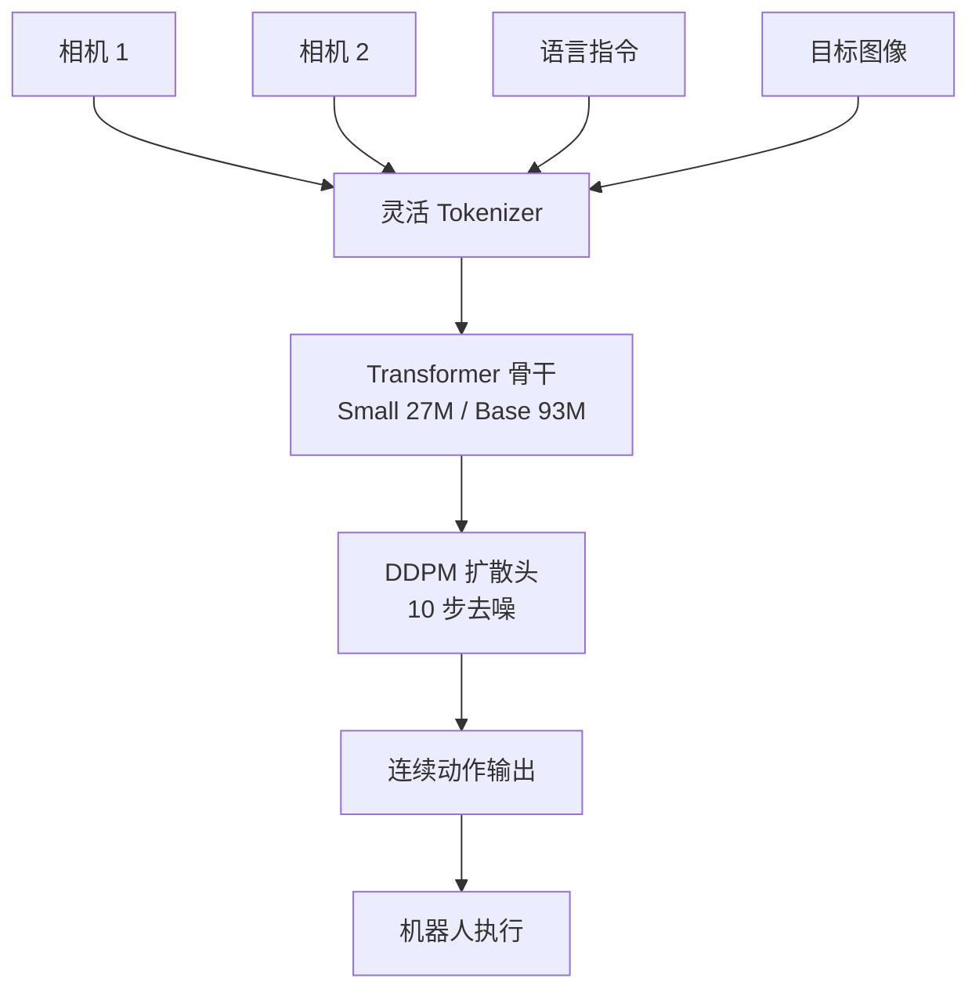

# Octo: An Open-Source Generalist Robot Policy

- 本地 PDF：`papers/curriculum/Octo_Open_Source_Generalist_Robot_Policy_2405.12213.pdf`
- arXiv：https://arxiv.org/abs/2405.12213
- 年份：2024
- 阶段：开源通用机器人策略

## 一句话总结

Octo 是开源社区最成熟的扩散策略 VLA 模型，在 Open X-Embodiment 数据上预训练，采用 Transformer 骨干加扩散输出头实现连续动作生成，以极小参数量（27M/93M）达到消费级 GPU 可部署的高频连续控制性能。

## 核心技术

1. **扩散输出头（Diffusion Head）** — 采用降噪扩散概率模型（DDPM）生成连续动作，仅需 10 步去噪即可输出高质量动作序列，彻底摆脱离散分箱的范式限制
2. **高度灵活的 Transformer 骨干网络** — 处理多模态输入（图像、语言指令、机器人状态），支持灵活的观测与动作空间定义
3. **多视角相机输入自适应处理** — 通过特殊 Tokenizer 设计，将不同视角的相机图像编码为独立 Token 序列，推理时可随意增删相机视角无需重新微调

## 底层原理与数学推导

Octo 是 2024 年开源社区最成熟的扩散策略 VLA 模型，它在 Open X-Embodiment 数据集上进行预训练，采用高度灵活的 Transformer 骨干处理多模态输入，在输出端采用扩散模型生成连续动作，彻底摆脱了离散分箱的范式限制，在高频连续控制场景表现极为出色。

**1. 扩散输出头核心原理**

扩散模型通过逐步向数据中添加高斯噪声，再学习从噪声中还原数据的过程，对连续动作的多峰分布有着极强的拟合能力，完美解决了传统回归方法的平均动作问题，同时无需离散化，无阶梯效应的精度损失。

Octo 采用降噪扩散概率模型（DDPM），核心公式为前向扩散 $x_t = \sqrt{\bar{\alpha}_t} x_0 + \sqrt{1-\bar{\alpha}_t} \epsilon$ 与逆向去噪 $x_{t-1} = \frac{1}{\sqrt{\alpha_t}} (x_t - \frac{1-\alpha_t}{\sqrt{1-\bar{\alpha}_t}} \epsilon_\theta(x_t, t))$，在推理阶段仅需 10 步去噪即可生成高质量连续动作，满足实时控制要求。

**2. 多视角相机自适应处理**

Octo 通过特殊的 Tokenizer 设计，将不同视角的相机图像编码为独立的 Token 序列，在推理时可以随意增删相机视角，无需重新微调模型，完美适配不同机器人的多相机配置，是开源模型中首个实现该能力的架构。

## 物理直觉解释

Octo 的扩散输出头就像一位雕塑家——先从一块完整的"噪声石块"开始，逐步雕琢出精细的动作轮廓。每一次去噪步骤都在剔除不可能的动作，让剩余的有效动作空间越来越精确，最终收敛到唯一的、最优的操作轨迹。相比离散分箱（像用乐高积木搭雕塑，受限于积木的形状和大小），扩散模型生成的连续动作就像用黏土雕塑，没有任何精度损失。

而多视角相机自适应处理，则像人类在操作时可以根据需要随时切换视角——主摄像头看全局，手腕摄像头看细节，Octo 可以灵活组合这些视角信息。

## 工程细节与实操指南

- **预训练数据**：基于 Open X-Embodiment 数据集的 80 万条轨迹进行预训练，覆盖 19 种机器人。
- **模型规格**：分为 Small（27M 参数）、Base（93M 参数）两个官方版本，普通消费级 GPU 即可完成推理与微调。
- **推理性能**：Base 版本在单张 NVIDIA 4090 GPU 上，推理帧率可达 13 it/sec，完美适配高频连续控制场景。
- **核心特性**：原生支持语言指令与目标图像双任务条件，支持灵活的观测与动作空间定义，可快速微调适配新的机器人硬件。

## 技术权衡（Trade-off）

| 维度 | Octo | OpenVLA |
|------|------|---------|
| 核心架构 | Transformer 骨干 + 扩散输出头 | 7B VLM 骨干 + 回归输出头 |
| 语义能力 | 较弱，无大规模 VLM 预训练语义先验 | 极强，基于 SigLIP 预训练 VLM，具备强大的常识推理能力 |
| 连续控制 | 极强，扩散模型完美适配多模态动作分布，高频控制表现出色 | 中等，回归方法在多峰分布上拟合能力弱于扩散模型 |
| 部署门槛 | 极低，最大 300M 参数，消费级 GPU 即可部署 | 中等，7B 模型需要量化后才能在消费级 GPU 上实时运行 |
| 适用场景 | 高频精细操作、工业流水线、动态场景 | 复杂语言指令、开放世界场景、零样本泛化任务 |

## 技术价值与演进定位

Octo 是开源 VLA 模型中扩散策略的标杆之作。它将"多路相机输入+连续动作输出"的架构完全标准化，证明了小参数量扩散模型在机器人操作任务上可以达到甚至超越大参数量 VLA 模型的性能，为工业落地提供了低成本、高性能的开源方案。

## 与其他论文的关系

- **Open X-Embodiment** 是 Octo 的预训练数据底座，Octo 基于其 80 万条轨迹进行多机器人预训练。
- **Diffusion Policy** 是 Octo 扩散输出头的技术前身，Octo 将其融入通用 Transformer 架构并扩展到多机器人场景。
- **OpenVLA** 与 Octo 形成开源路线的两种代表：策略型（扩散+小参数量）vs VLM 型（大语言模型骨干），在语义理解与连续控制之间各有取舍。
- **RT-1/RT-2** 使用离散动作 Token 化，Octo 通过扩散输出头实现了连续动作生成，解决了阶梯效应问题。

## 精读问题

1. Octo 的 diffusion head 在推理时仅需 10 步去噪，相比标准 DDPM（通常需要 100-1000 步），其加速策略具体是什么？
2. Octo 的 generalist 能力具体体现在哪些维度？多视角自适应处理的 Tokenizer 如何工作？
3. Octo 的 Small（27M）和 Base（93M）版本在性能与推理速度上如何权衡？如何根据任务需求选择？
4. Octo 与 OpenVLA 在语义理解与控制精度上的本质差异，是否意味着两者在架构上有融合的可能？
