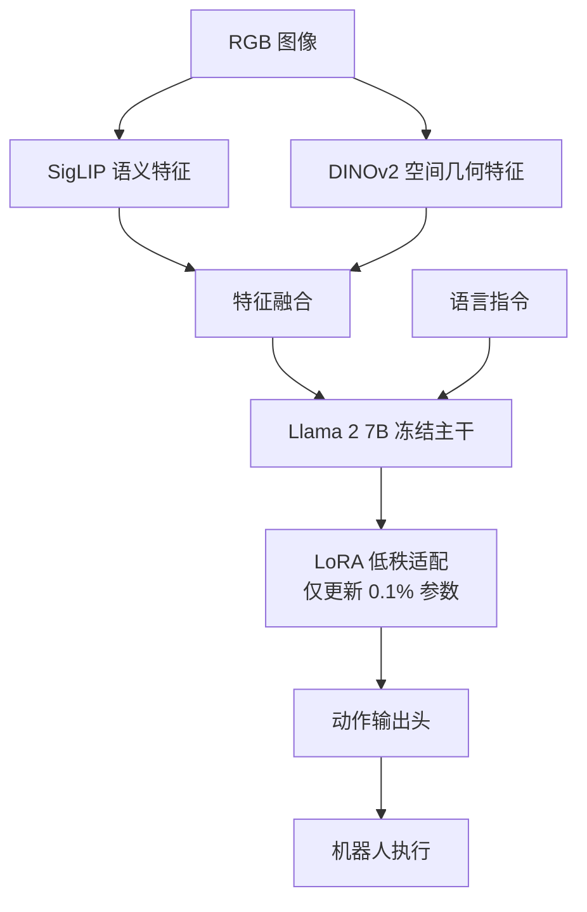

# OpenVLA: An Open-Source Vision-Language-Action Model

- 本地 PDF：`papers/curriculum/OpenVLA_Open_Source_Vision_Language_Action_Model_2406.09246.pdf`
- arXiv：https://arxiv.org/abs/2406.09246
- 年份：2024
- 阶段：开源端到端 VLA

## 一句话总结

OpenVLA 是首个完全开源、可商用、性能比肩闭源 RT-2 的 7B 级端到端 VLA 模型，基于双视觉编码器（DINOv2+SigLIP）和 Llama 2 7B 骨干，在 Open X-Embodiment 97 万条轨迹上预训练，通过 LoRA 实现消费级 GPU 低成本微调。

## 核心技术

1. **双视觉编码器（DINOv2 + SigLIP）** — SigLIP 提取语义特征以支撑常识推理，DINOv2 提取空间几何特征以支撑精细操作，二者融合实现语义与空间的双重精准感知
2. **LoRA 高效微调** — 冻结预训练主干权重，仅在 Transformer 注意力层插入低秩矩阵，实现单张 24G 显存 GPU 上完成 7B 模型的全流程微调
3. **大规模 VLM 预训练权重复用** — 基于 Llama 2 7B 语言模型骨干，完美继承大模型的语义常识推理与开放世界理解能力

## 底层原理与数学推导

OpenVLA 是首个完全开源、可商用、性能比肩闭源 RT-2 的端到端 VLA 模型。它基于开源 VLM 骨干，在 Open X-Embodiment 数据集的 97 万条机器人轨迹上进行预训练，完美继承了大模型的语义常识推理能力，同时实现了端到端的动作输出，是 2024 年工业落地的首选开源方案。

**1. 双视觉编码器架构**

OpenVLA 采用双视觉编码器融合架构，兼顾语义理解与空间特征提取：
- **SigLIP 编码器**：负责提取图像的语义特征，理解物体的类别、属性与功能，支撑模型的常识推理能力；
- **DINOv2 编码器**：负责提取图像的空间几何特征，精准定位物体的位置与姿态，支撑模型的精细操作能力。

两个编码器的特征融合后输入 Llama 2 7B 语言模型骨干，实现了语义与空间的双重精准感知。

**2. LoRA 高效微调核心数学推导**

OpenVLA 的核心工程突破，是实现了在单张 24G 显存 GPU 上，即可完成 7B VLA 模型的全流程微调。LoRA（低秩适配）是核心解决方案。

LoRA 的核心思想是冻结预训练模型的主干权重，仅在 Transformer 的注意力层中插入低秩矩阵，通过更新低秩矩阵来完成微调，大幅降低了显存占用与训练成本。核心公式如下：

$$
W = W_0 + \frac{\alpha_{lora}}{r} \Delta W, \quad \Delta W = A B^T
$$

其中：
- $W_0$ 为预训练模型的原始权重，冻结不更新；
- $A$ 和 $B$ 为可学习的低秩矩阵，秩为 $r$，远小于权重矩阵的原始维度；
- $\alpha_{lora}$ 为缩放系数，用于平衡微调的更新幅度，避免破坏预训练权重。

## 物理直觉解释

OpenVLA 的双视觉编码器就像人类的两套视觉系统：SigLIP 像大脑的"这是什么"通路，能识别物体的类别和功能（这是一个杯子、可以用来喝水）；DINOv2 像大脑的"它在哪"通路，能精准判断物体的位置和姿态（杯子在桌子右上角、杯把朝左）。两套系统协同工作，既知道"拿什么"，也知道"怎么拿"。

LoRA 微调则像在已有的知识基础上做"微调笔记"——不重写整本教科书，而是在书的页边加上少量批注和修正，用最小的代价让模型学会新技能。

## 工程细节与实操指南

**1. LoRA 微调超参工业最佳实践**
- 秩 $r=32$ 或 $64$，$\alpha_{lora}=64$ 或 $128$；
- 学习率：$5 \times 10^{-5}$，远低于全量微调的学习率，避免灾难性遗忘，破坏 VLM 原有的语义常识；
- 梯度累积：24G 显存仅能支持 Batch Size=4~8，必须设置梯度累积步数=4，等效实现大 Batch Size 的稳定更新。

**2. 部署优化**：采用 INT4 量化 + KV-Cache 优化后，7B 模型可在单张 RTX 4070Ti GPU 上实现 10Hz 的实时推理，满足工业落地要求。

**3. 核心性能**：零样本场景下，在 WidowX、UR5、RT-1 机器人上的表现比肩 550 亿参数的闭源 RT-2-X 模型，平均成功率超越 Octo 与 RT-1-X。

## 技术权衡（Trade-off）

| 优势 | 劣势与工程代价 |
|------|----------------|
| 首个完全开源可商用的 7B 级端到端 VLA 模型，性能比肩闭源 RT-2，零样本泛化能力远超同期开源小模型 | 7B 模型的推理部署依然需要中端以上 GPU，边缘端部署难度较大 |
| 双视觉编码器架构，兼顾语义理解与空间感知，完美适配开放世界的复杂语言指令任务 | 回归输出头在多模态动作分布上的拟合能力弱于扩散模型，高频精细操作表现不及 Octo |
| LoRA 微调方案实现了消费级 GPU 的低成本微调，大幅降低了工业落地的门槛 | 微调超参敏感，学习率过高极易导致灾难性遗忘，丢失预训练的语义常识能力 |

## 技术价值与演进定位

OpenVLA 是开源 VLA 模型的工业级标准。它彻底打破了闭源模型的垄断，让普通开发者与企业可以低成本、低门槛地使用、微调、部署端到端 VLA 模型，是 2024 年 VLA 模型从实验室走向工业规模化落地的核心推手。

## 与其他论文的关系

- **RT-2** 是 OpenVLA 的开源对标目标，OpenVLA 首次在开源生态中实现了比肩 RT-2 的端到端 VLA 性能。
- **Open X-Embodiment** 是 OpenVLA 的预训练数据底座（97 万条轨迹），提供了跨机型多任务训练数据。
- **Octo** 与 OpenVLA 形成开源路线的两种代表：Octo 以扩散策略和小参数量见长，OpenVLA 以大模型语义推理见长，二者在适用场景上互补。
- **Mobile ALOHA / ACT** 的动作分块与 CVAE 技术为 OpenVLA 所继承，作为其模仿学习的基础动作生成范式。
- **LoRA** 技术源自 NLP 领域的参数高效微调（Parameter-Efficient Fine-Tuning），OpenVLA 首次将其大规模应用于机器人 VLA 模型的微调。

## 精读问题

1. OpenVLA 的双视觉编码器（SigLIP + DINOv2）特征是如何在模型中融合的？是拼接、加权求和还是注意力融合？
2. OpenVLA 的动作输出头具体采用什么结构？与 RT-2 的离散化动作 Token 输出有何本质差异？
3. LoRA 的秩 $r$ 和缩放系数 $\alpha_{lora}$ 如何影响微调效果？是否存在最优组合的理论依据？
4. 7B 模型在 INT4 量化 + KV-Cache 优化下实现 10Hz 推理，量化对动作精度的具体影响有多大？
