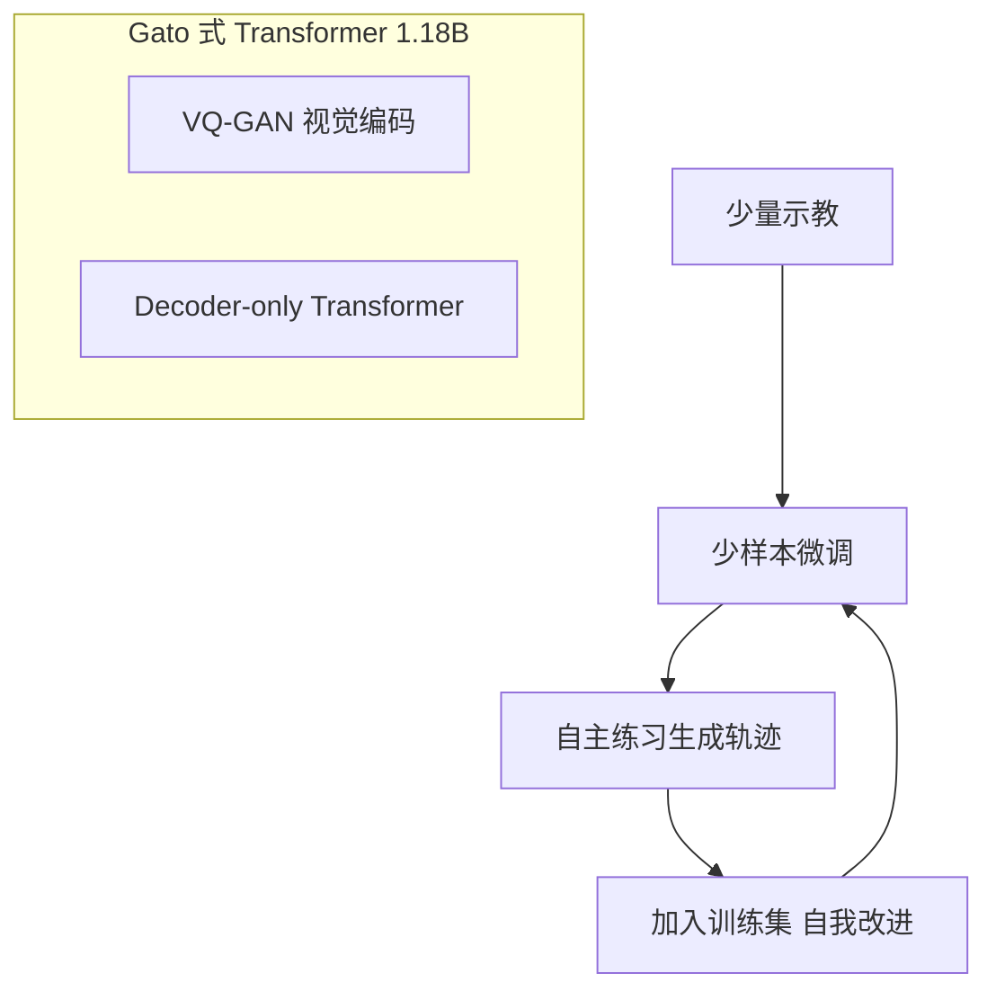

# RoboCat: A Self-Improving Generalist Agent for Robotic Manipulation

- 本地 PDF：`papers/curriculum/RoboCat_Self_Improving_Robot_Agent_2306.11706.pdf`
- arXiv：https://arxiv.org/abs/2306.11706
- 年份：2023 (TMLR)
- 阶段：跨本体多任务通用智能体 + 自改进循环
- 作者：Google DeepMind（Bousmalis, Vezzani, Rao, Devin, Lee, Bauza, Davchev, Zhou, Gupta 等共同一作）

## 一句话总结

RoboCat 是一个基于 Gato 架构的视觉目标条件决策 Transformer，首次实现了跨多机器人本体的大规模多任务操作，并通过「从实践中自我生成数据 -> 重训练」的自改进循环进一步提升能力。

## 核心技术

1. **自改进数据生成循环** — 由通用模型微调至新任务 -> 部署自主收集大量轨迹 -> 将新数据加入训练集重训练下一版通用模型
2. **跨本体架构** — 通过 Transformer 的可变长度序列输入输出能力原生支持不同机器人不同的观测维度、动作空间和控制频率
3. **多任务预训练 + Few-Shot 微调** — 在 240 个训练任务上预训练，仅用 100-1000 条示教即可微调适应全新任务/本体
4. **视觉目标条件（Visual Goal Conditioning）** — 通过目标图像（任务成功状态的图片）指定任务，天然支持事后目标重标记（Hindsight Goal Relabeling）
5. **VQ-GAN 图像分词器** — 图像压缩为 8x8 token 网格，提升训练效率

## 底层原理与数学推导

### 1. 序列模型与目标条件策略

RoboCat 将策略建模为自回归 Transformer 序列模型。设观测 $o_t = (x_t, I_t)$ 包含本体感知 $x_t$（如关节位置/速度）和图像 $I_t$，目标图像为 $g_t$，策略表示为：

$$\pi(a_t | o_t, g_t) = P_\theta(a_t | x_{<t}, I_{<t}, g_{<t})$$

其中下标 $<t$ 表示时间步 $t$ 之前的所有观测和目标图像。模型以 Token 级自回归方式预测动作，不要求不同本体具有相同的观测或动作维度。

### 2. 轨迹 Tokenization

每条轨迹 $\tau$ 被转化为 Token 序列 $\hat{\tau}$：

$$\hat{\tau} = [x_{1:L_1}, I_{1:M_1}, g_{1:N_1}, a_{1:Q_1}, ..., x_{1:L_T}, I_{1:M_T}, g_{1:N_T}, a_{1:Q_T}, x_{1:L_{T+1}}, I_{1:M_{T+1}}, g_{1:N_{T+1}}]$$

其中 $L, M, N, Q$ 分别表示本体感知、图像、目标、动作所需的 Token 数，$T$ 为轨迹长度。不同本体的 $L$ 和 $Q$ 不同。目标图像 $g_t$ 在整个轨迹中固定，每步重复输入。

**事后目标（Hindsight Goal）**：由于轨迹 $\tau^i$ 天然「成功」到达其最后帧，可将 $g_t^i = I_{T+1}^i$ 作为目标标注。也可使用语义等价目标（同任务不同成功轨迹的最后帧）。

### 3. 联合训练损失

模型同时优化动作预测和未来图像预测两个目标：

$$\mathcal{L}(\theta; \mathcal{D}) = \mathbb{E}_{\hat{\tau} \sim \hat{\mathcal{D}}} \left[ \sum_{t=1}^T \sum_{q=1}^Q \log P_\theta(a_t^q | ...) + \sum_{t=1}^{T+1-k} \sum_{m=1}^M \log P_\theta(I_{t+k}^m | ...) \right]$$

其中第一项为动作 Token 的交叉熵损失，第二项为对未来 $k=5$ 时间步图像 Token 的预测损失（观测预测损失）。

### 4. 自改进数据聚合

设 $\mathcal{D}_{\text{demo}}^y$ 为任务 $y$ 的人类示教数据，$\mathcal{D}_{\text{imp}}^y$ 为微调策略自主收集的额外轨迹。新迭代的训练集为：

$$\mathcal{D}_{\text{next}} = \mathcal{D} \cup \bigcup_{y \in \mathcal{Y}} (\mathcal{D}_{\text{demo}}^y \cup \mathcal{D}_{\text{imp}}^y)$$

其中 $\mathcal{Y}$ 为自改进任务集合。每个新迭代还重新训练 VQ-GAN 分词器。

### 5. 架构细节

- **骨干网络**：Decoder-only Transformer，1.18B 参数，24 层，embedding 维度 2048，FFN 隐层维度 8196
- **图像分词器**：冻结的 VQ-GAN（在 ImageNet + 控制任务图像 + 机器人图像上预训练），输出 8x8 token 网格
- **上下文长度**：固定 1024 个 Token（约对应 3 个时间步的历史）
- **本体感知/动作 Tokenization**：沿用 Gato 方案（连续值离散化为 1024 个分箱）
- **模型大小实验**：部分消融使用 364M 参数的更小模型

### 6. 自改进循环的完整流程

```
[初始] 大规模多任务多本体数据集 -> 训练 RoboCat 通用模型
    |
    v
[微调] 收集 100-1000 条新任务/新本体的人类示教 -> 微调通用模型
    |
    v
[自主收集] 部署微调策略到真实机器人，自动收集大量轨迹
    |          - 使用训练好的奖励模型进行成功检测
    |          - 使用策略池（Policy Pool）实现自主环境重置
    v
[聚合] 原数据 + 新示教 + 自主生成数据 -> 新数据集
    |
    v
[重训练] 训练下一迭代 RoboCat 通用模型（能力更强）
```



## 物理直觉解释

RoboCat 的核心逻辑是「用一个大脑控制多个不同的身体」。传统方法为每个机器人每种任务单独训练一个模型，而 RoboCat 把所有机器人的经验融合进同一个 Transformer 模型。

- **为什么能跨本体？** Transformer 的序列输入天然可以处理可变长度的输入输出。不同机器人的关节数量、动作维度差异，在 Token 化后都变成了不同长度的 Token 序列，模型只需学习统一的「下一个 Token 预测」任务。

- **自改进循环的意义**：RoboCat 先用少量人类示教学会一个新任务的大致做法，然后自己去反复练习（自主收集数据），把练习经验（包括成功的和失败的）都加入训练集，下次重训练时通用模型就更强。这是「从实践中学习」的具身版本。

- **视觉目标条件的优势**：一张目标图片（如「苹果在碗里」）天然包含了任务的全部信息，比语言描述更精确；同时任何轨迹的最后帧都可以作为目标标注，无需额外人工标注。

- **策略池**：为了解决自主收集中「做完任务后如何重置环境」的问题，RoboCat 巧妙利用不同任务的互补性——任务 A 的结束状态 = 任务 B 的起始状态。例如插入任务的结束状态就是移除任务的起始状态，形成一个闭环。

## 工程细节与实操指南

### 训练数据

- **总任务数**：253 个任务变体（240 训练 + 13 微调），涵盖 11 个任务族
- **本体**：2 种仿真 + 3 种真实机器人（Sawyer 5/7-DoF, Panda 7-DoF, KUKA 14-DoF）
- **对象**：134 个真实物体，123 个仿真物体
- **数据来源**：
  - 仿真：RL 专家策略生成
  - 真实：人类遥操作示教
  - 自主生成：RoboCat 微调策略收集
- **机器人数量**：36 台真实机器人（15 Panda + 17 Sawyer + 4 KUKA）

### 任务族

| 任务族 | 描述 | 难度特征 |
|--------|------|----------|
| Stacking | 将物体叠放在另一个物体上 | 需要理解形状物理交互 |
| Tower Building | 堆叠塔状结构 | 更高的精度要求 |
| Pyramid Building | 堆叠金字塔结构 | 多物体协作 |
| Inverted Pyramid | 倒金字塔 | 极具挑战性（人类遥操作成功率仅 52%）|
| Lifting | 从多物体场景中拾取指定物体 | 目标理解 + 新物体泛化 |
| Insertion | 将物体插入目标容器/底座 | 低容差精确操作（1mm）|
| Removal | 从目标容器/底座中取出物体 | 配合插入任务形成闭环 |

### 训练超参数

- **主模型**：1.18B 参数 Decoder-only Transformer
  - 24 层，嵌入维度 2048，FFN 隐层 8196
- **小模型（消融）**：364M 参数
- **图像编码器**：冻结 VQ-GAN，8x8 token
- **上下文长度**：1024 token
- **训练数据**：多来源混合（RL 专家 + 遥操作 + 自生成）
- **微调数据量**：100-1000 条示教/任务

### 自主数据收集基础设施

- **成功检测**：训练基于视觉的奖励模型（二分类器），通过众包标注来训练
- **自主重置**：策略池机制，利用任务间互补关系实现自动环境重置
- **评估**：每个任务变体平均 100 次评估，每次使用不同目标图像和随机初始状态

## 实验结果精华

### 训练任务性能
- RoboCat 在绝大多数训练任务上超越单任务 VFM 基线（NFNet-f6 438M, Swin-L 197M）
- 在真实世界任务上差距尤为显著（VFM 因数据量少无法利用多任务迁移）
- RGB Stacking Benchmark：RoboCat 平均 80%，与 Gato（78%）和 BC-IMP（79%）持平

### 微调泛化能力

| 泛化轴 | RoboCat（500 示教）| VFM 基线（1000 示教）|
|--------|-------------------|---------------------|
| 水果插入碗中 | 84% | ~5% |
| 水果从碗中取出 | 64% | ~0% |
| KUKA 14-DoF 齿轮举起 | 56% | ~0% |
| 形状匹配插入 | 6% | ~0% |

### 自改进效果

- 使用 364M 小模型验证自改进：自改进版本在 4 个任务上全面超越直接使用示教训练的版本
- 完全体 RoboCat（1.18B）在自改进任务上的表现达到或超越了数据生成代理的水平
- 多任务训练带来正向迁移：训练任务越多，各任务上的性能越好

## 技术权衡

| 优势 | 劣势与工程代价 |
|------|---------------|
| 首次实现原生跨本体的单模型通用操作策略 | 仅使用行为克隆，无强化学习，无法从奖励信号中在线学习 |
| 自改进循环显著降低新任务的示教成本 | 自主数据收集依赖复杂的奖励模型和策略池重置机制 |
| 正向迁移：增加训练任务使各任务都受益 | 自生成数据质量低于专家示教，存在数据质量退化风险 |
| 多本体训练提升对不同机器人的适应效率 | 实验环境受限（统一的实验室 cage + 视觉相似背景），鲁棒性不足 |
| 100-1000 条示教即可适应新本体 | KUKA 14-DoF 等未见本体零样本性能为 0，必须有微调数据 |
| 视觉目标条件天然支持事后重标记 | 仅支持目标图像，不支持语言条件（限制了任务指定灵活性） |

### 自改进的数据质量退化风险

RoboCat 的自改进循环中，自主生成的数据质量低于人类专家示教，这是因为：

1. 微调策略本身就不完美，会产出失败轨迹
2. 即使成功轨迹，其操作风格可能比人类示教更笨拙
3. 多轮自改进可能导致数据分布逐渐偏离最优行为

但 RoboCat 的实验表明：
- 事后目标重标记技术可以将失败轨迹也利用起来（轨迹的最后帧标为目标，前面就算失败也被学习为「通往成功的路径」）
- 实验显示自改进一代后模型能力提升而非下降
- 论文仅演示了一轮自改进，多轮循环的数据质量退化尚未被充分研究

论文对此的应对策略：
- 使用语义等价目标（同类成功的轨迹）而非仅仅事后目标，减少次优数据影响
- 保持原始专家数据始终在训练集中，避免遗忘

## 技术价值与演进定位

RoboCat 是 VLA 演进路线中「通用智能体」方向的里程碑工作。相比 RT-1（单本体多任务）和 RT-2（继承 VLM 知识），RoboCat 探索的是完全不同的维度：跨本体和自改进。

核心贡献：
1. **跨本体通用性**：首次在单模型中原生支持多个真实机器人，涵盖不同的观测维度、动作空间和控制频率
2. **自改进范式**：建立了从实践中学习的闭环流程，为后续机器人基础模型提供数据扩展范本
3. **视觉目标条件**：为任务指定提供了比语言更精确的接口

局限性：
- 不支持语言条件（限制了任务指定的灵活性）
- 仅使用行为克隆，无 RL 组件
- 所有实验在受控实验室环境中进行
- 仅演示了一轮自改进

## 与其他论文的关系

- **Gato**：直接继承其 Transformer 架构和序列建模范式，但专注于机器人操作并显著扩展了机器人任务规模和本体数量
- **RT-1 / RT-2**：互补路线——RT 系列关注语言条件 + VLM 知识迁移（单本体），RoboCat 关注视觉目标条件 + 跨本体 + 自改进
- **Open X-Embodiment**：后续工作，进一步扩展了跨本体数据集的规模和多样性
- **PaLM-E**：同时期工作，将 VLM 用于机器人任务规划而非底层控制

## 精读问题

1. RoboCat 的自改进循环中，数据质量的退化（误差累积）在哪些条件下会变得不可接受？
2. 跨本体训练的正向迁移具体来自什么机制？是视觉特征的共享还是底层运动模式的通用性？
3. 如果加入语言条件微调，能否在不破坏视觉目标条件能力的前提下灵活扩展任务指定方式？
4. 仅一轮自改进后性能已经提升，多轮循环（如在 1000+ 任务上迭代 5 轮）是否会收敛到某个上限？
5. RoboCat 的自改进和经典 DAgger 算法的核心区别在哪里？
