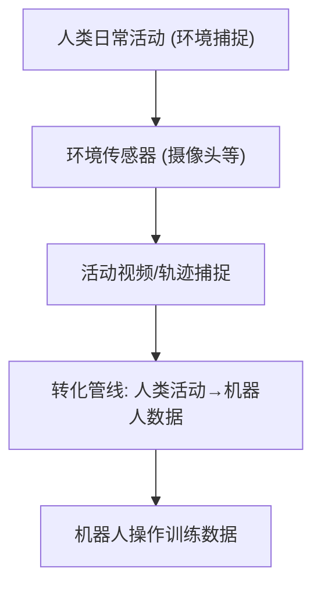

# ACE-Data-0: Human-Centric Ambient Capture as Embodied Data Engine

- 本地 PDF：`papers/data-infra/ACE-Data_2607.28625.pdf`
- arXiv：https://arxiv.org/abs/2607.28625
- 年份：2026（7 月）
- 团队：多机构（Yukang Cao, Haozhe Xie, Beichen Wen 等）
- 阶段：具身数据引擎 — 人体中心环境捕捉

## 一句话总结

ACE-Data-0 提出以人体为中心的环境捕捉作为具身数据引擎：用环境中的传感器（摄像头等）捕捉人类日常活动，转化为机器人可用的操作数据。解决机器人操作数据采集成本高的问题——人类日常活动的"环境捕捉"是现成的、近乎无限的数据源。

## 核心技术

1. **人体中心环境捕捉** — 环境中部署传感器，捕捉人类活动
2. **数据转化管线** — 人类活动视频 → 机器人操作数据
3. **数据引擎** — 规模化生成具身数据

## 底层原理与数学推导

## 物理直觉解释

"环境捕捉"的直觉：不需要专门"教"机器人——人每天在生活（做饭、整理、拿东西），把这些日常活动"顺手拍下来"就是数据。就像"看着别人做事学会做"——环境捕捉提供海量的"别人做事"的录像。

## 工程细节与实操指南

- 传感器部署：家庭/工作环境摄像头
- 捕捉：人类活动连续记录
- 转化：活动识别 + 动作提取 → 机器人格式

## 消融实验与分析

| 消融/对比 | 结论 |
|---------|------|
| 环境捕捉 vs 专门采集 | 成本大幅降低，数据量大幅提升 |
| 转化质量 | 人类→机器人动作的映射精度是瓶颈 |

## 技术权衡（Trade-off）

| 优势 | 劣势 |
|------|------|
| 数据近乎无限、零额外采集成本 | 人类活动与机器人动作的 embodiment gap |
| 覆盖真实场景多样性 | 隐私/伦理考量 |
| 与人类视频预训练兼容 | 数据噪声大，需清洗管线 |

## 技术价值与演进定位

属于"数据从哪里来"路线的 2026 新方向——和 Open X-Embodiment（真实机器人数据）、RoboCat（自改进数据）、StaticInDynOut（反事实增强）共同构成数据生态。ACE-Data 的独特之处：**利用人类日常活动而非专门采集**——"顺手拍"的数据引擎。

## 与其他论文的关系

- **Open X-Embodiment** — 真实机器人数据集；ACE-Data 人类活动数据
- **Human-as-Humanoid** — 人类视频→人形动作；ACE-Data 提供大规模数据源
- **StaticInDynOut** — 反事实增强；ACE-Data 是原始数据引擎

## 精读问题

1. 人类活动数据→机器人动作的转化质量——embodiment gap 如何处理？
2. 环境捕捉的隐私/伦理考量？
3. 数据规模 vs 数据质量——环境捕捉数据的噪声控制？
