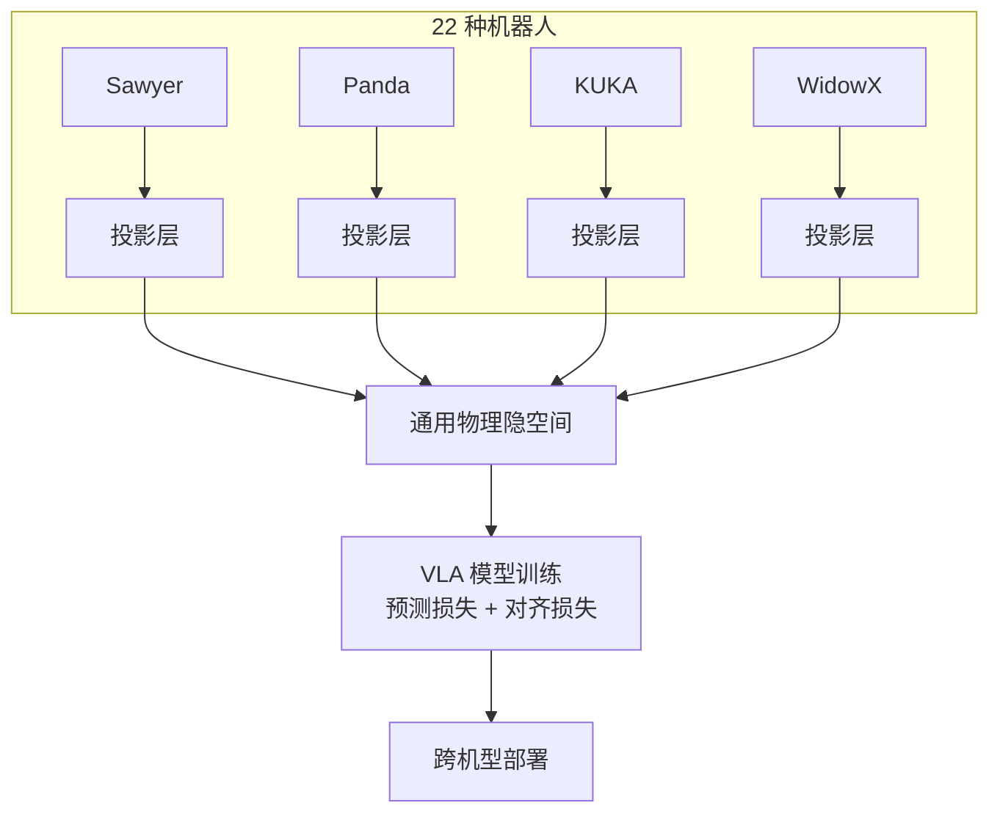

# Open X-Embodiment / RT-X

- 本地 PDF：`papers/data-infra/Open_X_Embodiment_RT-X_2310.08864.pdf`
- arXiv：https://arxiv.org/abs/2310.08864
- 年份：2023
- 阶段：机器人数据规模化

## 一句话总结

Open X-Embodiment 汇聚全球 22 种机器人、100 万+条示教轨迹，通过异构动作空间统一投影证明跨机型混合训练可显著提升泛化能力，是机器人领域的"ImageNet 时刻"。

## 核心技术

1. **跨机型异构动作空间统一投影** — 为每种机器人构建专属线性投影层，将不同维度和限位的动作空间映射到统一物理隐空间
2. **大规模多机构数据融合** — 整合全球 20+ 科研机构的 500+ 种操作任务数据，打破机器人领域的数据孤岛
3. **通用物理隐空间学习** — 通过跨机型对齐损失约束不同机器人的动作在隐空间中对齐，学习通用的物理操作规律

## 底层原理与数学推导

Open X-Embodiment 的核心突破，是解决了机器人领域"数据孤岛"的核心痛点，将全球 22 种不同形态、不同自由度的机器人、100 万+条示教轨迹融合到同一个数据集，证明了物理操作的底层逻辑在不同硬件之间是完全相通的，跨机型混合训练可以显著提升模型的泛化能力与成功率。

**1. 异构动作空间统一投影**

对于 N 种不同机器人的异构动作空间 $\mathcal{A}_1, \mathcal{A}_2, ..., \mathcal{A}_N$，为每个机器人构建一个专属的线性投影层 $\phi_i: \mathcal{A}_i \to \mathbb{R}^D$，将不同维度、不同限位的异构动作空间，统一映射到同一个 D 维通用物理隐空间中。

模型的总损失函数为：

$$
L_{total} = L_{pred} + \lambda L_{cross}
$$

其中：
- $L_{pred}$ 为动作预测损失，衡量模型在对应机型上的动作预测精度；
- $L_{cross}$ 为跨机型对齐损失，约束不同机型的动作在通用隐空间中的分布对齐；
- 工业最佳实践为 $\lambda=0.1$，平衡预测精度与跨机型泛化能力。

**2. 核心工程发现**

跨机型混合训练，不仅提升了模型的整体泛化能力，还让小样本数据的机型任务成功率平均提升了 16.5%。这证明了：不同机器人的物理操作，在隐空间中共享同一个通用的"物理常识"，海量的跨机型数据可以为小样本机型带来显著的性能提升。

## 物理直觉解释

Open X-Embodiment 就像给机器人建了一座"全球图书馆"，里面有全世界不同机器人的操作经验。之前的机器人只能学自己的经验，就像一个人只读过一本书；而跨机型训练，就是让机器人读遍图书馆里的所有书，学会了通用的物理操作规律，哪怕遇到一个从来没见过的机器人、从来没做过的任务，也能凭借学到的通用规律完成。

## 工程细节与实操指南

- **数据集规格**：包含 22 种机器人、100 万+条示教轨迹、500+ 种操作任务，覆盖桌面操作、抓取、装配、导航等全场景。
- **数据格式**：采用 RLDS（Reinforcement Learning Datasets）标准化格式，是机器人轨迹数据的工业标准，兼容所有主流 VLA 模型训练框架。
- **训练范式**：基于 RT-1/RT-2 架构，在 RT-X 数据集上训练的模型称为 RT-X 模型，跨机型泛化能力远超单机型训练的模型。

## 消融实验与分析

| 消融因子 | 变化 | 结论 |
|---------|------|------|
| 跨具身训练 | mixed vs single embodiment | 跨具身混合训练显著提升泛化 |
| 数据量 | 100万+ vs 10万轨迹 | 更多数据持续提升，但边际递减 |
| 动作空间统一 | 统一投影 vs 本体特定 | 统一投影在简化与精度间权衡 |
| 数据多样性 | 22种机器人 vs 单种 | 多样性比规模更重要 |

**核心结论**：跨具身混合训练是 Open X-Embodiment 最核心的发现——不同机器人之间存在正迁移。

## 技术权衡（Trade-off）

| 优势 | 劣势与工程代价 |
|------|----------------|
| 打破了机器人领域的数据孤岛，构建了全球最大的机器人操作数据集，为 VLA 模型的规模化训练奠定了数据基础 | 不同机构的数据集标注规范、坐标系定义、动作空间格式差异极大，数据清洗与对齐的工作量极大 |
| 证明了跨机型混合训练的有效性，显著提升了模型的泛化能力与小样本场景的成功率 | 异构动作空间的投影对齐会损失部分机型的专属动作特性，高精度专用任务的性能可能出现下降 |
| 定义了 RLDS 标准化数据格式，统一了行业的数据规范，推动了开源生态的标准化发展 | 数据集规模极大，全量训练需要极高的算力成本，普通开发者仅能使用子集进行微调 |

## 技术价值与演进定位

Open X-Embodiment 是 VLA 模型发展的"ImageNet 时刻"。它彻底解决了 VLA 模型训练的数据规模化问题，定义了行业的标准化数据格式，证明了通用物理操作隐空间的存在，为后续所有开源通用 VLA 模型（Octo、OpenVLA）提供了核心的数据底座。

## 与其他论文的关系

- **Octo** 和 **OpenVLA** 均以 Open X-Embodiment 数据集作为核心预训练数据底座，是其最直接的下游受益者。
- **RT-1/RT-2** 的架构被用于训练 RT-X 模型变体，验证跨机型泛化的有效性。
- **RoboCat** 的自生成数据路线与 Open X-Embodiment 的真实数据路线形成互补，前者解决数据多样性，后者解决数据规模。
- **Mobile ALOHA** 等低成本遥操作方案为 Open X-Embodiment 的数据扩充提供了可复制的采集范式。

## 精读问题

1. 异构动作空间统一投影时，线性映射 $\phi_i$ 是否足以表达不同机器人之间的运动学差异？非线性映射是否会对齐效果更好？
2. 跨机型对齐损失 $L_{cross}$ 的具体形式是什么？如何在保证预测精度的同时促进隐空间对齐？
3. 数据规模、数据多样性、数据质量三者中，哪一个对跨机型泛化能力的提升贡献最大？
4. RLDS 标准化格式如何确保不同采样频率、不同坐标系定义的轨迹数据在训练时保持一致？
